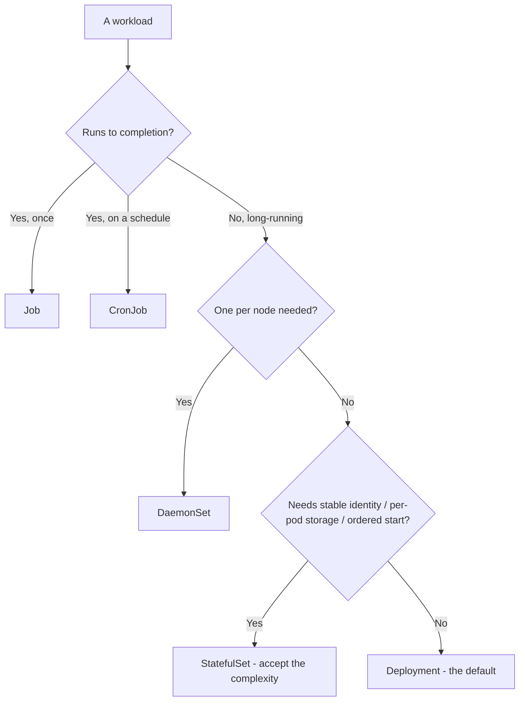
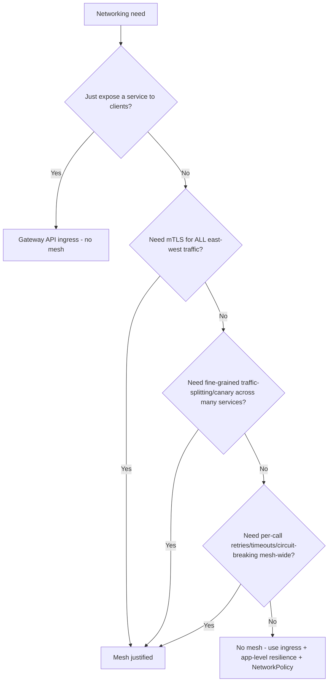
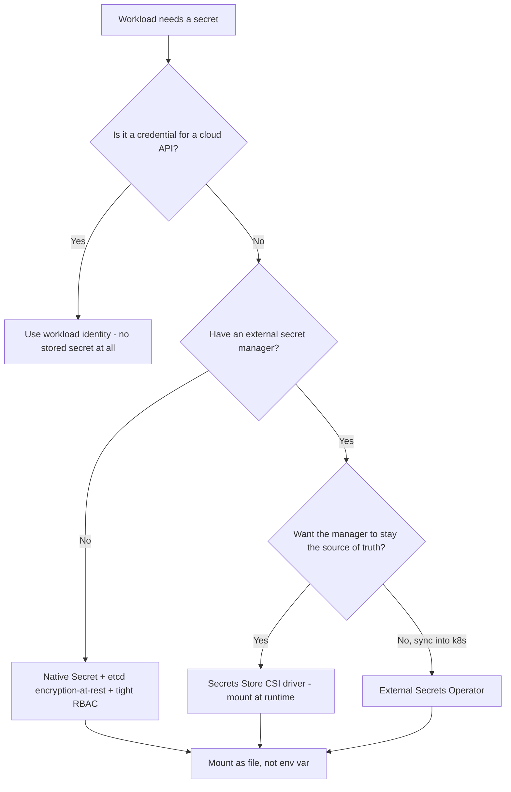
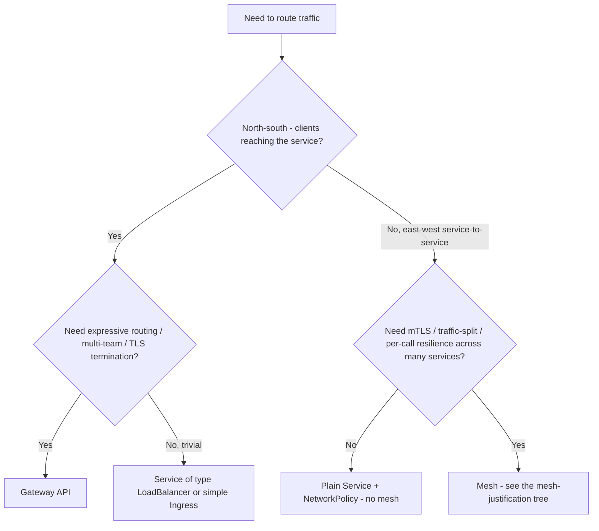
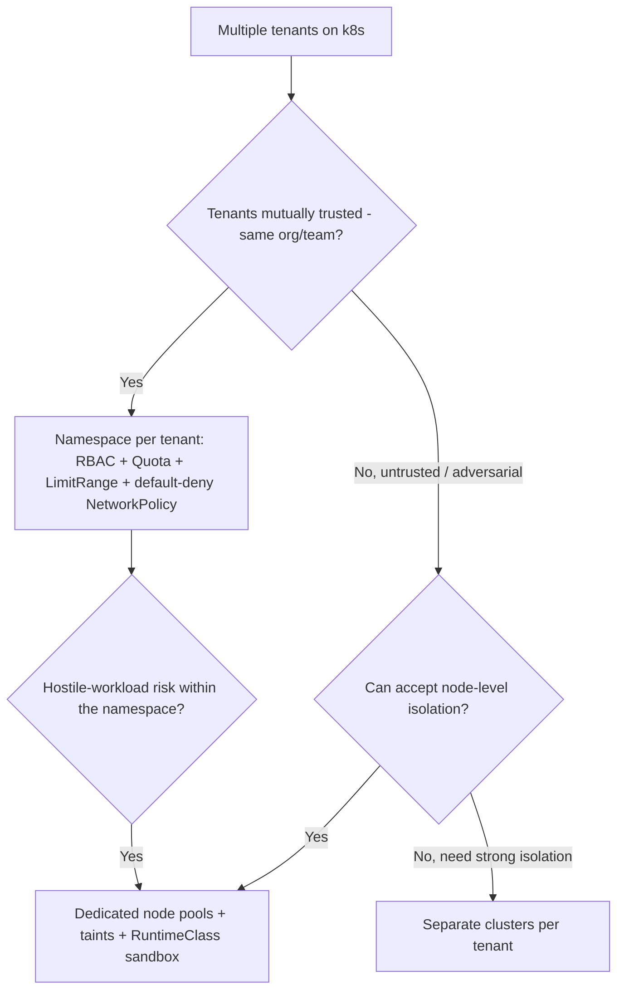
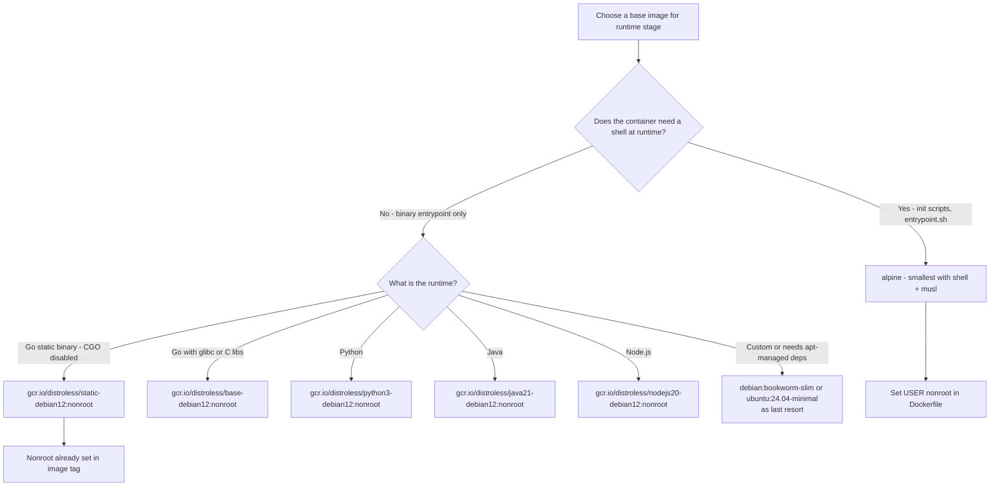
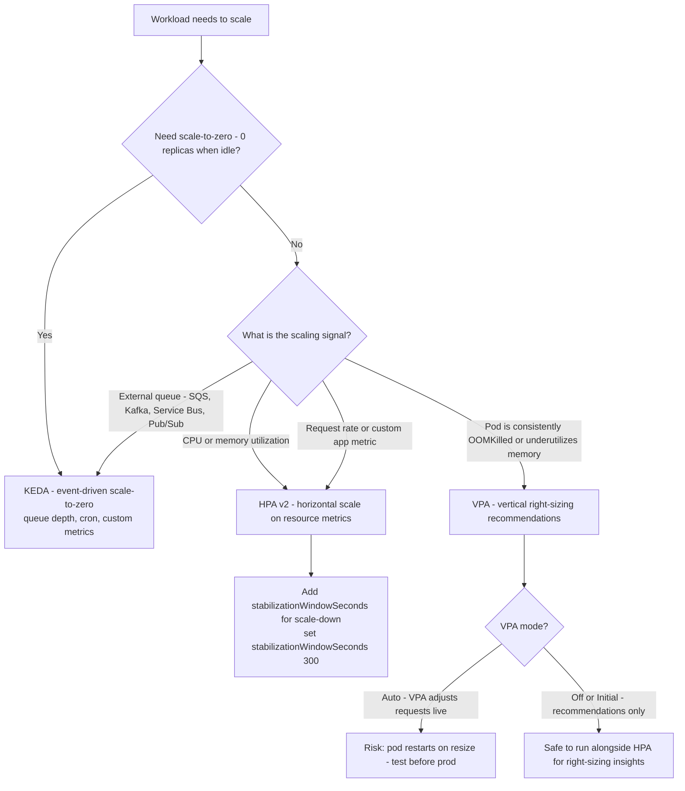
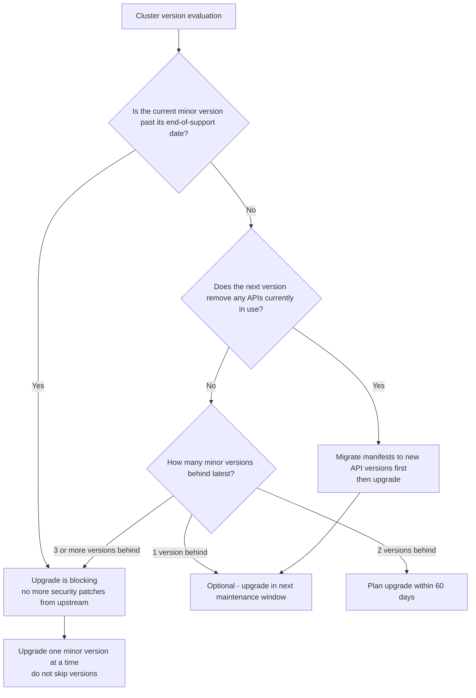

# Cloud-Native & Kubernetes — Decision Trees

_Decision trees + a dated capability map. Capability rows are `[verify-at-build]` — re-check against the vendor before quoting. Last reviewed: 2026-06-04._

Traverse before choosing a workload kind or installing a mesh.

## Decision Tree: Which workload kind?

Most things are Deployments. Reach for StatefulSet only when identity/storage truly matters.

_Don't StatefulSet a stateless app; you'll pay for it forever._

## Decision Tree: Do we need a service mesh?

Ingress first. A mesh must earn its complexity.

## Decision Tree: Where do secrets come from?

A Secret object is base64 in etcd, not a vault. Decide the source before you write the manifest.

_A secret committed in a manifest is already compromised — never the answer._

## Decision Tree: How to expose / route a service

North-south is Gateway API; a mesh is for east-west, and earns its cost separately.

_Gateway API is the successor to Ingress for new edge routing; a mesh is an east-west tool, not an ingress replacement._

## Decision Tree: How hard is the tenant isolation?

A namespace is a soft boundary. Match the mechanism to the trust level.

_A namespace shares a kernel and nodes; it is not a security boundary against a hostile tenant._

## Capability map (dated — verify at build)

| Capability | 2026 state `[verify-at-build]` | Notes |
|---|---|---|
| Gateway API | GA (replacing Ingress for new) | Role-oriented, expressive routing |
| HPA / VPA | GA | HPA on custom/external metrics; VPA for right-sizing |
| Pod Security Admission | GA (replaced PSP) | baseline/restricted profiles |
| OPA Gatekeeper / Kyverno | mature | policy-as-code admission |
| Istio / Linkerd | GA | mTLS, traffic-split; weigh sidecar cost (ambient mode emerging) |
| Distroless / minimal base images | mature | non-root, no shell; quiets CVE scans |

---

## Decision Tree: Container image base — distroless, alpine, or debian-slim?

**When this applies:** An engineer is writing or reviewing a Dockerfile and must choose a base image for the runtime stage. The observable inputs are: the application runtime, whether a shell is needed at runtime, whether glibc is needed, and what the CVE scan tolerance is.

**Last verified:** 2026-06-05 against Google distroless documentation and Docker Hub official images.

**Rationale per leaf:**
- *distroless/static* — zero OS packages beyond the bare syscall layer; smallest possible attack surface for statically linked binaries.
- *distroless/base* — includes glibc and libssl; required for Go/Rust binaries that link against C.
- *alpine* — smallest Linux distro with a shell; use when init scripts or debugging access is genuinely needed at runtime; musl libc occasionally causes unexpected behavior.
- *debian:slim / ubuntu:minimal* — last resort when apt-managed dependencies are truly unavoidable at runtime; scan actively.

**Tradeoffs summary:**

| Base | Shell | CVE count | glibc | Use when |
|---|---|---|---|---|
| distroless/static | No | Lowest | No | Go static binaries |
| distroless/base | No | Very low | Yes | C-linked runtimes |
| distroless/python3 | No | Low | Yes | Python apps |
| alpine | Yes | Low | No - musl | Shell needed at runtime |
| debian:slim | Yes | Medium | Yes | apt-managed deps unavoidable |

---

## Decision Tree: HPA, VPA, or KEDA for autoscaling?

**When this applies:** A Kubernetes workload needs to scale based on load. The observable inputs are: the scaling signal (CPU, memory, request rate, queue depth), whether scale-to-zero is needed, and whether the team wants vertical or horizontal scaling.

**Last verified:** 2026-06-05 against Kubernetes HPA v2, VPA documentation, and KEDA v2 release notes.

**Rationale per leaf:**
- *HPA* — the default for horizontal scaling on CPU/memory or custom metrics; simple, native, broadly supported.
- *VPA* — right-sizing tool that adjusts container resource requests; run in Off/Initial mode for recommendations without live pod restarts; do not run VPA Auto + HPA on the same pod (conflicting signals).
- *KEDA* — the standard for event-driven autoscaling and scale-to-zero; supports 50+ scalers (queues, crons, Prometheus metrics, Datadog metrics).

**Tradeoffs summary:**

| Tool | Scale-to-zero | Scaling signal | Pod restart on scale | Use when |
|---|---|---|---|---|
| HPA | No - min 1 | CPU/memory/custom metric | No - adds replicas | Standard horizontal scaling |
| VPA | No | CPU/memory over-request | Yes on Auto mode | Right-sizing container requests |
| KEDA | Yes | Any event source | No | Queue-driven or scale-to-zero |

---

## Decision Tree: When is a cluster upgrade blocking vs. optional?

**When this applies:** A Kubernetes cluster is running an older minor version and the team must decide whether to upgrade now or defer. The observable inputs are: the current version's end-of-support date, whether removed APIs are in active use, and the criticality of the cluster.

**Last verified:** 2026-06-05 against Kubernetes version support policy (12 months after GA).

**Rationale per leaf:**
- *Past end-of-support* — upstream stops shipping CVE patches; the cluster is a known vulnerability.
- *API migration required* — must be done before the upgrade, not after; a deploy failure after upgrade is a worse situation than a planned migration.
- *1 version behind* — acceptable lag; upgrade in a scheduled window.
- *2 versions behind* — end-of-support is approaching; plan within 60 days.
- *3+ versions behind* — the cluster is very likely past support or approaching it; urgent.

**Tradeoffs summary:**

| Urgency level | Condition | Recommended action |
|---|---|---|
| Blocking | Past EOL or 3+ versions behind | Upgrade immediately - start with staging |
| High | 2 versions behind | Upgrade within 60 days |
| Routine | 1 version behind | Next maintenance window |
| Preparatory | API deprecation in target version | Migrate manifests first |
