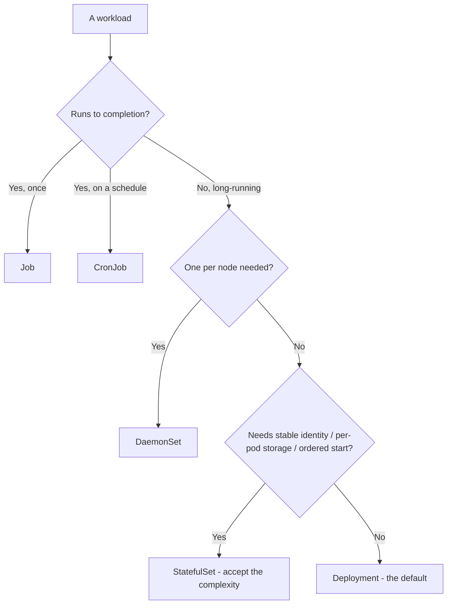
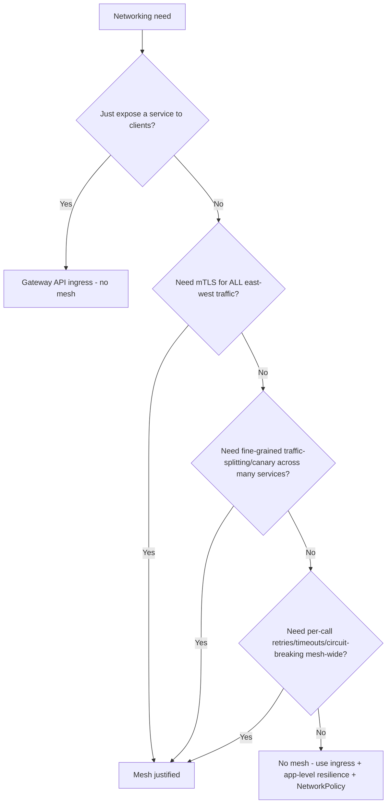

# Cloud-Native & Kubernetes — Decision Trees

_Decision trees + a dated capability map. Capability rows are `[verify-at-build]` — re-check against the vendor before quoting. Last reviewed: 2026-06-04._

Traverse before choosing a workload kind or installing a mesh.

## Decision Tree: Which workload kind?

Most things are Deployments. Reach for StatefulSet only when identity/storage truly matters.

_Don't StatefulSet a stateless app; you'll pay for it forever._

## Decision Tree: Do we need a service mesh?

Ingress first. A mesh must earn its complexity.

## Capability map (dated — verify at build)

| Capability | 2026 state `[verify-at-build]` | Notes |
|---|---|---|
| Gateway API | GA (replacing Ingress for new) | Role-oriented, expressive routing |
| HPA / VPA | GA | HPA on custom/external metrics; VPA for right-sizing |
| Pod Security Admission | GA (replaced PSP) | baseline/restricted profiles |
| OPA Gatekeeper / Kyverno | mature | policy-as-code admission |
| Istio / Linkerd | GA | mTLS, traffic-split; weigh sidecar cost (ambient mode emerging) |
| Distroless / minimal base images | mature | non-root, no shell; quiets CVE scans |
