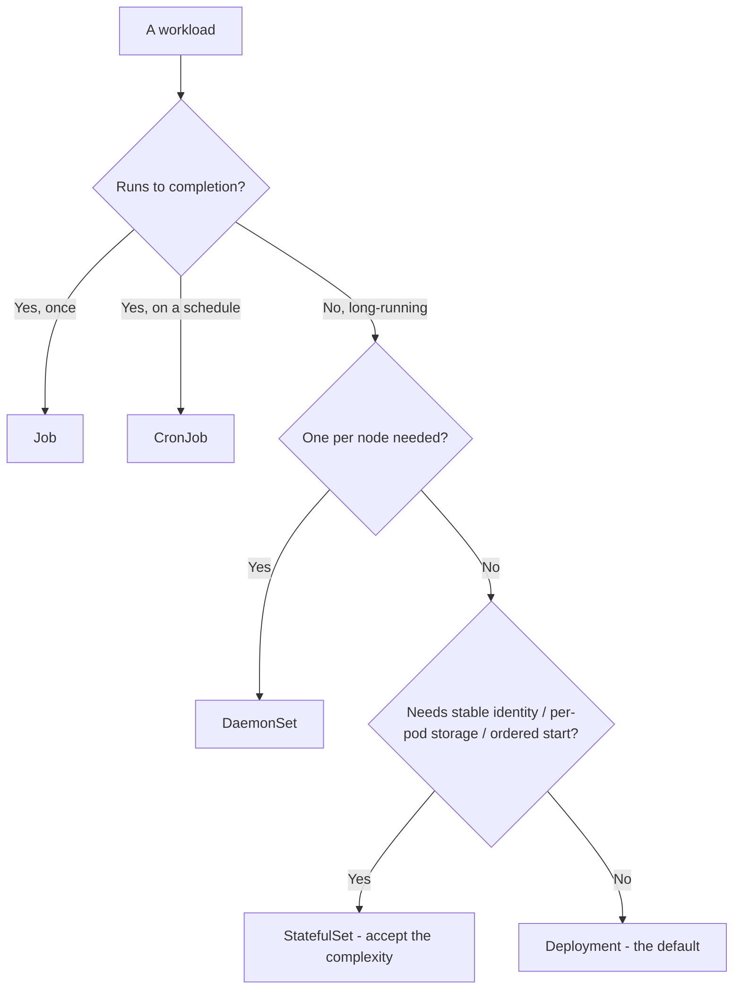
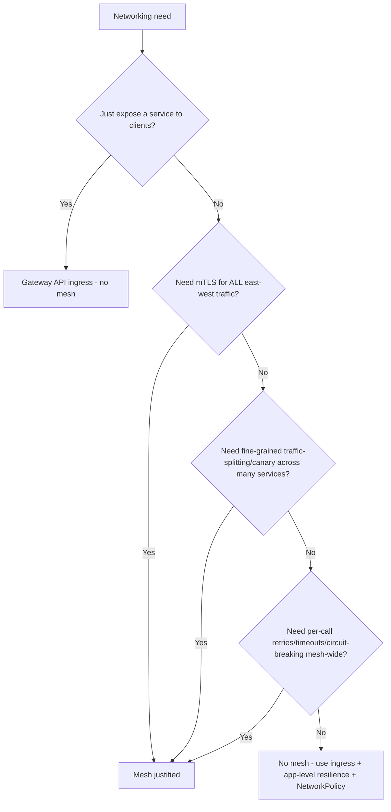
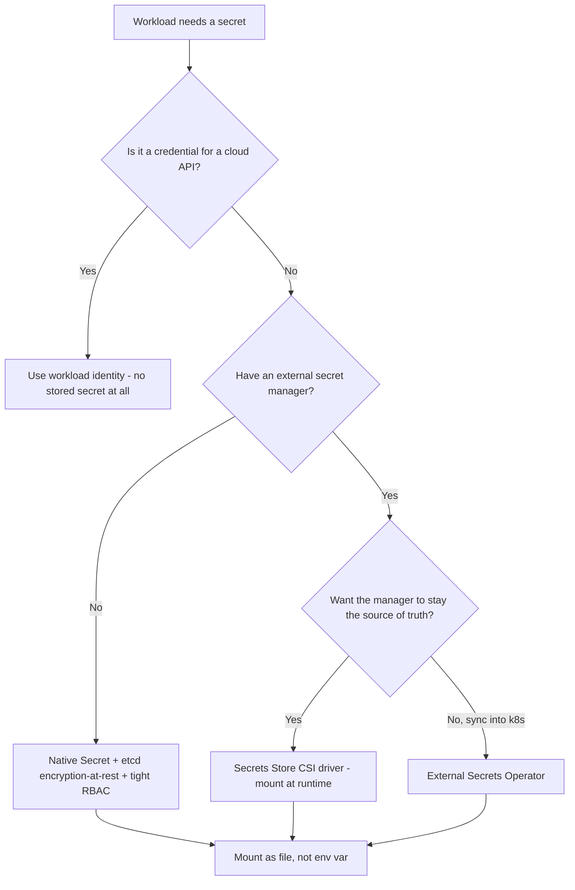
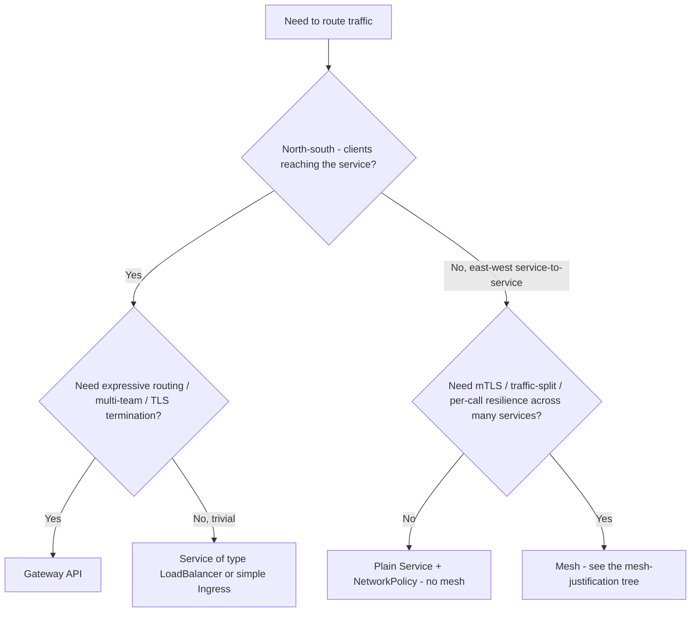
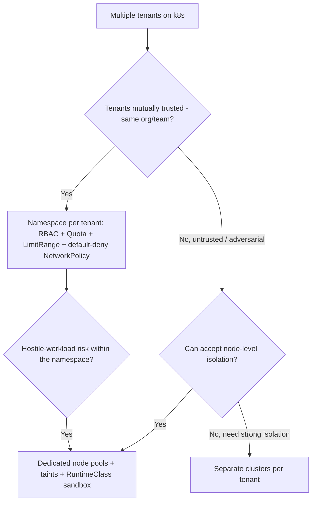
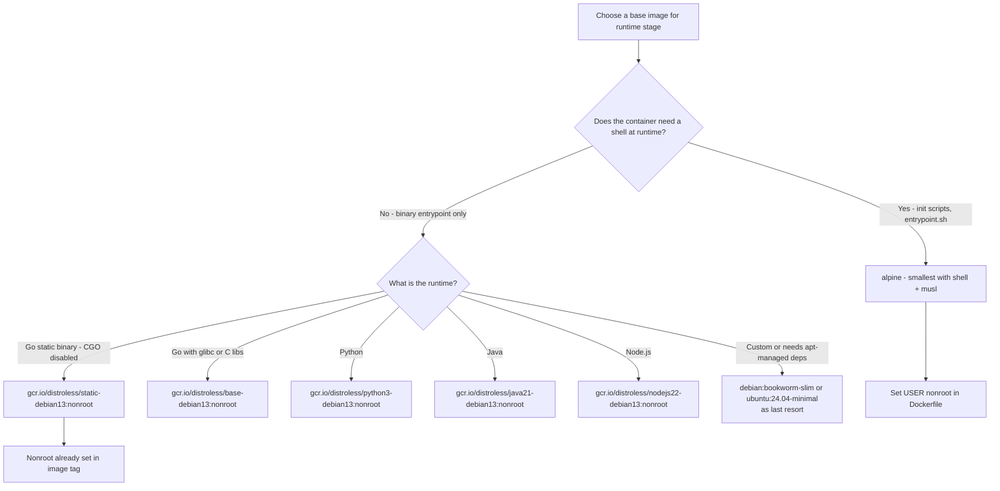
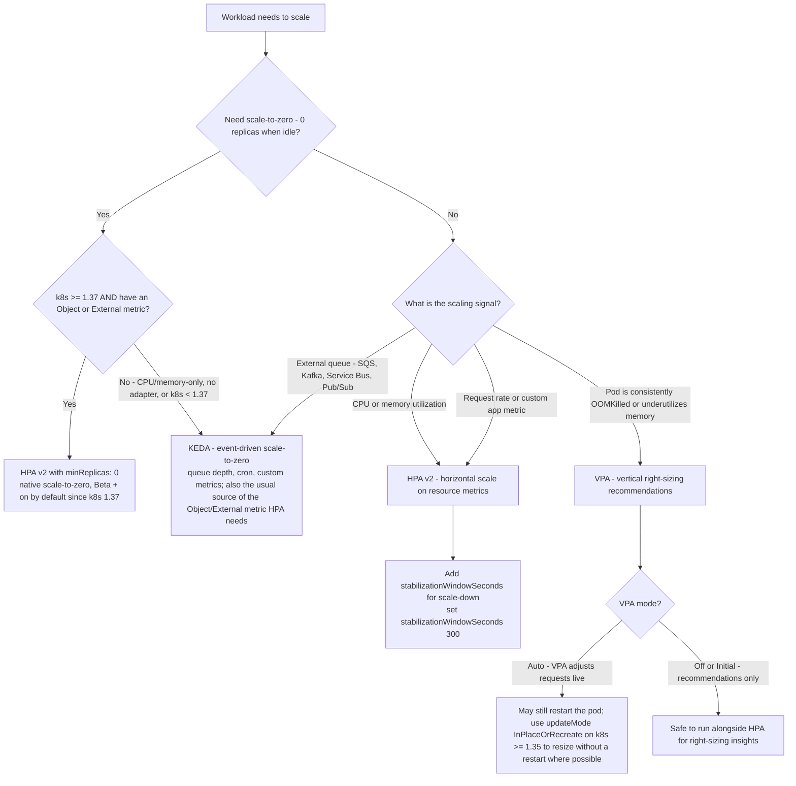
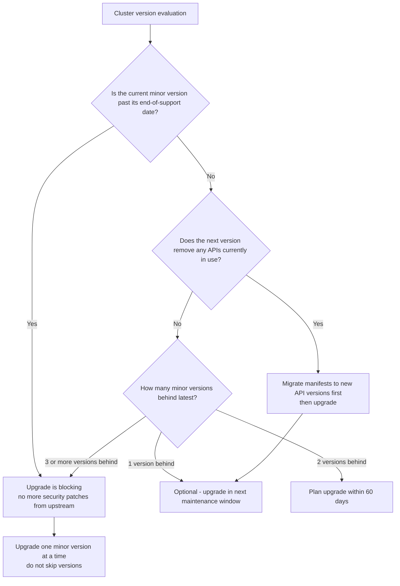

# Cloud-Native & Kubernetes — Decision Trees

_Decision trees + a dated capability map. Capability rows are `[verify-at-build]` — re-check against the vendor before quoting. Last reviewed: 2026-06-04._

Traverse before choosing a workload kind or installing a mesh.

## Decision Tree: Which workload kind?

Most things are Deployments. Reach for StatefulSet only when identity/storage truly matters.

```mermaid
graph TD
  A[A workload] --> B{Runs to completion?}
  B -- Yes, once --> C[Job]
  B -- Yes, on a schedule --> D[CronJob]
  B -- No, long-running --> E{One per node needed?}
  E -- Yes --> F[DaemonSet]
  E -- No --> G{Needs stable identity / per-pod storage / ordered start?}
  G -- Yes --> H[StatefulSet - accept the complexity]
  G -- No --> I[Deployment - the default]
```

_Don't StatefulSet a stateless app; you'll pay for it forever._

## Decision Tree: Do we need a service mesh?

Ingress first. A mesh must earn its complexity.

```mermaid
graph TD
  A[Networking need] --> B{Just expose a service to clients?}
  B -- Yes --> C[Gateway API ingress - no mesh]
  B -- No --> D{Need mTLS for ALL east-west traffic?}
  D -- Yes --> E[Mesh justified]
  D -- No --> F{Need fine-grained traffic-splitting/canary across many services?}
  F -- Yes --> E
  F -- No --> G{Need per-call retries/timeouts/circuit-breaking mesh-wide?}
  G -- Yes --> E
  G -- No --> H[No mesh - use ingress + app-level resilience + NetworkPolicy]
```

## Decision Tree: Where do secrets come from?

A Secret object is base64 in etcd, not a vault. Decide the source before you write the manifest.

```mermaid
graph TD
  A[Workload needs a secret] --> B{Is it a credential for a cloud API?}
  B -- Yes --> C[Use workload identity - no stored secret at all]
  B -- No --> D{Have an external secret manager?}
  D -- Yes --> E{Want the manager to stay the source of truth?}
  E -- Yes --> F[Secrets Store CSI driver - mount at runtime]
  E -- No, sync into k8s --> G[External Secrets Operator]
  D -- No --> H[Native Secret + etcd encryption-at-rest + tight RBAC]
  H --> I[Mount as file, not env var]
  F --> I
  G --> I
```

_A secret committed in a manifest is already compromised — never the answer._

## Decision Tree: How to expose / route a service

North-south is Gateway API; a mesh is for east-west, and earns its cost separately.

```mermaid
graph TD
  A[Need to route traffic] --> B{North-south - clients reaching the service?}
  B -- Yes --> C{Need expressive routing / multi-team / TLS termination?}
  C -- Yes --> D[Gateway API]
  C -- No, trivial --> E[Service of type LoadBalancer or simple Ingress]
  B -- No, east-west service-to-service --> F{Need mTLS / traffic-split / per-call resilience across many services?}
  F -- No --> G[Plain Service + NetworkPolicy - no mesh]
  F -- Yes --> H[Mesh - see the mesh-justification tree]
```

_Gateway API is the successor to Ingress for new edge routing; a mesh is an east-west tool, not an ingress replacement._

## Decision Tree: How hard is the tenant isolation?

A namespace is a soft boundary. Match the mechanism to the trust level.

```mermaid
graph TD
  A[Multiple tenants on k8s] --> B{Tenants mutually trusted - same org/team?}
  B -- Yes --> C[Namespace per tenant: RBAC + Quota + LimitRange + default-deny NetworkPolicy]
  B -- No, untrusted / adversarial --> D{Can accept node-level isolation?}
  D -- Yes --> E[Dedicated node pools + taints + RuntimeClass sandbox]
  D -- No, need strong isolation --> F[Separate clusters per tenant]
  C --> G{Hostile-workload risk within the namespace?}
  G -- Yes --> E
```

_A namespace shares a kernel and nodes; it is not a security boundary against a hostile tenant._

## Capability map (dated — verify at build)

| Capability | 2026 state `[verify-at-build]` | Notes |
|---|---|---|
| **Kubernetes core** | current GA **1.37** ("Garhwal", 2026-08-26); 1.36 / 1.35 in support; **1.34 in maintenance mode (entered 2026-08-27), EOL 2026-10-27** | re-verified 2026-08-31 for the 1.37 GA fact; **support-window figure and 1.34 status re-verified 2026-09-23** (WebSearch cross-referenced against kubernetes.io/releases/patch-releases and kubernetes.io/releases/1.34 — direct WebFetch to kubernetes.io was egress-blocked this session); **~14-mo support window (12 mo of GA support + 2 mo of maintenance mode), not 12 mo** — [1.37 release](https://kubernetes.io/blog/2026/08/26/kubernetes-v1-37-release/) |
| Gateway API | GA; latest v1.6.0 (2026-06-29) | Role-oriented, expressive routing; **UDPRoute + TCPRoute now GA (v1)** — stable L4 TCP/UDP routing, not just HTTP. [v1.6.0](https://github.com/kubernetes-sigs/gateway-api/releases/tag/v1.6.0) |
| Community **`ingress-nginx`** | **RETIRED** — best-effort maint. ended **March 2026**; no further releases/bugfixes/**security patches**, repos read-only | Do **not** deploy on new clusters (un-patched CVEs); migrate to Gateway API or a supported controller — [retirement notice](https://kubernetes.io/blog/2025/11/11/ingress-nginx-retirement/), [Steering/SRC statement](https://kubernetes.io/blog/2026/01/29/ingress-nginx-statement/) `[verified 2026-07-08]` |
| HPA / VPA | GA | HPA on custom/external metrics, **plus native scale-to-zero (Beta, on by default since k8s 1.37 — see the HPA/VPA/KEDA tree)**; VPA for right-sizing |
| Pod Security Admission | GA (replaced PSP) | baseline/restricted profiles |
| OPA Gatekeeper / Kyverno | mature | policy-as-code admission |
| Istio / Linkerd | GA | mTLS, traffic-split; weigh sidecar cost (**ambient mode reached GA in Istio v1.24, Nov 2024** — ztunnel, L7 waypoints, and the APIs are all marked Stable) `[re-verified 2026-09-23 via istio.io/latest/blog/2024/ambient-reaches-ga]` |
| Distroless / minimal base images | mature | non-root, no shell; quiets CVE scans |
| **DRA** (Dynamic Resource Allocation) | **GA since 1.34**; further enhancements GA in 1.36 | first-class GPU/accelerator scheduling — [1.34 DRA GA](https://kubernetes.io/blog/2025/09/01/kubernetes-v1-34-dra-updates/) |
| **cgroup v1** | **fail-by-default since 1.35** — kubelet `FailCgroupV1` defaults `true`, so a cgroup-v1 node won't start kubelet unless the operator sets `FailCgroupV1=false` (override still available); **not yet code-removed** — [KEP-5573](https://github.com/kubernetes/enhancements/blob/master/keps/sig-node/5573-remove-cgroup-v1/README.md) targets removal no earlier than 1.38, no committed date `[verify-at-use]` | prefer **cgroup v2** (and containerd ≥1.7); confirm before upgrading clusters |
| **User Namespaces** (`hostUsers: false`) | **GA in 1.36** | enabled-by-default since 1.33; rootless UID-mapping pod isolation — [1.36 userns GA](https://kubernetes.io/blog/2026/04/23/kubernetes-v1-36-userns-ga/) |

---

## Decision Tree: Container image base — distroless, alpine, or debian-slim?

**When this applies:** An engineer is writing or reviewing a Dockerfile and must choose a base image for the runtime stage. The observable inputs are: the application runtime, whether a shell is needed at runtime, whether glibc is needed, and what the CVE scan tolerance is.

**Last verified:** 2026-09-23 against the GoogleContainerTools/distroless README (upstream now bases every image on Debian 13/trixie; there is no `-debian12` or `nodejs20` tag in the current listing) and Node.js's own EOL schedule (Node 20 reached EOL 2026-04-30).

```mermaid
flowchart TD
    START[Choose a base image for runtime stage] --> SHELL{Does the container need a shell at runtime?}
    SHELL -->|Yes - init scripts, entrypoint.sh| ALPINE[alpine - smallest with shell + musl]
    SHELL -->|No - binary entrypoint only| RUNTIME{What is the runtime?}
    RUNTIME -->|Go static binary - CGO disabled| STATIC[gcr.io/distroless/static-debian13:nonroot]
    RUNTIME -->|Go with glibc or C libs| BASE[gcr.io/distroless/base-debian13:nonroot]
    RUNTIME -->|Python| PYTHON[gcr.io/distroless/python3-debian13:nonroot]
    RUNTIME -->|Java| JAVA[gcr.io/distroless/java21-debian13:nonroot]
    RUNTIME -->|Node.js| NODE[gcr.io/distroless/nodejs22-debian13:nonroot]
    RUNTIME -->|Custom or needs apt-managed deps| SLIM[debian:bookworm-slim or ubuntu:24.04-minimal<br/>as last resort]
    ALPINE --> NONROOT[Set USER nonroot in Dockerfile]
    STATIC --> DONE[Nonroot already set in image tag]
```

_Debian 12 tags (`-debian12`) and the `nodejs20` variant are no longer in upstream's current listing — retag to `-debian13`. Node 20 itself is EOL (2026-04-30); use `nodejs22-debian13` (LTS) or `nodejs24-debian13` if you need the newer runtime. `nodejs26-debian13` also exists upstream if you're tracking current._

**Rationale per leaf:**
- *distroless/static* — zero OS packages beyond the bare syscall layer; smallest possible attack surface for statically linked binaries.
- *distroless/base* — includes glibc and libssl; required for Go/Rust binaries that link against C.
- *alpine* — smallest Linux distro with a shell; use when init scripts or debugging access is genuinely needed at runtime; musl libc occasionally causes unexpected behavior.
- *debian:slim / ubuntu:minimal* — last resort when apt-managed dependencies are truly unavoidable at runtime; scan actively.

**Tradeoffs summary:**

| Base | Shell | CVE count | glibc | Use when |
|---|---|---|---|---|
| distroless/static | No | Lowest | No | Go static binaries |
| distroless/base | No | Very low | Yes | C-linked runtimes |
| distroless/python3 | No | Low | Yes | Python apps |
| alpine | Yes | Low | No - musl | Shell needed at runtime |
| debian:slim | Yes | Medium | Yes | apt-managed deps unavoidable |

---

## Decision Tree: HPA, VPA, or KEDA for autoscaling?

**When this applies:** A Kubernetes workload needs to scale based on load. The observable inputs are: the scaling signal (CPU, memory, request rate, queue depth), whether scale-to-zero is needed, and whether the team wants vertical or horizontal scaling.

**Last verified:** 2026-09-23 against the `kubernetes/enhancements` KEP-2021 (HPAScaleToZero) yaml, the Kubernetes 1.37 CHANGELOG, and the Kubernetes 1.35 "In-Place Pod Resize Graduates to Stable" blog post.

```mermaid
flowchart TD
    START[Workload needs to scale] --> ZERO{Need scale-to-zero - 0 replicas when idle?}
    ZERO -->|Yes| ZEROK8S{k8s >= 1.37 AND have an Object or External metric?}
    ZEROK8S -->|Yes| HPAZERO[HPA v2 with minReplicas: 0<br/>native scale-to-zero, Beta + on by default since k8s 1.37]
    ZEROK8S -->|No - CPU/memory-only, no adapter, or k8s < 1.37| KEDA[KEDA - event-driven scale-to-zero<br/>queue depth, cron, custom metrics; also the usual source of the Object/External metric HPA needs]
    ZERO -->|No| SIG{What is the scaling signal?}
    SIG -->|CPU or memory utilization| HPA[HPA v2 - horizontal scale on resource metrics]
    SIG -->|Request rate or custom app metric| HPA
    SIG -->|Pod is consistently OOMKilled or underutilizes memory| VPA[VPA - vertical right-sizing recommendations]
    SIG -->|External queue - SQS, Kafka, Service Bus, Pub/Sub| KEDA
    HPA --> STABLE[Add stabilizationWindowSeconds for scale-down<br/>set stabilizationWindowSeconds 300]
    VPA --> MODE{VPA mode?}
    MODE -->|Auto - VPA adjusts requests live| VPAOFF[May still restart the pod; use updateMode InPlaceOrRecreate on k8s >= 1.35 to resize without a restart where possible]
    MODE -->|Off or Initial - recommendations only| VPASAFE[Safe to run alongside HPA for right-sizing insights]
```

**Rationale per leaf:**
- *HPA* — the default for horizontal scaling on CPU/memory or custom metrics; simple, native, broadly supported. **Since Kubernetes 1.37, `HPAScaleToZero` is Beta and on by default**: an HPA with `minReplicas: 0` is accepted, but only when it scales on an **Object or External** metric — CPU/memory-only HPAs cannot go to zero because there are no running pods left to report them.
- *VPA* — right-sizing tool that adjusts container resource requests; run in Off/Initial mode for recommendations without live pod restarts; do not run VPA Auto + HPA on the same pod (conflicting signals). Auto mode **may still restart the pod**, but in-place pod resize graduated to GA in Kubernetes 1.35, and VPA's `InPlaceOrRecreate` update mode resizes in place first, falling back to evict-and-recreate only when the node lacks capacity.
- *KEDA* — still the practical way most teams **feed** the Object/External metric that native HPA scale-to-zero needs (60+ scalers: queues, crons, Prometheus, Datadog), and it remains the only option for scale-to-zero on clusters below 1.37 or where the event source has no metrics adapter. HPA-can-do-zero is not "KEDA is obsolete" — the two are complementary, not substitutes.

**Tradeoffs summary:**

| Tool | Scale-to-zero | Scaling signal | Pod restart on scale | Use when |
|---|---|---|---|---|
| HPA | **Yes, on k8s >= 1.37 with an Object/External metric** (Beta, on by default) | CPU/memory/custom metric | No - adds replicas | Standard horizontal scaling; native scale-to-zero once on 1.37+ |
| VPA | No | CPU/memory over-request | **May restart on Auto mode; use `InPlaceOrRecreate` on k8s >= 1.35 to minimise restarts** | Right-sizing container requests |
| KEDA | Yes (any k8s version) | Any event source | No | Queue/event-driven scale-to-zero, clusters < 1.37, or no metrics adapter for HPA to consume |

---

## Decision Tree: When is a cluster upgrade blocking vs. optional?

**When this applies:** A Kubernetes cluster is running an older minor version and the team must decide whether to upgrade now or defer. The observable inputs are: the current version's end-of-support date, whether removed APIs are in active use, and the criticality of the cluster.

**Last verified:** 2026-09-23 against kubernetes.io/releases/patch-releases and kubernetes.io/releases/1.34. Upstream support is **~14 months after GA, not 12**: 12 months of standard (GA) support followed by 2 months of maintenance mode (security-fix backports only) before EOL. Example: **1.34** was released 2025-08-27, entered maintenance mode 2026-08-27, and reaches **EOL 2026-10-27** — so 1.34 is still (in maintenance) support today, not out of support.

```mermaid
flowchart TD
    START[Cluster version evaluation] --> EOL{Is the current minor version past its end-of-support date?}
    EOL -->|Yes| URGENT[Upgrade is blocking<br/>no more security patches from upstream]
    EOL -->|No| API{Does the next version remove any APIs currently in use?}
    API -->|Yes| MIGRATE[Migrate manifests to new API versions first<br/>then upgrade]
    API -->|No| DELTA{How many minor versions behind latest?}
    DELTA -->|1 version behind| OPT[Optional - upgrade in next maintenance window]
    DELTA -->|2 versions behind| PLAN[Plan upgrade within 60 days]
    DELTA -->|3 or more versions behind| URGENT
    MIGRATE --> OPT
    URGENT --> INCR[Upgrade one minor version at a time<br/>do not skip versions]
```

**Rationale per leaf:**
- *Past end-of-support* — upstream stops shipping CVE patches; the cluster is a known vulnerability.
- *API migration required* — must be done before the upgrade, not after; a deploy failure after upgrade is a worse situation than a planned migration.
- *1 version behind* — acceptable lag; upgrade in a scheduled window.
- *2 versions behind* — end-of-support is approaching; plan within 60 days.
- *3+ versions behind* — the cluster is very likely past support or approaching it; urgent.

**Tradeoffs summary:**

| Urgency level | Condition | Recommended action |
|---|---|---|
| Blocking | Past EOL or 3+ versions behind | Upgrade immediately - start with staging |
| High | 2 versions behind | Upgrade within 60 days |
| Routine | 1 version behind | Next maintenance window |
| Preparatory | API deprecation in target version | Migrate manifests first |
