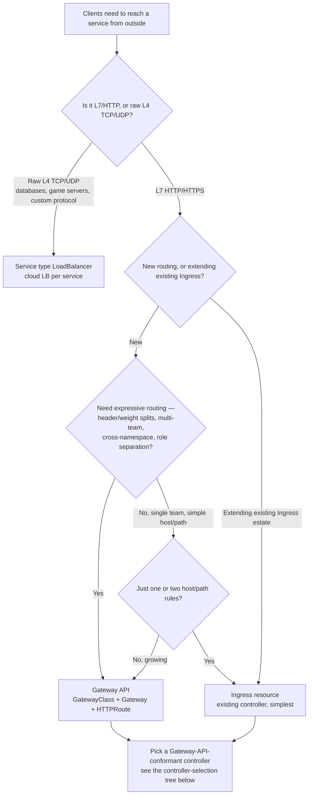
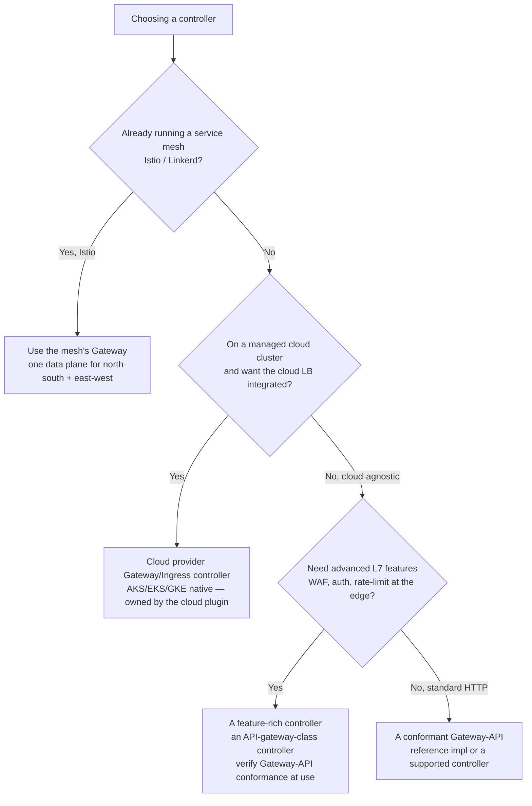
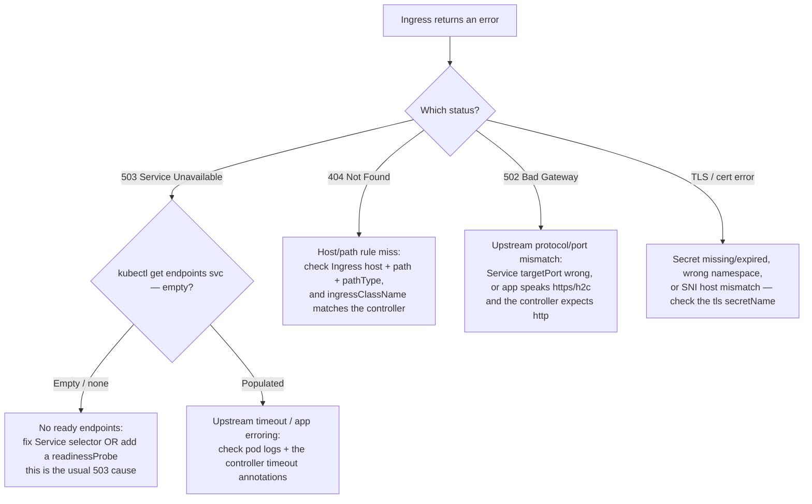

# Networking & Ingress — Decision Trees

_Topic-specific complement to [`cloud-native-kubernetes-decision-trees.md`](cloud-native-kubernetes-decision-trees.md). That file answers the **architecture** questions — "do we need a mesh?" and "north-south vs east-west routing." This file answers the **implementation** questions one layer down: which ingress mechanism to pick once you've decided you need north-south routing, and how to debug an Ingress that returns errors._

**Last verified:** 2026-06-05 against the Kubernetes Gateway API status (GA) and Ingress documentation. Gateway-API GA status and controller feature support are `[verify-at-use]` — re-check the controller's conformance level before committing.

Traverse before installing an ingress controller or writing an Ingress/Gateway resource.

## Decision Tree: Which north-south routing mechanism?

You've decided clients need to reach a service from outside (the architecture tree sent you here). Now pick the mechanism. **Gateway API is the successor to Ingress for new routing**; reach for plain Service types only when the need is trivial.

**Rationale per leaf:**

- _Service type LoadBalancer_ — for non-HTTP L4 traffic (TCP/UDP), or a single service that just needs an external IP. One cloud load balancer per service; simple but doesn't scale to many services (cost + IP sprawl).
- _Ingress resource_ — the established L7 mechanism: host/path rules against a shared controller. Fine for a small, single-team estate; its extension points are annotation-driven and controller-specific (a portability tax).
- _Gateway API_ — the role-oriented successor: `GatewayClass` (infra), `Gateway` (cluster-op owned listener), `HTTPRoute` (app-team owned routing). Native header/weight-based splits, cross-namespace routing, and clean multi-team separation without annotation soup. **The default for new north-south routing.**

**Tradeoffs summary:**

| Mechanism | Layer | Multi-team / expressive | Use when |
|---|---|---|---|
| Service LoadBalancer | L4 | No | Raw TCP/UDP, or one external service |
| Ingress | L7 | Limited (annotations) | Small single-team HTTP estate |
| Gateway API | L7 | Yes (role-separated) | New routing, multi-team, weight/header splits |

## Decision Tree: Picking the ingress / Gateway controller

The mechanism (above) is the *API*; the controller is the *implementation*. Match it to what you already run and what you need.

> **Do not pick community `ingress-nginx` for a new cluster.** The Kubernetes project **retired** the community `ingress-nginx` controller: best-effort maintenance ended **March 2026**, after which there are **no releases, bug fixes, or security patches** and the repos go read-only (per the [Nov 11 2025 retirement notice](https://kubernetes.io/blog/2025/11/11/ingress-nginx-retirement/) and the [Jan 29 2026 Steering/Security-Response statement](https://kubernetes.io/blog/2026/01/29/ingress-nginx-statement/)). Existing deployments keep functioning, but standing up `ingress-nginx` on a **new** cluster now signs up for un-patched CVEs. Migrate to the **Gateway API** (the recommended successor) or a supported/commercial ingress controller. `[verified 2026-07-08 — kubernetes.io]`

**Rationale:**

- _Mesh Gateway_ — if you already run Istio/Linkerd, route north-south through the mesh's gateway so you operate one data plane, not two. (Don't *add* a mesh just to get an ingress — see the architecture file's mesh-justification tree.)
- _Cloud-native controller_ — on a managed cluster, the cloud's own Gateway/Ingress controller integrates the cloud load balancer + IAM cleanly; that selection is the **cloud plugin's** lane (`azure-cloud` / `aws-cloud` / `gcp-cloud`), this team consumes it.
- _Feature-rich / standard controller_ — cloud-agnostic clusters pick a controller by feature need; **verify the controller's Gateway-API conformance level** before committing if you're on the Gateway API. `[verify-at-use]` **Note the community `ingress-nginx` retirement (March 2026, no further security patches — see the callout above): prefer a Gateway-API implementation or a maintained/commercial controller for new builds.**

## Decision Tree: Debugging an Ingress that returns an error

A controller-level error code points at *where* in the chain the request died. Walk it from the closest layer outward.

**The load-bearing rule:** a **503 through an Ingress is almost always "no healthy endpoint," not a broken controller.** First command is `kubectl get endpoints <service>` (or `endpointslices`) — empty endpoints mean a Service selector mismatch or pods that never went `Ready`. Don't restart the controller or chase DNS until you've confirmed the Service actually has backing pods. `[verify-at-use — endpoints vs endpointslices command on your cluster version.]`

## See also

- [`cloud-native-kubernetes-decision-trees.md`](cloud-native-kubernetes-decision-trees.md) — the **architecture** trees (mesh-justification, north-south-vs-east-west, secrets source) this file complements.
- [`../best-practices/gateway-api-for-new-ingress.md`](../best-practices/gateway-api-for-new-ingress.md) and [`../best-practices/probes-are-mandatory.md`](../best-practices/probes-are-mandatory.md) — the rule form.
- [`../scenarios/2026-06-05-ingress-503-dns-and-readiness.md`](../scenarios/2026-06-05-ingress-503-dns-and-readiness.md) — the field note where the 503 debug tree was the fix.
- The mesh data plane, mTLS, and east-west traffic-splitting belong to `service-mesh-networking-engineer`; managed-cloud LB/controller selection to the cloud plugins.
