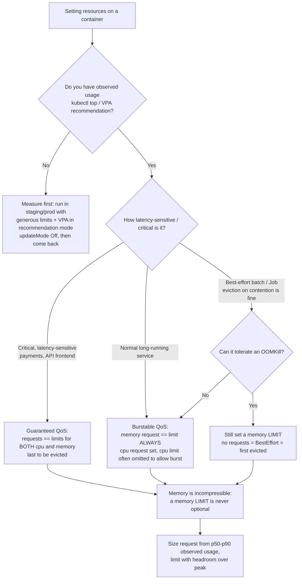
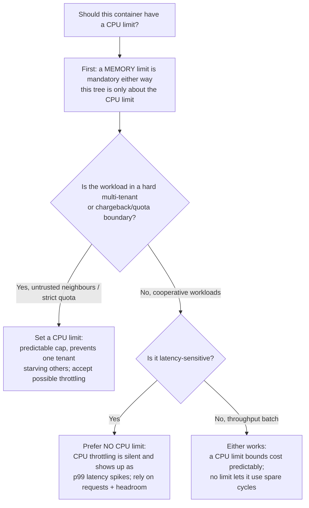

# Workload Resource Sizing — Decision Trees

_Topic-specific complement to [`cloud-native-kubernetes-decision-trees.md`](cloud-native-kubernetes-decision-trees.md). That file's autoscaling tree answers **which autoscaler** (HPA / VPA / KEDA); this file answers the upstream question those scalers depend on — **how to set `requests`/`limits` and which QoS class you land in**. Get the requests right first; autoscaling on wrong requests amplifies the error._

**Last verified:** 2026-06-05 against the Kubernetes scheduling / Quality-of-Service documentation and VPA recommender behavior. Mechanics (QoS derivation, the OOMKill signature) are stable Kubernetes contracts; the VPA `updateMode` behavior is `[verify-at-use]` against your install.

Traverse before writing `resources:` on any container.

## Decision Tree: How to set requests and limits (and which QoS you get)

The QoS class is **derived** from how you set requests/limits — it is not a field you set. It decides eviction order under node pressure. Choose the QoS you want, then set requests/limits to land it.

**Rationale per leaf:**

- _Guaranteed_ — `requests == limits` for **both** CPU and memory. Evicted last under node pressure; use for the workloads you least want killed. The cost is no bursting — you reserve exactly what you cap.
- _Burstable_ — `requests` set, at least one `limit` higher than (or absent for CPU). The common, sensible default: **memory `request == limit`** (incompressible — avoid OOM surprises) with a **CPU request but often no CPU limit** (CPU is compressible; a limit causes silent throttling, so many teams omit it and rely on requests + node headroom).
- _BestEffort_ — no requests/limits at all → first to be evicted. Acceptable only for interruptible batch — and even then, **cap memory** so one runaway pod can't OOM the node's neighbours.

**Why the QoS matters (the eviction order):** `Guaranteed` > `Burstable` > `BestEffort` for *survival* — the kubelet evicts BestEffort first, then Burstable pods exceeding requests, and Guaranteed last. A critical service left at BestEffort (no requests) is the first thing killed when a node gets tight.

**Tradeoffs summary:**

| QoS class | How to land it | Eviction order | Use when |
|---|---|---|---|
| Guaranteed | requests == limits for CPU **and** memory | Evicted last | Critical, latency-sensitive workloads |
| Burstable | memory request == limit; CPU request set (limit optional) | Middle | Normal long-running services (the default) |
| BestEffort | no requests or limits | Evicted first | Interruptible batch only — still cap memory |

## Decision Tree: CPU limit — set one or omit it?

CPU is **compressible** (the kernel throttles); memory is **incompressible** (the kernel OOMKills). That asymmetry drives the limit decision, and it's a genuine live debate — so it gets its own branch.

**Rationale:**

- _Set a CPU limit_ when you need a hard, predictable cap — multi-tenant nodes with untrusted neighbours, strict chargeback/quota, or a known-buggy workload that can spin. The price is CPU throttling (CFS quota), which is **silent** and surfaces as latency.
- _Omit the CPU limit_ for cooperative, latency-sensitive workloads: a CPU limit throttles the app the instant it exceeds quota even when the node has idle cores, producing p99 spikes that are hard to diagnose. Set a CPU **request** (so the scheduler reserves a floor) and rely on node headroom for burst.
- _Memory is never in this debate_ — always set a memory limit. An unbounded container is a node-wide OOM risk.

**The OOMKill signature (for the diagnosis half):** a container terminated with **exit code 137** (= 128 + SIGKILL/9) and `Last State: Terminated, Reason: OOMKilled` means its working set exceeded its memory limit. The fix is a correct memory request/limit from observed usage — not more replicas. `[verify-at-use — exit 137 = SIGKILL OOMKill signature; confirm against the kubelet docs for your version.]`

## See also

- [`cloud-native-kubernetes-decision-trees.md`](cloud-native-kubernetes-decision-trees.md) — the **which-autoscaler** tree (HPA/VPA/KEDA), the workload-kind tree, and the cluster-upgrade tree (the #315 baseline this file complements).
- [`../best-practices/resource-requests-and-limits-are-mandatory.md`](../best-practices/resource-requests-and-limits-are-mandatory.md) and [`../best-practices/set-requests-and-limits.md`](../best-practices/set-requests-and-limits.md) — the rule form of this tree.
- [`../scenarios/2026-06-05-crashloopbackoff-oomkilled-triage.md`](../scenarios/2026-06-05-crashloopbackoff-oomkilled-triage.md) and [`../scenarios/2026-06-05-cluster-cost-right-sizing.md`](../scenarios/2026-06-05-cluster-cost-right-sizing.md) — field notes where this tree was the fix.
