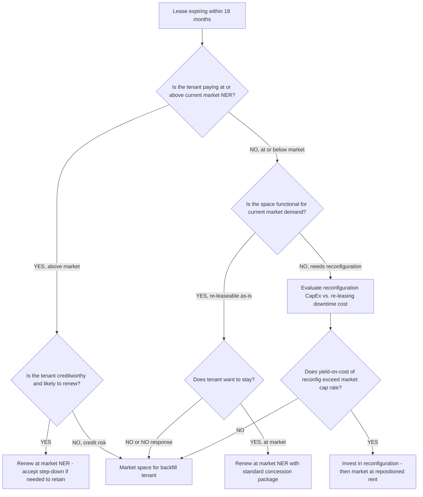
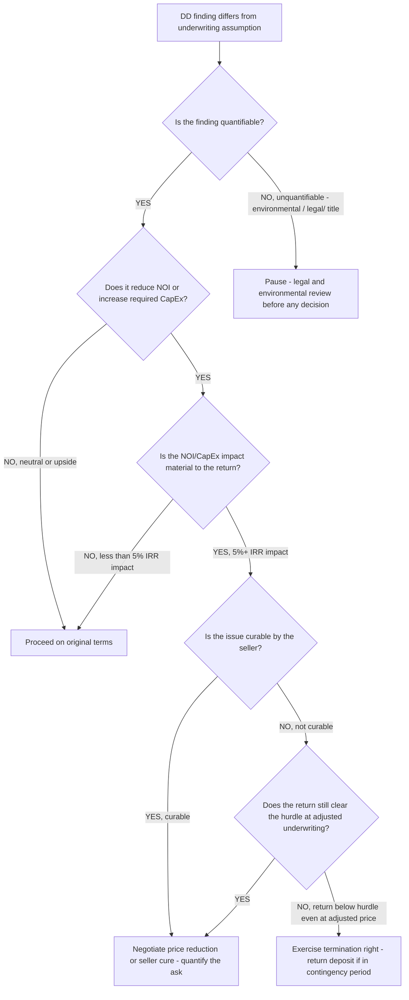
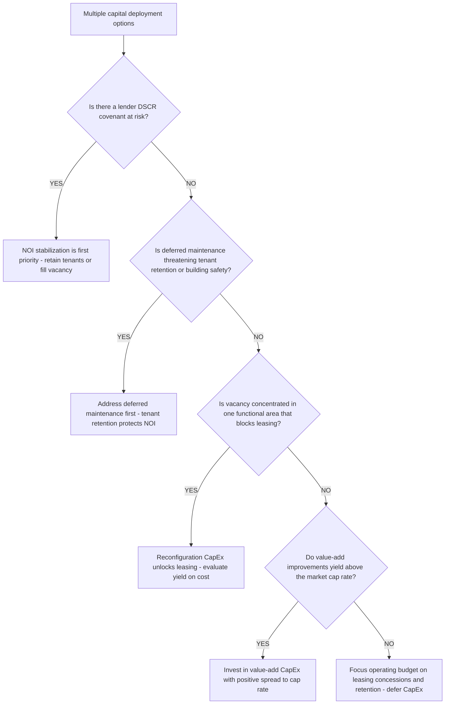

# CRE decision trees

Which analysis for which question — traverse top-to-bottom before picking a method.

## Decision Tree: Should we buy this deal?

1) Re-underwrite to in-place NOI (§3 #1). 2) Separate going-in cap from levered IRR (§3 #2). 3) Price the spread (§3 #3). 4) Stress the debt and refi (§3 #6). 5) Only then weigh the pro-forma upside.

## Decision Tree: This asset missed NOI

1) Is it a rent (occupancy/NER), opex, or recovery variance (§3 #7)? 2) Is the miss structural or a timing lag? 3) Map to a leasing, expense, or recovery fix.

## Decision Tree: Sell or hold through the refi?

1) What rate/cap does the refinance clear at (§3 #6)? 2) What's the clearing sale price today? 3) Compare hold equity-at-risk to a sale now.

## How to read these trees

Traverse top-to-bottom and stop at the first matching branch — the order encodes the cheap-checks-before-expensive-checks discipline (§3). Each leaf names a skill, a specialist, or a house-opinion to apply. Never skip a higher branch because a lower one looks more interesting; a denominator, seasonal, or definitional artifact masquerades as a finding more often than not.

## Decision Tree: Which skill for which task

- **Underwrite to in-place NOI** → use when: Build a CRE base case on contractual in-place income before any pro-forma step-up — separating real income from assumed growth so the return rests on something sourced. ([`../skills/underwrite-to-in-place-noi/SKILL.md`](../skills/underwrite-to-in-place-noi/SKILL.md))
- **Price the cap-rate-vs-Treasury spread** → use when: Frame a cap rate as a risk premium over the 10-yr Treasury, not an absolute level, so a 'compression' is read correctly. ([`../skills/price-the-cap-rate-spread/SKILL.md`](../skills/price-the-cap-rate-spread/SKILL.md))
- **Decompose net effective rent** → use when: Convert a face rent to net effective by netting TI, free rent, and leasing commissions, so comps and underwriting use the rent the landlord actually earns. ([`../skills/decompose-net-effective-rent/SKILL.md`](../skills/decompose-net-effective-rent/SKILL.md))
- **Stress the debt and refinance wall** → use when: Size the debt, schedule DSCR through the hold, and surface the refinance year and the rate at which the deal breaks. ([`../skills/stress-the-debt-and-refi/SKILL.md`](../skills/stress-the-debt-and-refi/SKILL.md))
- **Build a NOI-growth asset plan** → use when: Sequence lease rollovers, recovery improvements, and capex against a quarterly NOI target so a held asset tracks (or beats) its acquisition underwriting. ([`../skills/build-the-asset-plan/SKILL.md`](../skills/build-the-asset-plan/SKILL.md))

## Decision Tree: Which specialist owns this

- **The engagement** → [`cre-engagement-lead`](../agents/cre-engagement-lead.md)
- **The underwriting model** → [`acquisitions-underwriter`](../agents/acquisitions-underwriter.md)
- **The owned asset** → [`asset-property-manager`](../agents/asset-property-manager.md)
- **The outside view** → [`cre-market-analyst`](../agents/cre-market-analyst.md)

When two leaves apply, route to the **lead** first to scope and sequence — overlapping symptoms usually mean two drivers at once, and the lead keeps the analysis from collapsing into a single-cause story.

## Decision Tree: Which house-opinion gates the call

Before picking any method, check whether one of the standing biases (§3) already decides the framing:

1. Underwrite to in-place NOI, not pro-forma — if this is in question, apply §3 #1 before any method.
2. Cap rate and discount rate are not interchangeable — if this is in question, apply §3 #2 before any method.
3. Always separate the spread — if this is in question, apply §3 #3 before any method.
4. Vacancy is bifurcated — never quote it without the tier — if this is in question, apply §3 #4 before any method.
5. Net effective rent is the real number, not face rent — if this is in question, apply §3 #5 before any method.
6. Debt is the swing factor, not the cap rate — if this is in question, apply §3 #6 before any method.
7. Operating expenses are an underwriting input, not a plug — if this is in question, apply §3 #7 before any method.
8. Cite the source and date for every market number — if this is in question, apply §3 #8 before any method.

## Escalation & guardrails

- Anything touching client PII / regulated records → stop and route to `ravenclaude-core` `security-reviewer`.
- Any external figure entering a deliverable → carry a source URL + retrieval date, or mark it `[unverified — training knowledge]` / `[ESTIMATE]` (§3, final house opinion).
- A recommendation ships only with an owner, a date, and an expected metric movement.
## Sourcing note

Figures in this file are from the author's domain knowledge and are marked `[unverified — training knowledge]` or `[ESTIMATE]` at point of use. Validate against a primary source before putting any figure in a client deliverable (§3 cite-or-mark rule).

---

## Decision Tree: Lease Rollover — Renew, Backfill, or Reconfigure

**When this applies:** a tenant's lease is expiring within 12–18 months and the asset manager must recommend a leasing strategy. The tenant has not yet committed to renewing. The decision affects the hold-period NOI projection and the exit timing.

**Last verified:** 2026-06-05 against standard CRE asset management practice.

**Rationale per leaf:**
- *Renew at market NER* — a below-market tenant willing to pay market is the best outcome; retain with a standard concession package rather than letting the space go dark.
- *Renew below market to retain* — an above-market tenant renewing at a step-down to market is still a win; retain a creditworthy tenant with positive NOI rather than risk vacancy.
- *Begin backfill marketing* — a credit-impaired tenant near expiration requires a parallel marketing track; do not rely on renewal probability that the tenant's financial health doesn't support.
- *Reconfiguration* — if the space is functionally obsolete, the decision is a yield-on-cost test: the CapEx investment at market re-leasing rent must exceed the cost of capital.

**Tradeoffs summary:**

| Method | NOI continuity | CapEx required | Best for |
|---|---|---|---|
| Renew at market NER | High | Concession only | Creditworthy tenant, functional space |
| Renew at step-down | Medium | Concession only | Above-market tenant, need to retain |
| Backfill - as-is | Interrupted | Concession for new tenant | Space functional, tenant not renewing |
| Reconfiguration + re-lease | Interrupted | Medium-high | Space functionally obsolete |

---

## Decision Tree: Acquisition Decision — Pursue, Retrade, or Walk

**When this applies:** the deal is under LOI or PSA and due diligence findings have revealed information that was not available at the time of pricing. The buyer must decide whether to proceed on the original terms, seek a price adjustment, or exercise the contract termination right.

**Last verified:** 2026-06-05 against standard CRE acquisition due diligence practice.

**Rationale per leaf:**
- *Proceed* — findings that are neutral or below the materiality threshold do not justify a retrade; retrades on immaterial issues damage relationships and reputation.
- *Retrade* — a quantified, material, documented impact on return is the basis for a price reduction request; lead with the math, not the complaint.
- *Walk* — when adjusted underwriting does not clear the hurdle even at a negotiated price, the contract termination right is the rational exit; sunk due-diligence cost is not a reason to proceed.
- *Legal pause* — unquantified environmental, title, or legal findings require counsel before any decision; do not retrade or walk before the exposure is sized.

**Tradeoffs summary:**

| Method | Relationship impact | Capital at risk | Use when |
|---|---|---|---|
| Proceed | None | Full | Findings immaterial |
| Retrade | Medium | Reduced if accepted | Material, curable, quantified |
| Walk | High (one-time) | Deposit / DD cost only | Below hurdle even at retrade price |
| Legal pause | Low | Bounded | Unquantifiable finding |

---

## Decision Tree: Asset Plan Prioritization — Where to Deploy Capital First

**When this applies:** an owned asset has multiple competing capital-deployment options — lease-up, renovation, re-leasing, deferred maintenance, value-add conversion — and the asset manager must prioritize the hold-period business plan. Budget is limited.

**Last verified:** 2026-06-05 against standard CRE value-creation priority framework.

**Rationale per leaf:**
- *NOI stabilization first* — a DSCR covenant breach triggers lender action; stabilizing income is the asset's survival priority before any value-add investment.
- *Address deferred maintenance* — deferred maintenance that is visible to tenants drives non-renewals; retaining existing tenants is cheaper than re-leasing.
- *Reconfiguration to unlock leasing* — functional obsolescence blocks leasing; a targeted reconfiguration that creates leasable space generates a compounding NOI benefit.
- *Value-add CapEx* — invest only when the incremental NOI yield exceeds the market cap rate; below-cap-rate improvements destroy value.
- *Focus on leasing* — when no CapEx option clears the yield test, the best return is concession budget applied to tenant retention and lease-up rather than capital improvements.

**Tradeoffs summary:**

| Method | Urgency | Capital required | NOI impact | Use when |
|---|---|---|---|---|
| NOI stabilization | Immediate | Low-medium | Protects existing | DSCR at risk |
| Deferred maintenance | Near-term | Low-medium | Retains tenants | Visible deterioration |
| Reconfiguration | Medium | Medium-high | Unlocks leasing | Functional obsolescence blocking fills |
| Value-add CapEx | Planned | Medium-high | Grows NOI | Yield exceeds cap rate |
| Leasing focus | Ongoing | Low (concessions) | Fills vacancy | No CapEx option clears yield test |
