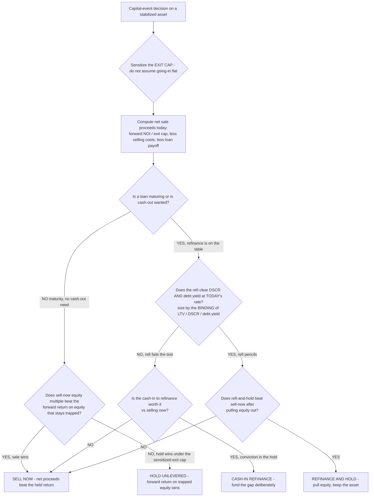

# CRE decision tree — Hold vs Sell vs Refinance (at a cap-rate shift / loan maturity)

A **Mermaid** decision tree for the disposition / capital-event decision on a stabilized owned asset: **sell now, refinance and hold, or hold unlevered.** It complements the shallow "Sell or hold through the refi?" prose tree in [`cre-decision-trees.md`](cre-decision-trees.md) by making the exit-cap sensitivity and the refi-clearing gate explicit, and it is the canonical tree for the [`../scenarios/2026-06-05-hold-vs-sell-at-cap-rate-shift.md`](../scenarios/2026-06-05-hold-vs-sell-at-cap-rate-shift.md) and [`../scenarios/2026-06-05-dscr-breach-on-refi-rate-reset.md`](../scenarios/2026-06-05-dscr-breach-on-refi-rate-reset.md) scenarios.

**When this applies:** an owned, stabilized asset reaches a hold-period decision point — a business-plan horizon, a loan maturity, or a cap-rate move that changes the disposition math. The owner must choose sell / refinance-and-hold / hold-unlevered.

**Last verified:** 2026-06-05 against standard CRE disposition + capital-markets practice. Market figures cited at point of use are `[verify-at-use]` — cap rates, spreads, and rates move quarterly (CLAUDE.md §3 #8).

**Rationale per leaf:**
- *Sensitize the exit cap first* — the exit cap is the most sensitive input in the whole decision; a 25–50 bps move swings net proceeds by more than a year of NOI growth. Exiting at the going-in cap assumed flat flatters the hold case (§3 — exit cap must be sensitized, not assumed flat). **This is the gate node, not an option.**
- *SELL NOW* — when sell-now net proceeds (at a realistic exit cap) produce a higher equity multiple than the forward return on the equity that would stay trapped, the sale is the rational exit; don't hold for a cap-compression forecast you can't underwrite.
- *HOLD UNLEVERED* — with no maturity and no cash-out need, hold only when the forward return on trapped equity beats sell-now under the *sensitized* exit cap (not just the optimistic one).
- *REFINANCE AND HOLD* — available **only if** the refi clears DSCR and debt yield at today's rate (the binding-constraint test, §3 #6); a refi that doesn't pencil is not a hold option.
- *CASH-IN REFINANCE* — when the refi falls short of the maturing balance, the gap is an equity check; fund it deliberately only with conviction in the hold, and only after pricing it against selling now.

**Tradeoffs summary:**

| Path | Equity event | Exit-cap exposure | Use when |
|---|---|---|---|
| Sell now | Returns equity | Locks today's cap | Sale multiple beats forward held return |
| Hold unlevered | Equity stays in | Full forward exposure | Forward return beats sale under sensitized cap |
| Refinance and hold | Pulls equity out | Forward exposure, levered | Refi clears DSCR/debt-yield AND beats sell-now |
| Cash-in refinance | Adds equity | Forward exposure | Conviction hold; gap priced vs sale |

**Pairs with:** [`../scripts/cre_calc.py`](../scripts/cre_calc.py) `hold-vs-sell` (net sale proceeds + equity multiple + rough held return) and `debt-size` (the refi-clearing binding-constraint test).
