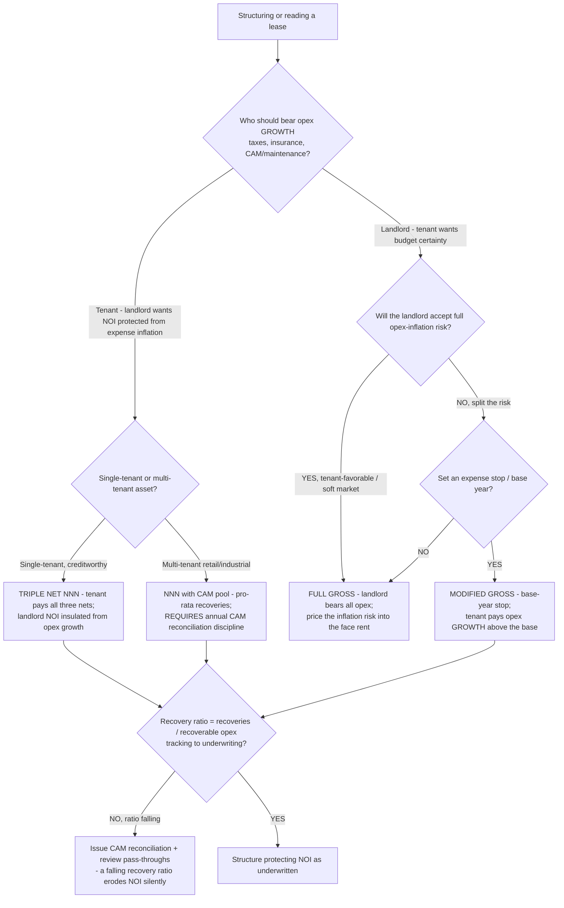

# CRE decision tree — Lease structure: NNN vs Gross vs Modified Gross

A **Mermaid** decision tree for choosing (or reading) a lease's expense-recovery structure — **triple net (NNN), gross, or modified gross** — when negotiating a new lease or a renewal. It complements the "Lease Rollover" tree in [`cre-decision-trees.md`](cre-decision-trees.md) (which decides renew/backfill/reconfigure) by deciding the *structure* of the rent once you've decided to lease, and is the canonical structure tree for the [`../scenarios/2026-06-05-lease-renewal-vs-retenant-ti-downtime.md`](../scenarios/2026-06-05-lease-renewal-vs-retenant-ti-downtime.md) and [`../scenarios/2026-06-05-noi-erosion-opex-and-vacancy.md`](../scenarios/2026-06-05-noi-erosion-opex-and-vacancy.md) scenarios.

**When this applies:** structuring a new or renewal lease, or diagnosing why an owned asset's recovery ratio is eroding NOI. The choice decides **who bears operating-expense growth** (taxes, insurance, CAM/maintenance) — the single biggest driver of whether NOI is protected against expense inflation (CLAUDE.md §3 #7).

**Last verified:** 2026-06-05 against standard CRE leasing practice. Lease-structure norms vary by market, asset class, and negotiation — verify against the actual lease abstract (§3 #8).

**Rationale per leaf:**
- *Triple net (NNN)* — the landlord passes taxes, insurance, and maintenance/CAM to the tenant, so opex growth doesn't erode NOI; most landlord-favorable, common for single-tenant and retail. Underwrite to the tenant's **credit**, since the income depends on the covenant.
- *NNN with CAM pool* — multi-tenant NNN recovers opex pro-rata; the structure only works if the **annual CAM reconciliation is actually issued** (estimate → reconcile to actuals → bill the true-up). Skipping the reconciliation is how a "NNN" asset silently absorbs expense growth.
- *Full gross* — the landlord bears all opex; choose it in a tenant-favorable/soft market for the leasing velocity, but **price the opex-inflation risk into the face rent** because the landlord now owns it.
- *Modified gross (base-year stop)* — the middle ground: the tenant pays opex *growth* above a base year, splitting inflation risk. Common in office.
- *Recovery-ratio recheck* — regardless of structure, monitor recoveries ÷ recoverable opex against underwriting; a falling ratio (un-passed-through expense growth, an un-issued reconciliation) erodes NOI without showing up as a rent problem (the [`../scenarios/2026-06-05-noi-erosion-opex-and-vacancy.md`](../scenarios/2026-06-05-noi-erosion-opex-and-vacancy.md) pattern).

**Tradeoffs summary:**

| Structure | Bears opex growth | NOI inflation protection | Common for |
|---|---|---|---|
| Triple net (NNN) | Tenant | High | Single-tenant, retail, net-lease |
| NNN + CAM pool | Tenant (pro-rata) | High *if reconciled* | Multi-tenant retail/industrial |
| Modified gross | Tenant above base year | Medium | Office |
| Full gross | Landlord | Low (price into rent) | Soft markets, short terms |

**Pairs with:** the [`decompose-net-effective-rent`](../skills/decompose-net-effective-rent/SKILL.md) skill (the NER math the structure feeds) and [`../scripts/cre_calc.py`](../scripts/cre_calc.py) `noi-cap` (the recoveries line in the NOI build-up).
