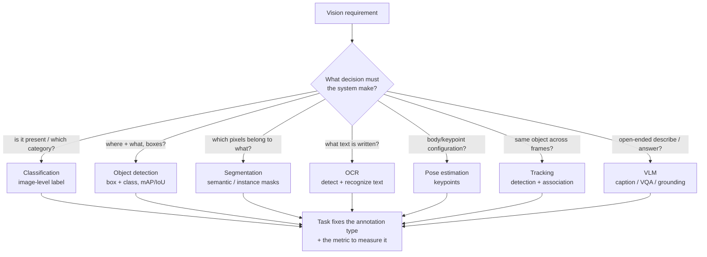
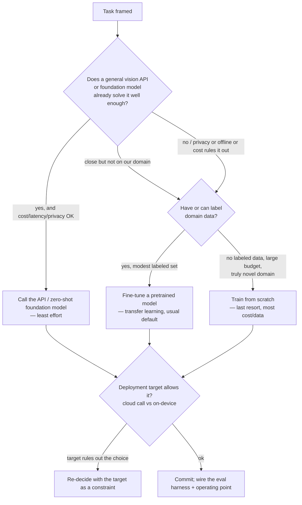
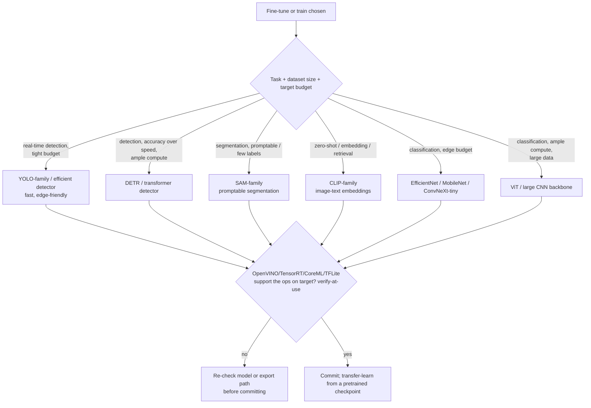
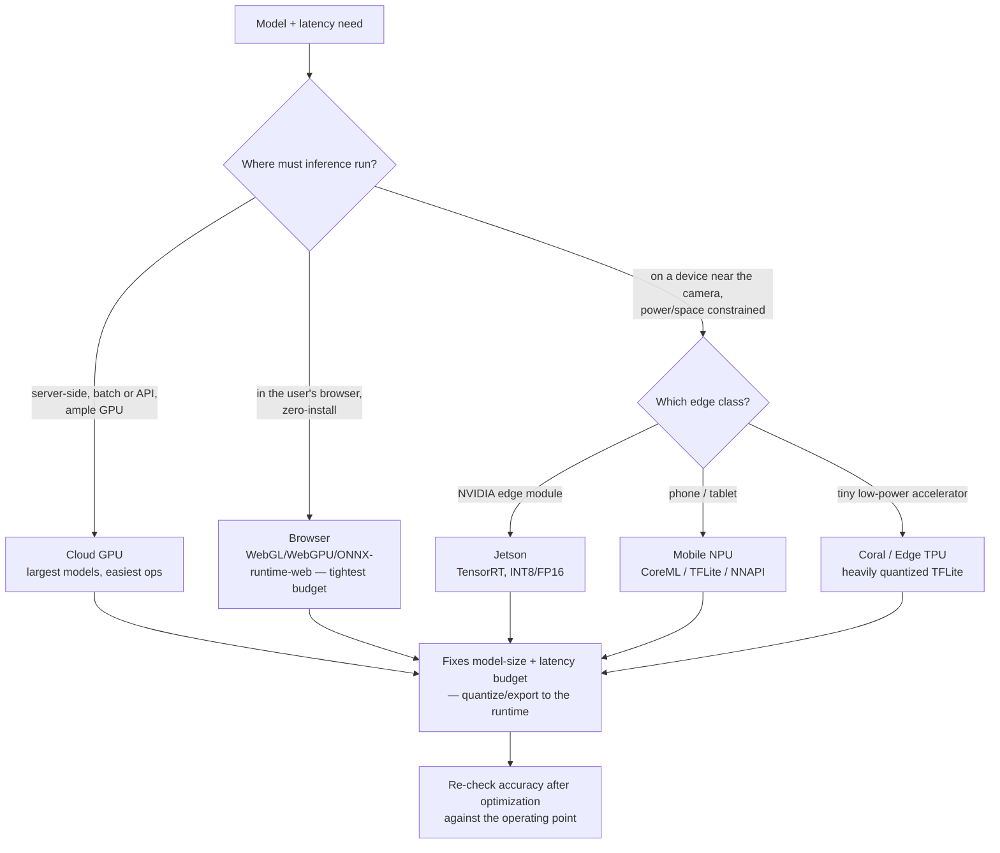

# Computer-Vision Engineering — Decision Trees

> Reference decision trees for the `computer-vision-engineering` team. Agents **traverse the relevant tree top-to-bottom before deciding** (the proactive complement to the Capability Grounding Protocol). Each `## Decision Tree` section is a Mermaid graph plus the rule it encodes.
>
> **Engineering judgment, not a benchmark or compliance verdict.** Anything touching a model name/version, accelerator spec, latency/accuracy number, or runtime capability is `[verify-at-use]` — confirm against the vendor/framework/paper before it drives a build commitment. No PII, no image data stored.
>
> _Last reviewed: 2026-07-03 by `claude`. Principles are durable; dated specifics live in [`cv-reference-2026.md`](cv-reference-2026.md)._

---

## Decision Tree: which vision task?

**Rule:** pick the task on the **decision the system must make**, not the easiest thing to label. The task fixes the annotation type and the metric. If the answer is open-ended natural language over an image, consider a VLM; if it's a fixed closed-set decision, a specialist model is usually cheaper and tighter. All model specifics `[verify-at-use]`.

---

## Decision Tree: build vs fine-tune vs API?

**Rule:** decide build-vs-fine-tune-vs-API **jointly with the deployment target** — the target can rule out a cloud API (privacy/offline/latency) or a large model (edge budget). Transfer-learning/fine-tuning is the usual default; from-scratch is a last resort. API vs on-device cost, privacy, and latency all `[verify-at-use]`.

---

## Decision Tree: which model family?

**Rule:** choose the family on **task + dataset size + target budget**, not leaderboard rank. ViT and large backbones need more data and compute than CNNs; edge budgets favor efficient CNNs and YOLO-family detectors. Confirm the export runtime supports the model's ops on the target — `[verify-at-use]` — before committing.

---

## Decision Tree: which deployment target?

**Rule:** the deployment target is a **design input, chosen up front** — it fixes the model-size and latency budget and the export runtime. Cloud GPU allows the largest models and easiest ops; edge/embedded/browser tighten the budget and force quantization/export. Always re-check accuracy after optimization. Accelerator specs + latency `[verify-at-use]`.

---

## See also

- [`cv-reference-2026.md`](cv-reference-2026.md) — dated model/accelerator/runtime/annotation-tool landscape + metric definitions (verify-at-use).
- Skills: [`../skills/cv-task-and-data-strategy/SKILL.md`](../skills/cv-task-and-data-strategy/SKILL.md), [`../skills/cv-model-training-and-evaluation/SKILL.md`](../skills/cv-model-training-and-evaluation/SKILL.md), [`../skills/vision-inference-optimization/SKILL.md`](../skills/vision-inference-optimization/SKILL.md), [`../skills/video-pipeline-and-edge-deployment/SKILL.md`](../skills/video-pipeline-and-edge-deployment/SKILL.md).
