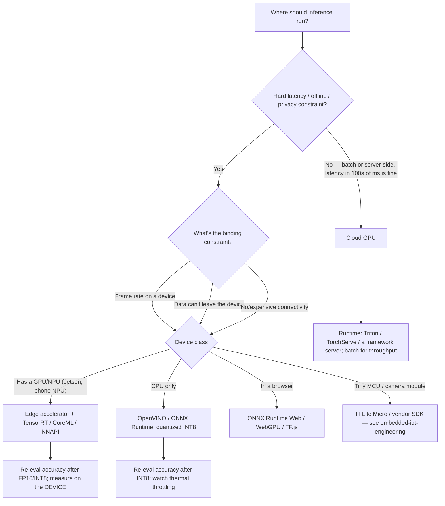

# CV inference, deployment & tooling — dated 2026 map

> **Retrieval date: 2026-07-06.** Model SOTA, benchmark numbers, accelerator specs,
> and license terms in this doc are **volatile** — the CV landscape shifts monthly.
> Treat every model name and number here as `[verify-at-use]`: re-check the current
> release and its license before a client commitment. The **durable** content is the
> cloud-vs-edge decision tree and the runtime trade-offs; the *names* are the
> perishable part.

## Cloud vs edge / real-time deployment decision tree

## Runtime / export targets (durable trade-offs)

| Runtime | Best for | Notes |
|---|---|---|
| **PyTorch / framework-native** | Training, research, cloud serving | Slowest raw inference; simplest to iterate. |
| **ONNX Runtime** | Portable cross-platform inference (CPU/GPU/web) | The lingua-franca export target; broad operator support; good CPU perf with the right execution provider. |
| **TensorRT** | NVIDIA GPUs / Jetson, lowest latency | Best NVIDIA latency; FP16/INT8; engine is hardware-specific — build on the target. |
| **OpenVINO** | Intel CPU/iGPU/NPU | Strong CPU quantized inference; good for CPU-only edge. |
| **CoreML** | Apple devices | On-device iOS/macOS; Neural Engine acceleration. |
| **TFLite / TFLite Micro** | Android / MCUs | Mobile + microcontroller; hands off to `embedded-iot-engineering` at the MCU line. |

**Quantization rule (durable):** FP16 is usually near-free; INT8 can be free or
cost several points — you don't know until you **re-run the eval** on the quantized
model. Never ship a quantized model without the measured accuracy delta on the
target hardware.

## Model families by task — dated names `[verify-at-use]`

> These are *pointers to the current families*, not endorsements of a specific
> version. Re-verify the leading release and its **license** (some strong models
> are non-commercial or research-only) before committing.

| Task | Zero-shot / foundation | Fine-tune backbone | Notes |
|---|---|---|---|
| Classification | Vision-LLM / CLIP-style zero-shot | Any modern pretrained backbone (ViT / ConvNeXt-family) | Zero-shot CLIP-style is strong for open-set; fine-tune for a fixed taxonomy under latency. |
| Detection | Open-vocabulary detectors (text-prompted) | YOLO-family / DETR-family | YOLO-family for real-time; DETR-family for set prediction / crowded scenes. |
| Segmentation | SAM-family (promptable, zero-shot masks) | Mask R-CNN-family / transformer segmenters | SAM for zero-shot masks; fine-tune for a fixed class set at speed. |
| OCR | General OCR engines / vision-LLMs | Fine-tuned recognizer for a font/domain | VLMs read messy scenes; dedicated OCR is faster/cheaper at volume. |
| Tracking | — | Detector + a modern association tracker | Tracking = your detector + motion/appearance association; measure MOTA/IDF1. |
| Pose/keypoints | Whole-body pose foundation models | Fine-tuned keypoint model | — |
| Vision-language | Modern VLMs (VQA/captioning/grounding) | Fine-tune only for a custom concept | High latency/cost — use for open-ended/low-volume. |
| Embeddings/retrieval | CLIP-style / vision embedding models | Rarely fine-tuned | Zero-shot similarity + a vector index. |
| Depth/geometry | Monocular-depth foundation models | Classical SfM/stereo where calibrated | — |

## Metrics cheat-sheet (durable)

| Task | Primary metric | Watch out for |
|---|---|---|
| Classification | Accuracy / F1 (macro for imbalance) | Class imbalance hiding in a headline accuracy. |
| Detection | **mAP** (@[.5:.95]) | Confidence-threshold choice; per-class AP, not just the mean. |
| Segmentation | **IoU / Dice** | Boundary vs region errors; small-object IoU. |
| Tracking | **MOTA / IDF1** | ID switches vs detection errors are different failures. |
| OCR | **CER / WER** | Layout errors vs character errors. |

## The recurring production bug (durable, read this)

**Train/serve preprocessing skew** — resize interpolation, normalization
mean/std, channel order (RGB vs BGR), and letterboxing must be *byte-identical*
between training and inference. It is the single most common cause of "great in
the notebook, bad in production". Share one preprocessing function and test it.

## Seams

- Generic training platform / experiment tracking / feature store / model CI →
  `ml-engineering`.
- On-device firmware, camera driver, accelerator HAL, MCU inference →
  `embedded-iot-engineering`.
- Video ingest / transcode / delivery feeding the model →
  `streaming-media-engineering`.
- System-level latency budgeting beyond the model → `performance-engineering`.
