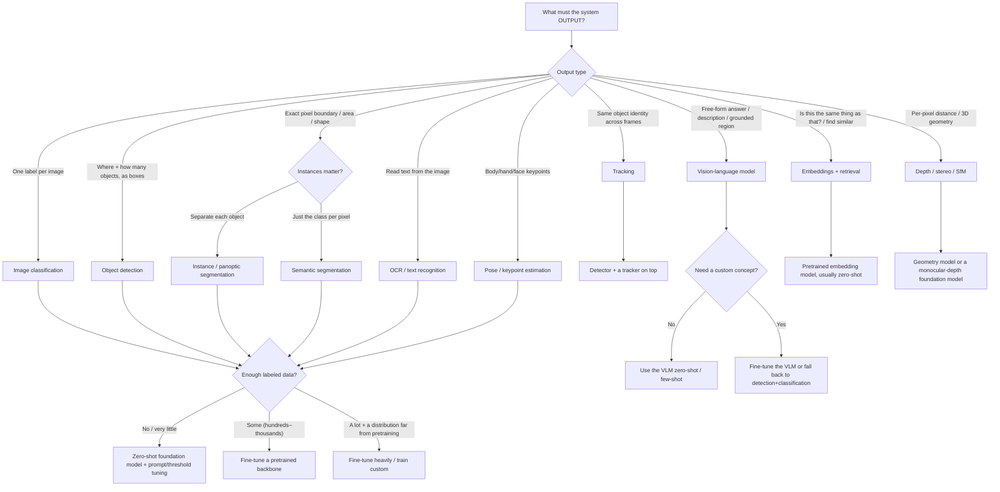

# CV task → model-family decision tree

> Read this **before naming any model**. The highest-leverage CV decision is the
> **task formulation** — what output the system must produce. Get that right, then
> the model family follows. Durable mechanics; the specific model *names* are in
> [`cv-inference-deployment-and-tooling-2026.md`](cv-inference-deployment-and-tooling-2026.md)
> (dated, because they move monthly).

## The tree

## How to read it

1. **Start from the output, not the input.** "Detect defects" is a goal, not a
   task. Does the output need a *label per image* (classification), *boxes*
   (detection), a *pixel mask* for measurement (segmentation), *text*
   (OCR), *identity over time* (tracking), or a *free-form answer* (VLM)?
2. **Instance vs semantic segmentation** hinges on whether you must separate two
   touching objects of the same class. If yes → instance/panoptic; if you only need
   "which pixels are road" → semantic.
3. **Tracking is detection + association.** Pick the detector first, then the
   association method (motion/appearance). Don't look for a single "tracking model".
4. **The data-availability branch is the same for every trained task.** Little data
   → try a zero-shot foundation model before you label anything. Some data →
   fine-tune a pretrained backbone (the default). A lot of data far from pretraining
   distribution → heavier fine-tuning or custom.
5. **Vision-LLMs collapse several tasks** (classification, VQA, captioning,
   open-vocabulary grounding) into one prompt-driven model — but at higher latency
   and cost. Reach for a VLM when the task is open-ended or low-volume; reach for a
   specialized model when latency/throughput/cost dominate.

## The three failure modes this tree prevents

- **Solving the wrong task** — training a detector when the measurement needs a
  segmentation mask; using classification when the user needs to know *where*.
- **Training when you didn't need to** — labeling thousands of images for something
  an open-vocabulary detector or SAM does zero-shot.
- **Reaching for a VLM under a latency budget** — a vision-LLM answering "is there a
  defect?" at 2s/image when a fine-tuned classifier does it in 5ms.

## Seam note

Choosing the model is only half the decision. The **deployment target** (cloud vs
edge, latency budget) and the **runtime** are decided against
[`cv-inference-deployment-and-tooling-2026.md`](cv-inference-deployment-and-tooling-2026.md),
which also carries the dated model-family names for each leaf above.
