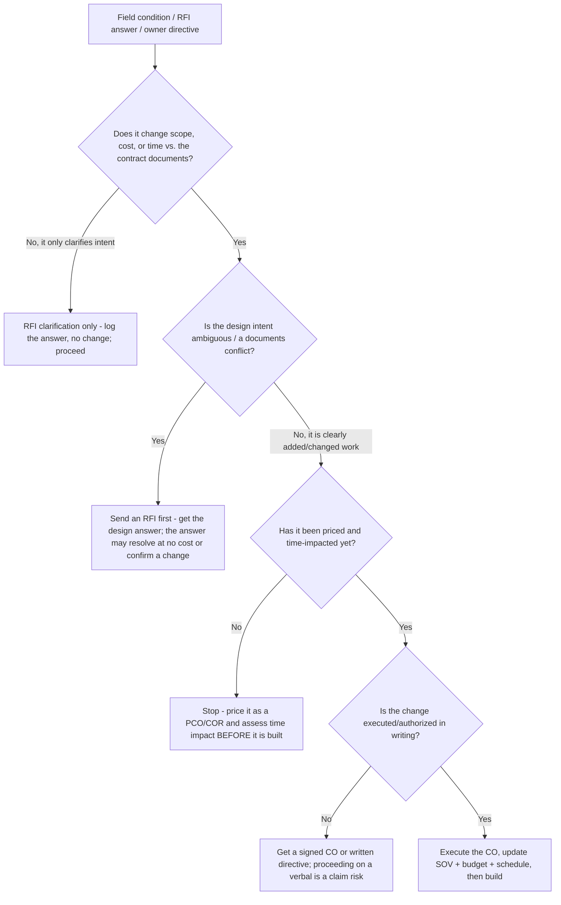
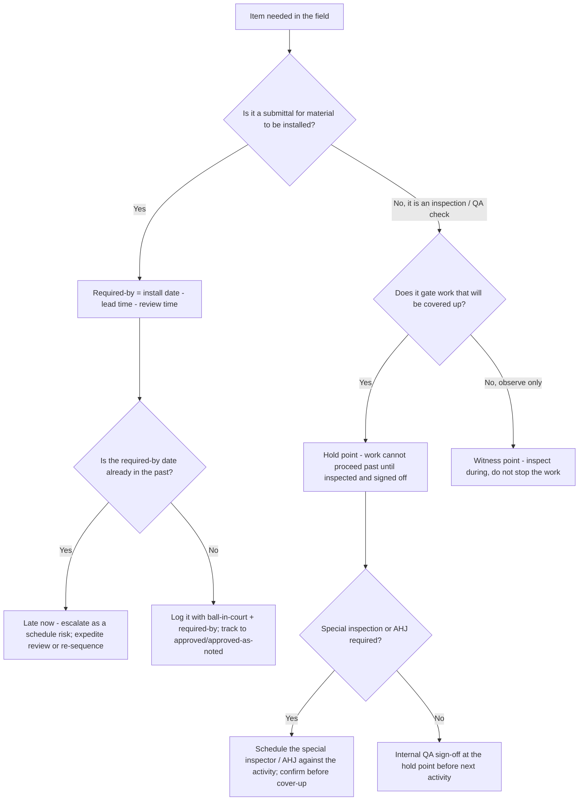
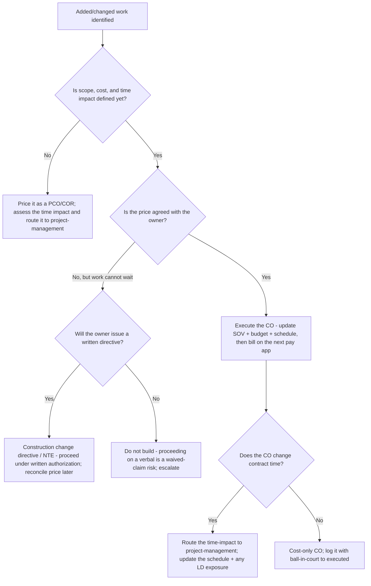
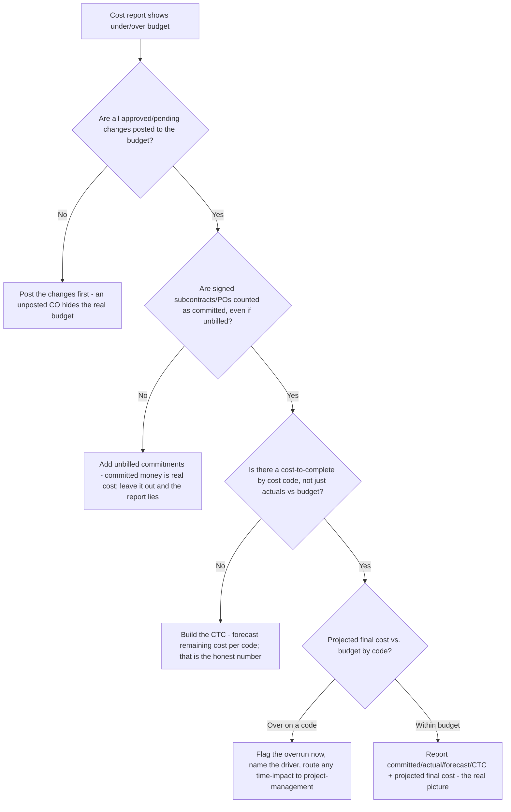
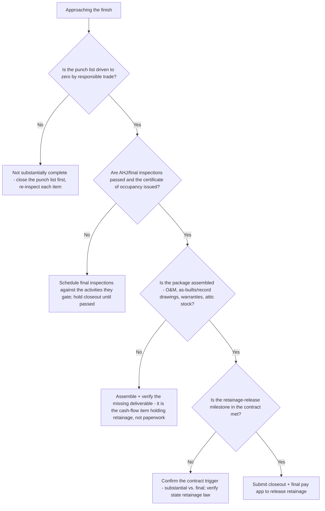

# Construction Field Management — Decision Trees

_Decision trees + a dated standards/forms map. Map rows are `[verify-at-build]` — re-check against the current AIA/EJCDC/OSHA source and the specific contract before quoting. Last reviewed: 2026-06-08._

Traverse before sending an RFI, sequencing a submittal, deciding whether a field event is a change order, or setting a QA hold point.

## Decision Tree: Is this field event a change order, or just an RFI / no-cost clarification?

Scope-bearing answers get priced *before* they're built; pure clarifications don't.

_Nothing scope-bearing gets built unpriced. A verbal "just do it" with no written authorization is how margin disappears and disputes start._

## Decision Tree: When must this submittal / inspection happen relative to the work?

Schedule backward from the need/install date; a hold point gates the next activity.

_If the required-by math lands in the past, the item is already late — surface it now, not the week of install. A hold point with no teeth is a checkbox._

## Decision Tree: How do I bill this change — PCO/COR, CCD, or hold?

A change is two columns — cost *and* time — and it gets authorized in writing before it's built and before it's billed.

_A change with no time-impact analysis is half-priced. Nothing scope-bearing gets billed before it's executed or covered by a written directive._

## Decision Tree: Is the cost report honest — what does the cost-to-complete say?

"Under budget" is a mirage until committed, actual, forecast, and CTC all tie by cost code.

_Unbilled commitments are real money. The cost report lies the month before the overrun lands if the CTC is missing._

## Decision Tree: Is this job ready for substantial completion / closeout?

Substantial completion is not final completion; closeout is the assembled package that releases retainage.

_An incomplete closeout package is usually what's actually holding the owner's money — treat the missing deliverable as the cash-flow item it is._

---

## Standards / forms map (2026, `[verify-at-build]`)

| Area | Standard / form | Notes |
|---|---|---|
| Pay application | AIA G702 Application and Certificate for Payment + G703 Continuation Sheet | The continuation sheet carries the SOV line items; verify the current AIA edition and the contract's required form `[verify-at-build]` |
| Contract family (alt) | EJCDC, ConsensusDocs | Some owners use EJCDC/ConsensusDocs instead of AIA — confirm which governs before building a pay app/CO `[verify-at-build]` |
| Schedule of values | Per the prime contract; tied to cost codes (e.g. CSI MasterFormat divisions) | Front-loading judgment is contract- and owner-specific; abusive front-loading gets the draw rejected `[verify-at-build]` |
| Change documents | PCO (potential change order) / COR (change order request) / CO (change order); construction change directive (CCD) | Terminology varies by contract; a CCD authorizes work before price is agreed — verify the contract's change clause `[verify-at-build]` |
| Retainage | Typically 5-10% withheld; release at substantial/final completion | The % and release milestone come from the specific contract and state retainage law `[verify-at-build]` |
| Schedule method | CPM (critical path method); look-ahead (3-week) | Master CPM build/owns → `project-management`; this plugin coordinates the field to it `[verify-at-build]` |
| QA/QC | Inspection-and-test plan (ITP); hold points / witness points; special inspections (IBC Ch. 17) | Special-inspection scope is set by the building code + the statement of special inspections `[verify-at-build]` |
| Safety | OSHA 29 CFR 1926 (construction); JHA / JSA; toolbox talks; fall protection, excavation, LOTO, scaffolding | OSHA is the floor; the JHA control is the specific one the task needs — verify the current standard `[verify-at-build]` |
| Closeout | Substantial vs. final completion; O&M manuals, as-builts/record drawings, warranties, attic stock, certificate of occupancy | Closeout deliverables and the retainage-release trigger come from the contract `[verify-at-build]` |
| Earned value | CV / SV / CPI / SPI from BCWP (EV) / ACWP (AC) / BCWS (PV); EAC = BAC / CPI | CPI/SPI < 1.0 means over budget / behind schedule; pair the EV read with a real cost-to-complete by code `[verify-at-build]` |
| Field records | Daily logs, RFI/submittal logs, change logs, inspection records, JHAs — written contemporaneously | Contemporaneous records are the project's memory and, in a claim, its evidence; a log written days later from memory is not credible `[verify-at-build]` |

_Runnable check:_ [`../scripts/construction_calc.py`](../scripts/construction_calc.py) computes a G702/G703-style draw (`payapp`), a running adjusted contract sum after change orders (`changeorder`), and earned-value CV/SV/CPI/SPI (`earned-value`) — stdlib-only, for sanity-checking a number before it goes to an owner. It does not replace the contract; verify the retainage %, change clause, and SOV against the prime contract.

_Seam reference: design intent / drawings / BIM → `architecture-aec`; master CPM schedule, risk, RAID → `project-management`; trade means-and-methods and subcontract scope → `skilled-trades-contracting`. Re-verify any standard, form edition, or contract term before quoting it to an owner or building off it._
