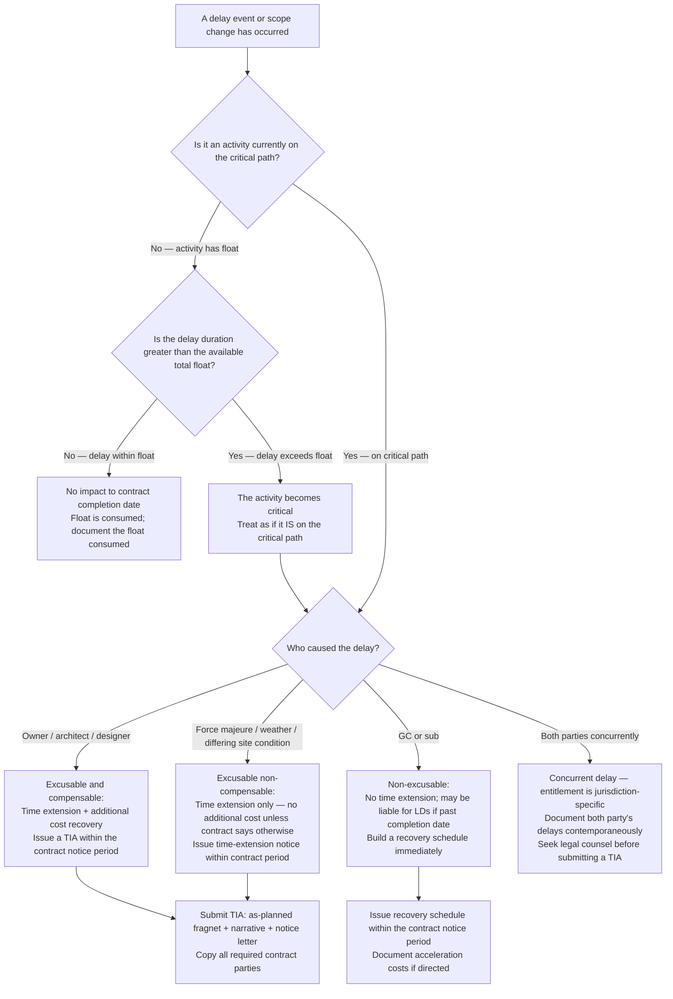

# Construction General Contractor — Decision Trees + 2026 Capability Map

> Canonical knowledge bank for `construction-general-contractor`. **Traverse the relevant
> Mermaid tree top-to-bottom before choosing** — the proactive complement to the Capability
> Grounding Protocol. Volatile product/version facts in the capability map carry a retrieval
> date and a re-verify-at-use rider.

---

## Decision Tree: Markup vs. Margin — which am I computing?

```mermaid
flowchart TD
  A[I need to apply a profit percentage to a bid or change order] --> B{Am I dividing profit by COST?}
  B -->|Yes| C[That is MARKUP\nMarkup % = Profit ÷ Direct Cost\nExample: $20 profit on $100 cost = 20% markup → $120 bid price]
  B -->|No — I am dividing profit by REVENUE| D[That is MARGIN\nMargin % = Profit ÷ Revenue\nExample: $20 profit on $120 revenue = 16.7% margin]
  C --> E{Is my TARGET stated as markup or margin?}
  D --> E
  E -->|Target is markup| F[Apply the markup %: Bid Price = Cost × (1 + Markup%)\nExample: 20% markup → Cost × 1.20]
  E -->|Target is margin| G[Convert to markup first: Markup% = Margin% ÷ (1 - Margin%)\nExample: 20% margin → 20% ÷ 80% = 25% markup → Cost × 1.25]
  F --> H{Did I state the basis in the estimate or CO?}
  G --> H
  H -->|No| I[GO BACK — always state 'X% markup on cost' or 'Y% gross margin on revenue'\nConfusing them on a $5M job = $165K error at 20% target]
  H -->|Yes, basis is stated| J[Proceed — conversion is correct]
```

**Leaf rule:** markup and margin are never interchangeable. A "20% margin" target priced with
a "20% markup" loses 3.3 margin points. Always state the basis in the estimate; always show
the conversion formula if you switch between the two.

---

## Decision Tree: Change-order-or-absorb — should I price this as a CO?

```mermaid
flowchart TD
  A[Field condition or owner direction differs from contract documents] --> B{Is it within the original contract scope?}
  B -->|Yes, clearly in scope| Z[Absorb — this is what you bid]
  B -->|No, outside scope OR ambiguous| C{Is there a written directive or authorization?}
  C -->|No written record| D[STOP — do not start the work\nGet a written direction first: email confirmation, RFI response, or ASI\nVerbal authorization is not a change order]
  C -->|Yes, written record exists| E{Does it add cost AND/OR time?}
  E -->|Neither — neutral to cost and schedule| F[Document it, but a $0 CO may still be needed to protect the schedule record\nFile the written record with the project docs]
  E -->|Adds cost or time| G{Is the dollar amount above the de-minimis threshold?\nTypical: >$500 or >contract-defined threshold}
  G -->|Below threshold| H[Absorb and document — note in daily report\nWatch for cumulative impact: many small absorptions = cardinal change]
  G -->|Above threshold| I[Price and submit a Proposed Change Order (PCO)\nDirect cost + markup per contract + time impact]
  I --> J{Is the scope clearly owner-caused?}
  J -->|Yes| K[Compensable: owner owes time AND money]
  J -->|No — concurrent or ambiguous cause| L[Excusable non-compensable: time extension only\nDocument concurrent GC delay if any — it limits recovery]
```

**Leaf rule:** no written directive, no change order — and no work without a written
directive on out-of-scope items. Verbal promises are not compensable. Document every
de-minimis absorption so cumulative-impact claims remain available.

---

## Decision Tree: Critical-path-impact — does this delay or change affect the contract completion date?



**Leaf rule:** total float belongs to the project, not the GC. A delay that stays within
available float does not move the contract completion date — but it consumes shared float and
the fact of consumption must be documented. Always issue a written delay notice within the
contract's notice period (typically 3–21 days); failure to give timely notice can waive the
right to a time extension, even for a valid compensable delay.

---

## 2026 Capability Map — GC Project Delivery Software

_Retrieved 2026-06-08. Product names, pricing, and feature scope are volatile — re-confirm
at use. This is orientation, not a procurement recommendation. [verify-at-use]_

| Category | Product | Notes (2026) [verify-at-use] |
|---|---|---|
| **Project Management / Field Ops** | **Procore** | Market-leading GC platform; owner, subcontractor, and compliance portals; financial management module; widely required by public owners and GCs as a collaboration platform. Integration ecosystem (Sage, Viewpoint, Oracle, Autodesk). [verify-at-use] |
| **Project Management / Field Ops** | **Autodesk Build** (formerly BIM 360 Build) | Strong for design-build and BIM-centric GCs; tight integration with Revit and ACC Document Management; RFI, submittal, and punch-list modules; field issue tracking. [verify-at-use] |
| **Document Markup / Takeoff** | **Bluebeam Revu** | Industry standard for PDF markup, plan review, and quantity extraction (Revu's markup tools and Studio collaboration). Widely used for RFI markup, submittal annotation, and drawing review. Bluebeam Revu 21+ on subscription. [verify-at-use] |
| **CPM Scheduling** | **Oracle Primavera P6** | Contract-required by many public agencies and large owners; the professional standard for CPM scheduling on complex projects. Steep learning curve; P6 Professional (desktop) and P6 EPPM (enterprise web). [verify-at-use] |
| **CPM Scheduling** | **Microsoft Project** | Widely used for mid-market and smaller GCs; easier to use than P6 but less suited for large, logic-dense schedules; not typically accepted on public mega-projects that specify P6. [verify-at-use] |
| **Estimating / Takeoff** | **Procore Estimating** (acquired Buildingpoint / On-Screen Takeoff) | Integrated with Procore PM; on-screen takeoff and bid management. [verify-at-use] |
| **Estimating / Takeoff** | **STACK** | Cloud-based takeoff and estimating; popular with small-to-mid GCs. [verify-at-use] |
| **Estimating / Takeoff** | **RS Means (Gordian)** | Industry standard cost database (unit prices, assemblies, city cost factors); used as a fallback when trade quotes aren't available. Annual subscription; data ages — note edition date on every reference. [verify-at-use] |
| **Accounting / ERP** | **Sage 300 CRE / Sage Intacct Construction** | Common GC accounting platforms; job-cost coding, subcontract management, AIA billing. [verify-at-use] |
| **Accounting / ERP** | **Viewpoint Vista / Spectrum** | Another common GC ERP; similar capability to Sage. [verify-at-use] |
| **Subcontractor Management** | **Textura (Oracle)** | Payment and compliance management; many large owners and GCs require it for lien-waiver collection and subcontractor payment. [verify-at-use] |

> Provenance: industry knowledge as of 2026-06-08, cross-referenced with GC practitioner
> experience patterns. Product market positions and integrations change — verify current
> feature sets, pricing, and owner/agency requirements before recommending a tool.
> No invented products listed.

---

## See also

- [`../CLAUDE.md`](../CLAUDE.md) — team constitution and seams.
- [`../best-practices/README.md`](../best-practices/README.md) — the named, citable rules.
- Neighbour decision trees: `architecture-aec`, `skilled-trades-contracting`,
  `project-management`.

_Last reviewed: 2026-06-08 by `claude`._
