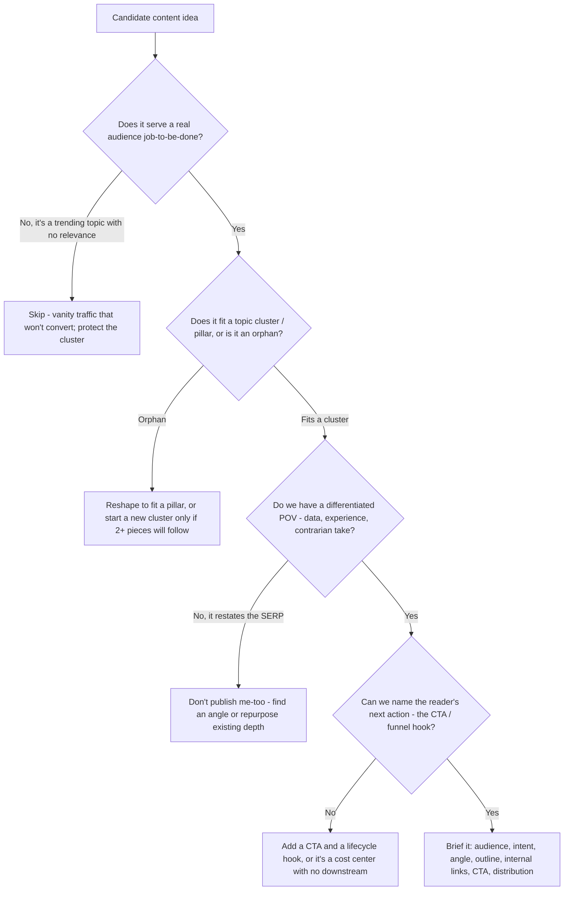
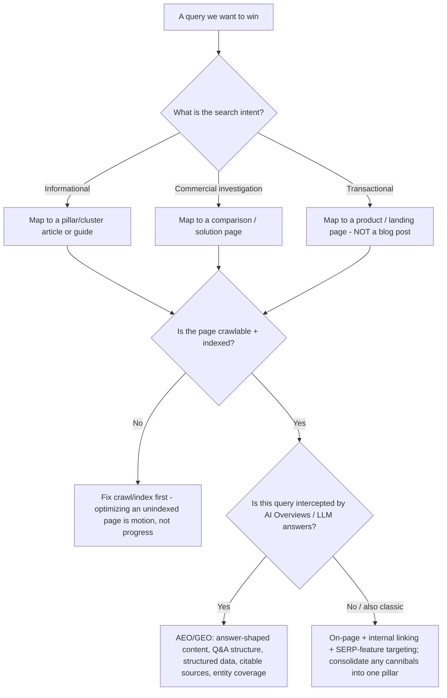
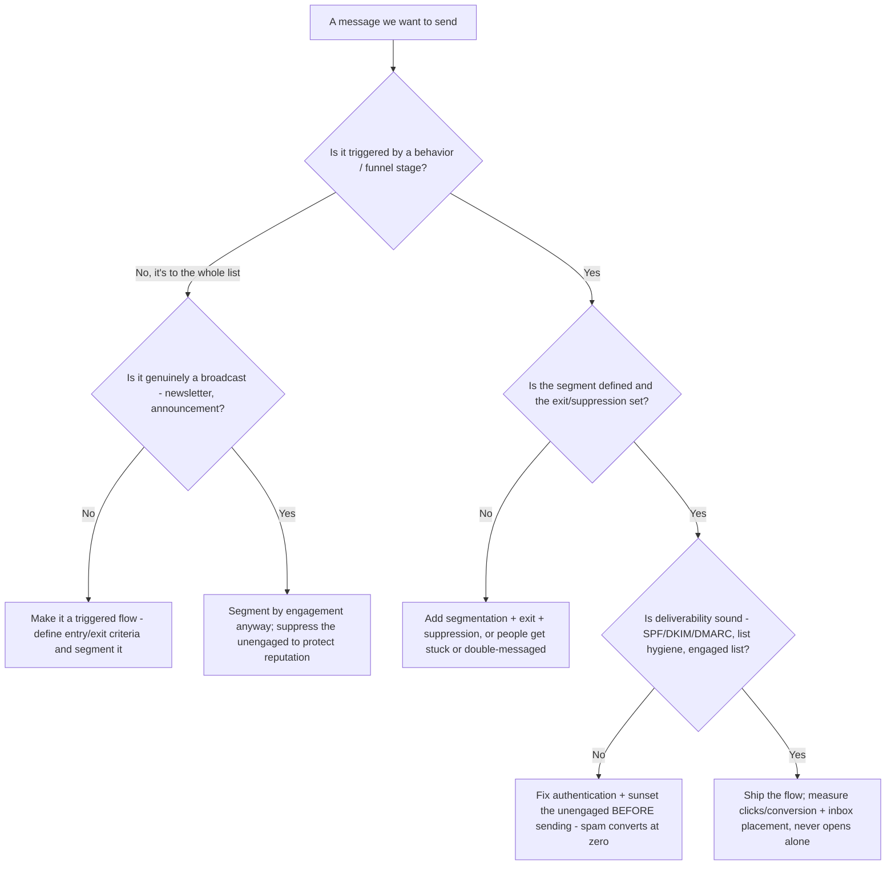
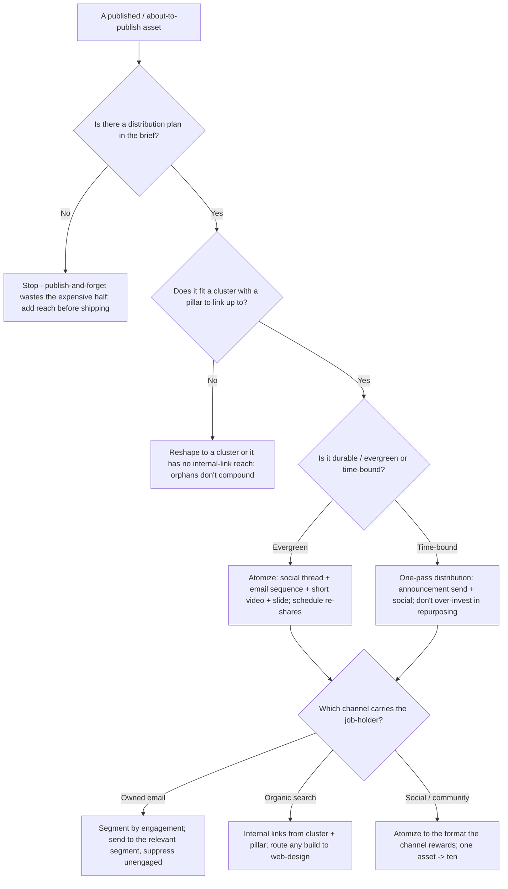
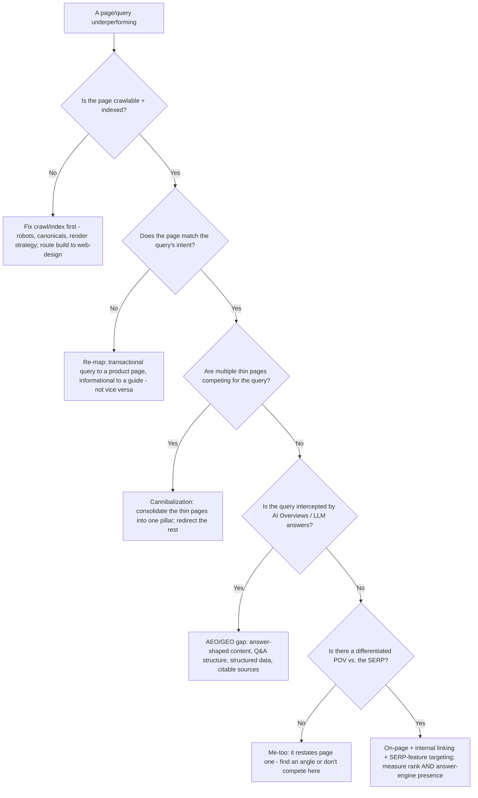

# Content & Growth Marketing — Decision Trees

_Decision trees + a dated capability/landscape map. Capability rows are `[verify-at-build]` — re-check against the vendor/platform before quoting (search volumes, algorithm behavior, ESP features, and AEO surfaces move fast). Last reviewed: 2026-06-08._

Traverse before publishing a piece, targeting a query, or building a lifecycle flow.

## Decision Tree: Should we publish this piece (and is it worth it)?

Content is justified by an audience job + a differentiated angle — not by a slot on the calendar.

_Compounding over volume: a skipped low-value post costs less than a published one that dilutes the cluster and the brand._

## Decision Tree: How do we target this query — and on which surface?

Match the page to the intent; then decide classic-rank vs. answer-engine (AEO/GEO) — increasingly both.

_Search now includes answer engines. AEO/GEO is a first-class surface measured distinctly from blue-link rank — not a footnote._

## Decision Tree: Lifecycle flow or broadcast — and is it deliverable?

Triggered, segmented flows out-convert blasts; deliverability is the foundation under both.

_Self-service-of-the-funnel means the right message fires on behavior — not a batch-and-blast. Deliverability and segmentation come before clever copy._

## Decision Tree: How do we distribute and repurpose this asset?

Distribution is half the work — a piece nobody sees is a sunk cost. Plan reach before shipping, then atomize.

_One asset becomes ten. The distribution plan is part of the brief, not bolted on after — a piece with no reach plan isn't ready to ship._

## Decision Tree: This page/query isn't winning — what's the root cause?

Optimizing on-page on a page that isn't crawled, indexed, or intent-matched is motion, not progress. Triage in order.

_Triage in order — crawl/index, then intent, then cannibalization, then surface (classic vs. AEO/GEO), then POV. Tuning on-page before this order is settled is motion, not progress._

---

## Capability / landscape map (2026, `[verify-at-build]`)

| Layer | Options | Notes |
|---|---|---|
| CMS / publishing | Headless (Contentful, Sanity, Strapi), WordPress, Webflow, framework-native (Next/Astro content) | Render strategy (SSR/SSG) affects crawlability — route the build to `web-design` `[verify-at-build]` |
| Keyword + SEO research | Ahrefs, Semrush, Moz, Google Search Console, Google Keyword Planner | Volumes/difficulty are estimates — cite the tool + date, never quote a number you didn't pull `[verify-at-build]` |
| Technical SEO | GSC, Screaming Frog, Sitebulb, PageSpeed Insights / CrUX (Core Web Vitals), schema.org structured data | Crawl/index + CWV before on-page polish `[verify-at-build]` |
| SERP features | Featured snippets, People-Also-Ask, knowledge panels, sitelinks | Answer-shaped content + structured data win these `[verify-at-build]` |
| AEO / GEO surfaces | Google AI Overviews, ChatGPT/Perplexity/Copilot answers, Bing generative | Optimize for citability + entity coverage; measure presence distinctly from rank — volatile, re-verify `[verify-at-build]` |
| ESP / marketing automation | Klaviyo, Braze, Customer.io, HubSpot, Marketo, Mailchimp, Iterable | Flow logic + segmentation + suppression matter more than the brand `[verify-at-build]` |
| Deliverability | SPF / DKIM / DMARC auth, Google Postmaster, list hygiene + sunset policy, seed-list testing | Authentication + engaged list are the foundation `[verify-at-build]` |
| Funnel / outcome metrics | DORA-of-marketing? No — use funnel-stage conversion, organic-to-pipeline, revenue per recipient, engaged-list health | Pair every throughput metric with an outcome; opens are a privacy-inflated proxy `[verify-at-build]` |

_Framework references: topic-cluster / pillar-page model (HubSpot), search-intent taxonomy (informational / commercial / transactional / navigational), the lifecycle stages (acquisition → activation → nurture → conversion → retention → reactivation), and the AEO/GEO distinction (optimizing for answer engines vs. classic ranking). Re-verify any tool/algorithm/surface specific before quoting it to a consumer — this landscape moves quarterly._
