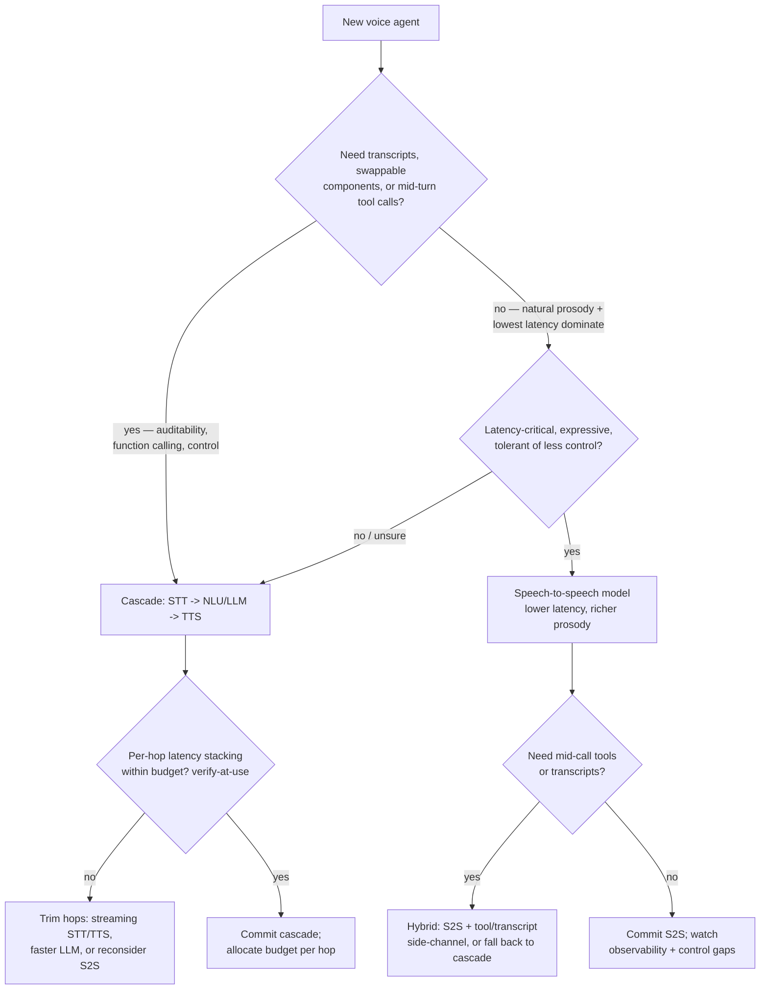
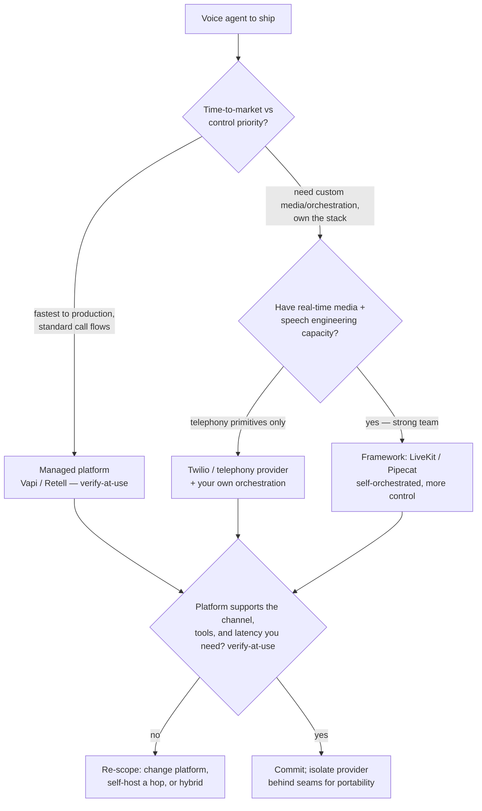
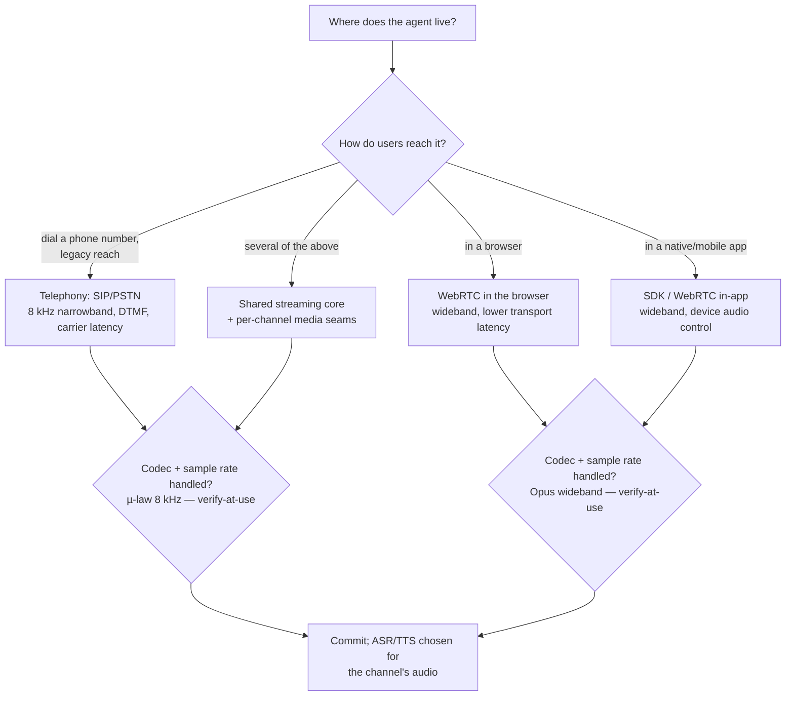
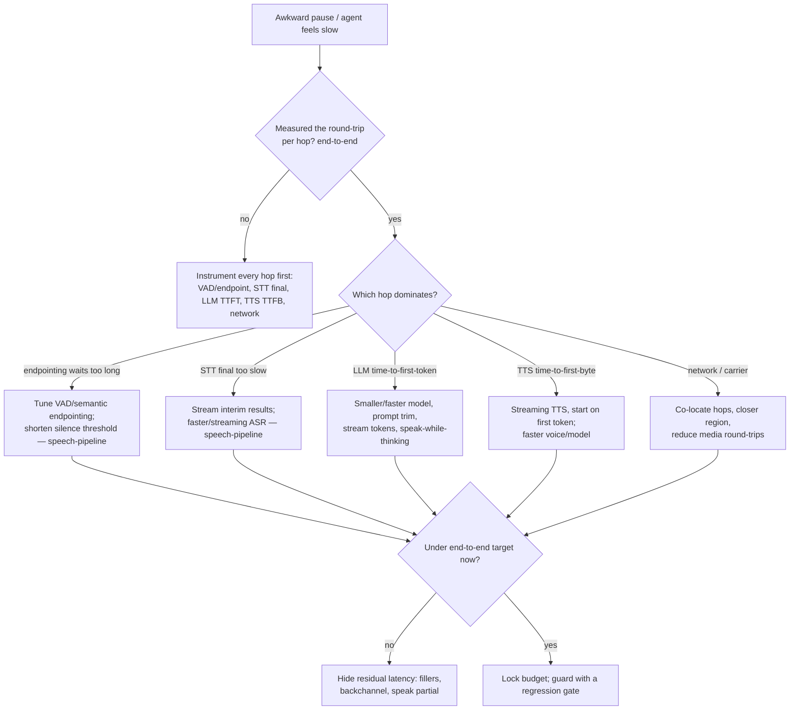

# Conversational Voice-AI Engineering — Decision Trees

> Reference decision trees for the `conversational-ai-voice-engineering` team. Agents **traverse the relevant tree top-to-bottom before deciding** (the proactive complement to the Capability Grounding Protocol). Each `## Decision Tree` section is a Mermaid graph plus the rule it encodes.
>
> **Engineering judgment, not legal/compliance advice.** Anything touching an ASR/TTS model version, provider price, platform feature, telephony protocol detail, or latency number is `[verify-at-use]` — confirm against the vendor/provider docs before it drives a build commitment. No PII; call audio/transcripts are sensitive.
>
> _Last reviewed: 2026-07-03 by `claude`. Principles are durable; dated specifics live in [`voice-ai-reference-2026.md`](voice-ai-reference-2026.md)._

---

## Decision Tree: cascade vs speech-to-speech?

**Rule:** choose on the **use-case**, not the hype. Cascade buys transcripts, swappable components, and mid-turn tool calling at the cost of stacked per-hop latency; speech-to-speech buys latency and prosody at the cost of control and observability. If you need tools/transcripts, default cascade; reach for S2S when latency and expressiveness dominate and control can give. All model/latency specifics `[verify-at-use]`.

---

## Decision Tree: build-vs-platform?

**Rule:** trade time-to-market against control. A managed platform ships fastest for standard flows; a framework (LiveKit/Pipecat) gives control at the cost of engineering; raw telephony primitives (Twilio) mean you own orchestration. Whatever you pick, isolate the provider behind seams so a later swap is a change, not a rebuild. Feature/price specifics `[verify-at-use]`.

---

## Decision Tree: channel choice (telephony vs web/app)?

**Rule:** the channel fixes the media constraints. Telephony (SIP/PSTN) is 8 kHz narrowband with DTMF and carrier latency; WebRTC (browser/app) is wideband with lower transport latency. For multi-surface, build a shared streaming core with per-channel media seams and pick ASR/TTS for the channel's actual audio. Codec/sample-rate specifics `[verify-at-use]`.

---

## Decision Tree: latency-budget triage

**Rule:** instrument **every hop** before optimizing, fix the **dominant** hop (endpointing, STT, LLM TTFT, TTS TTFB, network), and stream wherever possible. When latency can't be removed, hide it with natural fillers/backchannel rather than dead silence. Per-hop targets `[verify-at-use]`.

---

## See also

- [`voice-ai-reference-2026.md`](voice-ai-reference-2026.md) — dated ASR/TTS/platform/telephony landscape + per-hop latency targets (verify-at-use).
- Skills: [`../skills/voice-agent-architecture-and-latency/SKILL.md`](../skills/voice-agent-architecture-and-latency/SKILL.md), [`../skills/speech-recognition-and-synthesis/SKILL.md`](../skills/speech-recognition-and-synthesis/SKILL.md), [`../skills/dialog-management-and-tool-calling/SKILL.md`](../skills/dialog-management-and-tool-calling/SKILL.md), [`../skills/telephony-and-call-flow-integration/SKILL.md`](../skills/telephony-and-call-flow-integration/SKILL.md).
