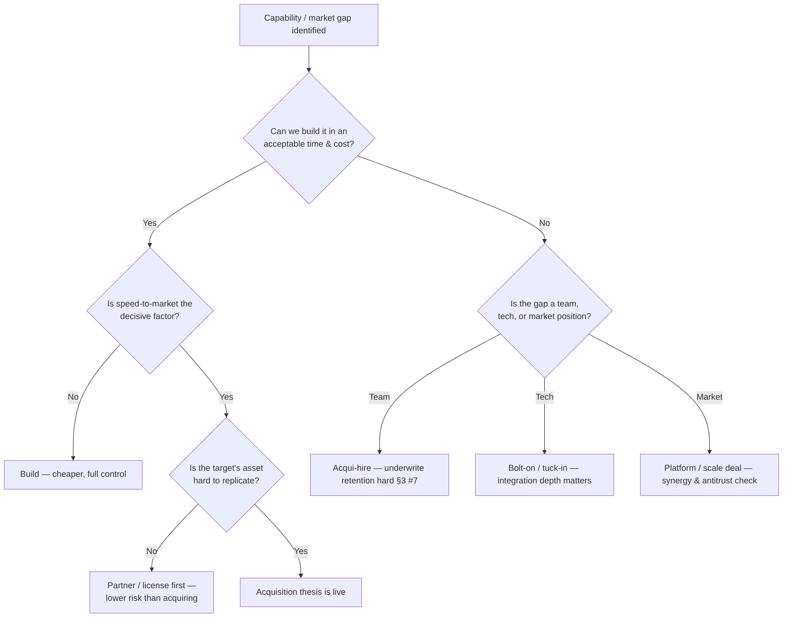
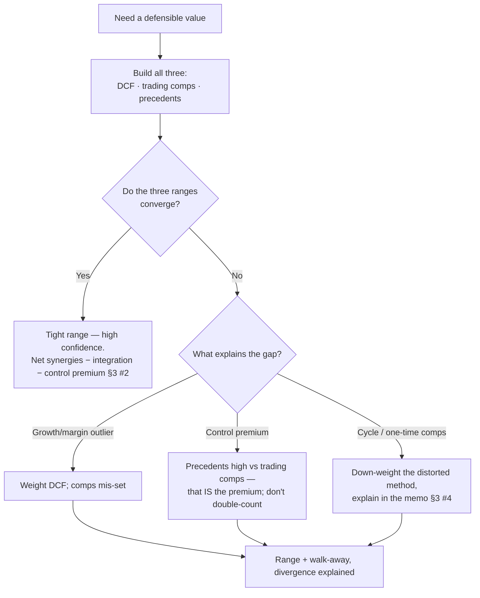
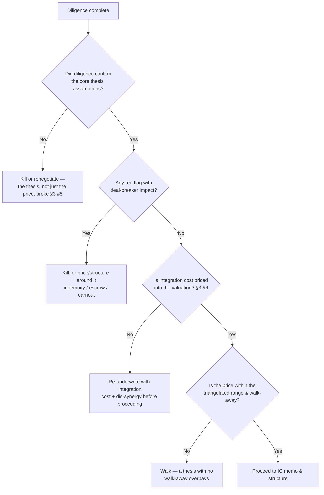

# Corporate Development & M&A — decision trees

Router + three Mermaid decision trees the agents traverse. Read the matching tree in
full when the situation fits. These encode the §3 house opinions as branch logic.

---

## Skill / agent router

| If the ask is… | Route to | Skill |
|---|---|---|
| "Should we buy this / frame the thesis" | `corpdev-lead` | `frame-a-deal-thesis` |
| "What's it worth / how to structure" | `corpdev-lead` | `triangulate-a-valuation` |
| "Run diligence / what could kill it" | `ma-diligence-lead` | `run-a-diligence-plan` |
| "Plan integration / are synergies real" | `integration-pmi-strategist` | `plan-post-merger-integration` |
| Legal / reps & warranties / regulatory | → counsel (seam) | — |
| Audited numbers / accounting / fairness opinion | → accountants / banker (seam) | — |
| Financing / cash impact | → `treasury-management` (seam) | — |

---

## Tree 1 — Buy vs build vs partner

Rule: if build or partner achieves the outcome cheaper or faster, the acquisition thesis is weak (§3 #1).

---

## Tree 2 — Valuation-method weighting

Rule: the divergence between methods is the finding — explain it, don't average it away (§3 #4).

---

## Tree 3 — Go / no-go gate (post-diligence)

