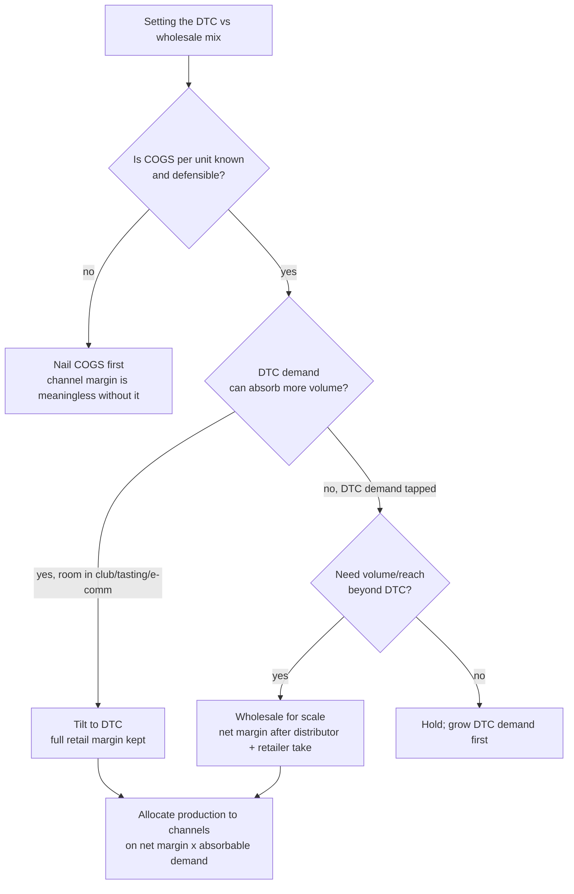
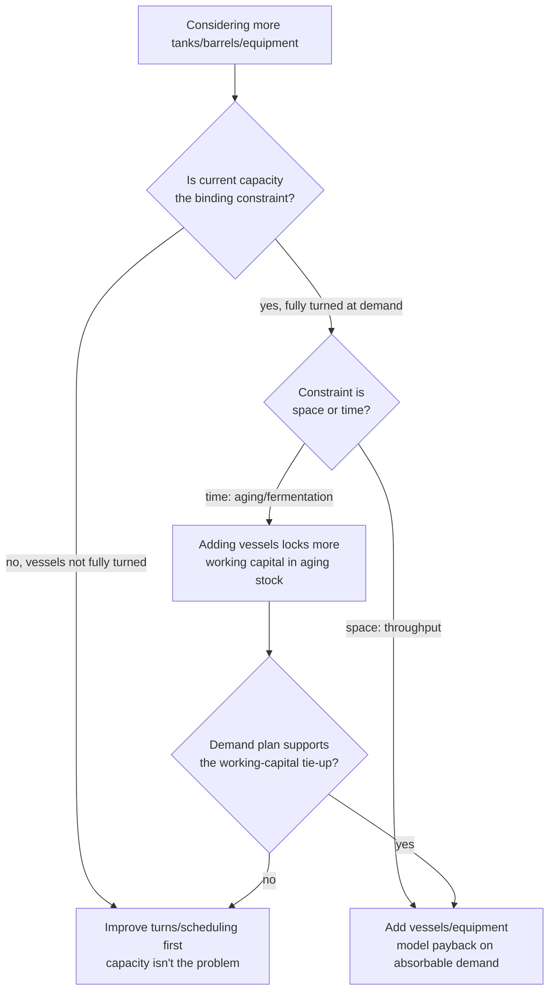
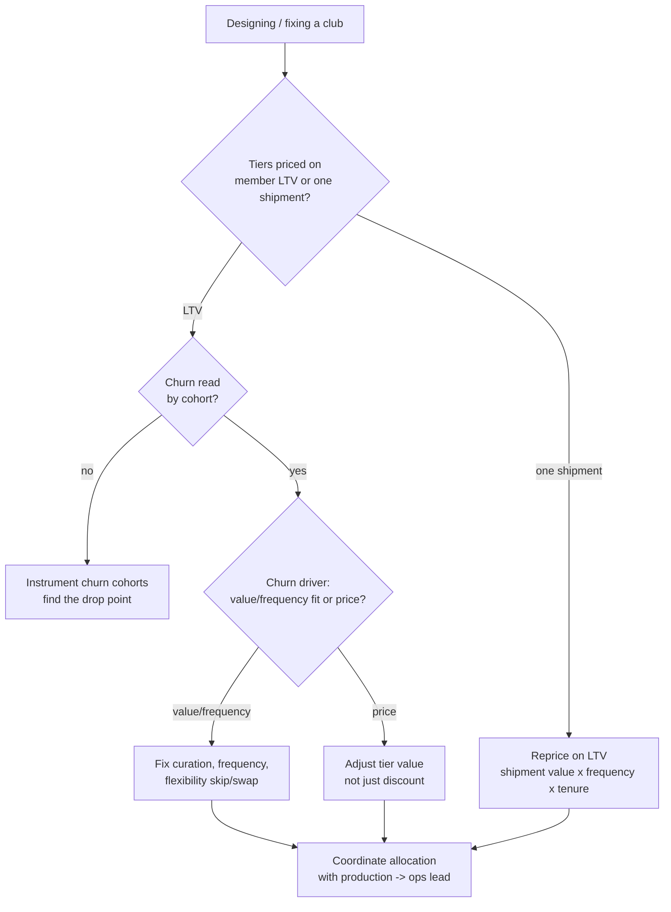
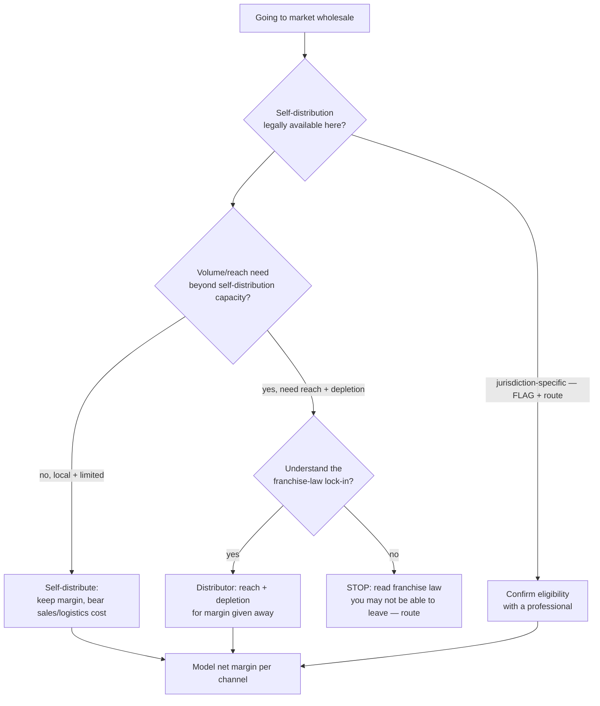

# Craft Beverage (Winery / Brewery / Distillery) — Decision Trees

> Reference decision trees for the `craft-beverage-operations` team. Agents **traverse the relevant tree top-to-bottom before deciding** (the proactive complement to the Capability Grounding Protocol). Each `## Decision Tree` section is a Mermaid graph plus the rule it encodes.
>
> **Operations and financial decision-support, not legal, tax, or regulatory advice.** Anything touching the three-tier system, franchise/distribution law, TTB or state licensing, direct-ship permits, or excise tax is jurisdiction-specific, `[verify-at-use]`, and routes to a licensed professional. Benchmarks (yields, COGS ranges, channel margins, club norms) are volatile — confirm before quoting. No PII.
>
> _Last reviewed: 2026-07-04 by `claude`. Principles are durable; dated benchmarks live in [`craft-beverage-reference-2026.md`](craft-beverage-reference-2026.md)._

---

## Decision Tree: channel mix (DTC vs wholesale)

**Rule:** channel mix is the margin decision, and it starts from a known COGS per unit. DTC keeps the full retail margin but is demand-limited; wholesale adds reach and volume but gives margin to the distributor and retailer. Allocate production on net margin per channel against the demand each can absorb. Margins are `[verify-at-use]`.

---

## Decision Tree: add production capacity

**Rule:** capacity is tanks, barrels, **and time**. Confirm current vessels are fully turned against the demand plan before adding, and recognize that in aging products the constraint is time — adding vessels locks more working capital in stock that won't sell for months or years. Model the payback on absorbable demand. `[verify-at-use]` on yields/turns.

---

## Decision Tree: design the club

**Rule:** the club is the recurring-revenue engine — design tiers on member lifetime value, manage churn by cohort (the driver is usually value/frequency fit, not price), treat each shipment as a retention moment, and coordinate club allocation with production. Norms are `[verify-at-use]`.

---

## Decision Tree: self-distribute vs distributor

**Rule:** model the economics (self-distribution keeps margin but costs effort and has eligibility limits; a distributor buys reach and depletion for margin and franchise-law lock-in), but **every** eligibility, licensing, franchise-law, and excise specific is jurisdiction-specific — flag it `[verify-at-use]` and route the determination to a licensed professional. Flag, never decide.

---

## See also

- [`craft-beverage-reference-2026.md`](craft-beverage-reference-2026.md) — dated benchmarks + concepts (verify-at-use).
- Skills: [`../skills/production-planning-and-cogs/SKILL.md`](../skills/production-planning-and-cogs/SKILL.md), [`../skills/tasting-room-throughput-and-conversion/SKILL.md`](../skills/tasting-room-throughput-and-conversion/SKILL.md), [`../skills/club-membership-and-dtc-revenue/SKILL.md`](../skills/club-membership-and-dtc-revenue/SKILL.md), [`../skills/three-tier-and-self-distribution-economics/SKILL.md`](../skills/three-tier-and-self-distribution-economics/SKILL.md).
