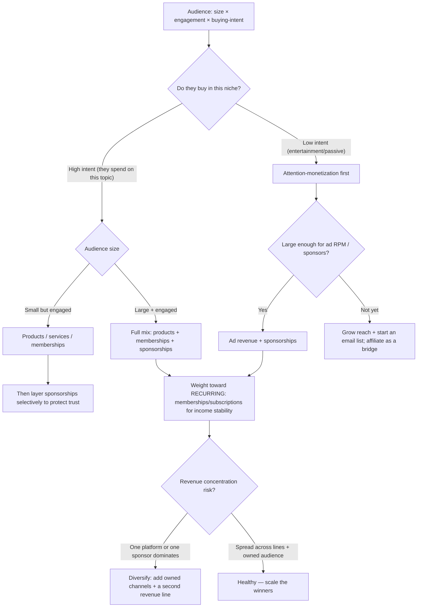

# Monetization-mix decision tree

> Read this **before recommending any revenue line**. The binding inputs are
> **audience size × engagement × buying-intent** — not follower count alone. A small,
> high-intent audience out-earns a large passive one. Durable mechanics; the
> perishable payout/rate specifics are in
> [`creator-platforms-and-monetization-2026.md`](creator-platforms-and-monetization-2026.md).

## The tree

## How to read it

1. **Buying-intent splits the tree.** If the audience actively spends in the niche
   (finance, fitness, professional skills, hobbies-with-gear), lead with things they
   buy — **products, courses, services, memberships**. If they're there to be
   entertained, lead with **attention monetization** (ads, then sponsorships) and
   layer products carefully.
2. **Engaged-small beats passive-large for direct monetization.** A few thousand
   people who trust you and buy in the niche can support memberships/products before
   ad RPM is even meaningful. Don't wait for a huge follower count to monetize intent.
3. **Weight toward recurring revenue.** Ads and sponsorships are volatile
   (seasonality, algorithm, sponsor budgets). Memberships/subscriptions smooth income
   — move toward MRR wherever the audience supports it.
4. **Protect trust when layering sponsorships.** Sponsorships are the fastest cash but
   spend audience trust; over-doing it or promoting low-quality products draws down
   the compounding asset. Keep them selective and disclosed.
5. **Check concentration last, always.** However good the mix looks, if one platform
   or one sponsor could zero the income, that's the top risk — add owned channels
   (email/community) and a second revenue line.

## The three failure modes this tree prevents

- **Monetizing attention that has no buying-intent** with hard products (low
  conversion, wasted trust) instead of ads/sponsorships.
- **Waiting for a huge follower count** before monetizing a small, high-intent
  audience that would already pay.
- **Building the whole business on one rented platform / one sponsor** with no owned
  audience and no revenue diversification.

## Seam note

Choosing the mix is the strategist's call; the **rate card / sponsorship valuation**
and the **owned-audience funnel** are executed via the plugin's skills, and the
dated platform/payout/rate specifics live in
[`creator-platforms-and-monetization-2026.md`](creator-platforms-and-monetization-2026.md).
