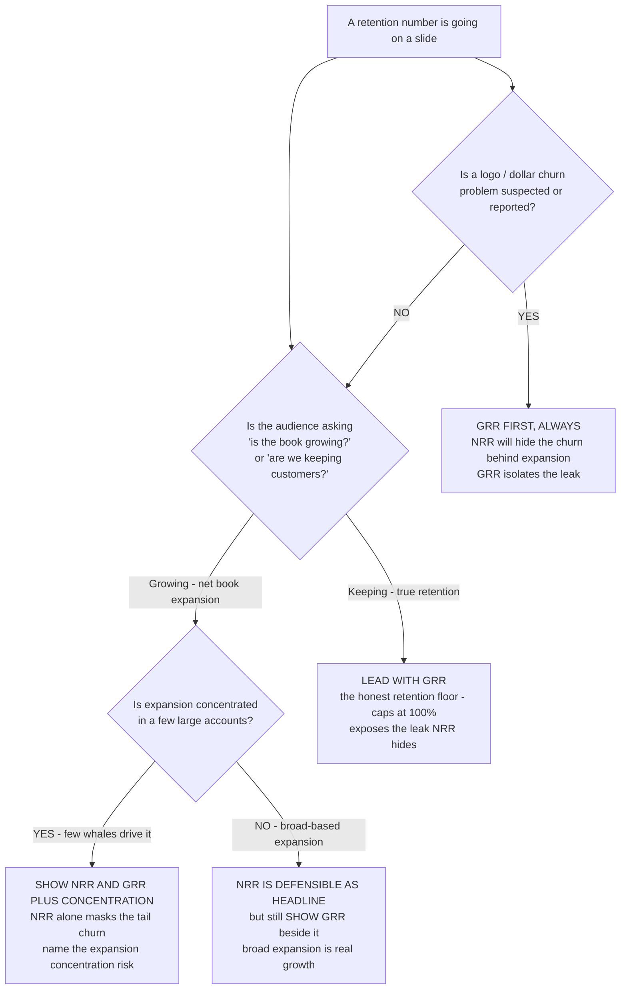
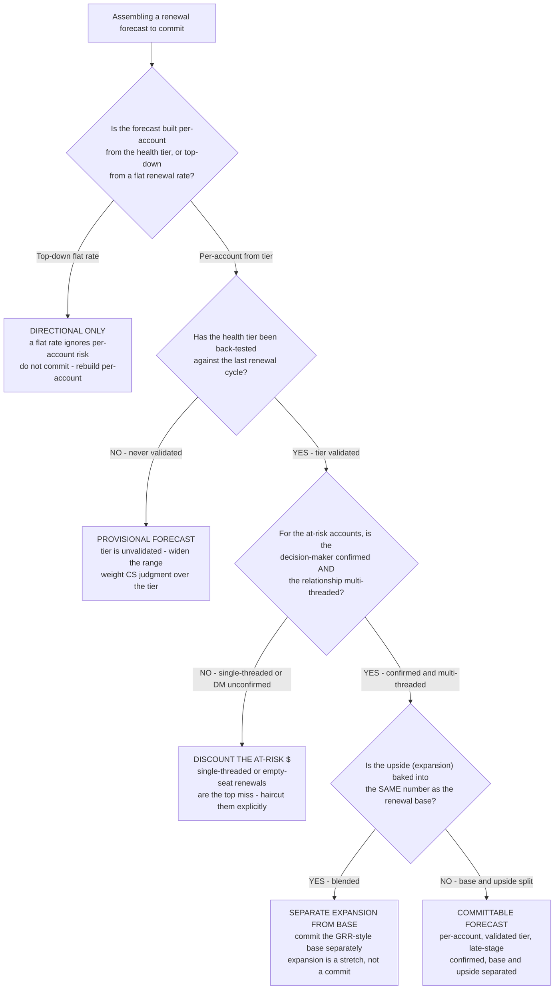

# CS retention metrics — NRR / GRR / CAC-payback (domain-neutral)

> **Last reviewed:** 2026-06-05
> **Read when:** a CS leader or exec asks "is our retention healthy?", an NRR number is being celebrated, or a renewal-forecast / CAC-payback figure is on a board slide. This file is the source of truth for the **revenue-retention** metric definitions the `cs_calc.py retention` mode computes and the two new decision trees below reference.
> **Scope:** domain-neutral. These are universal subscription-economics metrics — they hold for B2B SaaS, services, and platform businesses alike. Segment-specific overlays (the renewal clock, budget cycles) change the *timing*, not the *math*.

This file complements [`cs-health-metrics-and-churn-indicators.md`](cs-health-metrics-and-churn-indicators.md) (the *signal* layer) and [`renewal-and-account-lifecycle.md`](renewal-and-account-lifecycle.md) (the *workflow* layer). Those answer "which account is at risk?"; this answers "is the *book* retaining?".

---

## 1. NRR and GRR — the two retention rates, and why you need both

| Metric | Formula | Caps at 100%? | What it tells you |
|---|---|---|---|
| **GRR** (Gross Revenue Retention) | `(start − contraction − churn) / start` | **Yes** — you cannot keep more than you started with from the existing base | The **honest retention floor**: how much revenue you keep *before* any expansion. Pure leak rate. |
| **NRR** (Net Revenue Retention) | `(start + expansion − contraction − churn) / start` | No — expansion can push it well above 100% | Net of expansion: whether the existing book *grows* without new logos. |

> **The load-bearing rule: NRR alone can mask churn.** A headline NRR of 110% can sit on top of a six-figure churn number — a handful of expanding whales lift the net figure while the long tail bleeds logos. **GRR caps at 100% and exposes the leak NRR hides.** Surface **both**, never NRR on its own. When NRR ≥ 100% but GRR is materially below it, expansion is *carrying* retention — healthy only if the expansion is broad-based, a hidden risk if a few accounts drive it. `[verify-at-use]` the exact "materially below" cut against the team's own concentration data.

**Benchmarks (volatile — re-verify before quoting a client):**

- Median NRR for private B2B SaaS is **~106%** (2024–2025); best-in-class public SaaS averages **~120–125%**; SMB books typically **90–105%**, enterprise **115–125%** (expansion-driven). `[verify-at-use]` — segment- and stage-dependent; the single median number is "almost meaningless without ACV / ARR stage / pricing model." Sources retrieved 2026-06-05: [Optifai NRR benchmark](https://optif.ai/learn/questions/b2b-saas-net-revenue-retention-benchmark/), [Fiscallion NRR benchmark](https://www.fiscallion.io/blog/net-revenue-retention-benchmark-saas-what-the-numbers-actually-mean-for-your-stage), [ChurnZero NRR vs GRR](https://churnzero.com/blog/net-revenue-retention-vs-gross-revenue-retention-explained/).
- GRR is "good" in the **mid-80s to mid-90s%** for most B2B SaaS; the gap between NRR and GRR *is* the expansion contribution. `[verify-at-use]` — Source: [CustomerScore GRR guide](https://blog.customerscore.io/gross-revenue-retention-the-saas-metric-that-reveals-your-true-retention-health/), retrieved 2026-06-05.

---

## 2. CAC payback — the retention-sensitive efficiency metric

- **Formula:** `CAC / (ARPA × gross margin)` → months to recover the cost of acquiring a customer. `[verify-at-use]` — Source: [Drivetrain CAC payback](https://www.drivetrain.ai/strategic-finance-glossary/cac-payback-period-formula-benchmarks-and-how-to-reduce-it), retrieved 2026-06-05.
- **Benchmarks:** B2B SaaS median **~15–18 months**; by ACV — sub-$5K ~9mo, $10–25K ~12mo, $25–50K ~14mo, $250K+ ~24mo. Best-in-class <12mo, concerning 18–24mo, critical >24mo. `[verify-at-use]` — Sources retrieved 2026-06-05: [First Page Sage CAC payback 2025](https://firstpagesage.com/reports/saas-cac-payback-benchmarks/), [Optifai CAC payback](https://optif.ai/learn/questions/cac-payback-period-benchmark/).
- **The CS connection:** CAC payback only earns out *if the customer is retained past the payback month.* A short payback on a book with weak GRR is a treadmill — you recover CAC just in time to lose the logo. This is why retention (GRR) gates the unit economics, and why a CS analytics build should surface GRR next to CAC payback, not in a separate finance silo. CS owns *which accounts retain*; this metric is where that work shows up in the P&L.

> This plugin is the **domain layer** — it specifies these definitions and hands the *computation in the warehouse* (the `fct_*` revenue-movement facts, the mart-layer metric) to `data-platform`. The metric lives in the mart / semantic layer exactly once (the single-source rule), never recomputed in the BI tool.

---

## Decision Tree: Retention metric choice — NRR, GRR, or both?

**When this applies:** a retention number is being put on a slide, in a QBR, or in a board deck, and the team must decide which retention metric to lead with. Observable inputs: who the audience is, whether expansion is concentrated, and whether a logo-churn problem is suspected.

**Last verified:** 2026-06-05 against the §1 definitions and the cited 2025 SaaS benchmarks.

**Rationale per leaf:**
- *Lead with GRR* — when the question is genuinely "are we retaining?", GRR is the only metric that answers it without expansion contamination; it caps at 100% so it cannot flatter.
- *Show NRR and GRR plus concentration* — concentrated expansion behind a healthy NRR is the classic masking pattern; surfacing the concentration turns a flattering number into an honest one.
- *NRR is defensible as headline* — broad-based expansion across the book *is* real net growth; NRR earns the headline, but GRR still rides alongside so the floor is visible.
- *GRR first, always* — the moment churn is the concern, NRR is the wrong lead metric by construction; GRR isolates exactly what the team is worried about.

**Tradeoffs summary:**

| Decision | Honesty | Risk if used alone | Use when |
|---|---|---|---|
| Lead with GRR | High | Understates net growth | Audience asks "are we retaining?" |
| NRR + GRR + concentration | High | None (both shown) | Expansion is whale-concentrated |
| NRR as headline | Medium | Masks tail churn | Expansion is broad-based |
| GRR first | High | Understates expansion | A churn problem is suspected |

---

## Decision Tree: Renewal-forecast confidence — can I commit this number?

**When this applies:** a renewal forecast (a committed renewal $ for the quarter, or a churn-$ projection) is being assembled and the team must decide how much confidence to attach to it. Observable inputs: how the forecast is built (per-account vs. top-down rate), whether the health tier is back-tested, and whether late-stage signals (decision-maker, multi-threading) are confirmed.

**Last verified:** 2026-06-05 against [`renewal-and-account-lifecycle.md`](renewal-and-account-lifecycle.md) §2 (the renewal workflow stages) and the tier-confidence tree in `customer-success-decision-trees.md`.

**Rationale per leaf:**
- *Directional only* — a top-down flat renewal rate cannot see which specific accounts are at risk; it is a planning estimate, never a commit.
- *Provisional forecast* — an unvalidated tier may misrank risk; the forecast inherits that uncertainty, so widen the range and lean on CS judgment.
- *Discount the at-risk $* — single-threaded relationships and unconfirmed decision-makers are the single most common renewal miss (a champion departure evaporates the renewal); haircut those dollars explicitly rather than assuming they close.
- *Separate expansion from base* — blending expansion upside into the renewal commit inflates the number; the renewal base (GRR-shaped) is the commit, expansion is a separate stretch line.
- *Committable forecast* — per-account, validated tier, confirmed late-stage signals, and base-vs-upside separated: this number can be committed with a stated confidence.

**Tradeoffs summary:**

| Leaf | Commit-ability | Primary gap | Fix |
|---|---|---|---|
| Directional only | None | No per-account risk | Rebuild per-account |
| Provisional | Low | Tier unvalidated | Back-test then re-forecast |
| Discount at-risk $ | Medium | Late-stage unconfirmed | Confirm DM + multi-thread |
| Separate expansion | Medium-high | Upside inflates base | Split base from stretch |
| Committable | High | None material | Commit with confidence band |

---

## References

- Calculator: [`../scripts/cs_calc.py`](../scripts/cs_calc.py) (`retention` mode computes NRR/GRR + the masking check)
- Companion signal layer: [`cs-health-metrics-and-churn-indicators.md`](cs-health-metrics-and-churn-indicators.md)
- Companion workflow layer: [`renewal-and-account-lifecycle.md`](renewal-and-account-lifecycle.md)
- Existing decision trees (signal selection, retune, call-list, expansion, PII): [`customer-success-decision-trees.md`](customer-success-decision-trees.md)
- Where the metric is computed (handoff): [`../../data-platform/knowledge/where-cs-metrics-live.md`](../../data-platform/knowledge/where-cs-metrics-live.md)
