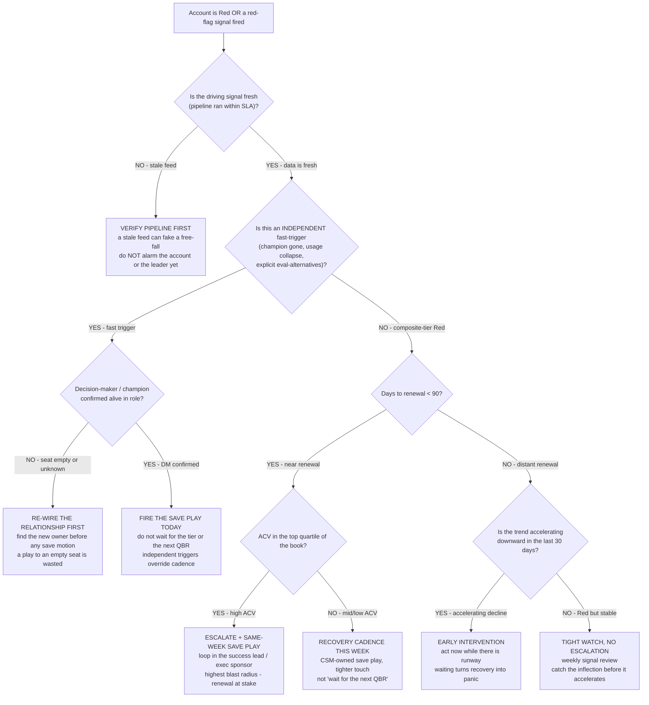

# CS risk-tier escalation & save-play trigger — decision tree (Mermaid)

> **Last reviewed:** 2026-06-05
> **Read when:** an account has been classified Red (or an independent red-flag fired) and the team must decide **what motion to trigger** — a fast same-day save play, a scheduled recovery cadence, a pipeline-freshness check, or an escalation up the chain. This is the **action** complement to the *classification* trees in [`customer-success-decision-trees.md`](customer-success-decision-trees.md): those decide *what tier*; this decides *what to do about the tier*.
> **Scope:** domain-neutral. The trigger logic is universal CS save-motion mechanics. Vertical overlays (which play, who owns it, the comms regime) belong in a CS-motion plugin (e.g. `edtech-partner-success`), not here.

This tree implements the plugin's house opinion that **independent red-flag triggers run alongside the tier, not inside it** (`cs-health-metrics-and-churn-indicators.md` §4) — a composite reacts too slowly to a champion departure, so a fast trigger fires the recovery motion the same day regardless of the tier's color. It also enforces **data-pipeline-freshness-before-alarm**: never escalate on stale data.

---

## Decision Tree: Risk-tier escalation — which motion fires?

**When this applies:** an account is Red, or an independent red-flag signal (champion departure, active-user collapse, an explicit "we're evaluating alternatives") has fired. Observable inputs: whether the signal is fresh, whether it is an independent fast-trigger vs. a composite-tier Red, days to renewal, ACV, and whether the decision-maker is confirmed.

**Last verified:** 2026-06-05 against `cs-health-metrics-and-churn-indicators.md` §4–5, `renewal-and-account-lifecycle.md` §6 (touch-cadence by tier), and the `data-pipeline-freshness-before-alarm` + `champion-silence-is-a-first-class-churn-signal` best practices.

**Rationale per leaf:**
- *Verify pipeline first* — the cheapest, most conservative move; a stale data feed routinely fakes a free-fall, and alarming the account or the leader on stale data destroys trust in the whole tier. Freshness is step zero before any escalation.
- *Re-wire the relationship first* — a save play aimed at a departed champion or an empty seat is wasted effort and can reach the wrong person; find the new owner before spending a motion.
- *Fire the save play today* — independent fast-triggers (champion departure, usage collapse, explicit evaluation of alternatives) are precisely the signals a composite tier reacts to too slowly; they override the scheduled cadence and fire the same day.
- *Escalate + same-week save play* — a near-renewal, high-ACV Red is the highest blast-radius combination; it warrants looping in the success lead / exec sponsor, not just a CSM touch.
- *Recovery cadence this week* — a near-renewal, mid/low-ACV Red still needs a tighter-than-QBR recovery cadence, CSM-owned, but does not need executive escalation.
- *Early intervention* — an accelerating decline with renewal runway is the highest-leverage moment to act; waiting until the renewal window converts a calm recovery into a panic play.
- *Tight watch, no escalation* — a Red that hit the threshold but is *stable* (not accelerating) and distant from renewal warrants weekly review, not an immediate motion — escalating it manufactures false urgency and erodes the tier's credibility.

**Tradeoffs summary:**

| Leaf | Urgency | Who owns it | Approval gate | Use when |
|---|---|---|---|---|
| Verify pipeline first | pre-work | data-platform | none | Signal may be stale |
| Re-wire relationship | pre-work | CSM | none | DM/champion unconfirmed |
| Fire save play today | same-day | CSM | none | Independent fast-trigger, DM confirmed |
| Escalate + save play | same-week | success lead / exec | yes — success lead | Near-renewal high-ACV Red |
| Recovery cadence | this-week | CSM | none | Near-renewal mid/low-ACV Red |
| Early intervention | this-week | CSM | soft — success lead | Accelerating decline, runway remains |
| Tight watch | weekly | CSM | none | Red but stable and distant |

---

## How an agent uses this tree

Per the Capability Grounding Protocol's pre-action decision-tree traversal (`ravenclaude-core/CLAUDE.md`): when an account is Red or a red-flag fired, traverse this graph **top-to-bottom** before recommending a motion. Resolve each node against the account's observable context (freshness, trigger type, days-to-renewal, ACV, trend acceleration, DM status) — never keyword-match the description to a leaf. **Default to the smaller-blast-radius leaf** (tight watch / recovery cadence) and escalate only when a higher node demonstrably applies. The freshness gate (Q0) and the DM-confirmation gate are non-negotiable pre-conditions — they run *before* any escalation, exactly as the call-list tree in `customer-success-decision-trees.md` requires.

## References

- Signal & explainability layer: [`cs-health-metrics-and-churn-indicators.md`](cs-health-metrics-and-churn-indicators.md) §4–5
- Renewal workflow & touch-cadence: [`renewal-and-account-lifecycle.md`](renewal-and-account-lifecycle.md) §2, §6
- Classification trees (tier *selection*): [`customer-success-decision-trees.md`](customer-success-decision-trees.md)
- Skill: [`../skills/renewal-workflow-design/SKILL.md`](../skills/renewal-workflow-design/SKILL.md)
- Best practices: [`../best-practices/data-pipeline-freshness-before-alarm.md`](../best-practices/data-pipeline-freshness-before-alarm.md), [`../best-practices/champion-silence-is-a-first-class-churn-signal.md`](../best-practices/champion-silence-is-a-first-class-churn-signal.md)
