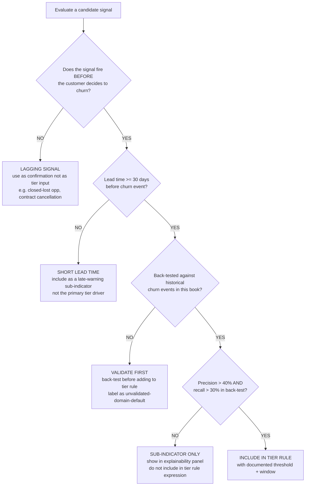
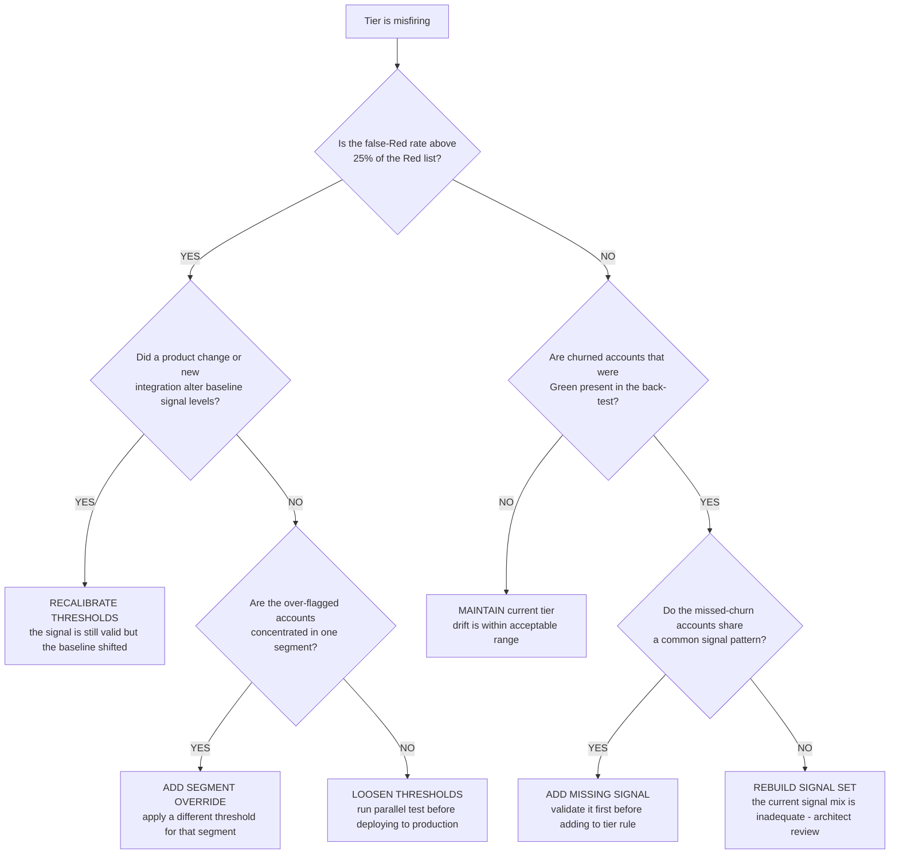
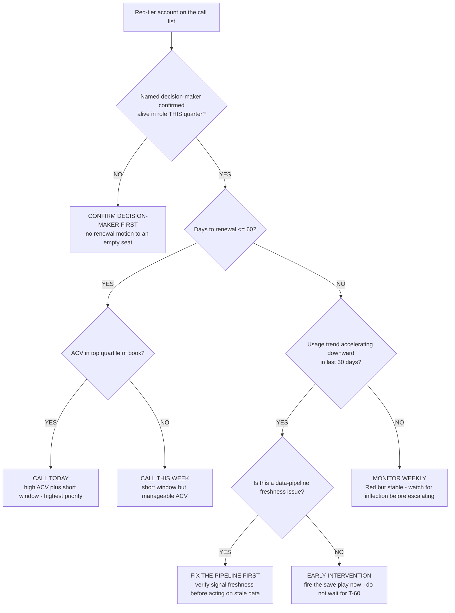

# Customer-success analytics decision trees

Branching decision trees for CS health scoring, signal selection, and renewal-risk triage. Traverse top-to-bottom before picking a method. Last reviewed: 2026-06-05.

---

## Decision Tree: Churn signal selection — leading vs lagging

**When this applies:** the team is selecting which signals to include in the health tier, OR a signal is under review because it is not predicting churn with the expected lead time. Observable inputs: the signal's description, when in the customer lifecycle it typically fires, and whether it has been back-tested against historical churn events.

**Last verified:** 2026-06-05 against the plugin's knowledge bank (`cs-health-metrics-and-churn-indicators.md`) and standard CS analytics practice.

**Rationale per leaf:**
- *Lagging Signal* — a signal that fires after the churn decision is made describes what happened, it does not predict what will happen; it belongs in post-mortem analysis, not live triage.
- *Short Lead Time* — a signal with less than 30 days of lead time gives the CS team too little runway to intervene; valuable as a last-warning indicator but not as the primary tier driver.
- *Validate First* — an unvalidated signal is a hypothesis; labeling it "domain default" makes the hypothesis explicit and sets an expectation for when the back-test will run.
- *Sub-Indicator Only* — a signal that fails the precision/recall bar provides observational context but lacks the predictive strength to drive tier classification; showing it in the explainability panel preserves its transparency without inflating false-positive rate.
- *Include in Tier Rule* — a back-tested, high-precision, high-recall signal with adequate lead time has earned its place in the rule expression.

**Tradeoffs summary:**

| Decision | CS impact | False-positive risk | Evidence bar | Use when |
|---|---|---|---|---|
| Lagging only | post-mortem use | n/a | n/a | Fires after churn decision |
| Short lead time | late warning | medium | none | Less than 30-day lead |
| Validate first | delayed inclusion | low | back-test pending | No validation yet |
| Sub-indicator only | transparency gain | low | fails precision/recall | Low predictive strength |
| Include in tier rule | drives triage | medium | back-test pass | Validated, adequate lead |

---

## Decision Tree: Health tier accuracy problem — retune or rebuild

**When this applies:** the CS team reports that the health tier is misfiring — yellow accounts are renewing fine while green accounts are churning, or the Red list is too long to triage. Observable inputs: number of false Reds, known churn events that were Green before churning, and whether the signals themselves have changed since the tier was tuned.

**Last verified:** 2026-06-05 against standard CS health-score drift and retune practice.

**Rationale per leaf:**
- *Recalibrate Thresholds* — a product change or new data source can shift the baseline of a valid signal; the fix is threshold adjustment, not signal replacement.
- *Add Segment Override* — over-flagging concentrated in one segment (e.g., SMB vs. enterprise, or a specific vertical) indicates the threshold is not universal; a segment-specific rule is the targeted fix.
- *Loosen Thresholds* — a diffuse false-Red problem indicates the thresholds are too sensitive; loosen in a parallel test first to validate the false-positive reduction before promoting.
- *Maintain* — if the false-Red rate is acceptable and no known churns were missed, the tier is performing within its design parameters.
- *Add Missing Signal* — a common pattern among missed-churn accounts points to a specific signal that the current tier doesn't capture; validate it before adding.
- *Rebuild Signal Set* — when missed-churn accounts share no common pattern in the current signal set, the problem is structural; escalate to the `cs-analytics-architect` for a redesign.

**Tradeoffs summary:**

| Action | Disruption | Evidence needed | Time to implement | Use when |
|---|---|---|---|---|
| Recalibrate thresholds | low | baseline change confirmed | days | Product or integration change |
| Segment override | medium | segment pattern confirmed | days | Concentrated false positives |
| Loosen thresholds | medium | parallel-test result | weeks | Diffuse false positives |
| Maintain | none | drift check passes | — | Tier performing within range |
| Add missing signal | medium | back-test pass | weeks | Missed churns share a pattern |
| Rebuild signal set | high | architect review | months | No detectable pattern in missed churns |

---

## Decision Tree: Renewal-risk call list — which account to call first

**When this applies:** the CS leader has the filtered Red-tier list sorted by days-to-renewal and must decide the call order. Observable inputs: days-to-renewal, tier-driver signals, ACV, and whether a live decision-maker is confirmed.

**Last verified:** 2026-06-05 against the plugin's `renewal-and-account-lifecycle.md` knowledge file.

**Rationale per leaf:**
- *Confirm Decision-Maker First* — a renewal or recovery motion to a departed champion is wasted effort and may trigger the wrong person; confirmation is always the first step.
- *Call Today* — high ACV plus a short renewal window is the highest blast-radius combination on the call list; it is the first call every time.
- *Call This Week* — short window with manageable ACV is urgent but not the absolute first call; schedule within the week.
- *Fix the Pipeline First* — a stale data feed can make a healthy account appear to be in free-fall; verify signal freshness before alarming the CS leader or the account.
- *Early Intervention* — accelerating downward trend outside the T-60 window is the scenario where early action has the most leverage; waiting until T-60 converts a recovery play into a panic play.
- *Monitor Weekly* — a stable Red (hit threshold but not accelerating) warrants attention but not an immediate call; weekly monitoring catches the inflection point without manufacturing urgency.

**Tradeoffs summary:**

| Action | Urgency | Cost if wrong | Approval gate? | Use when |
|---|---|---|---|---|
| Confirm decision-maker | pre-work | High - motion to empty seat | No | DM not confirmed this quarter |
| Call today | immediate | High if missed | No | High ACV plus T-60 or less |
| Call this week | urgent | Medium | No | T-60 or less, any ACV |
| Fix the pipeline | technical | Low - conservative | Data-platform | Freshness gap suspected |
| Early intervention | this week | High if late | Yes - success lead | Accelerating decline at T-90+ |
| Monitor weekly | deferred | Low if stable | No | Red but stable trend |
