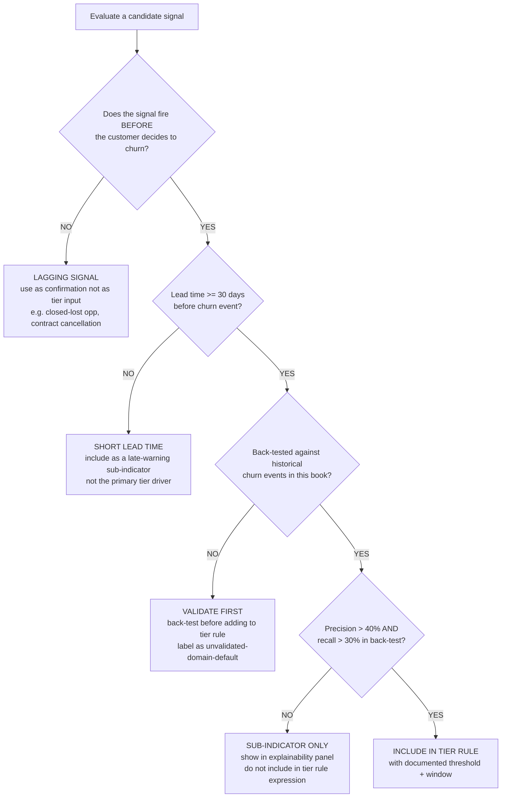
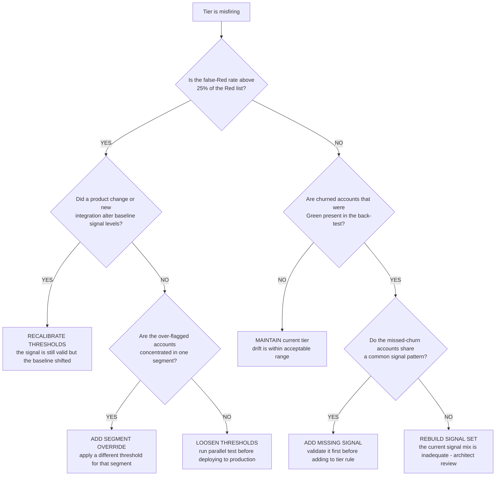
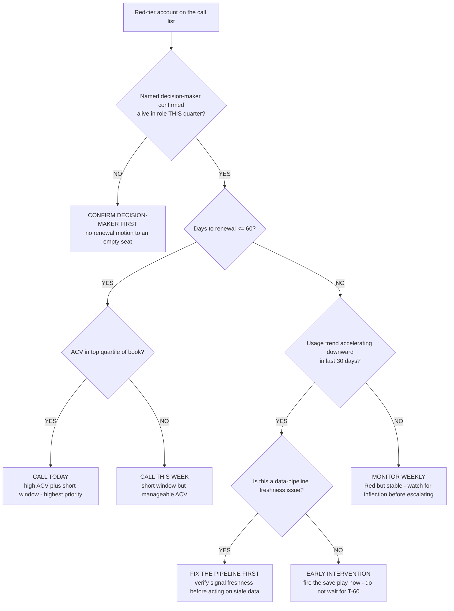
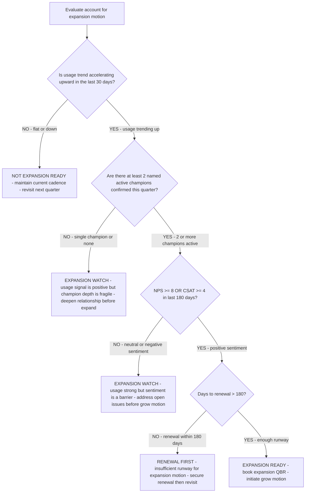
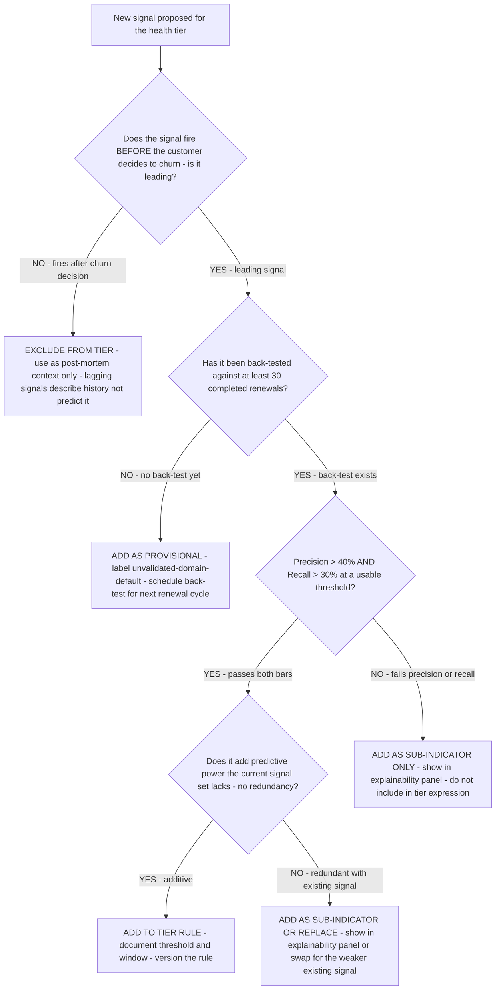
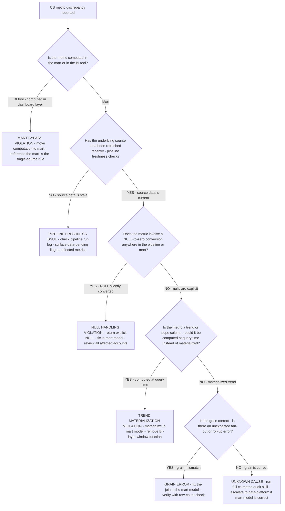
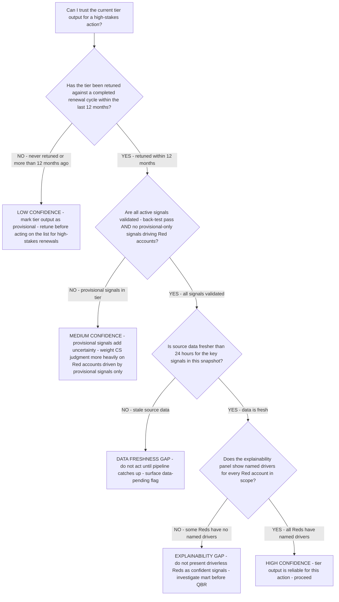
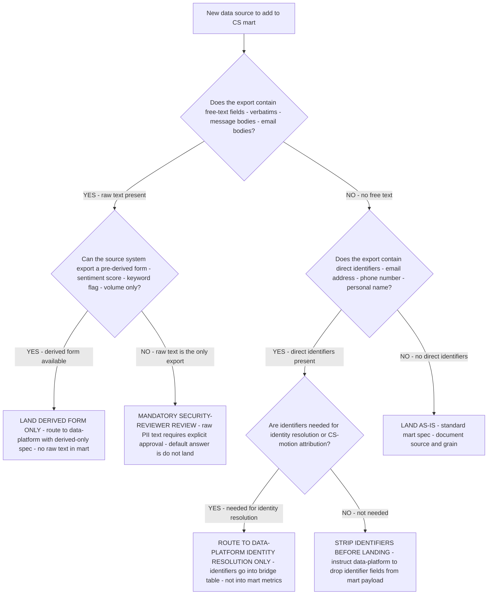

# Customer-success analytics decision trees

Branching decision trees for CS health scoring, signal selection, and renewal-risk triage. Traverse top-to-bottom before picking a method. Last reviewed: 2026-06-05.

---

## Decision Tree: Churn signal selection — leading vs lagging

**When this applies:** the team is selecting which signals to include in the health tier, OR a signal is under review because it is not predicting churn with the expected lead time. Observable inputs: the signal's description, when in the customer lifecycle it typically fires, and whether it has been back-tested against historical churn events.

**Last verified:** 2026-06-05 against the plugin's knowledge bank (`cs-health-metrics-and-churn-indicators.md`) and standard CS analytics practice.

**Rationale per leaf:**
- *Lagging Signal* — a signal that fires after the churn decision is made describes what happened, it does not predict what will happen; it belongs in post-mortem analysis, not live triage.
- *Short Lead Time* — a signal with less than 30 days of lead time gives the CS team too little runway to intervene; valuable as a last-warning indicator but not as the primary tier driver.
- *Validate First* — an unvalidated signal is a hypothesis; labeling it "domain default" makes the hypothesis explicit and sets an expectation for when the back-test will run.
- *Sub-Indicator Only* — a signal that fails the precision/recall bar provides observational context but lacks the predictive strength to drive tier classification; showing it in the explainability panel preserves its transparency without inflating false-positive rate.
- *Include in Tier Rule* — a back-tested, high-precision, high-recall signal with adequate lead time has earned its place in the rule expression.

**Tradeoffs summary:**

| Decision | CS impact | False-positive risk | Evidence bar | Use when |
|---|---|---|---|---|
| Lagging only | post-mortem use | n/a | n/a | Fires after churn decision |
| Short lead time | late warning | medium | none | Less than 30-day lead |
| Validate first | delayed inclusion | low | back-test pending | No validation yet |
| Sub-indicator only | transparency gain | low | fails precision/recall | Low predictive strength |
| Include in tier rule | drives triage | medium | back-test pass | Validated, adequate lead |

---

## Decision Tree: Health tier accuracy problem — retune or rebuild

**When this applies:** the CS team reports that the health tier is misfiring — yellow accounts are renewing fine while green accounts are churning, or the Red list is too long to triage. Observable inputs: number of false Reds, known churn events that were Green before churning, and whether the signals themselves have changed since the tier was tuned.

**Last verified:** 2026-06-05 against standard CS health-score drift and retune practice.

**Rationale per leaf:**
- *Recalibrate Thresholds* — a product change or new data source can shift the baseline of a valid signal; the fix is threshold adjustment, not signal replacement.
- *Add Segment Override* — over-flagging concentrated in one segment (e.g., SMB vs. enterprise, or a specific vertical) indicates the threshold is not universal; a segment-specific rule is the targeted fix.
- *Loosen Thresholds* — a diffuse false-Red problem indicates the thresholds are too sensitive; loosen in a parallel test first to validate the false-positive reduction before promoting.
- *Maintain* — if the false-Red rate is acceptable and no known churns were missed, the tier is performing within its design parameters.
- *Add Missing Signal* — a common pattern among missed-churn accounts points to a specific signal that the current tier doesn't capture; validate it before adding.
- *Rebuild Signal Set* — when missed-churn accounts share no common pattern in the current signal set, the problem is structural; escalate to the `cs-analytics-architect` for a redesign.

**Tradeoffs summary:**

| Action | Disruption | Evidence needed | Time to implement | Use when |
|---|---|---|---|---|
| Recalibrate thresholds | low | baseline change confirmed | days | Product or integration change |
| Segment override | medium | segment pattern confirmed | days | Concentrated false positives |
| Loosen thresholds | medium | parallel-test result | weeks | Diffuse false positives |
| Maintain | none | drift check passes | — | Tier performing within range |
| Add missing signal | medium | back-test pass | weeks | Missed churns share a pattern |
| Rebuild signal set | high | architect review | months | No detectable pattern in missed churns |

---

## Decision Tree: Renewal-risk call list — which account to call first

**When this applies:** the CS leader has the filtered Red-tier list sorted by days-to-renewal and must decide the call order. Observable inputs: days-to-renewal, tier-driver signals, ACV, and whether a live decision-maker is confirmed.

**Last verified:** 2026-06-05 against the plugin's `renewal-and-account-lifecycle.md` knowledge file.

**Rationale per leaf:**
- *Confirm Decision-Maker First* — a renewal or recovery motion to a departed champion is wasted effort and may trigger the wrong person; confirmation is always the first step.
- *Call Today* — high ACV plus a short renewal window is the highest blast-radius combination on the call list; it is the first call every time.
- *Call This Week* — short window with manageable ACV is urgent but not the absolute first call; schedule within the week.
- *Fix the Pipeline First* — a stale data feed can make a healthy account appear to be in free-fall; verify signal freshness before alarming the CS leader or the account.
- *Early Intervention* — accelerating downward trend outside the T-60 window is the scenario where early action has the most leverage; waiting until T-60 converts a recovery play into a panic play.
- *Monitor Weekly* — a stable Red (hit threshold but not accelerating) warrants attention but not an immediate call; weekly monitoring catches the inflection point without manufacturing urgency.

**Tradeoffs summary:**

| Action | Urgency | Cost if wrong | Approval gate? | Use when |
|---|---|---|---|---|
| Confirm decision-maker | pre-work | High - motion to empty seat | No | DM not confirmed this quarter |
| Call today | immediate | High if missed | No | High ACV plus T-60 or less |
| Call this week | urgent | Medium | No | T-60 or less, any ACV |
| Fix the pipeline | technical | Low - conservative | Data-platform | Freshness gap suspected |
| Early intervention | this week | High if late | Yes - success lead | Accelerating decline at T-90+ |
| Monitor weekly | deferred | Low if stable | No | Red but stable trend |

---

## Decision Tree: Expansion signal — is this account ready for a grow motion?

**When this applies:** the CS leader has a Yellow or Green account and wants to know whether to initiate an expansion (upsell / cross-sell / seat expansion) motion, or the `account-expansion-signal-design` skill is being applied. Observable inputs: usage trend direction, champion depth, NPS in the last 180 days, and days to renewal.

**Last verified:** 2026-06-05 against the plugin's `account-expansion-signal-design` skill and standard B2B CS practice.

**Rationale per leaf:**
- *Not Expansion Ready* — flat or declining usage means the account is not extracting value from the current product; an expansion motion before value is demonstrated will be rejected.
- *Expansion Watch (single champion)* — one champion is a single point of failure; an expansion commitment from one person is fragile and hard to protect if that person leaves.
- *Expansion Watch (sentiment barrier)* — positive usage with negative sentiment means the account has unresolved pain; fixing the pain before expanding is better than expanding into a complaint.
- *Renewal First* — an expansion motion with less than 180 days of runway competes for attention with the renewal itself; secure the base before growing it.
- *Expansion Ready* — all four signals pass: usage is up, champion depth is sufficient, sentiment is positive, and there is enough contract runway to execute the motion.

**Tradeoffs summary:**

| Leaf | Primary blocker | CS action | Timeline |
|---|---|---|---|
| Not Expansion Ready | Usage not established | Maintain cadence; focus on adoption | Next quarter review |
| Watch — champion depth | Relationship fragility | Deepen champion network | This quarter |
| Watch — sentiment barrier | Unresolved pain | Address tickets and NPS drivers | Before next QBR |
| Renewal first | Contract runway | Secure renewal | Within 90 days |
| Expansion Ready | None | Book expansion QBR | This week |

---

## Decision Tree: New signal proposal — should this signal enter the tier, sub-indicators, or be excluded?

**When this applies:** a new signal is proposed for the CS health tier (by a stakeholder, a CS leader, or discovered during a tier retune) and the team needs to decide how to treat it. Observable inputs: whether the signal fires before or after the churn decision, whether a back-test exists, and the back-test precision/recall results.

**Last verified:** 2026-06-05 against the plugin's `churn-signal-backtest` skill and churn-signal-selection decision tree.

**Rationale per leaf:**
- *Exclude* — lagging signals belong in post-mortem analysis, not the live tier; their presence inflates the signal count without improving prediction.
- *Provisional* — a plausible leading signal without a back-test is a hypothesis; labeling it provisional keeps it visible while the evidence is gathered.
- *Add to tier rule* — a validated, additive, high-precision-recall signal earns its place in the rule expression.
- *Sub-indicator or swap* — a validated signal that duplicates an existing one should replace the weaker signal or surface as a sub-indicator, not add count noise.
- *Sub-indicator only* — a signal that clears the leading bar but fails precision/recall still provides observational context; showing it in the explainability panel preserves transparency without inflating false-positive rate.

**Tradeoffs summary:**

| Decision | CS impact | Evidence bar | Signal count impact |
|---|---|---|---|
| Exclude | No change | Confirmed lagging | 0 |
| Provisional | Delayed inclusion | None yet | +1 provisional |
| Tier rule | Improved precision | Back-test pass, non-redundant | +1 active |
| Sub-indicator or swap | Transparency or quality gain | Back-test pass, redundant | 0 net |
| Sub-indicator only | Transparency gain | Leading but below bar | +1 visibility |

---

## Decision Tree: CS metric discrepancy — when numbers don't match

**When this applies:** a CS leader or stakeholder reports that a metric on the dashboard doesn't match their expectation, a prior report, or what they see in the source system. Observable inputs: the metric name, whether it is computed in the mart or the BI tool, and when the discrepancy was first observed.

**Last verified:** 2026-06-05 against the plugin's `cs-metric-audit` skill and mart architecture.

**Rationale per leaf:**
- *BI bypass* — metrics computed in the BI tool diverge silently from mart definitions; the fix is always to move the computation into the mart.
- *Pipeline freshness* — the most common cause of sudden metric drops; always check before escalating to a mart fix.
- *NULL violation* — a NULL converted to zero makes a missing signal read as the worst possible value; this inflates risk scores for accounts where the source is simply not connected.
- *Trend materialization* — a trend computed at query time produces different results per query depending on session parameters; materialization is the only reliable fix.
- *Grain error* — a join that fans out (or incorrectly rolls up) produces inflated or deflated counts; the mart model's join logic is the fix.

---

## Decision Tree: Tier confidence question — can I trust the current tier output?

**When this applies:** a CS team is about to act on the health tier results (a QBR deck, a renewal call list, a save-play trigger) and wants to know how much confidence to place in the tier's current output. Observable inputs: time since last retune, back-test status of active signals, and pipeline freshness.

**Last verified:** 2026-06-05 against the plugin's tier-design and back-test skills.

**Rationale per leaf:**
- *Low confidence* — a tier that has never been measured against outcomes may have accumulated drift; provisional use only, with heavy CS-judgment overlay.
- *Medium confidence* — validated signals support moderate trust; provisional signals in the active rule require the CS rep to apply additional judgment on those specific accounts.
- *Stale data* — a tier computed on stale data is not a tier output; it is a projection from the last good snapshot; do not act.
- *Explainability gap* — a Red account with no named driver cannot be actioned by the CS rep and cannot be presented to the account; it indicates a mart defect.
- *High confidence* — all four conditions pass; the tier output is as reliable as it can be given the current design.

**Tradeoffs summary:**

| Confidence level | Pre-conditions | CS action | Override needed? |
|---|---|---|---|
| High | Retuned, validated, fresh, explainable | Act on tier output | No |
| Medium | Retuned but provisional signals present | Weight CS judgment on provisional-driven accounts | Soft override |
| Low | Never retuned | Treat as directional only | Yes — CS judgment primary |
| Stale data | Source data > 24h old | Wait for pipeline | Hard block |
| Explainability gap | Red has no named drivers | Do not present to account | Hard block |

---

## Decision Tree: PII signal classification — what can land in the CS mart?

**When this applies:** a new data source is being added to the CS health mart collection spec and the team needs to determine what form of the data is permitted to land in the warehouse. Observable inputs: the source system type (CRM, CS platform, support tool, collaboration tool) and the data elements in the export payload.

**Last verified:** 2026-06-05 against the plugin's `CLAUDE.md` §4 house opinion #11 and the `pii-signals-require-security-reviewer-before-landing` best practice.

**Rationale per leaf:**
- *Derived form only* — pre-computed sentiment scores and keyword counts are not PII; they carry no text that identifies a person or recreates the original statement.
- *Security reviewer required* — raw text (NPS verbatims, support bodies, Slack messages) requires an explicit legal/security verdict; the default in this plugin is do not land without that verdict.
- *Data-platform identity resolution only* — email addresses and phone numbers are needed only for matching, not for the metrics layer; they belong in the `bridge_account_xref` table, not in any fact or dimension the BI tool queries.
- *Strip identifiers* — if identifiers are in the export but not needed for resolution or attribution, drop them at ingestion; don't land what isn't needed.
- *Land as-is* — a payload with no free text and no direct identifiers is clean for the mart; standard spec applies.
