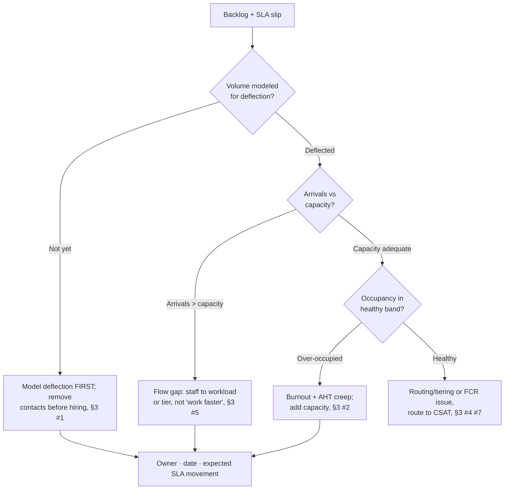
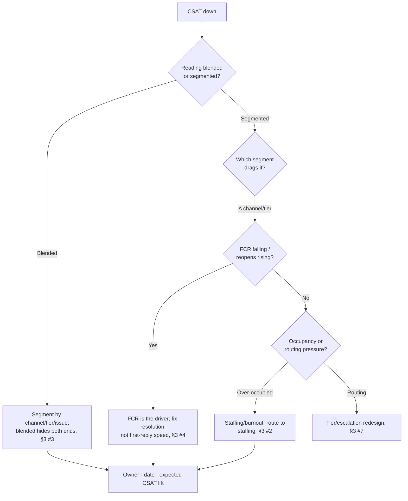

# Customer Support & CX Operations Decision Trees

> Mermaid decision trees for the three most common triage paths. Traverse top-to-bottom and pick the smaller-blast-radius leaf — don't keyword-match the symptom to a method. Each tree encodes the team's house opinions (CLAUDE.md §3).

## Tree 1 — Queue backing up, SLAs slipping



## Tree 2 — How many agents do we need?

```mermaid
flowchart TD
    A[Staffing question] --> B{Using a fixed<br/>agent:ticket ratio?}
    B -- "Yes" --> B1[Wrong model: ratio ignores AHT<br/>and occupancy, §3 #2]
    B -- "Workload-based" --> C{Forecast volume<br/>+ AHT known?}
    C -- "No" --> C1[Forecast arrivals and measure<br/>AHT by channel first, §3 #2]
    C -- "Yes" --> D{Target occupancy<br/>set?}
    D -- "No / 100%" --> D1[Set a healthy band; 100% =<br/>burnout + AHT creep, §3 #2]
    D -- "Healthy band" --> D2[Agents = workload ÷<br/>(interval × occupancy), §3 #2]
    B1 --> E[Owner · date · staffing plan]
    C1 --> E
    D2 --> E
```

## Tree 3 — Why is CSAT dropping?



## How to read these

- **Decompose before you act** — the first node of each tree is usually a STOP that prevents acting on an aggregate you haven't yet split.
- **Fix the constraint before adding volume** — more input into a leaking process wastes resource.
- Every leaf ends in the §6 Output Contract: owner · date · expected metric movement.
