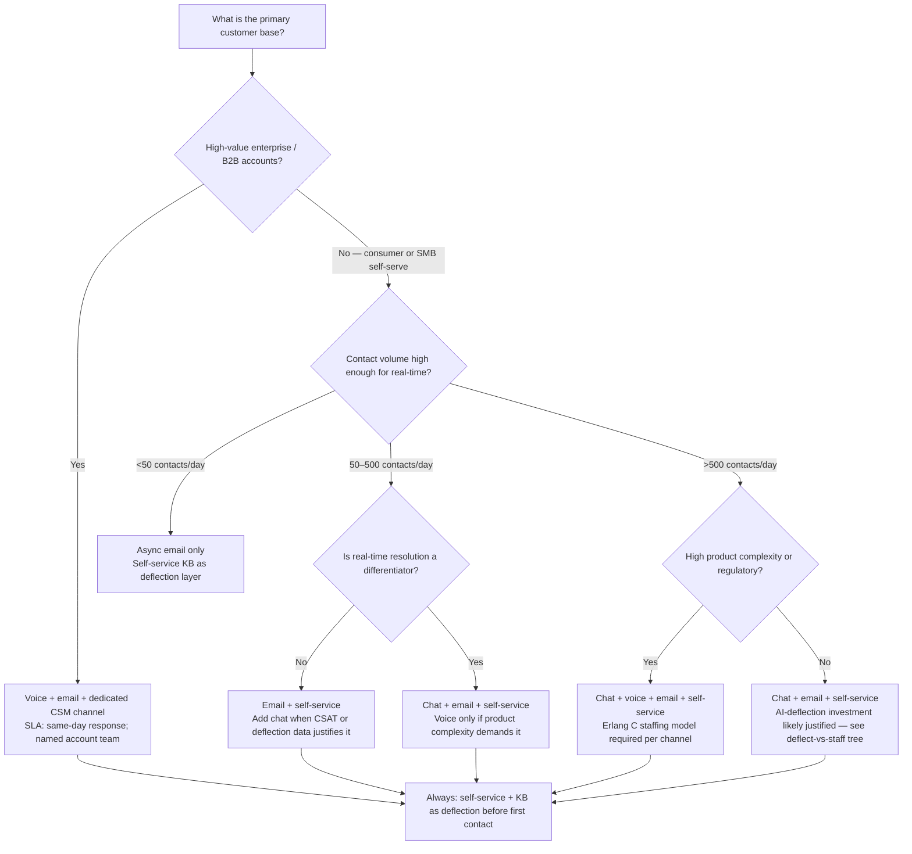
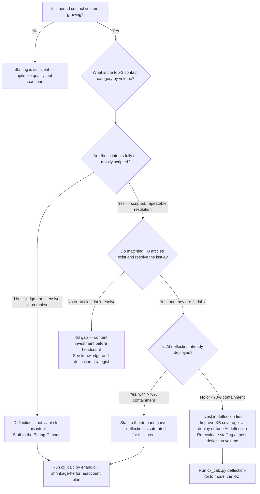
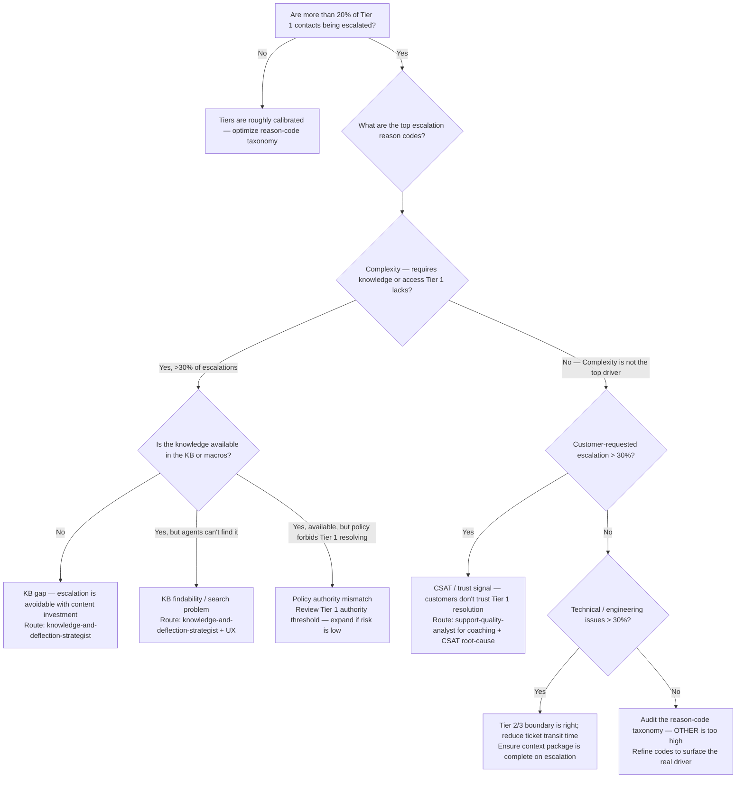

# CX Operations — Decision Trees + 2026 Capability Map

> Canonical knowledge bank for `customer-support-cx-operations`. **Traverse the relevant Mermaid
> tree top-to-bottom before choosing** — the proactive complement to the Capability Grounding
> Protocol. Volatile product/version/pricing facts carry a retrieval date and a re-verify-at-use
> rider.

---

## Decision Tree: Channel strategy (which channels to run)

**Leaf rule:** start with the channel that matches your customer's preference and your support
complexity, not the one with the best vendor demo. Every synchronous channel (chat, voice) requires
an Erlang C staffing model — publishing an SLA without one is a commitment without a basis. Add
channels when ticket data (not intuition) justifies the cost.

---

## Decision Tree: Deflect-vs-staff (should we hire or deflect?)

**Leaf rule:** deflection is almost always cheaper per-contact than a full-time agent. Always
model the deflection ROI (`scripts/cx_calc.py deflection-roi`) before recommending net-new headcount
for a scripted, high-volume intent category. Deflection that doesn't resolve the contact is not
deflection — it is a re-queued contact with a worse customer experience.

---

## Decision Tree: Escalation tier design

**Leaf rule:** an escalation rate above 20% of Tier 1 contacts is a signal, not a fact of life.
Diagnose via reason codes first. The most common fixable cause is a KB or authority gap that
can be resolved with content or policy change — not headcount.

---

## 2026 Capability Map — CX platform landscape (dated, re-verify at use)

_Retrieved 2026-06-08. Product positioning, pricing tiers, and AI feature sets are volatile —
re-confirm at use; this is orientation, not a procurement recommendation._

| Category | Platform | Strengths | Typical fit | Notes [verify-at-use] |
| --- | --- | --- | --- | --- |
| **Helpdesk / ticketing** | **Zendesk** | Largest marketplace ecosystem; mature reporting; multi-channel | Mid-market to enterprise; >10 agents; complex workflows | Strong AI features (Zendesk AI / Fin integration); pricing scales with seats [verify-at-use] |
| **Helpdesk / ticketing** | **Freshdesk** | Cost-competitive; fast setup; solid mid-market feature set | SMB to mid-market; cost-sensitive | Freshworks ecosystem (CRM, ITSM) if already embedded [verify-at-use] |
| **Helpdesk / CRM** | **Salesforce Service Cloud** | Deep CRM integration; enterprise workflows; AI (Einstein) | Enterprise with Salesforce CRM investment | High implementation cost; best ROI when SF is already the system of record [verify-at-use] |
| **Messaging-first** | **Intercom** | In-product messaging; strong product-led growth fit; AI-first (Fin bot) | PLG SaaS; high self-serve volume; in-app support | Intercom Fin is a leading AI deflection tool [verify-at-use] |
| **People-centric / omnichannel** | **Gladly** | Customer-centric (no ticket numbers); true omnichannel threading | Mid-market retail, direct-to-consumer, high-repeat-contact brands | Differentiated UX; smaller ecosystem than Zendesk [verify-at-use] |
| **AI deflection / bots** | **Intercom Fin** | GPT-powered; resolves without training data; Intercom-native | Teams already on Intercom; high FAQ/scripted contact volume | Containment rates vary by KB quality [verify-at-use] |
| **AI deflection / bots** | **Zendesk AI (Answer Bot + Agent Copilot)** | Zendesk-native; no separate integration | Teams already on Zendesk | Copilot (agent assist) vs Answer Bot (deflection) are distinct products [verify-at-use] |
| **AI deflection / bots** | **Ada, Forethought, Kustomer AI** | Independent of helpdesk; integrate via API | Teams wanting platform-neutral AI deflection | Market consolidating rapidly — verify current vendor landscape [verify-at-use] |
| **WFM / scheduling** | **NICE WFM, Verint, Assembled, Playvox** | Erlang-based scheduling; real-time adherence; forecasting | Mid-to-large contact centers (>20 agents) needing automated WFM | Assembled and Playvox are newer/SMB-friendly [verify-at-use] |
| **QA / conversation review** | **MaestroQA, Klaus (Zendesk), Playvox QA** | Automated QA sampling; scorecard management; coaching workflows | Teams with >10 agents needing systematic QA | Auto-QA uses AI to score; verify accuracy claims [verify-at-use] |
| **CSAT / survey** | **Delighted, SurveyMonkey CX, Nicereply, CSAT.ai** | Multi-channel survey dispatch; verbatim analysis; NPS tracking | Any team size; integrate via helpdesk API | Most helpdesks have native CSAT; use standalone for CES or advanced verbatim analytics [verify-at-use] |

> Provenance: CX analyst coverage (Forrester, Gartner Magic Quadrant for CRM Customer Engagement),
> vendor websites, and the G2 enterprise-support-software category, retrieved 2026-06-08.
> Market positioning and AI feature sets change rapidly — re-verify at use. No invented products.

---

## See also

- [`../CLAUDE.md`](../CLAUDE.md) — team constitution and seams.
- [`../best-practices/README.md`](../best-practices/README.md) — the named, citable rules.
- [`../scripts/cx_calc.py`](../scripts/cx_calc.py) — Erlang C, deflection ROI, CSAT/CES, shrinkage FTE.
- Neighbour decision trees: `data-platform`, `customer-success-analytics`, `claude-app-engineering`.

_Last reviewed: 2026-06-08 by `claude`._
