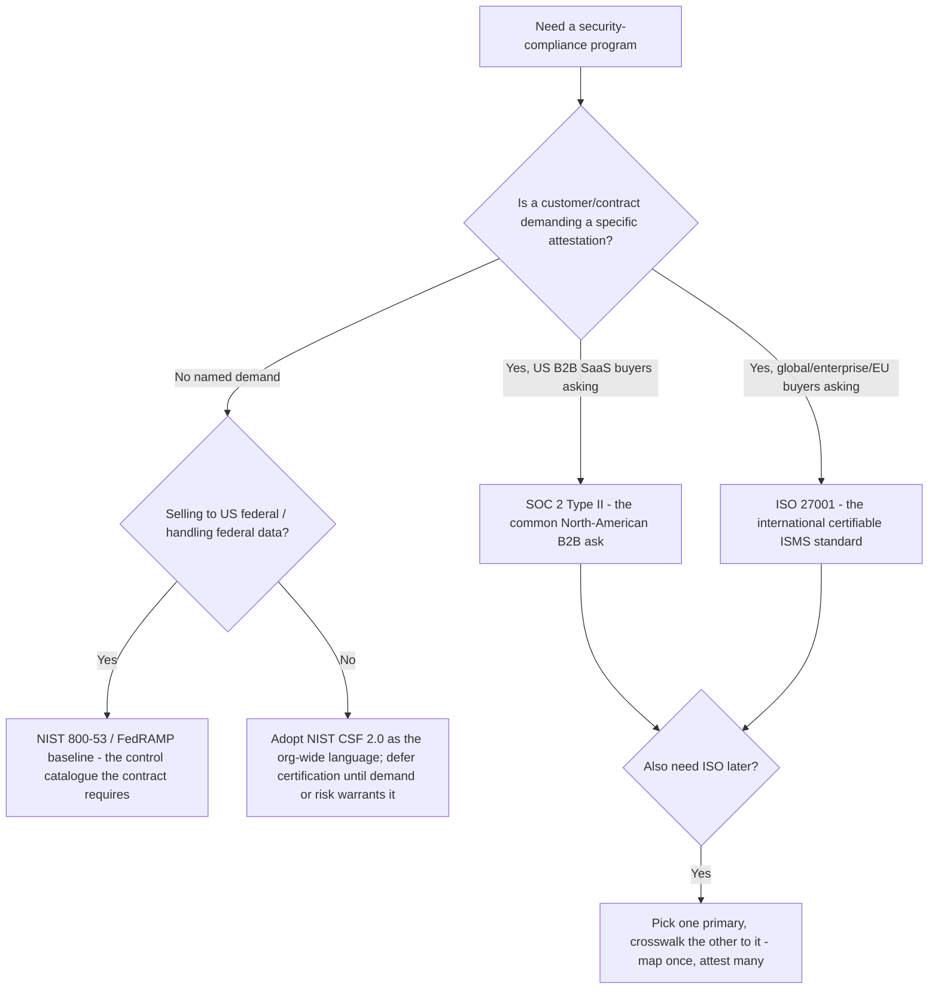
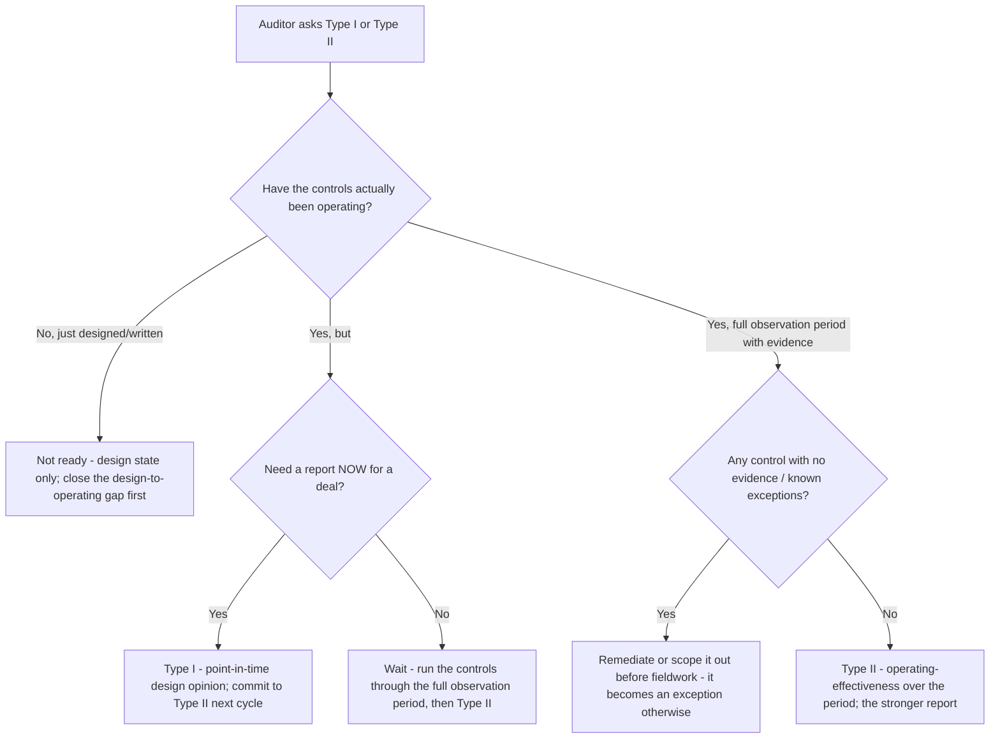

# Cybersecurity GRC — Decision Trees

_Decision trees + a dated framework/reference map. Framework rows are `[verify-at-build]` — re-check the current edition of each framework before quoting control text or counts to a consumer. Last reviewed: 2026-06-08._

Traverse before choosing a framework, committing to a report type, or assessing a vendor.

## Decision Tree: Which framework do we pursue first?

Right-size the framework to the org's size, risk, and who's actually asking — not to ambition.

_Don't cargo-cult a heavyweight framework. SOC 2 for B2B SaaS, ISO 27001 for global/enterprise, NIST CSF as the language, full 800-53 only when the contract/risk demands it._

## Decision Tree: Type I vs Type II (am I ready to be audited)?

A report is only as good as the evidence window behind it.

_Type I is a point-in-time design opinion; Type II proves the controls operated across a period. Don't chase the report date past the evidence window._

## Capability / framework map (2026, `[verify-at-build]`)

| Item | What it is | Notes |
|---|---|---|
| SOC 2 (AICPA) | Attestation against the Trust Services Criteria (Security + optional Availability, Confidentiality, Processing Integrity, Privacy) | Type I = design at a point in time; Type II = operating effectiveness over a period `[verify-at-build]` |
| ISO/IEC 27001 | Certifiable ISMS standard; controls in Annex A | Annex A control count/structure changed in the 2022 revision — confirm the current edition `[verify-at-build]` |
| NIST CSF 2.0 | Risk-management framework; Functions: Govern, Identify, Protect, Detect, Respond, Recover | CSF 2.0 added the Govern function — verify the current function set `[verify-at-build]` |
| NIST SP 800-53 | Control catalogue (control families, baselines low/moderate/high) | Heavyweight; right-size — full catalogue rarely fits a small SaaS `[verify-at-build]` |
| Crosswalk | One primary framework, others mapped to it | NIST publishes informative references / mappings; a control evidenced once can attest many `[verify-at-build]` |
| Statement of Applicability (SoA) | ISO 27001 artifact: which controls apply + justification + status | Every exclusion needs an auditor-defensible reason traced to the risk register `[verify-at-build]` |
| Risk register | Assets, threats, likelihood × impact, treatment, residual risk | Risk drives controls; ISO 27005 / NIST 800-30 are common methodologies `[verify-at-build]` |
| SIG (Shared Assessments) | Standardized vendor-risk questionnaire (full + SIG-Lite/Core) | Use depth proportional to the vendor's tier `[verify-at-build]` |
| CAIQ (CSA) | Cloud-vendor assessment questionnaire mapped to the Cloud Controls Matrix | For cloud/SaaS vendors; pairs with the vendor's SOC 2/ISO `[verify-at-build]` |
| Vendor SOC 2 reliance | Read scope, period, exceptions, qualified opinions, and the CUECs you must run | A clean opinion with exceptions in your critical area is not assurance `[verify-at-build]` |

_Treatment options for a risk: mitigate (add/strengthen a control), accept (document + own the residual), transfer (insurance/contract), avoid (stop the activity). Likelihood × impact scoring drives prioritization. Re-verify any framework edition, control count, or questionnaire version before quoting it to a consumer._
