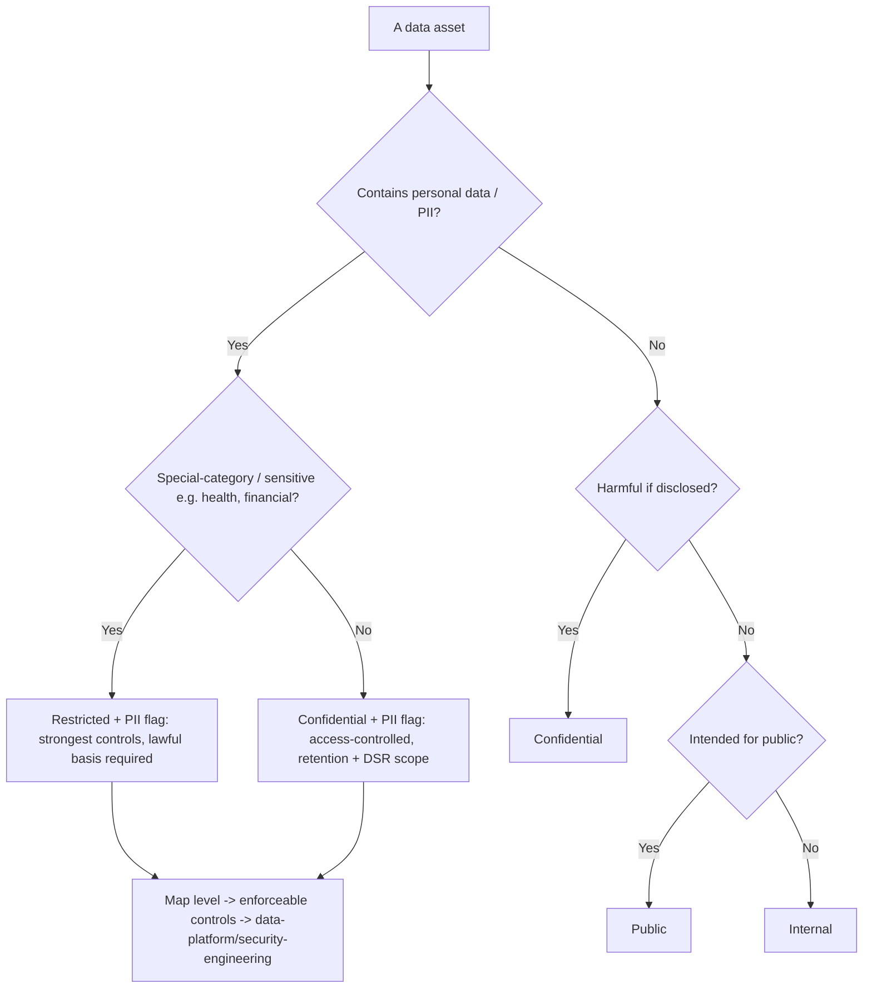
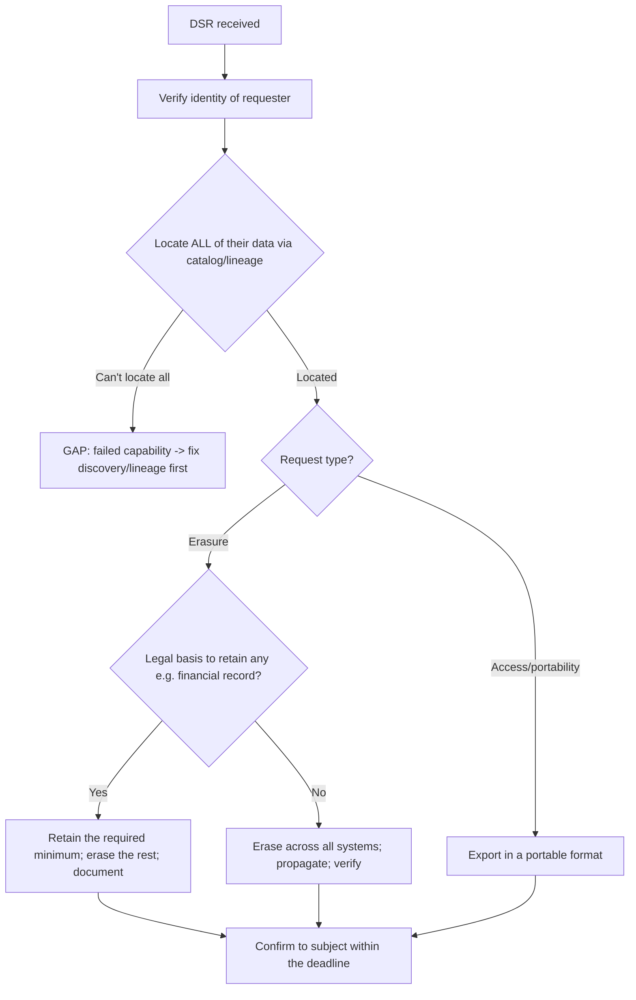

# Data Governance & Privacy — Decision Trees

_Decision trees + a dated capability map. Capability rows are `[verify-at-build]` — re-check against the vendor before quoting. Last reviewed: 2026-06-04._

Traverse before classifying data or handling a data-subject request. This is governance engineering, not legal advice.

## Decision Tree: Classify this data

Classify by sensitivity and personal-data status; the level drives the controls.

_Classification precedes control; discovery (catalog) precedes classification._

## Decision Tree: Handle a data-subject request

A DSR is an engineered pipeline that depends on knowing where the data is.

_Legal interpretation of basis/retention obligations routes to legal / regulatory-compliance._

## Capability map (dated — verify at build)

| Capability | 2026 state `[verify-at-build]` | Notes |
|---|---|---|
| GDPR | in force | DSR deadlines, lawful basis, minimization |
| CCPA/CPRA | in force | access/delete/opt-out; verify current |
| Data catalogs (OpenMetadata/DataHub/managed) | GA | discovery + lineage + glossary |
| PII discovery/classification | GA (tools + cloud-native) | column-level tagging |
| Pseudonymization vs anonymization | legal distinction | pseudonymized = still personal data |
| Microsoft Purview | GA | Fabric/M365 governance -> microsoft-fabric |
