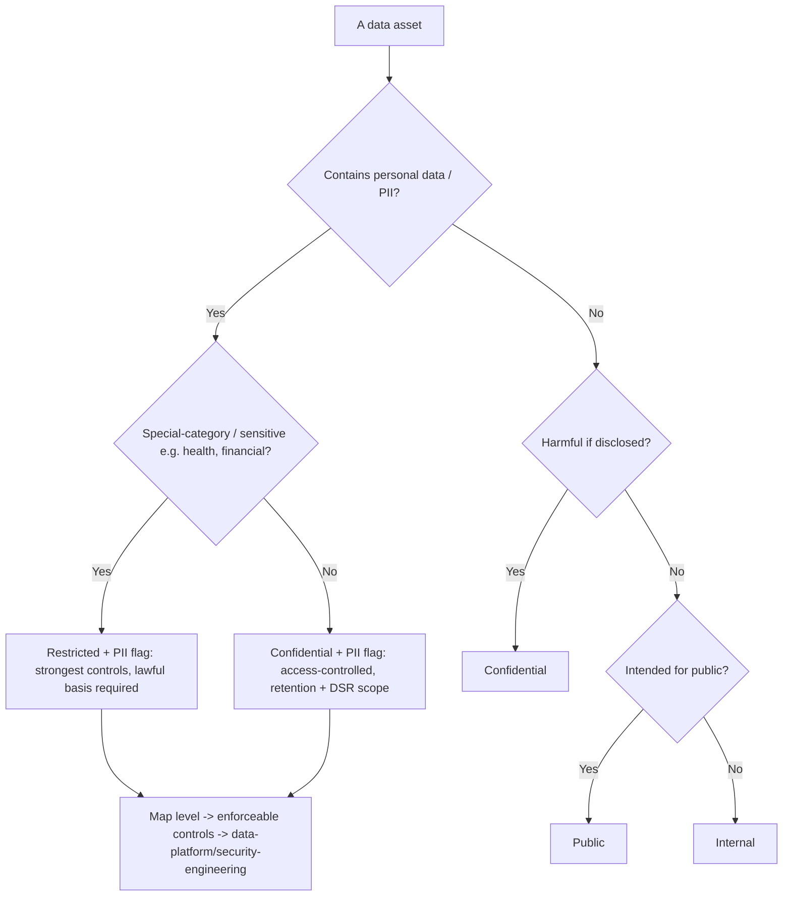
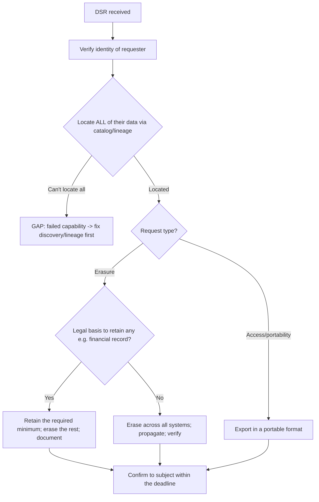
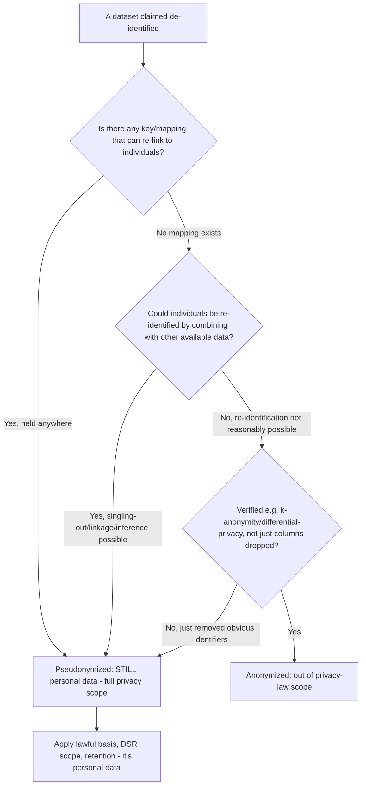
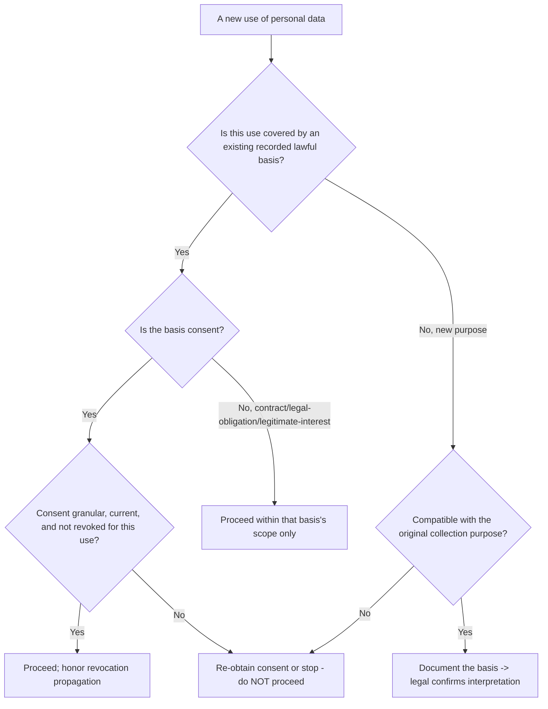
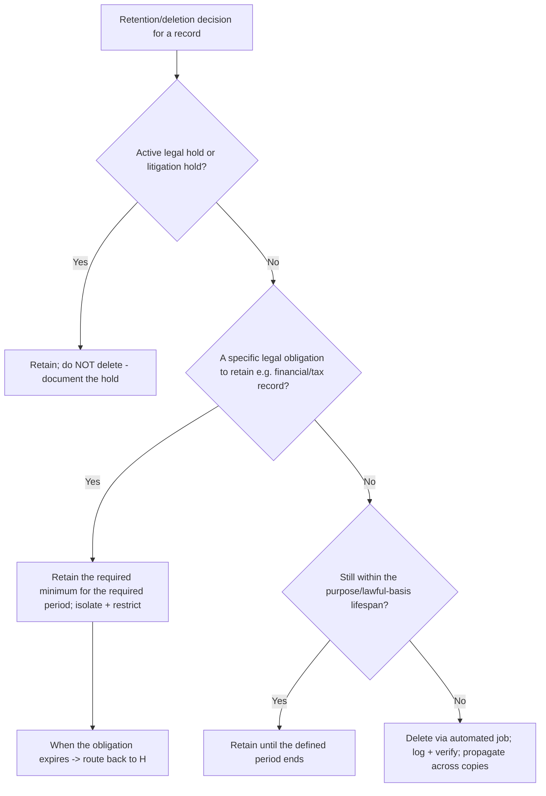
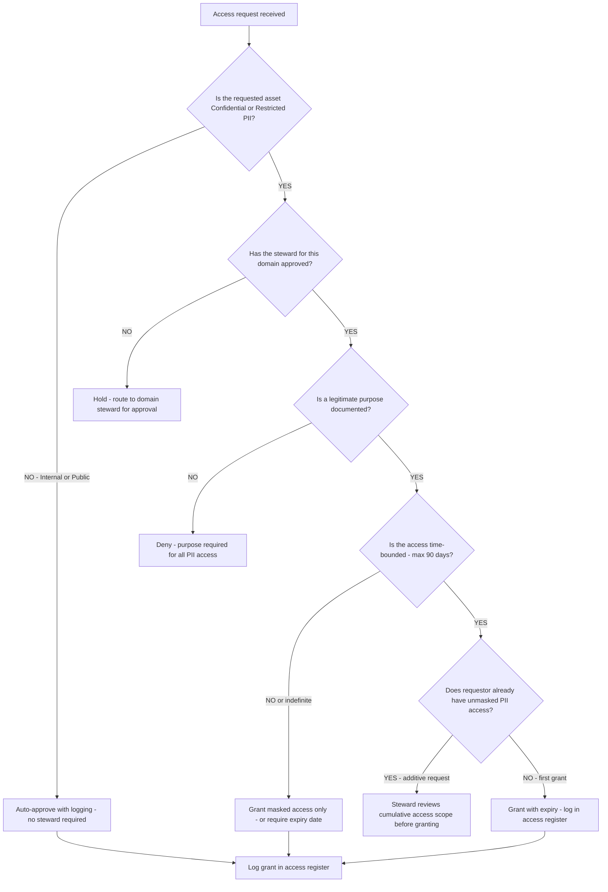
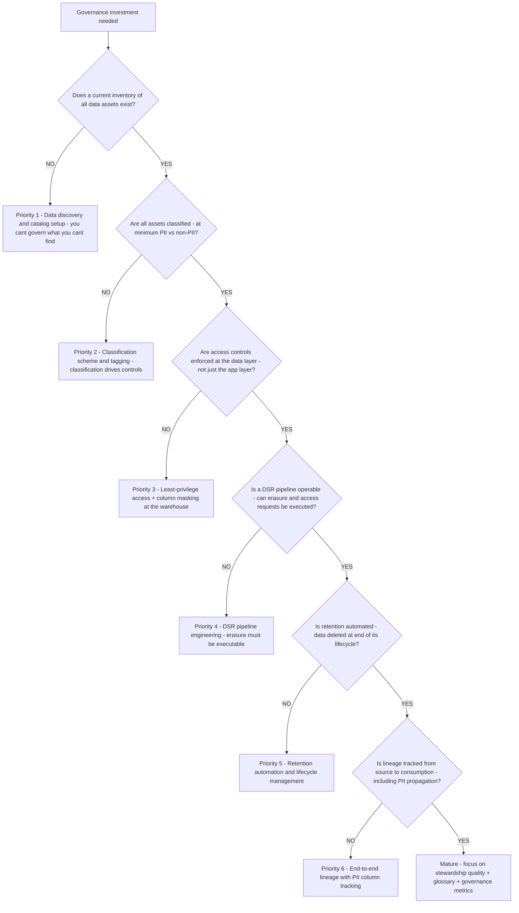
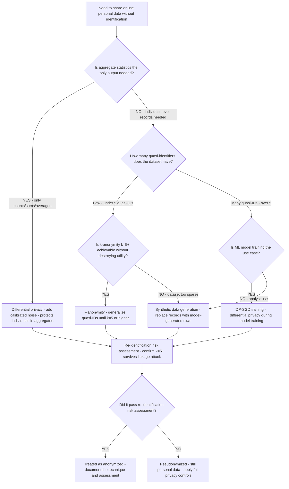

# Data Governance & Privacy — Decision Trees

_Decision trees + a dated capability map. Capability rows are `[verify-at-build]` — re-check against the vendor before quoting. Last reviewed: 2026-06-04._

Traverse before classifying data or handling a data-subject request. This is governance engineering, not legal advice.

## Decision Tree: Classify this data

Classify by sensitivity and personal-data status; the level drives the controls.

_Classification precedes control; discovery (catalog) precedes classification._

## Decision Tree: Handle a data-subject request

A DSR is an engineered pipeline that depends on knowing where the data is.

_Legal interpretation of basis/retention obligations routes to legal / regulatory-compliance._

## Decision Tree: Is this anonymized or pseudonymized?

Most 'anonymized' data isn't; the distinction decides whether privacy law still applies.

_Dropping the name column is not anonymization. Re-identifiability via linkage/inference keeps it personal data; legal interpretation routes to legal._

## Decision Tree: What's the lawful basis for this use?

Every personal-data use needs a recorded basis before it happens; 'we already had it' is not one.

_Processing beyond the basis it was collected under is a violation. Engineer the basis/consent store; the legal interpretation routes to legal/regulatory-compliance._

## Decision Tree: Can this data be deleted now?

Retention is per-category and automated; a legal hold or retention obligation overrides deletion.

_Indefinite retention is unbounded risk. Carve out only what's legally required, isolate it, and let the automated job delete the rest — verified, not hoped._

## Decision Tree: Access request — approve, restrict, or deny?

**When this applies:** a data access request arrives for a Confidential or Restricted data asset. Observable inputs: the requestor's role and stated purpose, the classification of the requested asset, whether a steward has approved, and whether the request is time-bounded.

**Last verified:** 2026-06-05 against ISO 27001 A.9.2 access management guidelines and GDPR Article 5(1)(f).

**Rationale per leaf:**
- *AUTO* — Internal/Public assets have no PII sensitivity; auto-approval reduces friction for non-sensitive data without undermining governance.
- *PENDING* — steward approval is the accountability mechanism; no PII access without a named approver on record.
- *DENY* — "I just want to look at it" is not a purpose; every PII access grant requires a documented business use case.
- *RESTRICT* — an indefinite grant is an unmanaged grant; masked access is the fallback when the requestor won't accept a time boundary.
- *REVIEW* — cumulative access (a user who has three separate active grants) may add up to a broader scope than any single grant intended; steward reviews the aggregate.
- *GRANT* — time-bounded, purpose-documented, steward-approved grants are the governed baseline.

**Tradeoffs summary:**

| Grant type | Steward needed | Expiry required | Audit trail | Use when |
|---|---|---|---|---|
| Internal / Public auto-approve | No | No | Yes (log) | Non-sensitive assets |
| Masked Confidential+PII | Yes | Yes | Yes | Analysis needing behavioral data not raw PII |
| Unmasked Restricted+PII | Yes | Yes | Yes | Production data handling, DSR execution |
| Service account (BI tool) | Yes (provisioning) | No (permanent) | Yes | Operational connections — reviewed annually |

---

## Decision Tree: Governance maturity — where should we invest next?

**When this applies:** an organization is starting or advancing a governance program and must choose the next investment. Observable inputs: whether a discovery/catalog exists, whether classification is in place, whether access controls are enforced, and whether the DSR pipeline is operable.

**Last verified:** 2026-06-05 against DAMA-DMBOK data management maturity model.

**Rationale per leaf:**
- *DISCOVER* — no governance investment matters without an inventory; policy on un-inventoried data is theater.
- *CLASSIFY* — classification is the key that maps to controls; without it, every access and retention decision is manual guesswork.
- *ACCESS* — controls at the app layer can be bypassed via direct DB access; the warehouse is the enforcement layer.
- *DSR* — regulatory deadlines (GDPR 30 days, CCPA 45 days) make DSR operability non-optional for any organization handling EU/CA residents' data.
- *RETAIN* — indefinite retention of PII is unbounded risk; automated deletion is cheaper than a manual audit of every record.
- *LINEAGE* — lineage is the prerequisite for complete DSR execution and impact analysis on schema changes.
- *MATURE* — a mature program's marginal value shifts from building capabilities to improving stewardship quality and governance metrics.

**Tradeoffs summary:**

| Stage | Compliance risk before | Compliance risk after | Effort | Quick win |
|---|---|---|---|---|
| Discovery + catalog | Blind to what exists | Aware | Medium | Column-name PII heuristic scan |
| Classification | Policy not applicable | Policy applicable | Low | Tier the highest-risk domain first |
| Access controls | Any analyst can see PII | PII role-gated | Medium | Column masking on one table |
| DSR pipeline | Regulatory exposure | DSR-compliant | High | Manual DSR runbook as interim |
| Retention automation | Unbounded PII accumulation | Lifecycle-managed | Medium | One automated deletion job per domain |
| Lineage | Incomplete DSR | Complete DSR | High | dbt lineage → OpenMetadata integration |

---

## Decision Tree: Anonymization technique — which method for this use case?

**When this applies:** personal data must be shared, published, or used for analytics/ML where the recipient/model should not be able to re-identify individuals. Observable inputs: dataset size (n), the number of quasi-identifiers, the required analytical utility, and whether an adversarial re-identification attack is a realistic threat.

**Last verified:** 2026-06-05 against ICO Anonymisation guidance (UK) and GDPR Recital 26.

**Rationale per leaf:**
- *DP* — aggregate statistics (counts, histograms, averages) can be shared with mathematically-proven privacy via calibrated Laplace or Gaussian noise; the individual-level records are never exposed.
- *KANON* — k-anonymity (every record is indistinguishable from at least k-1 others on all quasi-identifiers) is the practical standard for small-quasi-ID datasets; k=5 is the typical floor.
- *SYNTH* — when k-anonymity destroys too much utility (sparse dataset + many quasi-IDs), synthetic data preserves statistical properties without linking to real individuals.
- *DP_TRAIN* — ML model training on individual records is the highest re-identification risk; DP-SGD (differentially private stochastic gradient descent) trains the model without memorizing individual records.
- *VERIFY* — every technique must be followed by a re-identification risk assessment; the technique choice is not a guarantee, the assessment is.
- *PSEUDO* — if the re-identification risk assessment fails, the data remains pseudonymized (not anonymized) and full privacy controls apply.

**Tradeoffs summary:**

| Technique | Analytical utility | Re-ID protection strength | Complexity | Use when |
|---|---|---|---|---|
| Differential privacy (aggregates) | Low - noise | High (mathematically proven) | Medium | Aggregate statistics only |
| k-anonymity (k=5+) | Medium | Medium (linkage attacks exist) | Low | Individual records - few quasi-IDs |
| Synthetic data | High (distribution preserved) | High (no real records) | High | Individual records - many quasi-IDs |
| DP-SGD training | n/a (model weights) | High | High | ML model training on PII |

---

## Capability map (dated — verify at build)

| Capability | 2026 state `[verify-at-build]` | Notes |
|---|---|---|
| GDPR | in force | DSR deadlines, lawful basis, minimization |
| CCPA/CPRA | in force | access/delete/opt-out; verify current |
| Data catalogs (OpenMetadata/DataHub/managed) | GA | discovery + lineage + glossary |
| PII discovery/classification | GA (tools + cloud-native) | column-level tagging |
| Pseudonymization vs anonymization | legal distinction | pseudonymized = still personal data |
| Microsoft Purview | GA | Fabric/M365 governance -> microsoft-fabric |
