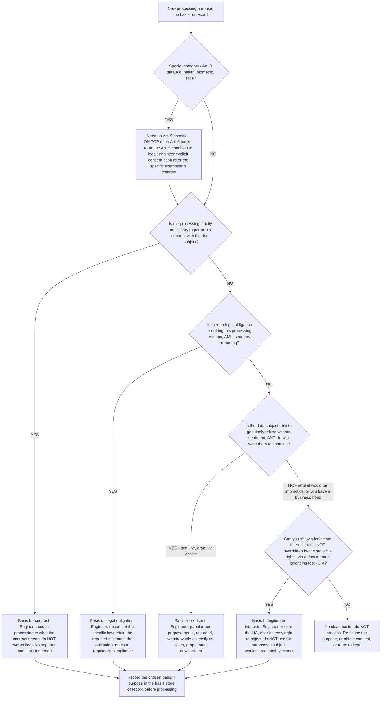

# Lawful-basis selection decision tree (GDPR Article 6)

**Last reviewed:** 2026-06-05 · **Confidence:** medium (grounded in the GDPR statutory text + ICO lawful-basis guidance, web-verified this date). The bases themselves are statutory and stable; their *application* to a given processing activity is a legal interpretation that varies by jurisdiction and fact pattern — every leaf routes the interpretation to legal / `regulatory-compliance`. This is **governance engineering, not legal advice** (CLAUDE.md §2 #6).

> Canonical decision tree for the [`privacy-compliance-engineer`](../agents/privacy-compliance-engineer.md). Traverse top-to-bottom **before** processing personal data for a new purpose. It complements — does not replace — the **"What's the lawful basis for this use?"** tree in [`data-governance-privacy-decision-trees.md`](data-governance-privacy-decision-trees.md): that tree answers *"is an existing basis already on record for this use?"*; this one answers *"if we need to pick a basis, which of the six is the right shape, and what must we engineer to stand it up?"*

---

## When this applies

You are about to process personal data for a purpose with **no recorded lawful basis yet** (a new feature, a new analytics use, a new vendor integration, an ML training set). Under GDPR Art. 6 every processing of personal data needs **one** of six lawful bases, chosen *before* processing and **recorded**. Picking the basis is not a formality — it determines the data subject's rights (e.g. the right to erasure and to object behave differently across bases) and what you must build to honor it.

## The six bases (GDPR Art. 6(1))

`(a)` consent · `(b)` contract performance · `(c)` legal obligation · `(d)` vital interests · `(e)` public task · `(f)` legitimate interests. Special-category data (Art. 9 — health, biometrics, etc.) needs an **additional** Art. 9 condition on top of the Art. 6 basis — that path is flagged below and routes to legal.

## The tree

_(Bases `(d)` vital interests and `(e)` public task are real but narrow — vital interests is life-or-death emergencies; public task is for official-authority/public-interest functions. If your purpose fits one of those, it short-circuits the tree; both still route the interpretation to legal.)_

## Rationale per leaf

- **Art. 9 / special-category data** — the highest-risk path: you need a *second* legal condition beyond the Art. 6 basis, and most of those conditions are narrow (explicit consent, employment law, substantial public interest, etc.). Don't guess the condition — route it to legal and engineer the controls (explicit-consent capture or the exemption's guardrails) once legal confirms.
- **Contract (b)** — clean and common: if the processing is genuinely *necessary to deliver what the user signed up for*, contract is the basis and you don't bolt a consent checkbox onto it. The trap is using "contract" to cover processing the contract doesn't actually require (e.g. marketing) — that's over-reach; use consent or legitimate interest for those.
- **Legal obligation (c)** — when a law *compels* the processing (tax records, AML/KYC, statutory reporting). Document the specific obligation; the financial-regulatory specifics route to `regulatory-compliance` (§3).
- **Consent (a)** — the right basis when the subject can genuinely refuse and you want them in control. It is also the **most expensive to engineer correctly**: granular per-purpose, recorded, and **withdrawable as easily as it was given**, with withdrawal propagated to every downstream copy (see the consent-purpose-limitation-drift scenario). A pre-ticked box or a take-it-or-leave-it bundle is not valid consent.
- **Legitimate interests (f)** — the most flexible but requires a documented **balancing test (LIA)** showing your interest isn't overridden by the subject's rights and freedoms, and you must offer an easy **right to object**. Don't use it for processing a person wouldn't reasonably expect — that's where it fails.
- **No clean basis → stop** — if none fit, the honest answer is "don't process this": re-scope the purpose to something a basis covers, switch to a consent flow, or escalate. Manufacturing a basis to keep the project moving is the violation.

## What you engineer per basis (the governance deliverable)

| Basis | What the team builds | Subject-rights consequence |
|---|---|---|
| Consent (a) | Granular per-purpose opt-in store, withdrawal flow, **downstream revocation propagation** | Right to erasure + withdraw apply strongly; data must stop on withdrawal |
| Contract (b) | Purpose scoped to contractual necessity; minimize collection | Erasure limited while contract is live |
| Legal obligation (c) | Documented law reference; retain required minimum, isolate it | Erasure overridden by the obligation (carve-out, not deletion) |
| Legitimate interests (f) | Recorded LIA + easy right-to-object handling | Right to object applies; honor it |

## Gotchas

- **"We already have the data" is never a basis** — a new purpose needs its own basis, even on data you collected lawfully for something else (purpose limitation, Art. 5(1)(b)).
- **Consent is not the default / safest pick** — it's the *most operationally demanding* (withdrawal must work). Don't reach for consent when contract or a documented legitimate interest is the honest fit.
- **Special-category data is a different game** — Art. 9 condition required *on top of* Art. 6; never treat health/biometric data as a normal Art. 6 decision.
- **The basis is recorded *before* processing, not reconstructed after** — a basis decided retroactively to justify processing already underway is a finding, not a defense.

## Escalation & guardrails

- The *interpretation* of whether a basis applies, the Art. 9 condition, the LIA conclusion, and any sector-specific obligation → legal / [`regulatory-compliance`](../CLAUDE.md) (§3). This team engineers the basis/consent store and the enforcement; it does not opine on the legal sufficiency.
- Every regulatory fact in a deliverable carries a source + retrieval date or an `[unverified — training knowledge]` mark; privacy law varies by jurisdiction (CLAUDE.md §2).

## Sources (retrieved 2026-06-05)

- GDPR Art. 6 (lawfulness of processing) — https://gdpr-info.eu/art-6-gdpr/
- GDPR Art. 9 (special categories) — https://gdpr-info.eu/art-9-gdpr/
- ICO — *Lawful basis for processing* guidance — https://ico.org.uk/for-organisations/uk-gdpr-guidance-and-resources/lawful-basis/a-guide-to-lawful-basis/

GDPR basis selection is jurisdiction-specific and fact-dependent; the statute is stable but its application is a legal interpretation — `[verify-at-use]` and route the interpretation to legal before any deliverable.
