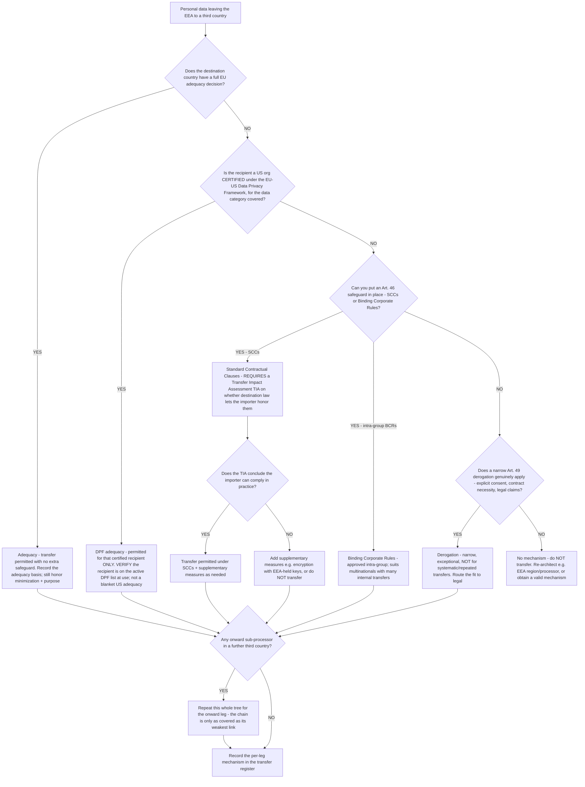

# Cross-border transfer-mechanism decision tree (GDPR Chapter V)

**Last reviewed:** 2026-06-05 · **Confidence:** medium (grounded in GDPR Chapter V + EU Commission / EDPB guidance, web-verified this date). **Adequacy decisions and EU-US Data Privacy Framework status are politically volatile** — every status row carries `[verify-at-use]` and must be re-checked against the current EU Commission adequacy list and the recipient's live certification before any deliverable. This is **governance engineering, not legal advice** (CLAUDE.md §2 #6); the interpretation of any mechanism's sufficiency routes to legal / `regulatory-compliance`.

> Canonical decision tree for the [`privacy-compliance-engineer`](../agents/privacy-compliance-engineer.md) with input from the [`data-catalog-lineage-engineer`](../agents/data-catalog-lineage-engineer.md) (the data map the transfer register is built from). Traverse **per transfer leg** — including each onward sub-processor — before personal data leaves the EEA. Complements the cross-border-transfer-gap scenario ([`../scenarios/2026-06-05-cross-border-transfer-gap.md`](../scenarios/2026-06-05-cross-border-transfer-gap.md)).

---

## When this applies

Personal data subject to the GDPR is about to leave the EEA — to a vendor, a cloud region, a support tool, an analytics processor, or any recipient in a third country. GDPR Chapter V (Arts. 44–49) requires a **transfer mechanism** for each such transfer. The load-bearing rule that teams miss: **the mechanism is per transfer *leg*, and the sub-processor chain is part of it** — a covered direct transfer to a vendor that onward-transfers to an uncovered fourth country is still a gap.

## The tree

## Rationale per leaf

- **Adequacy** — if the EU Commission has decided the destination ensures essentially-equivalent protection, no extra transfer safeguard is needed (you still owe minimization, purpose limitation, and the rest). The adequacy list changes — verify the country is currently on it.
- **DPF (EU-US Data Privacy Framework)** — the DPF adequacy decision (adopted **10 July 2023**) covers **only US organizations that are *certified* under it**, and only for the data categories their certification covers. It is **not** a general US adequacy finding — a transfer to a *non-certified* US recipient still needs SCCs or another Art. 46 safeguard. The DPF survived an EU General Court annulment challenge (dismissed **3 Sept 2025**) but remains politically contested; treat its durability as `[verify-at-use]` and always check the recipient is on the **active certification list**.
- **SCCs** — the workhorse Art. 46 safeguard, but **not a signature-and-done**: post-*Schrems II* the exporter must run a **Transfer Impact Assessment** on whether the destination's surveillance/legal regime actually lets the importer comply, and add **supplementary measures** (e.g. strong encryption with keys held in the EEA) where it doesn't.
- **BCRs** — approved Binding Corporate Rules suit multinationals moving data **intra-group** across many borders; heavyweight to stand up, efficient once approved.
- **Derogations (Art. 49)** — narrow exceptions (explicit informed consent, necessity for a contract, establishment/defense of legal claims). They are for **occasional, non-systematic** transfers; using a derogation to cover a routine production data flow is misuse — route the fit to legal.
- **No mechanism → don't transfer** — the honest answer is to **re-architect** (keep the processing in an EEA region, choose an EEA-based processor) or stop, not to transfer and paper it later.
- **Onward sub-processor chain** — the leg teams forget. A perfectly-covered transfer to Vendor A means nothing if Vendor A sub-processes to Country C with no basis. Walk the chain to its end and cover **every** leg.

## What you engineer (the governance deliverable)

A **transfer register** built off the data map ([`../templates/data-inventory.md`](../templates/data-inventory.md)): one row per transfer leg recording the data category, the recipient, **the recipient's onward sub-processors and their countries**, the **mechanism per leg**, and the **verification** (DPF-list check date / TIA reference / derogation rationale). The register turns "are we okay on transfers?" into a concrete per-leg worklist legal can sign off.

## Gotchas

- **"The US is adequate now" is wrong as stated** — only *DPF-certified* recipients are covered; verify certification per recipient.
- **SCCs without a TIA is an incomplete mechanism** post-*Schrems II* — the assessment is part of the safeguard, not optional paperwork.
- **The sub-processor chain is part of the transfer** — cover every leg, not just the direct vendor.
- **Adequacy and DPF status change** — a mechanism valid today can lapse; date every status and re-check at use.
- **A region choice can dissolve the problem** — keeping data in an EEA region / EEA processor means no Chapter V transfer at all; consider it before papering safeguards.

## Escalation & guardrails

- Which mechanism is *sufficient*, the TIA conclusion, derogation applicability → legal / [`regulatory-compliance`](../CLAUDE.md) (§3). This team builds the data map, the transfer register, and verifies certification/TIA existence — it does not opine on legal sufficiency.
- Every status/fact in a deliverable carries a source + retrieval date or an `[unverified — training knowledge]` mark; adequacy and DPF status are jurisdiction-specific and volatile (CLAUDE.md §2).

## Sources (retrieved 2026-06-05)

- GDPR Chapter V, Arts. 44–49 (transfers to third countries) — https://gdpr-info.eu/chapter-5/
- European Commission — EU-US Data Privacy Framework adequacy decision (10 Jul 2023) — https://ec.europa.eu/commission/presscorner/detail/en/ip_23_3721
- EDPB — EU-US Data Privacy Framework FAQ for businesses (v2.0, 2026) — https://www.edpb.europa.eu/our-work-tools/our-documents/other-guidance/eu-us-data-privacy-framework-faq-european-individuals-0_en
- EU General Court dismissal of the DPF annulment action (3 Sept 2025) — https://www.workforcebulletin.com/adequacy-of-the-eu-u-s-data-privacy-framework-survives-challenge

Adequacy decisions, DPF certification, and SCC/TIA requirements vary by jurisdiction and change — `[verify-at-use]` against current EU Commission / EDPB guidance and the recipient's live certification before any deliverable.
