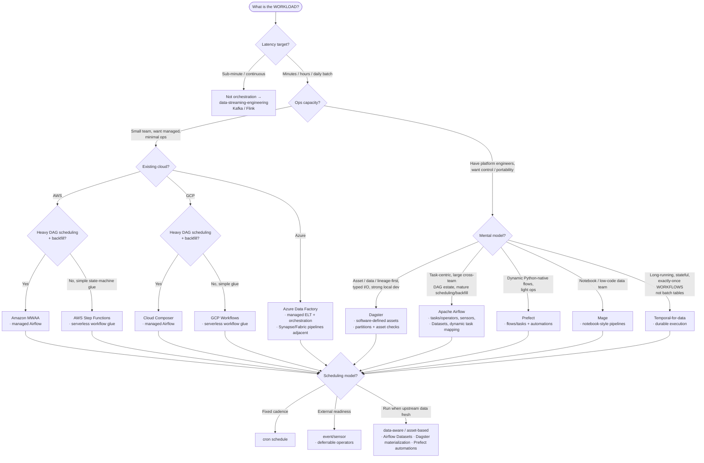

# Knowledge — Orchestrator selection decision tree

> **Last reviewed:** 2026-06-21 · **Confidence:** Medium-High (consensus on the OSS vs managed and asset-vs-task framing; **version/feature-parity claims are volatile — re-verify before a client commitment**).
> The most-asked orchestration question is "what should run our pipelines — Airflow, Dagster, Prefect, or a cloud-native service?". This is the decision tree the `orchestration-architect` traverses **before** naming an engine, plus the trade-off table and the seams to adjacent plugins.

The agent's discipline: **name the workload requirements first, name the engine second.** Sub-minute/continuous latency is not an orchestration problem — it leaves this layer for `data-streaming-engineering`.

---

## Decision Tree: choosing a data-pipeline orchestrator

Traverse top-to-bottom. Gate on **latency** first, then **mental model (asset vs task)**, then **ops capacity / managed-vs-OSS**, then **cloud lock-in**.

---

## Trade-off table

| Engine | Sweet spot | Watch out for |
|---|---|---|
| **Apache Airflow** | Large, cross-team DAG estates; mature scheduling, backfill, huge operator ecosystem | Heaviest ops if self-hosted; task-centric (lineage is bolt-on via Datasets); `catchup` default historically bites |
| **Dagster** | Asset/lineage-first work; typed I/O; local dev + asset checks; data-aware scheduling native | Newer ecosystem; asset mental model is a shift for task-centric teams |
| **Prefect** | Dynamic, Python-native flows; light ops; pythonic control flow | Less of a fixed "DAG estate" model; smaller operator library than Airflow |
| **Mage** | Notebook/low-code data teams wanting fast pipeline authoring | Smaller community; less suited to very large/complex estates |
| **Temporal-for-data** | Long-running, stateful, exactly-once *workflows* (durable execution) | Overkill / wrong tool for nightly batch table builds |
| **MWAA / Cloud Composer** | Want Airflow without operating it; already on AWS/GCP | Managed-version lag + cloud lock-in; still Airflow's task model |
| **Azure Data Factory** | Azure-native ELT + orchestration, low-code | Azure lock-in; less code-first than OSS engines |
| **Step Functions / GCP Workflows** | Serverless state-machine glue, light dependency needs | Not a full DAG scheduler; weak backfill/catchup story; cloud lock-in |

> **Volatile:** feature parity of managed Airflow (MWAA/Composer) vs upstream, pricing, and per-engine version capabilities change frequently. Treat the rows above as a 2026-06 snapshot and re-verify with `ravenclaude-core/deep-researcher` before a client commitment.

---

## Executor / runtime sub-choice (after the engine)

- **Local** — small workloads, dev.
- **Celery** — horizontal worker scale.
- **Kubernetes** (e.g. Airflow KubernetesExecutor / Dagster K8s) — per-task isolation, bursty/elastic.
- **Serverless / managed** — minimal ops; pay-per-run.

State where the **scheduler** and **metadata DB** live; they are the reliability core.

---

## Seams (the orchestrator runs work it does not own)

- **Ingestion / connectors / warehouse** → `data-platform`.
- **Transforms (dbt models/tests)** → `analytics-engineering`.
- **Real-time / streaming** → `data-streaming-engineering` (anything sub-minute leaves this layer).
- **Deploying the engine (Helm/Terraform, K8s, managed provisioning)** → `devops-cicd` / cloud plugins.

---

## Provenance

- OSS docs and consensus framing for Airflow (tasks/operators, sensors, deferrable operators, Datasets, dynamic task mapping, `catchup`), Dagster (software-defined assets, partitions, asset checks), and Prefect (flows/tasks, automations), reviewed 2026-06-21.
- Managed/cloud-native: AWS MWAA + Step Functions, GCP Cloud Composer + Workflows, Azure Data Factory — vendor positioning as of 2026-06; **feature parity and pricing are volatile, re-verify before quoting.**
