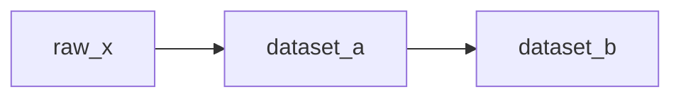

# DAG / asset design doc — <pipeline-name>

> The one-page design captured **before** writing DAG/asset code. Pairs with
> [`backfill-runbook.md`](backfill-runbook.md) (the operational reprocessing plan).

**Owner:** <name> · **Date:** <YYYY-MM-DD> · **Orchestrator:** <Airflow / Dagster / Prefect / …> · **Status:** draft / approved / built

## Purpose & outputs
- **What this pipeline produces:** <datasets/tables and who consumes them>
- **Partition grain:** <logical/event date · region · tenant — the NATURAL data grain, not wall-clock run time>

## Dependency graph
- **Expression:** <task-centric (operators) | asset-centric (software-defined assets)>
- **Edges (upstream → downstream):**
  | Output | Depends on (minimal inputs) |
  |---|---|
  | <dataset_a[partition]> | <raw_x[partition]> |
  | <dataset_b[partition]> | <dataset_a[partition]> |
- **Parallelism note:** <which steps can run concurrently; any false edges deliberately avoided>

## Scheduling & triggering
- **Model:** <cron | event/sensor (deferrable) | data-aware/asset-based>
- **Schedule / trigger detail:** <cron expr · which dataset's freshness triggers a run · sensor source>
- **Catchup / backfill behavior:** <explicit setting — e.g. `catchup=False`; backfills via the runbook, not auto-catchup>

## Idempotency & retries
- **Idempotency:** <partition key + overwrite strategy (MERGE / INSERT OVERWRITE / delete-then-insert) that makes a re-run safe>
- **Retries:** <max attempts · exponential backoff (+ jitter) · transient-vs-deterministic split · on-exhaust action (alert/dead-letter)>

## Executor / runtime & concurrency
- **Executor:** <Local / Celery / Kubernetes / serverless>
- **Concurrency controls:** <pools · max_active_runs/tasks · dynamic-task-mapping cap, to protect the warehouse / rate-limited APIs>

## Data-freshness SLA & alerting
- **Freshness SLA:** <e.g. "<dataset> ≤ 2h behind event time">
- **Alert on:** <SLA miss / sensor timeout / retry exhaustion>
- **Who's paged + runbook:** <owner/on-call + link>

## Lineage & blast radius
- **Downstream consumers:** <dashboards/models/exports that go stale if this fails>
- **Lineage surface:** <Dagster asset graph · Airflow Datasets · OpenLineage/catalog>

## Seams (work this DAG runs but does not own)
- **Ingestion / warehouse:** data-platform
- **Transforms (dbt):** analytics-engineering
- **Real-time:** data-streaming-engineering
- **Deploy infra:** devops-cicd / cloud plugin

## Open questions / risks
- <list>

**Sign-off:** <reviewer> · <date>
