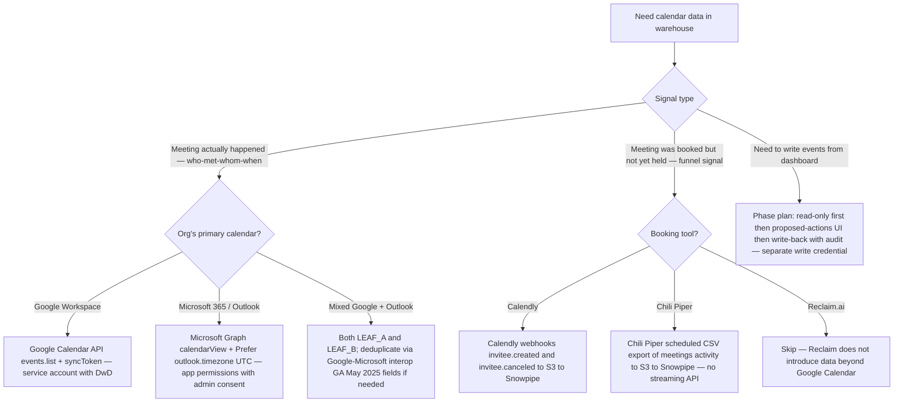

# Calendar integration — Google Calendar + Microsoft Graph (Outlook)

> **Last reviewed:** 2026-06-04. Sources: Google Calendar API docs, Microsoft Graph `dateTimeTimeZone` resource docs, Google Workspace blog (Google ↔ Microsoft interop GA May 2025), Chili Piper meetings activity docs (URLs in `## References`). Refresh when: (a) Google or Microsoft change OAuth scope shapes, (b) Microsoft Graph fixes or regresses the documented DST bugs, (c) Calendly / Chili Piper change their data export model, or (d) the read-only-first discipline becomes a hard constraint (write-back compliance event).

## TL;DR

- **No managed Fivetran connector** for raw calendar events as of 2026-06 `[verify-at-use — 2026-06-04]`. Airbyte ships a community-supported Google Calendar connector; Microsoft Graph paths are BUILD universally.
- **Read-only first; write-back only after the audit landing is stable.** Calendar write-back from analytics is an irreversible side effect — earn it.
- **Timezone normalization is the K-12 gotcha.** Partners span Arizona (no DST) + Hawaii (no DST) + 4 mainland zones (DST) + Alaska. Store UTC + IANA timezone on dim_partner; convert at query time.
- **Microsoft Graph `dateTime + timeZone` ≠ RFC 3339 with offset.** Must reassemble in ingest. Use `Prefer: outlook.timezone="UTC"` header to force UTC and eliminate DST math at ingest.
- **Calendly + Chili Piper sit above the raw calendar layer** — they emit meeting-booking events; ingest those separately to attribute "who booked what" before the raw calendar event fires.

## When to use this file

| Scenario | Use this file |
|---|---|
| Need PSM touch-cadence metrics ("how many partner meetings last quarter") | Yes |
| Need to ingest CSM ↔ partner meeting history into a warehouse for health-score factors | Yes |
| Need Calendly / Chili Piper booking events as a separate funnel signal | Yes |
| Need to write calendar events from the warehouse (PSM dashboard "schedule a check-in" button) | Yes — but read-only first |
| Need Outlook email content | **No** — that's Microsoft Graph mail, not calendar. Different scopes, different design |

## Google Calendar API

### OAuth setup `[verify-at-use — 2026-06-04]`

- **OAuth 2.0 with domain-wide delegation (DwD)** for org-wide ingest — a Google Workspace admin grants a service account access to impersonate users.
- **Minimum scopes:**
  - `https://www.googleapis.com/auth/calendar.events.readonly` — read-only event access.
  - `https://www.googleapis.com/auth/calendar.readonly` — read-only calendar metadata (used to enumerate which calendars the user has).
- **Write scope (write-back path only):** `https://www.googleapis.com/auth/calendar.events` — full event write. Treat as a separate credential; do not grant read+write on the same token by default.
- **Service-account JWT auth** for unattended ELT (Google's recommended pattern).

### `events.list` extraction pattern

The workhorse endpoint is `GET /calendar/v3/calendars/{calendarId}/events`. Useful query params:

| Param | Purpose | Value |
|---|---|---|
| `updatedMin` | Incremental cursor. | ISO 8601 of last watermark. |
| `singleEvents` | Expand recurring events to instances. | `true` for analytics (one row per occurrence). |
| `orderBy` | Required when `singleEvents=true`. | `startTime`. |
| `timeMin` / `timeMax` | Window the read. | Use for backfill chunks. |
| `pageToken` | Pagination. | Returned in the previous response's `nextPageToken`. |
| `syncToken` | Cursor for incremental "give me only changes since token." | Preferred over `updatedMin` once the initial backfill completes. |

**`syncToken` is the right cursor** for steady-state incremental — Google's documented "give me only the delta since last call" pattern. Use `updatedMin` for backfill only. On `syncToken` expiration (Google rotates them periodically), re-issue with a fresh `timeMin` and rebuild.

### Watermark + page-token discipline

Three state values track per (calendar_id, sync_run):

1. **`syncToken`** (steady-state) — the Google-issued resumption cursor.
2. **`pageToken`** (within-run) — the within-page continuation; nullable.
3. **`last_loaded_at`** (fallback) — UTC timestamp; used to recover when `syncToken` is expired/invalid.

```
Run start ──→ read syncToken from control table
            ├── present? ─→ events.list with syncToken
            │                  ├── 200 → process page, update pageToken if nextPageToken present, repeat
            │                  └── 410 GONE → syncToken expired, restart with timeMin = last_loaded_at - 7d
            └── absent? ─→ events.list with timeMin = (epoch or backfill start), paginate via nextPageToken
                          → on final page, capture nextSyncToken into control table
```

**Idempotency:** match on Google's `event.id` (stable per event); MERGE into Snowflake; advance `syncToken` only after a successful commit.

### Recurring events

- `singleEvents=true` expands to instances (one row per occurrence) — the analytics shape.
- `singleEvents=false` returns the master recurring event with `recurrence` RRULE strings — useful for "show the recurring pattern" UX but a pain for analytics.
- **Always pick one mode per pipeline.** Mixing them in the same staging model is a recipe for double-counting.

### Rate limits `[verify-at-use — 2026-06-04]`

- Per-project quota (varies by project); default ~1M queries/day.
- Per-user-per-second cap (~50 req/sec).
- `403 rateLimitExceeded` → exponential backoff with `Retry-After` honor.

## Microsoft Graph (Outlook)

### OAuth setup `[verify-at-use — 2026-06-04]`

- **Microsoft Graph application permissions** (unattended) — admin consent required.
- **Minimum scopes:**
  - `Calendars.Read` — read-only events for the signed-in user.
  - `Calendars.Read.Shared` — read shared calendars.
  - Org-wide: `Calendars.Read` with **application-level** permission + admin consent.
- **Write scope (write-back path only):** `Calendars.ReadWrite` — separate credential.
- **Auth flow:** client credentials (OAuth 2.0) for unattended ELT.

### `/me/calendarView` extraction pattern

The workhorse endpoint is `GET /v1.0/users/{user_id}/calendarView?startDateTime=…&endDateTime=…`:

- **`calendarView` auto-expands recurring events to instances** within the time window — the analytics-friendly shape.
- **`events` endpoint** returns master + exceptions separately — requires extra reconstruction. Use `calendarView` unless you need the RRULE.
- **`$top` + `@odata.nextLink`** for pagination.
- **`Prefer: outlook.timezone="UTC"`** header — forces all `dateTime` values to be returned in UTC. **Set this on every request.** Eliminates DST-related normalization at ingest time.

### The `dateTimeTimeZone` shape (the load-bearing gotcha)

Microsoft Graph returns event start/end as a **composite object**, not RFC 3339:

```json
{
  "start": {
    "dateTime": "2026-06-04T14:00:00.0000000",
    "timeZone": "America/Chicago"
  },
  "end": {
    "dateTime": "2026-06-04T15:00:00.0000000",
    "timeZone": "America/Chicago"
  }
}
```

**Reassemble at ingest:**

```python
from datetime import datetime
from zoneinfo import ZoneInfo

start_local = datetime.fromisoformat(event["start"]["dateTime"])
start_tz    = ZoneInfo(event["start"]["timeZone"])  # IANA name
start_utc   = start_local.replace(tzinfo=start_tz).astimezone(ZoneInfo("UTC"))
```

**Forcing UTC via header eliminates this entirely** — `Prefer: outlook.timezone="UTC"` returns `dateTime` already in UTC and sets `timeZone = "UTC"`. Always set this header. Without it, downstream DST math is the first regression source.

### Known Microsoft Graph DST bugs `[verify-at-use — 2026-06-04]`

Documented and persistent:

- Events created during a DST transition window can have start/end times that diverge from the user's local intent by 1 hour.
- Some endpoints return local-time stamps without an offset.
- Graph occasionally returns Windows timezone names (e.g., `"Central Standard Time"`) instead of IANA (`"America/Chicago"`) — when this happens, map via Unicode CLDR's Windows-to-IANA mapping.

**Defense via dbt assertion tests:**

```sql
-- tests/assert_calendar_event_duration_sane.sql
select event_id, partner_key, start_utc, end_utc,
       datediff('hour', start_utc, end_utc) as duration_h
from {{ ref('fct_calendar_event') }}
where datediff('minute', start_utc, end_utc) < 0
   or datediff('hour', start_utc, end_utc) > 24
```

A negative duration or a >24h calendar slot is almost always a DST-induced ingestion error. Surface immediately.

### Rate limits `[verify-at-use — 2026-06-04]`

- 10,000 requests / 10 minutes per app per tenant.
- Throttling response `429 Too Many Requests` with `Retry-After` header — honor it.
- Per-mailbox concurrency limits — backoff on `429` with exponential jitter.

## Calendly / Chili Piper / Reclaim.ai

These sit **above** the raw calendar layer — they emit meeting-booking events that fire **before** the raw Google/Outlook event lands. Ingest them as a separate funnel signal.

### Calendly `[verify-at-use — 2026-06-04]`

- REST API with full webhook coverage.
- Documented webhook events: `invitee.created`, `invitee.canceled`, `routing_form_submission.created`.
- Strong for inbound prospect/partner scheduling.
- **BUILD pattern:** Calendly webhooks → S3 → Snowpipe → `raw.calendly_invitees`.
- **Identity bridge:** Calendly invitee email → match against `dim_partner` via `bridge_account_xref` (see `cross-system-identity-resolution`).

### Chili Piper `[verify-at-use — 2026-06-04]`

- REST API; strength is real-time lead routing/qualification.
- **CSV export of meetings activity is the documented data-pull path** (per Chili Piper's help docs). Not a streaming API — a scheduled export.
- **BUILD pattern:** scheduled CSV pull → S3 → Snowpipe → `raw.chilipiper_meetings`.

### Reclaim.ai

- Practitioner-facing layer; surfaces existing Google Calendar via its own UI.
- **Skip from ingest perspective** — Reclaim doesn't introduce data beyond what Google Calendar already has.

## Timezone normalization — the cross-state K-12 gotcha

K-12 partners span all US timezones plus DST/non-DST regions (Arizona, Hawaii). The pattern:

1. **Store all calendar events in UTC** in Snowflake (`event_start_utc TIMESTAMP_TZ`, `event_end_utc TIMESTAMP_TZ`).
2. **Store the partner's `timezone_iana`** (e.g., `America/Chicago`, `America/Phoenix`, `Pacific/Honolulu`) on `dim_partner`.
3. **Compute `event_start_local` at query time**: `CONVERT_TIMEZONE('UTC', dim_partner.timezone_iana, event_start_utc)`.
4. **Never store local time without timezone** — it loses DST context and is unrecoverable.

**`dim_partner.timezone_iana` is a load-bearing column.** A missing or wrong IANA value silently mis-bucket every dashboard panel that aggregates by "morning / afternoon."

### Cross-state caveats

- **Arizona** (except the Navajo Nation) — no DST. `America/Phoenix`. A Phoenix partner does not gain or lose an hour in March/November.
- **Hawaii** — no DST. `Pacific/Honolulu`.
- **Indiana** — historically split DST/non-DST; now all `America/Indiana/Indianapolis`. Legacy data may have inconsistencies.
- **The Navajo Nation** — observes DST. `America/Denver`. The non-Navajo Arizona does not. Districts on the reservation need careful IANA assignment.

### dbt assertion tests for DST-boundary integrity

```sql
-- tests/assert_no_dst_duration_change.sql
-- An event whose duration changed by exactly 1 hour around a DST transition
-- without a corresponding update_time is almost always a Graph DST bug
with dst_boundaries as (
    select '2026-03-08'::date as dst_start union all
    select '2026-11-01'::date as dst_end
)
select event_id, start_utc, end_utc, original_duration_minutes, updated_at
from {{ ref('snap_calendar_event') }}
where date_trunc('day', start_utc) in (select * from dst_boundaries)
  and original_duration_minutes is not null
  and abs(datediff('minute', start_utc, end_utc) - original_duration_minutes) = 60
  and updated_at < start_utc - interval '1 day'
```

## Read-only-first then write-back discipline

Write-back from analytics into a partner-facing calendar is **an irreversible side effect**. Earn it in phases:

1. **Phase 0 (weeks 1–2):** Read-only ingestion to Snowflake. PSM dashboard renders calendar data but cannot mutate.
2. **Phase 1 (weeks 3–6):** Read-only with proposed-action UI. The dashboard surfaces "schedule a check-in" buttons that drop into a draft state in a separate `proposed_actions` table; a human approves; an out-of-band script (with separate credentials) writes the event.
3. **Phase 2 (post-stable Phase 1):** Direct write-back from the dashboard with full audit. Requires:
   - **Separate write credential** (do not reuse read credential).
   - **Mandatory audit row** per write: `calendar_write_audit(write_id, partner_key, event_id, requested_by, requested_at, request_payload, response_payload, response_status)`.
   - **Idempotency key** — generate a UUID per write attempt; pass to Google as `requestId` (calendar API) or to Graph as a custom event ID. Replay is safe.
   - **Rollback procedure** — every write must have a documented "how to undo this from the warehouse audit row" runbook.

**House rule:** read-only ingestion for at least 30 days before any write-back ships. The most common failure is a write-back that fires N times due to a webhook retry; Phase 0/1 catches the integration shape before consequences are partner-visible.

## Decision Tree: Calendar Source Selection

**When this applies:** You are scoping calendar-event ingestion for a PSM dashboard. The choice of source (raw calendar vs. Calendly vs. Chili Piper) and the auth path depend on what signal the dashboard actually consumes.

**Last verified:** 2026-06-04 against Google Calendar API docs, Microsoft Graph docs (calendarView resource), Calendly webhook event reference.



**Rationale per leaf:**
- *Leaf A — Google Calendar API* — the canonical read path for Google Workspace orgs. **Requires:** Workspace admin to grant domain-wide delegation to a service account.
- *Leaf B — Microsoft Graph calendarView* — the canonical read path for Microsoft 365 orgs. **Requires:** Entra admin consent for `Calendars.Read` application permission.
- *Leaf C — Calendly webhooks* — booking-time signal; fires before the raw calendar event exists. Pair with raw calendar to detect cancellations.
- *Leaf D — Chili Piper CSV export* — no real-time API; scheduled export is the supported pattern.
- *Leaf E — Mixed Google + Outlook* — ingest both; the May 2025 Google ↔ Microsoft interop GA helps cross-platform reconciliation but doesn't replace dual ingest.
- *Leaf F — Write-back* — never ship as Phase 0. Read-only first, proposed-actions middle, audited write-back last. **Requires:** separate write credential, audit table, idempotency-key discipline.
- *Leaf G — Reclaim.ai skip* — Reclaim is a UI over Google Calendar; ingesting from Google directly is sufficient.

**Tradeoffs summary table:**

| Method | Latency | Auth complexity | Use when |
|---|---|---|---|
| Google Calendar API (A) | Sub-minute via syncToken | Medium (DwD) | Google Workspace org. |
| Graph calendarView (B) | Sub-minute | Medium (admin consent) | Microsoft 365 org. |
| Calendly webhooks (C) | Real-time | Low (per-org token) | Inbound prospect scheduling. |
| Chili Piper CSV (D) | Daily | Low (per-org token) | Lead-routing telemetry. |
| Dual A+B (E) | Sub-minute | High (both) | Mixed-stack org. |
| Write-back (F) | Direct | High (separate write cred + audit) | Post-Phase-1 only. |

## dbt modeling — common staging + facts

| Model | Purpose |
|---|---|
| `stg_google__events` | Typed staging from Google Calendar API; UTC start/end; expanded singleEvents. |
| `stg_microsoft__calendar_view` | Typed staging from Graph calendarView; UTC start/end via `Prefer` header. |
| `stg_calendly__invitees` | Booking events from Calendly webhooks. |
| `stg_chilipiper__meetings` | Booking events from Chili Piper CSV. |
| `int_calendar_event_unioned` | Union across Google + Microsoft into a single shape. |
| `fct_calendar_event` | Per-event fact: `partner_key`, `start_utc`, `end_utc`, `attendees`, `source_vendor`, `booking_source` (calendly/chilipiper/manual). |
| `fct_partner_touch_cadence` | Roll-up: `partner_key` × `month` × `touch_count`, `total_duration_minutes`. |
| `mart_psm_touch_dashboard` | The PSM-facing panel data — "weeks since last partner contact." |

## PII / data sensitivity

- **Event titles + descriptions can contain PII or confidential context** (e.g., "Quarterly review — termination discussion"). Apply Snowflake dynamic masking on the title/description columns; surface only `start_utc`, `end_utc`, `attendee_count`, `partner_key` to broad analyst roles.
- **Attendee emails are PII.** Hash for cohort analytics; mask raw email in non-privileged roles.
- **GDPR / CCPA right-to-erasure** — calendar data inherits the requester's deletion. Document the deletion path that propagates from Google/Microsoft → Snowflake.
- **K-12 + COPPA** — if any attendees are students under 13 (rare on PSM calendars but possible on partner-side calendars surfaced via DwD), apply stricter masking.

## Common gotchas

1. **Microsoft Graph `dateTime + timeZone` not RFC 3339.** Reassemble at ingest or force UTC via `Prefer` header.
2. **Recurring event expansion mode mismatch.** Pick `singleEvents=true` (Google) / `calendarView` (Graph) and stick with it.
3. **`syncToken` expiration.** Catch 410 GONE and rebuild from `timeMin = last_loaded_at - 7d`.
4. **DST-boundary event duration changes.** Surface via dbt assertion tests; investigate before publishing.
5. **Domain-wide delegation scope creep.** Calendar scopes only; do not grant Mail or Drive on the same service account.
6. **Windows timezone names vs IANA.** Map via Unicode CLDR mapping when Graph returns Windows names.
7. **Calendly webhook signature verification.** Verify HMAC on every incoming webhook — Calendly publishes a signing key per workspace. Unsigned webhooks are a forgery vector.
8. **Chili Piper CSV column drift.** The export columns can change without API versioning; pin a column-set in staging and fail loudly on additions.
9. **Mixed Google + Outlook organizations** with the May 2025 interop GA produce mirror events that look like duplicates. Dedup via the `iCalUId` field (stable across both sides).
10. **Write-back idempotency.** Never write without an idempotency key; Google `requestId` and Graph custom event IDs are the supported mechanisms.

## Refresh triggers

- Google or Microsoft change OAuth scope shapes.
- Microsoft Graph fixes or regresses the documented DST bugs.
- Calendly / Chili Piper change their export model.
- A Phase 2 write-back compliance event surfaces and tightens the write-back discipline.
- Google ↔ Microsoft calendar interop adds field-level reconciliation primitives.

## References

All URLs accessed 2026-06-04.

- https://developers.google.com/calendar/api/v3/reference/events/list — Google Calendar events.list reference.
- https://developers.google.com/calendar/api/guides/sync — Google Calendar sync token pattern.
- https://learn.microsoft.com/en-us/graph/api/user-list-calendarview — Microsoft Graph calendarView reference.
- https://learn.microsoft.com/en-us/graph/api/resources/datetimetimezone?view=graph-rest-1.0 — Microsoft Graph `dateTimeTimeZone` resource.
- https://workspaceupdates.googleblog.com/2025/05/calendar-interoperability-microsoft-office-365-with-microsoft-graph-api.html — Google ↔ Microsoft calendar interop GA May 2025.
- https://developer.calendly.com/api-docs/ — Calendly REST API + webhooks.
- https://help.chilipiper.com/hc/en-us/articles/31428605286931-Meetings-Activity-and-Events-History — Chili Piper meetings activity export.
- https://www.iana.org/time-zones — IANA tzdata reference.
- https://docs.snowflake.com/en/sql-reference/functions/convert_timezone — Snowflake `CONVERT_TIMEZONE` reference.
