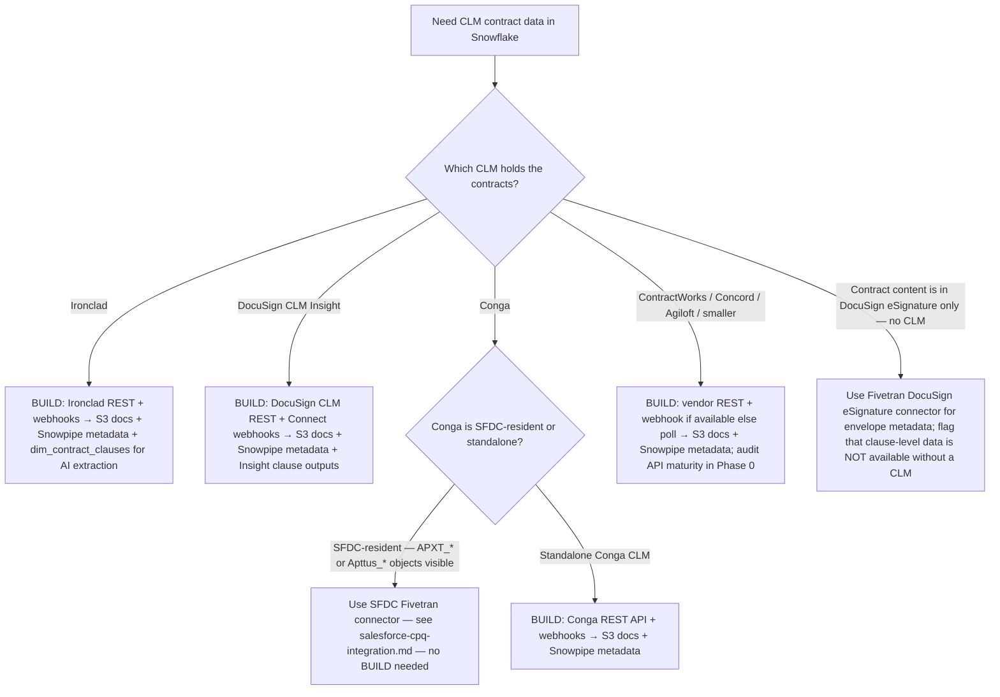

# CLM integration — Ironclad / DocuSign CLM / Conga / ContractWorks

> **Last reviewed:** 2026-06-04. Sources: Ironclad developer hub, DocuSign CLM Insight docs, Conga CLM API reference (URLs in `## References`). Refresh when: (a) Fivetran or Airbyte ship a managed CLM connector for any of these vendors, (b) Ironclad's AI clause-extraction API surface changes, (c) DocuSign CLM transitions out of Insight branding, or (d) the cross-vendor `dim_contract` schema needs to absorb a new clause type.

## TL;DR

- **No managed Fivetran / Airbyte connector exists for any major CLM as of 2026-06.** `[verify-at-use — 2026-06-04]` Every CLM path here is BUILD: REST API + webhooks → S3 → Snowpipe → Snowflake → dbt.
- **Per-vendor strengths drive the extraction emphasis:**
  - Ironclad: AI clause extraction from PDFs (`renewal_date`, `notice_period`, `auto_renewal_flag`) — strong.
  - DocuSign CLM (Insight): post-signature term-extraction + obligation tracking + envelope webhooks.
  - Conga CLM: standard REST; often SFDC-anchored — check before assuming BUILD.
  - ContractWorks / smaller CLMs: REST + webhook, single-source viability.
- **Document-vs-metadata split** is the load-bearing design decision. Always land metadata (renewal date, parties, ARR) to Snowflake. Land document binaries to S3 separately, never as VARIANT blobs in Snowflake.
- **Cross-vendor normalization** is where the ROI is — every CLM vendor has different field names; the warehouse `dim_contract` is vendor-agnostic.

## When to use CLM extraction vs. CPQ

| Scenario | Use this file | Use `salesforce-cpq-integration.md` |
|---|---|---|
| Contracts originate in SFDC, signed in SFDC, lifecycle in SFDC | — | Yes |
| Contracts drafted in Word/Google Docs, signed in DocuSign eSignature, metadata in SFDC | Yes (DocuSign eSignature path — limited) | Yes (SFDC is the system of record) |
| Contracts authored + negotiated + stored in Ironclad / DocuSign CLM / Conga CLM | Yes — the CLM is the system of record | Only for the post-signature SFDC sync |
| Renewal clauses, notice periods, auto-renewal flags are extracted by the CLM's AI | Yes — the CLM is where the clause data lives | — |

**The litmus test:** if the renewal date and notice period live as structured fields in the CLM (not in SFDC), the CLM is the source of truth and this file applies. If SFDC `Contract` holds those fields and the CLM is just where the PDF was signed, the CPQ file applies.

## Document-vs-metadata split (design rule)

Every CLM extraction makes one decision up front: where does the document go vs. where does the metadata go?

**The rule:** **metadata → Snowflake; documents → S3 (or equivalent blob store); link via a stable URL or key.**

| Layer | What lives there | Why |
|---|---|---|
| **Snowflake (`raw_clm_*` schemas)** | Contract metadata: id, parties, start/end dates, ARR, notice period, auto-renewal, clause-extraction outputs, status timestamps. JSON-shaped where vendor-defined; typed in staging. | Queryable. Joinable. Cost-efficient. |
| **S3 (or Azure Blob / GCS)** | The PDF / DOCX binaries themselves, organized by `<vendor>/<contract_id>/<version>.pdf`. | Snowflake VARIANT can technically hold blobs, but compute cost on a `LIST_TABLES`-style scan over multi-MB binaries is brutal. S3 is cheaper, supports signed-URL access patterns, and integrates with downstream OCR/AI services. |
| **Snowflake `dim_contract_document`** | Pointer rows: `contract_id`, `version`, `s3_key`, `mime_type`, `byte_size`, `uploaded_at`. **No binary content.** | The bridge between metadata and binary. The dashboard renders "View PDF" buttons by generating a signed S3 URL from the pointer. |

**Anti-pattern:** landing the entire CLM document as a VARIANT column in Snowflake "for completeness." This explodes the warehouse cost on any naive `SELECT *` and slows every downstream query.

## Ironclad CLM

### Connector availability `[verify-at-use — 2026-06-04]`

- **No managed Fivetran connector.**
- **No managed Airbyte connector.**
- **BUILD path:** Ironclad REST API + webhooks → S3 (documents) → Snowpipe → Snowflake → dbt.

### API approach

- **Developer hub:** `developer.ironcladapp.com`.
- **Auth:** API key (workspace-scoped) `[verify-at-use — 2026-06-04]`.
- **Bulk-export endpoints:** Ironclad supports per-workflow exports + record-level pulls. Use the workflow export for backfill; record-level + webhooks for incremental.
- **AI clause extraction (Ironclad's strength):** the API returns structured clauses (`renewal_date`, `notice_period`, `auto_renewal_flag`, `liability_cap`) extracted from the PDF. **Land these into a `dim_contract_clauses` table** as the structured layer over the document.

### Extraction pattern

```
Ironclad Records API ─────────────────┐
                                      ├──→ Snowpipe → raw.ironclad_records
Ironclad Webhooks (record.updated) ───┘            └──→ raw.ironclad_clauses
                                                   └──→ raw.ironclad_workflow_states
Ironclad Document download API ───→ S3://contracts/ironclad/<record_id>/<version>.pdf
                                  ──→ raw.ironclad_documents (pointer rows only)
```

### Common gotchas

1. **Webhook delivery is at-least-once.** Idempotent MERGE on Ironclad's record ID — same pattern as other webhook-driven sources.
2. **AI clause-extraction confidence varies by clause type.** Renewal-date extraction is the strongest; liability-cap is weakest. Surface the confidence score; do not auto-trust.
3. **Workflow state machine is custom per Ironclad workspace.** Hard-coding state names in dbt breaks on workspace customization. Source the workflow definitions and normalize in staging.
4. **Document binaries can be large** (signed contracts with appendices > 50MB). Stream to S3 via multipart upload; do not hold in memory.
5. **Counterparty data is PII-adjacent** — contact names + emails on the counterparty side. Mask in non-privileged roles.

## DocuSign CLM (Insight)

### Connector availability `[verify-at-use — 2026-06-04]`

- **No managed Fivetran connector for DocuSign CLM.** (Note: Fivetran has a DocuSign **eSignature** connector — that is different and limited to envelope-level metadata.)
- **No managed Airbyte connector for DocuSign CLM.**
- **BUILD path:** DocuSign CLM REST API + DocuSign Connect webhooks → S3 → Snowpipe → Snowflake → dbt.

### API approach

- **Insight is the post-signature intelligence layer** — term extraction, obligation tracking, renewal alerts.
- **REST API:** envelope-level + clause-level pulls.
- **DocuSign Connect** (webhook): envelope status changes, completed-signature notifications, post-sign Insight extraction.
- **Auth:** OAuth 2.0 (JWT-bearer flow for unattended ELT).

### Extraction pattern

```
DocuSign CLM REST API (envelope-level)
                  +
DocuSign Connect webhooks (status changes)
                  +
DocuSign Insight clause-extraction outputs
                       ↓
                       S3 (document binaries) + Snowpipe (metadata + clauses)
                       ↓
                       Snowflake → dbt
```

### Common gotchas

1. **DocuSign eSignature ≠ DocuSign CLM ≠ Insight.** Three distinct products with three different APIs. Confirm which the org owns before scoping.
2. **Insight extraction lag** — Insight processes envelopes asynchronously after signing; clause data arrives minutes-to-hours after the envelope completes. Do not assume real-time.
3. **Connect webhook retries** — DocuSign Connect retries failed deliveries; the consumer must be idempotent. Use the envelope ID + event timestamp as the dedup key.
4. **Custom envelope fields** — orgs heavily customize the envelope-metadata layer. Inventory custom fields per org; normalize in staging.
5. **Multi-envelope contracts** — one "contract" in the org's mental model may be N DocuSign envelopes (counter-signature workflows, amendment chains). Reconstruct via a custom `contract_group_id` field if present, or build the link in dbt.

## Conga CLM (and Conga Contracts)

### Connector availability `[verify-at-use — 2026-06-04]`

- **No managed Fivetran / Airbyte connector.**
- **BUILD via REST API** (documented at `documentation.conga.com`).
- **SFDC-anchored Conga deployments:** Conga's custom objects often flow through the SFDC Fivetran connector when Conga is deployed inside SFDC. **Verify the namespace** (`APXT_*` or `Apttus_*`) before assuming BUILD is required — if the org's Conga is SFDC-resident, the SFDC connector path applies and this file does not.

### Extraction pattern

- SFDC-resident: same as `salesforce-cpq-integration.md` — confirm the Conga namespace and add to the field allow-list.
- Standalone Conga CLM: REST API + webhooks → Snowpipe → Snowflake.

### Common gotchas

1. **Conga's product line has had multiple rebrands** (Apttus → Conga → Conga CLM). Field-naming archaeology by org age.
2. **SFDC-resident Conga vs. standalone Conga** — different extraction paths. Confirm before scoping.

## ContractWorks / smaller CLMs

### Connector availability `[verify-at-use — 2026-06-04]`

- **No managed Fivetran / Airbyte connector for any of: ContractWorks, vaquill, Concord, Agiloft, LinkSquares (most editions).**
- **BUILD path is universal:** REST API + webhook → S3 → Snowpipe → Snowflake → dbt.
- **Single-source viability:** these vendors typically don't appear in third-party connector catalogs at all. Plan for BUILD from day one.

### Common gotchas

1. **API maturity varies sharply.** Some vendors have clean REST + OpenAPI specs; others have undocumented endpoints requiring support tickets. Audit API maturity in Phase 0.
2. **Rate limits often undocumented.** Plan for 100 req/min unless the vendor publishes higher; observe `X-RateLimit-*` headers in Phase 0.
3. **Webhook coverage incomplete.** Smaller CLMs often lack webhooks; polling is the only option. Plan watermark-based polling.

## Cross-vendor `dim_contract` normalization

This is the load-bearing piece — the dashboard renders a single contract surface regardless of which CLM the contract lives in. The schema:

```sql
create table analytics.dim_contract (
    contract_key            varchar primary key,         -- warehouse-synthetic surrogate
    partner_key             varchar not null,            -- joins to dim_partner
    contract_source         varchar not null,            -- 'sfdc_cpq' | 'ironclad' | 'docusign_clm' | 'conga' | 'contractworks' | …
    contract_source_id      varchar not null,            -- vendor-native ID
    contract_start_date     date,
    contract_end_date       date,                        -- the renewal anchor (uniform across vendors)
    arr_usd                 numeric(18,2),
    tcv_usd                 numeric(18,2),
    auto_renew_flag         boolean,
    notice_period_days      integer,
    notice_window_opens_at  date,                        -- derived: end_date - notice_period_days
    contract_status         varchar,                     -- 'active' | 'pending' | 'expired' | 'terminated'
    counterparty_name       varchar,
    document_s3_key         varchar,                     -- pointer to the binary in S3
    clm_clause_data         variant,                     -- JSON: vendor-specific clause-extraction output
    effective_from          timestamp,                   -- SCD2 effective-from
    effective_to            timestamp,                   -- SCD2 effective-to (null = current)
    is_current              boolean,
    created_at              timestamp,
    updated_at              timestamp,
    unique (contract_source, contract_source_id, effective_from)
);
```

**Modeling rules:**

- **SCD Type 2 on `LastModifiedDate`** (or vendor-equivalent). Each amendment / status change / clause re-extraction produces a new SCD2 row.
- **Vendor-specific clause data → `clm_clause_data` JSON column.** Do not flatten every vendor's clause schema into typed columns; the variance is too high. The five universal columns (`contract_end_date`, `notice_period_days`, `auto_renew_flag`, `arr_usd`, `counterparty_name`) are typed; everything else stays JSON.
- **`partner_key`** is resolved upstream — the `bridge_account_xref` (see `cross-system-identity-resolution`) maps `contract_source_id` → `partner_key`.

## Decision Tree: CLM Extraction Path Selection

**When this applies:** You are scoping data extraction for contracts that live in a CLM (not just SFDC CPQ). The vendor + the doc-vs-metadata trade-off determine the build path.

**Last verified:** 2026-06-04 against Ironclad developer hub, DocuSign CLM Insight docs, Conga API reference.



**Rationale per leaf:**
- *Leaf A — Ironclad BUILD* — strongest AI clause-extraction in the category; preserve the structured clause output as a first-class table. **Requires:** Ironclad workspace API key + S3 bucket + Snowpipe configured.
- *Leaf B — DocuSign CLM BUILD* — Insight is the load-bearing layer; envelope webhooks drive incremental, REST drives backfill. **Requires:** DocuSign CLM API access + Connect webhook endpoint + OAuth JWT-bearer credentials.
- *Leaf C — SFDC-resident Conga (skip BUILD)* — Conga's SFDC-managed-package objects ride the standard SFDC connector. Confirm the namespace before assuming.
- *Leaf D — Standalone Conga BUILD* — same pattern as Ironclad/DocuSign CLM.
- *Leaf E — Smaller CLMs* — API maturity audit before scoping; webhook coverage often incomplete.
- *Leaf F — DocuSign eSignature only (no CLM)* — eSignature is a signing tool, not a CLM. Envelope-level metadata only; flag the gap to the PSM team if clause-level analytics is in scope.

**Tradeoffs summary table:**

| Method | Time to v1 | Clause-extraction quality | Doc storage | Use when |
|---|---|---|---|---|
| Ironclad BUILD (A) | 2–4 weeks | High (AI-extracted) | S3 | Ironclad is the system of record. |
| DocuSign CLM BUILD (B) | 2–4 weeks | High (Insight) | S3 | DocuSign CLM is the system of record. |
| SFDC Fivetran (C) | Hours (already running) | Org-dependent | SFDC Files / S3 | Conga is SFDC-resident. |
| Conga BUILD (D) | 2–4 weeks | Org-dependent | S3 | Standalone Conga. |
| Smaller-CLM BUILD (E) | 3–6 weeks (incl. API audit) | Vendor-dependent | S3 | API + webhook coverage acceptable. |
| eSignature only (F) | Days | None (envelope metadata only) | DocuSign cloud | No CLM in scope; surface the gap. |

## PII / data sensitivity

- **Counterparty contact data** (names, emails, signing authorities) is PII. Mask in non-privileged roles.
- **Document content** can include commercially sensitive negotiated terms — surface only to PSM-authorized roles.
- **Clause extraction outputs** can leak negotiated discount structures — apply row-access policies if PSMs are partner-scoped.
- **Right-to-erasure** on counterparty data: document the deletion path through CLM + S3 + Snowflake.

## Refresh triggers

- Fivetran or Airbyte ship a managed CLM connector for any of these vendors.
- Ironclad's AI clause-extraction API surface changes.
- DocuSign CLM transitions out of Insight branding (recurring DocuSign product rename pattern).
- The cross-vendor `dim_contract` schema needs to absorb a new clause type.
- A consumer's org migrates between CLMs (e.g., Conga → Ironclad consolidation).

## References

All URLs accessed 2026-06-04.

- https://developer.ironcladapp.com/ — Ironclad CLM developer hub.
- https://documentation.conga.com/clm/latest/api-reference-150503950.html — Conga CLM API reference.
- https://www.docusign.com/products/clm — DocuSign CLM (Insight) product page.
- https://developers.docusign.com/ — DocuSign developer hub (eSignature + CLM).
- https://docs.snowflake.com/en/user-guide/data-load-snowpipe-intro — Snowpipe overview (the universal landing pattern for CLM BUILD).
- https://xebia.com/blog/a-practical-guide-to-creating-slowly-changing-dimensions-type-2-in-dbt-part-1/ — SCD2 in dbt (contract-amendment modeling).
