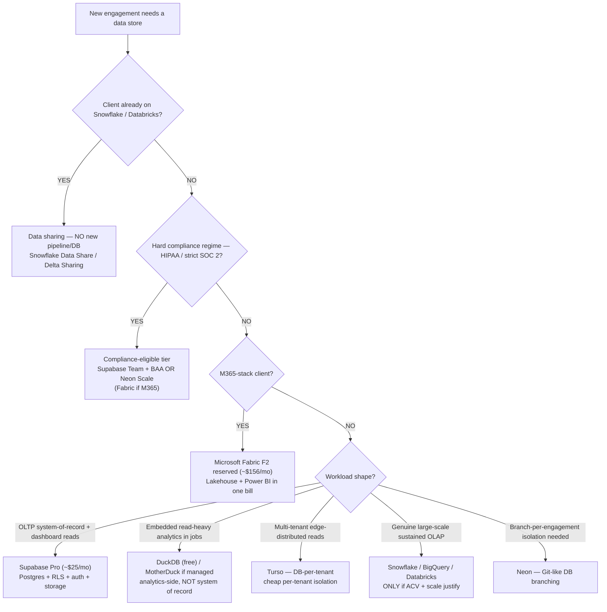
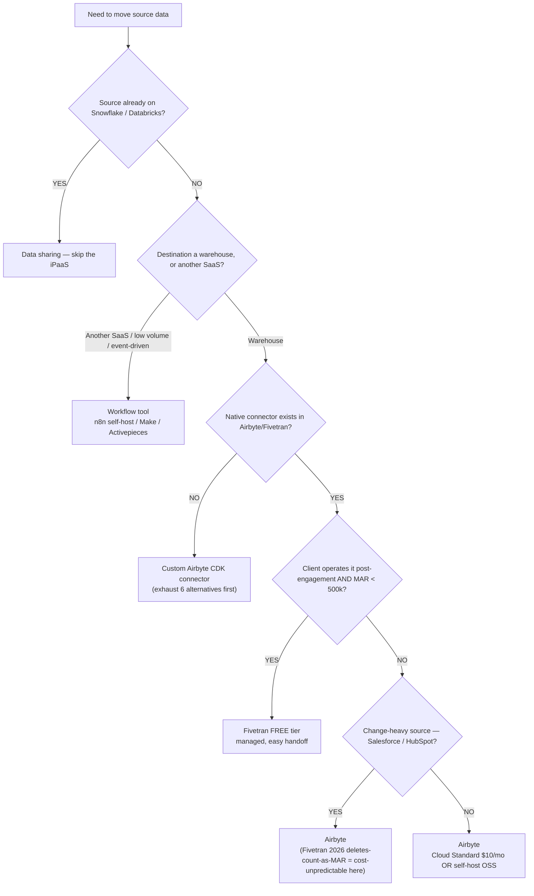
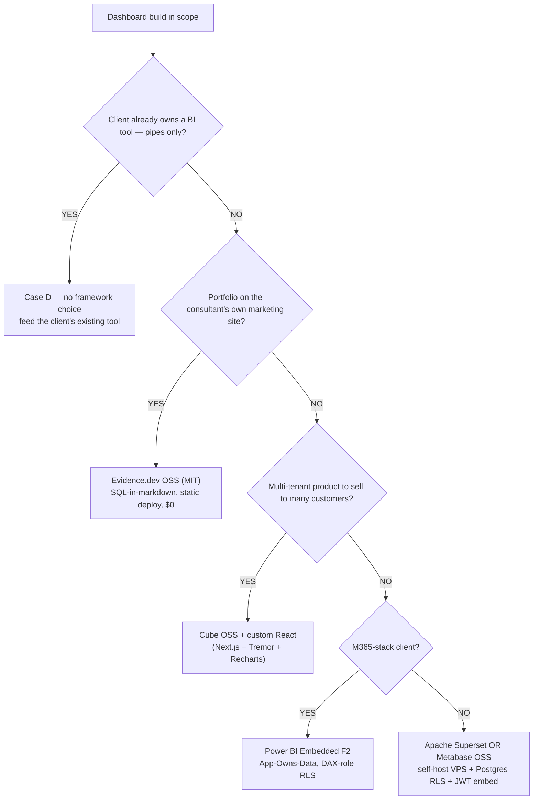
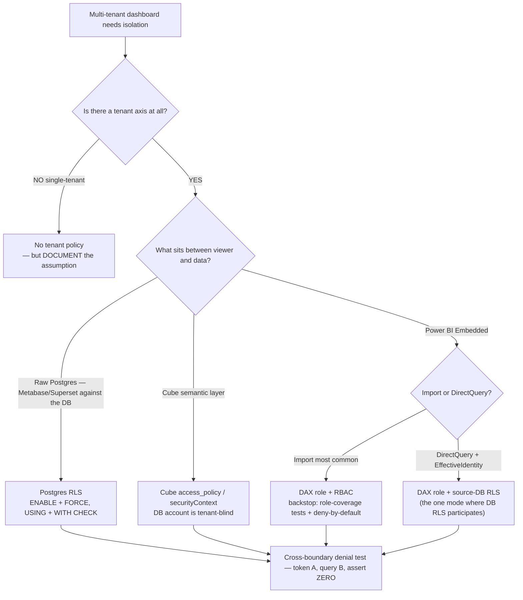
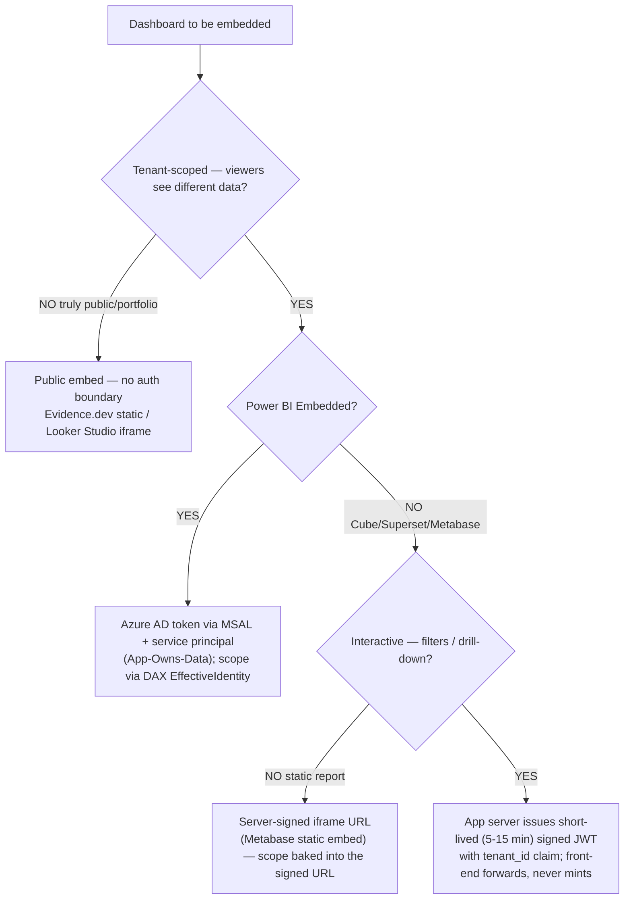

# Data-platform decision trees

> Canonical `## Decision Tree:` sections for the four-layer dashboard engagement (DB / ELT / dashboard / embed). Each tree follows the marketplace format in [`../../../docs/best-practices/decision-trees-in-knowledge-files.md`](../../../docs/best-practices/decision-trees-in-knowledge-files.md): an observable **When this applies**, a **Last verified** date (anti-staleness backstop), a Mermaid flowchart, per-leaf rationale, and a tradeoffs table for any tree with ≥3 leaves.
>
> **Decision-tree traversal (priors).** When a user's situation matches a tree's entry condition, traverse the Mermaid graph top-to-bottom **before** selecting a method — do NOT pattern-match on keywords in the situation description. The first branch where the condition resolves cleanly is the leaf to apply.
>
> These trees are **complementary to** (not a replacement for) the Case A/B/C/D `stack-selection` skill tree ([`../skills/stack-selection/SKILL.md`](../skills/stack-selection/SKILL.md)) — that tree names the engagement Case; these trees pick the tool *within* a layer once the Case is known. Pricing claims are volatile — every `$` figure here is `[verify-at-build]` against the retrieval-dated landscape files before quoting a client.

---

## Decision Tree: Warehouse / database — which engine for this workload?

**When this applies:** a new engagement needs a system-of-record and/or analytics store, OR a client asks "which database?" The Case (A/B/C/D) is already named; this picks the engine. Observable inputs: workload shape (OLTP-plus-dashboard-reads vs. embedded analytics vs. large-scale OLAP), whether the client is *already* on a lakehouse, M365-alignment, and a hard compliance regime.

**Last verified:** 2026-05-30 against [`cloud-database-landscape-2026.md`](cloud-database-landscape-2026.md) (itself last reviewed 2026-05-21). Pricing volatile — re-confirm before quoting.

**Rationale per leaf:**
- *SHARE* — copying data already on a lakehouse adds cost + latency for zero benefit; the share *is* the integration (house opinion #10).
- *COMPLY* — compliance can override the cost default; surface the BAA/eligibility before recommending a tier.
- *FABRIC* — M365 alignment (Power BI integration, Entra-ID RLS) earns Fabric even when it isn't cheapest.
- *SUPA* — Postgres+RLS+auth+storage in one connection string is the lowest-setup non-Microsoft default.
- *DUCK* — embedded analytics engine for pipeline jobs/read paths; not where customer writes live.
- *TURSO* — DB-per-tenant gives cheap hard isolation + edge-distributed reads for many small tenants.
- *OLAP* — the lakehouse default is correct *because* the workload demands it; below `$25k` ACV it doesn't.
- *NEON* — instant Git-like branching is a real differentiator for a consultant running 4-6 simultaneous engagements.

**Tradeoffs summary:**

| Engine | ~Monthly (SMB) | Multi-tenant fit | Setup burden | Use when |
|---|---|---|---|---|
| Supabase Pro | ~$25 | RLS (force-on) | Lowest | Default non-Microsoft OLTP + dashboard reads |
| Neon | ~$5+ usage | RLS | Low | Branch-per-engagement isolation matters |
| Fabric F2 reserved | ~$156 | Entra-ID / DAX-role RLS | Medium | M365-stack client |
| Turso | ~$5-25 | DB-per-tenant | Low-medium | Many small tenants, edge reads |
| DuckDB / MotherDuck | $0 / ~$250 (Business) | n/a (read path) | Low | Embedded analytics, not system-of-record |
| Snowflake / BigQuery / Databricks | $250-2,000+ | warehouse row-policies | High | Genuine large-scale OLAP, or client already there |

---

## Decision Tree: ELT / ingestion tool — share, workflow, managed, or custom?

**When this applies:** data must move from a source into the warehouse, OR a client asks "Airbyte vs Fivetran vs custom?" Observable inputs: source already on a lakehouse, destination is a warehouse vs. another SaaS, monthly active rows (MAR) volume, whether a native connector exists, and who operates it post-engagement.

**Last verified:** 2026-05-30 against [`ipaas-connector-landscape-2026.md`](ipaas-connector-landscape-2026.md) (last reviewed 2026-05-21). The Fivetran 2026 deletes-count-as-MAR change is current as of this date.

**Rationale per leaf:**
- *SHARE* — same as the warehouse tree; a lakehouse-resident source needs a grant, not a pipeline.
- *FLOW* — SaaS-to-SaaS, event-driven, low-volume work is the workflow-tool lane; n8n self-hosted is the cheapest credible option. **requires:** a small VPS to self-host.
- *CUSTOM* — only after exhausting Airbyte catalog → Fivetran → Hevo/Stitch/Estuary → Workato/Tray → Merge.dev → REST-script. EdTech LMS (Canvas/Moodle/Schoology) is the canonical gap. Routes to `connector-developer`.
- *FIVETRAN* — the one Fivetran tier to default-recommend: free, fully managed, hands off cleanly when the client takes over and MAR is under 500k.
- *AIRBYTE_CH* — on change-heavy sources the 2026 deletes-count MAR change makes Fivetran cost-unpredictable for fixed-fee work; Airbyte avoids the cliff.
- *AIRBYTE* — the default ELT: Cloud Standard for short engagements, self-host OSS for sticky/long-running ones.

**Tradeoffs summary:**

| Path | Cost model | Handoff ease | Ops burden | Use when |
|---|---|---|---|---|
| Data sharing | Storage only | n/a (grant) | None | Source on a lakehouse |
| Workflow (n8n) | Flat / VPS | Medium | Low | SaaS-to-SaaS, low volume |
| Fivetran free | Flat (<500k MAR) | Easiest (managed) | Lowest | Client takes over, MAR<500k |
| Airbyte Cloud | $10/mo + credits | Medium | Low | Default warehouse ELT, short engagement |
| Airbyte self-host | VPS only | Hardest (runbook!) | High | Sticky, cost-sensitive, firm hosts |
| Custom Airbyte CDK | Build + maintain | Posture-dependent | Highest | No native connector (EdTech LMS) |

---

## Decision Tree: BI / embed framework — which dashboard tool?

**When this applies:** the engagement includes a dashboard build (Case A/B/C — NOT Case D, where the client owns the BI tool). Observable inputs: portfolio-vs-client-vs-product, M365 alignment, viewer count, and whether the deliverable is a multi-tenant product.

**Last verified:** 2026-05-30 against [`embedded-analytics-landscape-2026.md`](embedded-analytics-landscape-2026.md) (last reviewed 2026-05-21). Per-viewer pricing figures are volatile — re-confirm before quoting.

**Rationale per leaf:**
- *CASE_D* — the dashboard build is out of scope; stay in the data-pipes lane (don't sell a dashboard the client doesn't need).
- *EVIDENCE* — single-tenant + version-controlled + public means no embed-auth complexity; OSS Evidence handles SQL-fenced-block authoring at $0 (Evidence *Cloud* has no free tier and Embedded is Enterprise-only — stay on OSS).
- *CUBE* — a multi-tenant product needs a semantic layer to avoid shipping raw SQL to the browser; Cube owns the query plan, caching, and `securityContext` isolation.
- *PBI* — M365 alignment makes Entra-ID/DAX-role RLS the path of least resistance; F2 is flat-capacity (no per-viewer). Coordinate with `power-platform/power-bi-engineer`.
- *OSS* — non-Microsoft + 5-50 viewers means per-viewer pricing kills the math; Superset/Metabase OSS with Postgres RLS + JWT embed is the consulting-friendly default.

**Tradeoffs summary:**

| Tool | Cost | Multi-tenant | Embed auth | Use when |
|---|---|---|---|---|
| Evidence.dev OSS | $0 | No (single-tenant) | none (public) | Case A portfolio |
| Superset/Metabase OSS | ~$20-40/mo VPS | Yes (Postgres RLS) | JWT guest token | Case B, non-Microsoft |
| Power BI Embedded F2 | ~$156-262/mo flat | Yes (DAX roles) | Azure AD via MSAL | Case B, M365 client |
| Cube OSS + React | $0 OSS + infra | Yes (`securityContext`) | short-lived JWT | Case C productized SaaS |
| **Per-viewer traps** (Looker/Tableau/Sigma/Metabase Pro) | $400+/viewer/yr | varies | varies | Flag the math — avoid for SMB |

**Failure modes to avoid:** recommending a per-viewer-priced tool for Case B/C without showing the 5-50 viewers × 4-6 clients math; putting Case C on raw Postgres with no semantic layer; recommending Evidence Cloud (no free tier) for Case A.

---

## Decision Tree: RLS / tenant-isolation enforcement layer — where does the boundary live?

**When this applies:** a multi-tenant dashboard needs tenant isolation and you must choose the *enforcement layer*. Observable input: the architecture between the viewer and the data — raw Postgres vs. a semantic layer (Cube) vs. Power BI's model. The invariant is fixed; this tree picks the layer that satisfies it.

**Last verified:** 2026-05-30 against [`multi-tenant-rls-patterns.md`](multi-tenant-rls-patterns.md) (last reviewed 2026-05-21).

**Rationale per leaf:**
- *SINGLE* — no tenant axis means no policy, but an undocumented single-tenant assumption is a silent foot-gun for a future multi-tenant pivot.
- *PG* — when BI reads the DB directly, the DB is the closest layer the viewer can't influence; `FORCE` stops owner/ELT bypass.
- *CUBE* — Cube injects the tenant filter before SQL generation; the DB connection account is intentionally tenant-blind, so the semantic layer *is* the boundary.
- *PBI_IMPORT* — the service principal needs all tenants' rows to slice per-viewer, so source-DB RLS can't participate; DAX roles + deny-by-default are the control. **requires:** every role has a coverage test.
- *PBI_DQ* — DirectQuery + EffectiveIdentity passes identity through, so source-DB RLS *does* participate alongside DAX roles (the narrow exception).
- *TEST* — every leaf terminates at the mandatory denial test; **no test, no merge**, regardless of stack.

**Tradeoffs summary:**

| Layer | Primary control | Backstop | App-code role | Escalation |
|---|---|---|---|---|
| Postgres RLS | `FORCE` RLS policy | — (DB is closest) | redundant only | `security-reviewer` |
| Cube `access_policy` | `securityContext` filter | warehouse row-policy | redundant only | `security-reviewer` |
| Power BI (Import) | DAX role + RBAC | role-coverage + deny-by-default | redundant only | `power-bi-engineer` + `security-reviewer` |
| Power BI (DirectQuery) | DAX role | source-DB RLS via EffectiveIdentity | redundant only | `power-bi-engineer` + `security-reviewer` |
| Single-tenant | none (no axis) | n/a | n/a | document assumption |

**Forbidden in every branch:** app-code `where tenant_id = …` as the *load-bearing* control on a viewer-facing read path. Acceptable only as a redundant layer or in back-end ELT/job code.

---

## Decision Tree: Embed authentication — signed JWT, server proxy, or public?

**When this applies:** a dashboard must be embedded and you must choose how the embed authenticates the viewer's tenant scope. Observable inputs: is the dashboard tenant-scoped at all, is it interactive (filters/drill) vs. static, and is it Power BI (Azure AD) vs. an app-issued-JWT tool (Cube/Superset/Metabase).

**Last verified:** 2026-05-30 against [`../skills/jwt-embed-issuance/SKILL.md`](../skills/jwt-embed-issuance/SKILL.md) + [`../skills/embed-csp-and-iframe-sandboxing/SKILL.md`](../skills/embed-csp-and-iframe-sandboxing/SKILL.md).

**Rationale per leaf:**
- *PUBLIC* — no tenant boundary means no token to issue; a static deploy or iframe is correct. (Still set `frame-ancestors`.)
- *PBI* — Power BI doesn't use app-issued JWTs; the token is an Azure AD access token via MSAL, scoped by DAX `EffectiveIdentity`. **requires:** a service principal + secret in server-side Key Vault, never in the SPA.
- *STATIC* — a non-interactive report's scope can be baked into a server-signed iframe URL; the short-lived-refresh pattern matters less, but the signing secret still stays server-side.
- *JWT* — the 2026 standard for interactive embeds: the *server* mints a 5-15 min JWT carrying the `tenant_id` claim from the authenticated session; the browser only requests and forwards it — **it never holds the signing secret**.

**Tradeoffs summary:**

| Method | Token | Lifetime | Secret location | Use when |
|---|---|---|---|---|
| Public embed | none | n/a | n/a | Truly public / portfolio (Case A) |
| Server-signed iframe URL | signed URL | per-URL | server only | Static non-interactive report |
| App-issued JWT | short-lived JWT | 5-15 min | server env only | Interactive Cube/Superset/Metabase embed |
| Azure AD via MSAL | AAD access token | AAD-managed | server Key Vault | Power BI Embedded (App-Owns-Data) |

**Forbidden in every branch:** shipping the signing/service key to the browser (any `NEXT_PUBLIC_*` secret, inline `.tsx` secret, or long-lived web-component attribute), or deriving `tenant_id` from a URL/query param. Any embed-auth change is **security-sensitive → escalate to `ravenclaude-core/security-reviewer`**.

---

## See also

- [`../skills/stack-selection/SKILL.md`](../skills/stack-selection/SKILL.md) — the Case A/B/C/D tree these layer-trees sit under
- [`cloud-database-landscape-2026.md`](cloud-database-landscape-2026.md) · [`ipaas-connector-landscape-2026.md`](ipaas-connector-landscape-2026.md) · [`embedded-analytics-landscape-2026.md`](embedded-analytics-landscape-2026.md) · [`multi-tenant-rls-patterns.md`](multi-tenant-rls-patterns.md) — the retrieval-dated landscape sources each tree verifies against
- [`../best-practices/`](../best-practices/) — the named rules the leaves implement (warehouse selection, ELT, RLS authoring, embed secret-handling, CSP)
- [`../../../docs/best-practices/decision-trees-in-knowledge-files.md`](../../../docs/best-practices/decision-trees-in-knowledge-files.md) — the format these trees follow

## Refresh triggers

- Any landscape file these trees cite is re-reviewed (warehouse / iPaaS / embedded-analytics / RLS) → re-verify the affected tree and bump its **Last verified** date.
- A pricing restructure changes a leaf's recommendation (Fivetran MAR, Power BI F-SKU, MotherDuck floor have all moved recently).
- A new tool crosses the SMB-friendly threshold (would add a leaf).
- `last-verified:` older than 90 days on any tree (the marketplace anti-staleness backstop).
