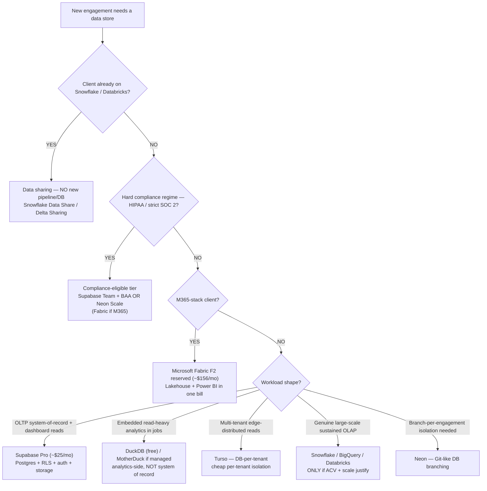
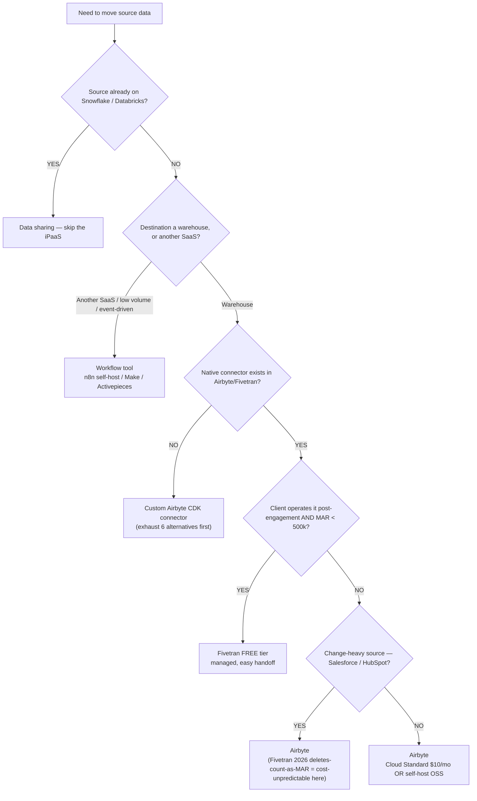
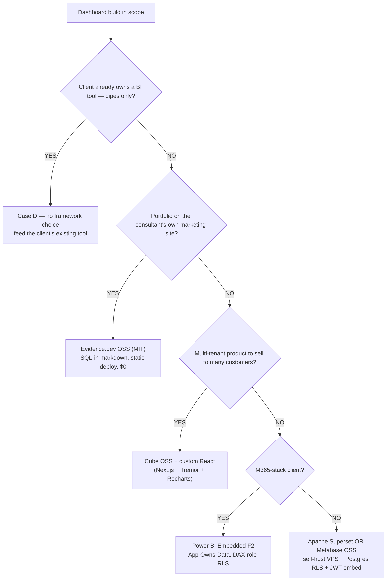
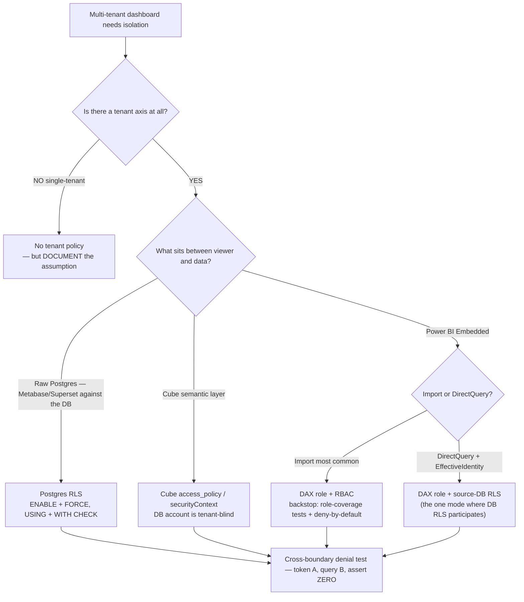
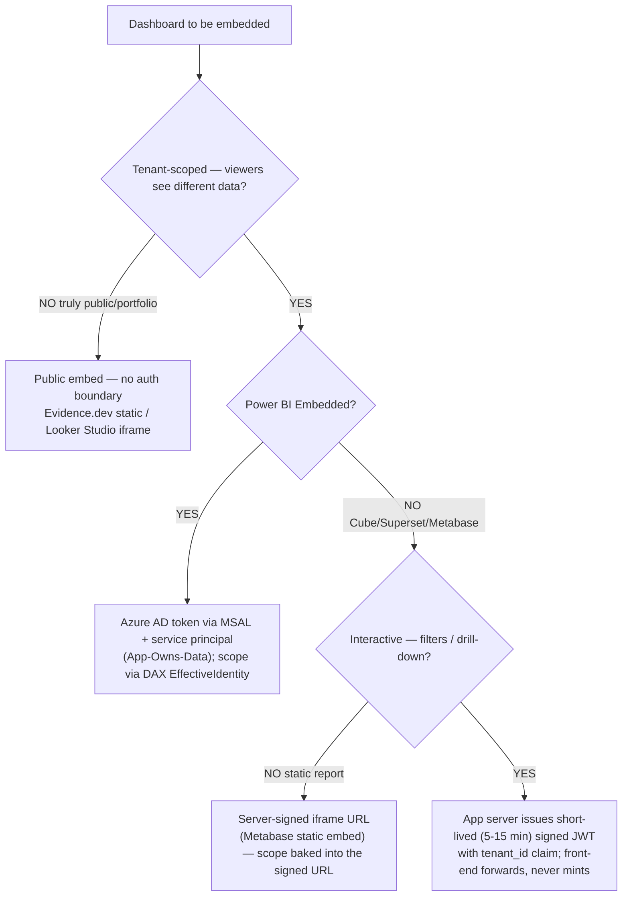
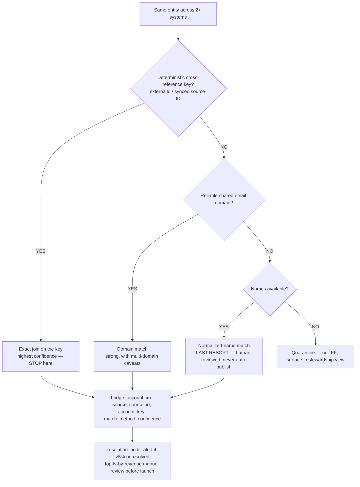
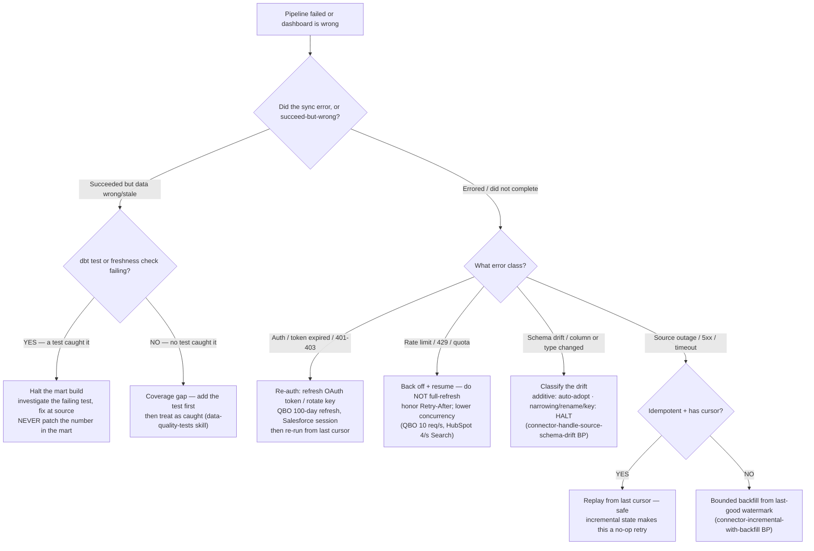
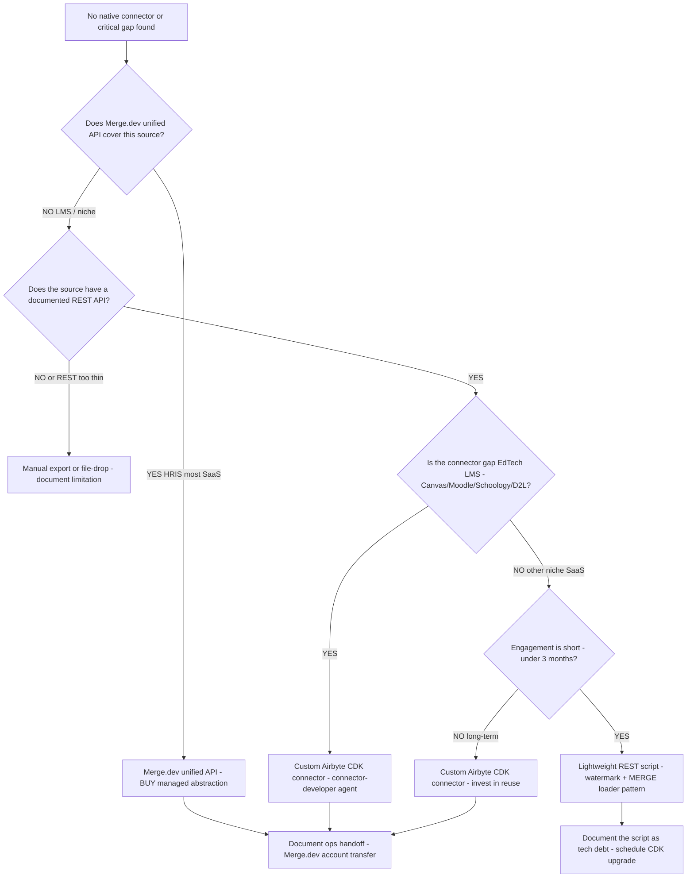
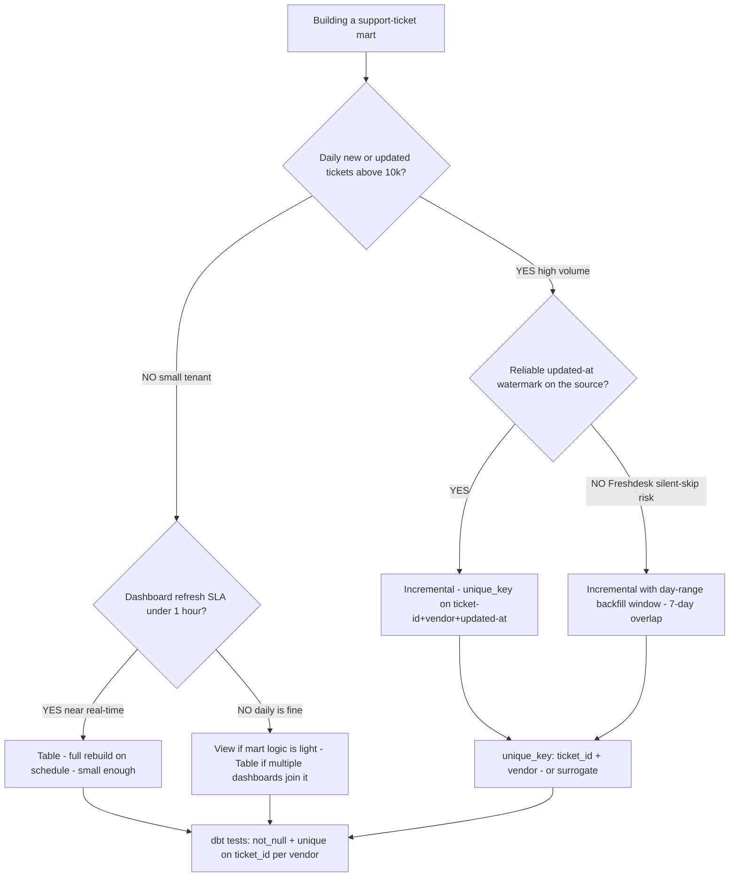
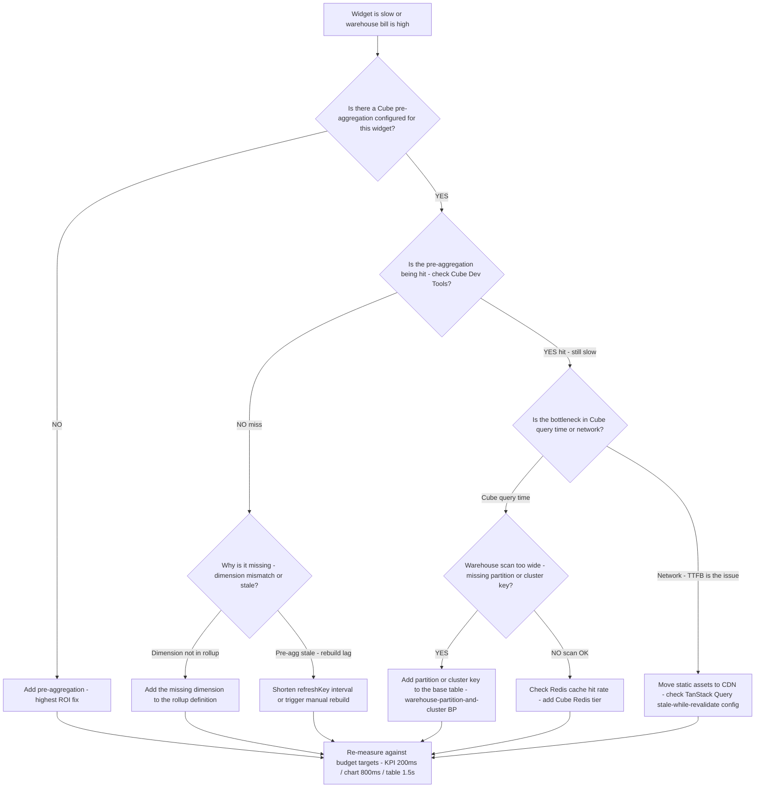

# Data-platform decision trees

> Canonical `## Decision Tree:` sections for the four-layer dashboard engagement (DB / ELT / dashboard / embed). Each tree follows the marketplace format in [`../../../docs/best-practices/decision-trees-in-knowledge-files.md`](../../../docs/best-practices/decision-trees-in-knowledge-files.md): an observable **When this applies**, a **Last verified** date (anti-staleness backstop), a Mermaid flowchart, per-leaf rationale, and a tradeoffs table for any tree with ≥3 leaves.
>
> **Decision-tree traversal (priors).** When a user's situation matches a tree's entry condition, traverse the Mermaid graph top-to-bottom **before** selecting a method — do NOT pattern-match on keywords in the situation description. The first branch where the condition resolves cleanly is the leaf to apply.
>
> These trees are **complementary to** (not a replacement for) the Case A/B/C/D `stack-selection` skill tree ([`../skills/stack-selection/SKILL.md`](../skills/stack-selection/SKILL.md)) — that tree names the engagement Case; these trees pick the tool *within* a layer once the Case is known. Pricing claims are volatile — every `$` figure here is `[verify-at-build]` against the retrieval-dated landscape files before quoting a client.

---

## Decision Tree: Warehouse / database — which engine for this workload?

**When this applies:** a new engagement needs a system-of-record and/or analytics store, OR a client asks "which database?" The Case (A/B/C/D) is already named; this picks the engine. Observable inputs: workload shape (OLTP-plus-dashboard-reads vs. embedded analytics vs. large-scale OLAP), whether the client is *already* on a lakehouse, M365-alignment, and a hard compliance regime.

**Last verified:** 2026-05-30 against [`cloud-database-landscape-2026.md`](cloud-database-landscape-2026.md) (itself last reviewed 2026-05-21). Pricing volatile — re-confirm before quoting.

**Rationale per leaf:**
- *SHARE* — copying data already on a lakehouse adds cost + latency for zero benefit; the share *is* the integration (house opinion #10).
- *COMPLY* — compliance can override the cost default; surface the BAA/eligibility before recommending a tier.
- *FABRIC* — M365 alignment (Power BI integration, Entra-ID RLS) earns Fabric even when it isn't cheapest.
- *SUPA* — Postgres+RLS+auth+storage in one connection string is the lowest-setup non-Microsoft default.
- *DUCK* — embedded analytics engine for pipeline jobs/read paths; not where customer writes live.
- *TURSO* — DB-per-tenant gives cheap hard isolation + edge-distributed reads for many small tenants.
- *OLAP* — the lakehouse default is correct *because* the workload demands it; below `$25k` ACV it doesn't.
- *NEON* — instant Git-like branching is a real differentiator for a consultant running 4-6 simultaneous engagements.

**Tradeoffs summary:**

| Engine | ~Monthly (SMB) | Multi-tenant fit | Setup burden | Use when |
|---|---|---|---|---|
| Supabase Pro | ~$25 | RLS (force-on) | Lowest | Default non-Microsoft OLTP + dashboard reads |
| Neon | ~$5+ usage | RLS | Low | Branch-per-engagement isolation matters |
| Fabric F2 reserved | ~$156 | Entra-ID / DAX-role RLS | Medium | M365-stack client |
| Turso | ~$5-25 | DB-per-tenant | Low-medium | Many small tenants, edge reads |
| DuckDB / MotherDuck | $0 / ~$250 (Business) | n/a (read path) | Low | Embedded analytics, not system-of-record |
| Snowflake / BigQuery / Databricks | $250-2,000+ | warehouse row-policies | High | Genuine large-scale OLAP, or client already there |

---

## Decision Tree: ELT / ingestion tool — share, workflow, managed, or custom?

**When this applies:** data must move from a source into the warehouse, OR a client asks "Airbyte vs Fivetran vs custom?" Observable inputs: source already on a lakehouse, destination is a warehouse vs. another SaaS, monthly active rows (MAR) volume, whether a native connector exists, and who operates it post-engagement.

**Last verified:** 2026-05-30 against [`ipaas-connector-landscape-2026.md`](ipaas-connector-landscape-2026.md) (last reviewed 2026-05-21). The Fivetran 2026 deletes-count-as-MAR change is current as of this date.

**Rationale per leaf:**
- *SHARE* — same as the warehouse tree; a lakehouse-resident source needs a grant, not a pipeline.
- *FLOW* — SaaS-to-SaaS, event-driven, low-volume work is the workflow-tool lane; n8n self-hosted is the cheapest credible option. **requires:** a small VPS to self-host.
- *CUSTOM* — only after exhausting Airbyte catalog → Fivetran → Hevo/Stitch/Estuary → Workato/Tray → Merge.dev → REST-script. EdTech LMS (Canvas/Moodle/Schoology) is the canonical gap. Routes to `connector-developer`.
- *FIVETRAN* — the one Fivetran tier to default-recommend: free, fully managed, hands off cleanly when the client takes over and MAR is under 500k.
- *AIRBYTE_CH* — on change-heavy sources the 2026 deletes-count MAR change makes Fivetran cost-unpredictable for fixed-fee work; Airbyte avoids the cliff.
- *AIRBYTE* — the default ELT: Cloud Standard for short engagements, self-host OSS for sticky/long-running ones.

**Tradeoffs summary:**

| Path | Cost model | Handoff ease | Ops burden | Use when |
|---|---|---|---|---|
| Data sharing | Storage only | n/a (grant) | None | Source on a lakehouse |
| Workflow (n8n) | Flat / VPS | Medium | Low | SaaS-to-SaaS, low volume |
| Fivetran free | Flat (<500k MAR) | Easiest (managed) | Lowest | Client takes over, MAR<500k |
| Airbyte Cloud | $10/mo + credits | Medium | Low | Default warehouse ELT, short engagement |
| Airbyte self-host | VPS only | Hardest (runbook!) | High | Sticky, cost-sensitive, firm hosts |
| Custom Airbyte CDK | Build + maintain | Posture-dependent | Highest | No native connector (EdTech LMS) |

---

## Decision Tree: BI / embed framework — which dashboard tool?

**When this applies:** the engagement includes a dashboard build (Case A/B/C — NOT Case D, where the client owns the BI tool). Observable inputs: portfolio-vs-client-vs-product, M365 alignment, viewer count, and whether the deliverable is a multi-tenant product.

**Last verified:** 2026-05-30 against [`embedded-analytics-landscape-2026.md`](embedded-analytics-landscape-2026.md) (last reviewed 2026-05-21). Per-viewer pricing figures are volatile — re-confirm before quoting.

**Rationale per leaf:**
- *CASE_D* — the dashboard build is out of scope; stay in the data-pipes lane (don't sell a dashboard the client doesn't need). **Sub-case — the client already owns Sigma-on-Snowflake and wants the analytics there:** that is not a framework _choice_ but a leverage-the-sunk-investment call — Sigma is then the right primary surface (Snowflake-native, pushes compute down, governed-metrics/semantic layer, RLS via Snowflake roles). The per-viewer-pricing caution below governs greenfield _selection_, not leveraging an already-owned tool; do **not** add Tableau alongside it (a second semantic layer = metric drift). See [`sigma-when-already-owned.md`](sigma-when-already-owned.md).
- *EVIDENCE* — single-tenant + version-controlled + public means no embed-auth complexity; OSS Evidence handles SQL-fenced-block authoring at $0 (Evidence *Cloud* has no free tier and Embedded is Enterprise-only — stay on OSS).
- *CUBE* — a multi-tenant product needs a semantic layer to avoid shipping raw SQL to the browser; Cube owns the query plan, caching, and `securityContext` isolation.
- *PBI* — M365 alignment makes Entra-ID/DAX-role RLS the path of least resistance; F2 is flat-capacity (no per-viewer). Coordinate with `power-platform/power-bi-engineer`.
- *OSS* — non-Microsoft + 5-50 viewers means per-viewer pricing kills the math; Superset/Metabase OSS with Postgres RLS + JWT embed is the consulting-friendly default.

**Tradeoffs summary:**

| Tool | Cost | Multi-tenant | Embed auth | Use when |
|---|---|---|---|---|
| Evidence.dev OSS | $0 | No (single-tenant) | none (public) | Case A portfolio |
| Superset/Metabase OSS | ~$20-40/mo VPS | Yes (Postgres RLS) | JWT guest token | Case B, non-Microsoft |
| Power BI Embedded F2 | ~$156-262/mo flat | Yes (DAX roles) | Azure AD via MSAL | Case B, M365 client |
| Cube OSS + React | $0 OSS + infra | Yes (`securityContext`) | short-lived JWT | Case C productized SaaS |
| **Per-viewer traps** (Looker/Tableau/Sigma/Metabase Pro) | $400+/viewer/yr | varies | varies | Flag the math — avoid for SMB |

**Failure modes to avoid:** recommending a per-viewer-priced tool for Case B/C without showing the 5-50 viewers × 4-6 clients math; putting Case C on raw Postgres with no semantic layer; recommending Evidence Cloud (no free tier) for Case A.

---

## Decision Tree: RLS / tenant-isolation enforcement layer — where does the boundary live?

**When this applies:** a multi-tenant dashboard needs tenant isolation and you must choose the *enforcement layer*. Observable input: the architecture between the viewer and the data — raw Postgres vs. a semantic layer (Cube) vs. Power BI's model. The invariant is fixed; this tree picks the layer that satisfies it.

**Last verified:** 2026-05-30 against [`multi-tenant-rls-patterns.md`](multi-tenant-rls-patterns.md) (last reviewed 2026-05-21).

**Rationale per leaf:**
- *SINGLE* — no tenant axis means no policy, but an undocumented single-tenant assumption is a silent foot-gun for a future multi-tenant pivot.
- *PG* — when BI reads the DB directly, the DB is the closest layer the viewer can't influence; `FORCE` stops owner/ELT bypass.
- *CUBE* — Cube injects the tenant filter before SQL generation; the DB connection account is intentionally tenant-blind, so the semantic layer *is* the boundary.
- *PBI_IMPORT* — the service principal needs all tenants' rows to slice per-viewer, so source-DB RLS can't participate; DAX roles + deny-by-default are the control. **requires:** every role has a coverage test.
- *PBI_DQ* — DirectQuery + EffectiveIdentity passes identity through, so source-DB RLS *does* participate alongside DAX roles (the narrow exception).
- *TEST* — every leaf terminates at the mandatory denial test; **no test, no merge**, regardless of stack.

**Tradeoffs summary:**

| Layer | Primary control | Backstop | App-code role | Escalation |
|---|---|---|---|---|
| Postgres RLS | `FORCE` RLS policy | — (DB is closest) | redundant only | `security-reviewer` |
| Cube `access_policy` | `securityContext` filter | warehouse row-policy | redundant only | `security-reviewer` |
| Power BI (Import) | DAX role + RBAC | role-coverage + deny-by-default | redundant only | `power-bi-engineer` + `security-reviewer` |
| Power BI (DirectQuery) | DAX role | source-DB RLS via EffectiveIdentity | redundant only | `power-bi-engineer` + `security-reviewer` |
| Single-tenant | none (no axis) | n/a | n/a | document assumption |

**Forbidden in every branch:** app-code `where tenant_id = …` as the *load-bearing* control on a viewer-facing read path. Acceptable only as a redundant layer or in back-end ELT/job code.

---

## Decision Tree: Embed authentication — signed JWT, server proxy, or public?

**When this applies:** a dashboard must be embedded and you must choose how the embed authenticates the viewer's tenant scope. Observable inputs: is the dashboard tenant-scoped at all, is it interactive (filters/drill) vs. static, and is it Power BI (Azure AD) vs. an app-issued-JWT tool (Cube/Superset/Metabase).

**Last verified:** 2026-05-30 against [`../skills/jwt-embed-issuance/SKILL.md`](../skills/jwt-embed-issuance/SKILL.md) + [`../skills/embed-csp-and-iframe-sandboxing/SKILL.md`](../skills/embed-csp-and-iframe-sandboxing/SKILL.md).

**Rationale per leaf:**
- *PUBLIC* — no tenant boundary means no token to issue; a static deploy or iframe is correct. (Still set `frame-ancestors`.)
- *PBI* — Power BI doesn't use app-issued JWTs; the token is an Azure AD access token via MSAL, scoped by DAX `EffectiveIdentity`. **requires:** a service principal + secret in server-side Key Vault, never in the SPA.
- *STATIC* — a non-interactive report's scope can be baked into a server-signed iframe URL; the short-lived-refresh pattern matters less, but the signing secret still stays server-side.
- *JWT* — the 2026 standard for interactive embeds: the *server* mints a 5-15 min JWT carrying the `tenant_id` claim from the authenticated session; the browser only requests and forwards it — **it never holds the signing secret**.

**Tradeoffs summary:**

| Method | Token | Lifetime | Secret location | Use when |
|---|---|---|---|---|
| Public embed | none | n/a | n/a | Truly public / portfolio (Case A) |
| Server-signed iframe URL | signed URL | per-URL | server only | Static non-interactive report |
| App-issued JWT | short-lived JWT | 5-15 min | server env only | Interactive Cube/Superset/Metabase embed |
| Azure AD via MSAL | AAD access token | AAD-managed | server Key Vault | Power BI Embedded (App-Owns-Data) |

**Forbidden in every branch:** shipping the signing/service key to the browser (any `NEXT_PUBLIC_*` secret, inline `.tsx` secret, or long-lived web-component attribute), or deriving `tenant_id` from a URL/query param. Any embed-auth change is **security-sensitive → escalate to `ravenclaude-core/security-reviewer`**.

---

## Decision Tree: Cross-system identity resolution — which match method?

**When this applies:** the build stitches the same real-world entity — usually a customer account — across two or more source systems into one conformed spine (e.g., Salesforce Account → Planhat company → Intercom company → Slack channel). This is the #1 silent-correctness risk in any multi-source analytics build: every metric sits on top of a join, and a wrong join is wrong invisibly.

**Last verified:** 2026-06-03 against [`../best-practices/resolve-identity-deterministic-keys-before-fuzzy.md`](../best-practices/resolve-identity-deterministic-keys-before-fuzzy.md) and [`../skills/cross-system-identity-resolution/SKILL.md`](../skills/cross-system-identity-resolution/SKILL.md).

**Rationale per leaf:**

- _DET_ — exhausting deterministic options costs minutes of investigation; a wrong fuzzy match costs weeks to undo after it propagates through a mart. Look for a synced external ID first (Planhat `externalId`, Intercom `company_id` carrying the Salesforce Account ID).
- _DOMAIN_ — strong second choice, but multi-domain customers and shared/consumer domains (gmail.com) make it imperfect; never the sole key for a high-stakes account.
- _NAME_ — "Acme Corp" vs "Acme Corporation" is a coin-flip; acceptable only as a human-reviewed candidate, never an auto-published join.
- _QUAR_ — unresolved is an explicit state (null FK), never a silent drop; the stewardship surface is where a human confirms low-confidence matches.

**Failure modes to avoid:** reaching for a name join first because it's easy to code; auto-publishing a name-only match to a dashboard; dropping unresolved rows silently instead of quarantining them; shipping without the `resolution_audit` alert or the top-N manual review. Full procedure: [`../skills/cross-system-identity-resolution/SKILL.md`](../skills/cross-system-identity-resolution/SKILL.md).

---

## Decision Tree: Pipeline failure — what broke, and what's the recovery move?

**When this applies:** a scheduled ELT sync failed, alerted, or produced a wrong/stale number, OR a client asks "the dashboard is wrong/empty — what happened?" This tree triages the failure to a class and routes to the recovery move; it does **not** replace the per-source runbook (it tells you which runbook section to open). Observable inputs: the sync's exit signal (error vs success-but-wrong), the error class (auth / rate-limit / schema / data-quality), and whether the warehouse holds a last-good state to recover from.

**Last verified:** 2026-06-01 against [`ipaas-connector-landscape-2026.md`](ipaas-connector-landscape-2026.md) and the [`../skills/data-quality-tests/SKILL.md`](../skills/data-quality-tests/SKILL.md) taxonomy. The failure-class taxonomy is stable; vendor-specific error codes are `[verify-at-build]`.

**Rationale per leaf:**
- *QUARANTINE* — a succeeded-but-wrong sync is the dangerous case; the fix is upstream (fix the source / staging cast), never an override in the mart cell — that's the data-platform equivalent of the compliance "fix-the-source-not-the-return" rule. Halt the mart so the wrong number never publishes.
- *GAP* — if nothing caught it, the test coverage is the defect; add the test (so it catches the *next* occurrence), then proceed as caught. House discipline: no test, no merge.
- *AUTH* — token/credential expiry is the single most common recurring failure on handed-off pipelines; the recovery is re-auth then resume from cursor, not a full re-pull.
- *RATE* — a 429 is a *pacing* problem, not a data problem; full-refreshing on a rate-limit error makes it worse and can trip the 2026 Fivetran deletes-count-as-MAR cost cliff. Honor `Retry-After`, lower concurrency, resume.
- *SCHEMA* — routes to the schema-drift BP's classification table; the recovery branches on drift kind (auto-adopt additive, halt on narrowing/rename/key change).
- *REPLAY* — an idempotent connector with a cursor turns a transient source outage into a safe no-op retry; this is *why* `connector-incremental-with-backfill` is a standing default.
- *BACKFILL* — without idempotency/cursor, recover by re-running a bounded window from the last-good watermark, not the whole history.

**Tradeoffs summary:**

| Failure class | Recovery move | Re-pull scope | Cost risk if mishandled |
|---|---|---|---|
| Succeeded-but-wrong | Halt mart, fix source | none (don't write) | Wrong number ships to client |
| Auth / 401 | Re-auth, resume from cursor | incremental only | Repeated full-pull on each expiry |
| Rate limit / 429 | Back off, resume | incremental only | MAR cost cliff (Fivetran) |
| Schema drift | Classify → adopt or halt | depends on kind | Silent column drop / type corruption |
| Transient 5xx (idempotent) | Replay from cursor | last cursor | none — safe retry |
| Transient 5xx (not idempotent) | Bounded backfill | last-good window | Duplicate rows / double-count |

**Escalation:** a PII/PHI source that failed mid-load → loop in `ravenclaude-core/security-reviewer` before replaying (don't re-expose partial sensitive data); a structural re-plan (key change, source split) → back to `etl-pipeline-engineer` for topology, `connector-developer` if a custom source needs rework.

---

## Decision Tree: Connector gap — build, buy, or workaround?

**When this applies:** the source system has no first-class managed connector in Fivetran or Airbyte Cloud, OR the available connector has a known critical limitation (missing endpoint, broken incremental). Observable inputs: source category (LMS / HRIS / niche SaaS), whether a Merge.dev or Unified API covers it, and the engagement's ops-handoff requirement.

**Last verified:** 2026-06-05 against `knowledge/edtech-lms-connector-gap.md` and `knowledge/hris-integration.md`.

**Rationale per leaf:**
- *MERGE* — for HRIS (Workday, BambooHR, ADP, Rippling, Gusto) and many CRM/productivity sources, Merge.dev's unified API is a BUY decision; it eliminates per-vendor auth+schema work and transfers maintenance to Merge.
- *LMS* — the EdTech LMS gap (Canvas/Moodle/Schoology) is the plugin's highest-leverage proprietary claim; no managed option exists; route to `connector-developer`.
- *SCRIPT* — a short engagement doesn't justify a full CDK connector; a watermark-keyed REST script with a MERGE-pattern upsert is correct-enough and documented as tech debt.
- *CDK* — long-running or multi-engagement sources justify the CDK investment for reuse and Airbyte catalog compatibility.
- *MANUAL* — when no API exists, file-drop is the only path; document it as a data-quality risk (no automated freshness checks).

**Tradeoffs summary:**

| Path | Build cost | Ops burden | Handoff ease | Use when |
|---|---|---|---|---|
| Merge.dev unified API | Low | None (managed) | Easy | HRIS / most SaaS with Merge coverage |
| Custom Airbyte CDK | High | Medium | Runbook required | EdTech LMS / no native + long engagement |
| REST script | Medium | Medium | Runbook required | Short engagement / single niche source |
| Manual export | None | Manual | Fragile | No API available |

---

## Decision Tree: dbt materialization for a support-ticket mart

**When this applies:** building a `fct_ticket` or `fct_conversation_event` mart over a conformed support source (Zendesk, Freshdesk, Intercom, SFDC Service Cloud, JSM, HubSpot Service, Help Scout, Front) and choosing the materialization strategy. Observable inputs: ticket volume per day, whether SLA breach and first-response-time fields require near-real-time freshness, and the dashboard refresh SLA agreed with the client.

**Last verified:** 2026-06-05 against `skills/support-ticket-normalization/SKILL.md` and `skills/dbt-project-scaffolding/SKILL.md`.

**Rationale per leaf:**
- *INC* — above 10k daily tickets, a full rebuild scans the entire staging table on every run; incremental with a reliable `updated_at` watermark is the correct trade.
- *INC_SAFE* — Freshdesk's `updated_since` filter has a known silent-skip behavior (per `knowledge/freshdesk-integration.md`); a 7-day overlap window catches rows that slip through the watermark.
- *TABLE_FAST* — at small volume, a full rebuild is cheaper than incremental bookkeeping and avoids the `updated_at` reliability question.
- *VIEW_OR_TABLE* — a view defers compute to query time (correct for rarely-used mart variants); a table is better when multiple dashboards join it and scan cost matters.

**Tradeoffs summary:**

| Strategy | Full-rebuild cost | Freshness risk | Watermark reliability required | Use when |
|---|---|---|---|---|
| Incremental + watermark | Low | Low | High | High volume + reliable updated_at |
| Incremental + day-range overlap | Low-medium | Low | Medium | Freshdesk or sources with silent-skip |
| Table full-rebuild | High | None | Not required | Small tenant, hourly refresh OK |
| View | None | Deferred to query | Not required | Rarely queried, light logic |

---

## Decision Tree: Dashboard performance problem — where is the bottleneck?

**When this applies:** a dashboard widget is slow to load (KPI >200ms, chart >800ms, table >1.5s per the plugin's budget targets), or the warehouse bill has spiked after a dashboard launch. Observable inputs: whether the widget uses a pre-aggregation, the query plan from Cube Dev Tools, and the warehouse scan size.

**Last verified:** 2026-06-05 against `skills/dashboard-performance-tuning/SKILL.md`.

**Rationale per leaf:**
- *FIX_PREAG* — a widget with no pre-aggregation pays full warehouse scan on every load; this is the single highest-ROI fix in almost all slow-dashboard diagnoses.
- *ROLLUP* — a pre-aggregation miss due to an unlisted dimension means the rollup definition is incomplete; the fix is schema, not infra.
- *REFRESH* — a stale pre-aggregation serves yesterday's data; shortening `refreshKey` is a trade between freshness and compute cost.
- *PART* — a Cube query hitting a Postgres/Snowflake table without a partition key on the time dimension scans the whole table; partition/cluster keys are the lowest-layer fix.
- *CACHE* — Redis caches Cube query results across viewers; a low cache hit rate on a frequently-queried widget is a missed configuration, not a query problem.
- *CDN* — if the pre-aggregation hits but the page still feels slow, TTFB/asset delivery is the bottleneck; TanStack Query's `stale-while-revalidate` eliminates loading spinners on re-visits.

**Tradeoffs summary:**

| Fix | Cost to implement | Blast radius | Freshness impact | Use when |
|---|---|---|---|---|
| Add pre-aggregation | Low-medium | None | Controlled by refreshKey | No pre-agg configured |
| Fix rollup definition | Low | None | None | Pre-agg missing on dimension |
| Shorten refreshKey | Low | Compute cost | Better freshness | Pre-agg too stale |
| Add partition key | Medium | Schema migration | None | Warehouse scan too wide |
| Add Redis cache | Medium | None | None | Cube cache hit rate low |
| CDN + stale-while-revalidate | Low | None | None | Network TTFB is bottleneck |

---

## See also

- [`../skills/stack-selection/SKILL.md`](../skills/stack-selection/SKILL.md) — the Case A/B/C/D tree these layer-trees sit under
- [`cloud-database-landscape-2026.md`](cloud-database-landscape-2026.md) · [`ipaas-connector-landscape-2026.md`](ipaas-connector-landscape-2026.md) · [`embedded-analytics-landscape-2026.md`](embedded-analytics-landscape-2026.md) · [`multi-tenant-rls-patterns.md`](multi-tenant-rls-patterns.md) — the retrieval-dated landscape sources each tree verifies against
- [`../best-practices/`](../best-practices/) — the named rules the leaves implement (warehouse selection, ELT, RLS authoring, embed secret-handling, CSP)
- [`../../../docs/best-practices/decision-trees-in-knowledge-files.md`](../../../docs/best-practices/decision-trees-in-knowledge-files.md) — the format these trees follow

## Refresh triggers

- Any landscape file these trees cite is re-reviewed (warehouse / iPaaS / embedded-analytics / RLS) → re-verify the affected tree and bump its **Last verified** date.
- A pricing restructure changes a leaf's recommendation (Fivetran MAR, Power BI F-SKU, MotherDuck floor have all moved recently).
- A new tool crosses the SMB-friendly threshold (would add a leaf).
- `last-verified:` older than 90 days on any tree (the marketplace anti-staleness backstop).
