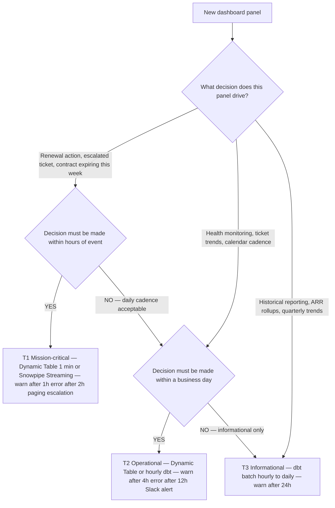
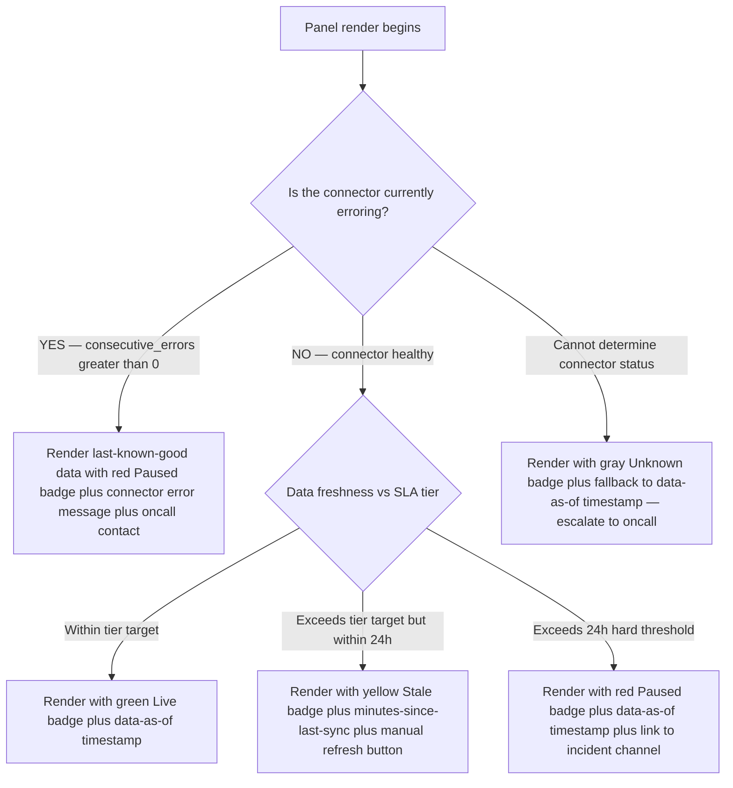

# ELT freshness SLA patterns

> **Last reviewed:** 2026-06-04. Sources: integrate.io SLA building guide, tacnode freshness-vs-latency distinction, Smashing Magazine 2025 UX strategies for real-time dashboards, Elementary dbt source freshness docs, dbt Labs "data SLAs best practices" (URLs in `## References`). Refresh when: (a) dbt Source freshness API changes, (b) Snowflake `FRESHNESS()` SDMF GA changes its interface, (c) Elementary's `freshness_anomalies` test reaches a breaking version, or (d) the three-state UX pattern is superseded by a stronger industry convention.

## TL;DR

- **"Real-time" is the wrong default.** Most operational dashboards need *fresh enough*, not *real-time*. The PSM 8am dashboard wants last-night-fresh, not last-millisecond-fresh.
- **Freshness ≠ latency.** A pipeline can run fast (low latency) and serve stale data (low freshness). Instrument both separately.
- **Five-element SLA template:** freshness target, availability, monitoring mechanism, escalation procedure, consequences. Define before designing the pipeline.
- **Three-state UX badge — "Live / Stale / Paused"** — is the load-bearing dashboard pattern. Per Smashing Magazine 2025.
- **SLA tiers:** mission-critical (1–2h freshness) vs informational (≤24h). Don't pay for tier 1 on a tier 3 panel.
- **Graceful degradation on connector failure:** the dashboard renders with a stale badge, never blanks. A blank dashboard is worse than a stale one.

## Freshness vs latency — the distinction

| Concept | What it measures | Failure shape |
|---|---|---|
| **Latency** | How long a query takes to return | Slow dashboard. User-visible. |
| **Freshness** | How old the underlying data is | Wrong-but-fast answer. User-invisible without telemetry. |
| **Pipeline success rate** | Whether the load ran without erroring | A pipeline can succeed against a stalled source and load zero new rows. |

**The silent killer:** a fast query against stale data. The PSM sees a snappy dashboard, the panels render in 200ms, and the data underneath is 48 hours old because a Planhat keypair expired and the sync silently stopped. **Freshness telemetry is the only defense.**

## The five-element SLA template

A real-time-dashboard SLA specifies five things `[verify-at-use — 2026-06-04]`:

1. **Freshness target** — "data must be ≤N minutes/hours old."
2. **Availability** — typically 99.5%–99.9% for an internal dashboard.
3. **Monitoring mechanism** — how breach is detected (e.g., dbt source freshness check on a fact table, alerting to Slack).
4. **Escalation procedure** — who gets paged, when, on what channel.
5. **Consequences** — what the SLA buys; what its breach costs.

For "PSM opens dashboard at 8am, needs last-night-fresh," a realistic SLA looks like:

- Freshness ≤ **2 hours** during business hours; ≤ 12 hours overnight `[unverified — practitioner heuristic]`.
- Availability 99.5% (the dashboard is up and serving) `[unverified — common SaaS baseline]`.
- Stale-data warning visible if freshness > 4 hours.
- Hard error/paused badge if freshness > 24 hours OR pipeline error count > 3 consecutive runs.
- Escalation: Slack alert to `#data-platform-oncall` on stale-data warning; PagerDuty page on hard-error/paused.
- Consequences: missed SLA logged in a quarterly RAID review; no monetary consequences for internal dashboards.

## SLA tier model — mission-critical vs informational

Not every panel needs the same SLA. Tier the panels by **decision cost** — what happens if this panel is wrong by 12 hours?

| Tier | Freshness target | Panels in tier | Example breach cost |
|---|---|---|---|
| **T1 — Mission-critical** | ≤ 1 hour | Renewal alerts (notice window opening), escalated tickets > N hours old, contracts expiring this week | PSM misses a renewal action; partner churns. |
| **T2 — Operational** | ≤ 4 hours | Health score, ticket counts, calendar touch cadence | PSM uses stale signal but trend direction is right. |
| **T3 — Informational** | ≤ 24 hours | ARR rollups, contract counts by stage, historical trends | Reporting drift; no immediate decision impact. |

**The design rule:** route T1 panels through Dynamic Tables (1-min) or Snowpipe Streaming. Route T3 through dbt batch at hourly+ cadence. **Do not pay for T1 freshness on a T3 panel.**

## Freshness telemetry — what to instrument

Four signals, each catches a different failure mode:

### 1. `max(source_event_time)` per fact table

The semantic-level freshness — when did real-world data last change? A pipeline that succeeds with zero new rows looks healthy at the orchestrator level but has a flat `max(source_event_time)`.

```sql
-- models/marts/mart_freshness_telemetry.sql
select
    'fct_support_ticket' as table_name,
    max(created_at) as max_source_event_time,
    datediff('minute', max(created_at), current_timestamp()) as minutes_since_event,
    count(*) as row_count
from {{ ref('fct_support_ticket') }}

union all

select 'fct_calendar_event', max(start_utc),
       datediff('minute', max(start_utc), current_timestamp()),
       count(*)
from {{ ref('fct_calendar_event') }}
```

### 2. dbt source freshness checks (built-in) `[verify-at-use — 2026-06-04]`

Declare in `_sources.yml`:

```yaml
sources:
  - name: salesforce
    loaded_at_field: _fivetran_synced
    freshness:
      warn_after: { count: 2, period: hour }
      error_after: { count: 6, period: hour }
    tables:
      - name: account
      - name: opportunity
```

Run via `dbt source freshness`. Failures flow into the orchestration alerting.

### 3. Elementary OSS `freshness_anomalies` `[verify-at-use — 2026-06-04]`

Elementary layers on dbt and detects **drift vs historical baseline** — "this table is usually fresh within 1 hour but is now 3 hours stale." Sends Slack/Teams alerts.

The anomaly test catches the case where the absolute thresholds (`warn_after`, `error_after`) are too loose but the relative drift indicates a problem.

### 4. Snowflake `FRESHNESS()` system data metric function `[verify-at-use — 2026-06-04]`

Table-level freshness as a SQL primitive. Useful for dashboards that need to render freshness without a separate orchestration callout:

```sql
select system$reference('TABLE', 'analytics.fct_support_ticket') as ref,
       system$data_metric_scheduled_time() as last_check_time,
       freshness(ref) as freshness_minutes;
```

Pair with row-access policy checks to expose to the dashboard layer safely.

## Three-state stale-data UX pattern — Live / Stale / Paused

Smashing Magazine's 2025 "UX strategies for real-time dashboards" piece codifies the load-bearing pattern `[verify-at-use — 2026-06-04]`:

| Badge | Trigger | Color | What the PSM sees |
|---|---|---|---|
| **Live** | Freshness within SLA target | Green | "Data as of 07:58 EST — Live" |
| **Stale** | Freshness exceeds target but pipeline still running | Yellow | "Data as of 04:12 EST — Stale (last sync 3h ago)" |
| **Paused** | Pipeline errored OR freshness > hard threshold | Red | "Data as of 22:30 yesterday — Paused (connector error since 02:15)" |

**Design rules:**

- **Per-panel badge** — not just a global dashboard freshness indicator. Different panels can have different freshness because they're fed by different connectors.
- **Manual refresh button + freshness timestamp** visible per panel — improves transparency, reinforces user control.
- **Three states, not five.** Resist the urge to add "Warning" / "Critical" / "Unknown" — practitioners stop reading detail after three.
- **Analysts get detailed update logs** (click the badge to see "Last 10 syncs, durations, row counts"); **business users get the simple state.**

### Implementation pattern

```sql
-- The query the dashboard runs to compute its badge
with panel_freshness as (
    select 'support_tickets' as panel,
           datediff('minute', max(created_at), current_timestamp()) as minutes_stale,
           max(_loaded_at) as last_sync,
           (select count(*) from {{ ref('mart_connector_health') }}
            where source = 'zendesk' and status = 'error'
              and error_at > current_timestamp() - interval '1 hour') as error_count
    from {{ ref('fct_support_ticket') }}
)
select panel, last_sync,
       case
           when error_count > 0 or minutes_stale > 1440 then 'paused'
           when minutes_stale > 240 then 'stale'
           else 'live'
       end as badge_state,
       case
           when error_count > 0 then 'Connector error since ' || error_count || ' attempts'
           when minutes_stale > 240 then 'Last sync ' || minutes_stale || ' minutes ago'
           else 'Live — last sync ' || minutes_stale || ' minutes ago'
       end as badge_label
from panel_freshness
```

## Graceful degradation on connector failure

When a connector fails, the dashboard must **not** blank or error out. The dashboard renders the last-known-good data with a Paused badge.

| Failure | Dashboard behavior |
|---|---|
| Zendesk connector errors for 1 sync | Ticket panels render with last sync's data + Stale badge. |
| Zendesk connector errors for 24 hours | Ticket panels render with 24h-stale data + Paused badge. |
| Zendesk warehouse table missing (catastrophic) | Panel renders an explicit "Data unavailable — contact data-platform-oncall" placeholder, NOT a JavaScript error. |
| Snowflake warehouse suspended | Dashboard returns last cached panel results (Hex / Tableau / Cube) + "Data store unavailable" notice. |

**The anti-pattern:** a panel that throws a 500 error to the PSM. The PSM doesn't know whether the data is bad or the dashboard is bad. Always render *something* with a clear state badge.

### Connector health table

A central table tracks connector state across the warehouse:

```sql
create table analytics.mart_connector_health (
    source              varchar primary key,    -- 'planhat' | 'sfdc' | 'zendesk' | …
    last_sync_at        timestamp,
    last_success_at     timestamp,
    last_error_at       timestamp,
    last_error_message  varchar,
    consecutive_errors  integer,
    sla_freshness_target_minutes integer,       -- T1: 60, T2: 240, T3: 1440
    current_tier        varchar,                 -- 'T1' | 'T2' | 'T3'
    status              varchar                  -- 'healthy' | 'degraded' | 'failed'
);
```

Populated by the ingest layer; consumed by every dashboard panel's freshness badge.

## Decision Tree: Freshness SLA Tier Assignment

**When this applies:** You are scoping a new dashboard panel and need to assign it an SLA tier. The tier dictates pipeline architecture, monitoring intensity, and cost.

**Last verified:** 2026-06-04 against dbt Labs data SLAs best-practices guide + integrate.io SLA building guide.



**Rationale per leaf:**
- *Leaf A — T1 Mission-critical* — partner-facing renewal / escalation decisions. Justifies Dynamic Table + Snowpipe Streaming costs.
- *Leaf B — T2 Operational* — operational monitoring; hourly cadence acceptable; standard dbt batch.
- *Leaf C — T3 Informational* — historical reporting; daily refresh cheap and sufficient.

**Tradeoffs summary table:**

| Tier | Freshness target | Pipeline | Monitoring | Cost shape |
|---|---|---|---|---|
| T1 (A) | ≤ 1h | Dynamic Table 1min / Snowpipe Streaming | Page on breach | Premium |
| T2 (B) | ≤ 4h | Dynamic Table or hourly dbt | Slack alert | Standard |
| T3 (C) | ≤ 24h | Daily dbt batch | Daily summary report | Cheap |

## Composite pipeline pattern

End-to-end, the PSM-dashboard freshness story is:

```
Salesforce / Planhat / Zendesk
    ↓
Fivetran (or Planhat-native Snowflake share)
    ↓
Snowflake raw layer (raw.*)
    ↓
dbt staging (stg_*) + facts (fct_*) — declare source freshness checks
    ↓
Dynamic Tables for hot rollups (1-min cadence)
    ↓
Elementary observability — alert to Slack on anomaly
    ↓
Hex / Streamlit / React renders with three-state freshness badge
```

**Per panel, the dashboard runs two queries:**
1. The panel data query (against the fact / Dynamic Table).
2. A freshness query (against `mart_connector_health` + `max(_loaded_at)` on the fact table).

The badge is computed from (2); the panel renders from (1). Both queries hit the Snowflake result cache.

## Decision Tree: Stale Data — Panel Behavior

**When this applies:** A panel's underlying data is past its SLA freshness threshold but the dashboard render is in flight. The decision is what the user sees.

**Last verified:** 2026-06-04 against Smashing Magazine 2025 UX strategies for real-time dashboards.



**Rationale per leaf:**
- *Leaf A — Connector errored* — the most informative state. Surface the error directly so PSMs don't act on stale data unknowingly.
- *Leaf B — Within tier* — happy path. Live badge.
- *Leaf C — Stale but recoverable* — yellow signal. PSM can still use the data with awareness; manual refresh button drives engagement.
- *Leaf D — Past hard threshold* — red signal. Data is too old to trust for action.
- *Leaf E — Status unknown* — fallback case (e.g., `mart_connector_health` itself is stale). Gray badge + escalation.

## Common gotchas

1. **Pipeline success ≠ data freshness.** A pipeline can succeed against a stalled source. Always instrument `max(source_event_time)` separately.
2. **`CURRENT_TIMESTAMP()` in the freshness check defeats Snowflake result cache** — the freshness query re-executes on every page load. Acceptable because it's a small query, but be aware.
3. **Per-panel badges, not just a global dashboard badge** — panels are fed by different connectors with different SLAs.
4. **Three states, not five.** Live / Stale / Paused. Resist scope creep.
5. **Graceful degradation, never blank** — a blank panel is worse than a stale panel.
6. **`ACCOUNT_USAGE` is 90 minutes stale** — never use for the freshness badge query. Use `INFORMATION_SCHEMA` or the fact-table `max(_loaded_at)`.
7. **dbt source freshness only catches "table not updated"** — it does NOT catch "table updated with zero new rows." Need the semantic `max(source_event_time)` for that.
8. **Elementary `freshness_anomalies` requires historical baseline** — a new pipeline has no baseline; expect ~2 weeks of warmup before anomaly alerts are meaningful.
9. **Timezone confusion on freshness display** — always render freshness in the PSM's local timezone, but compute deltas in UTC.
10. **SLA breach without alert escalation is just a log entry** — wire the Slack/PagerDuty escalation in the same PR as the SLA declaration, not later.

## Refresh triggers

- dbt source freshness API changes.
- Snowflake `FRESHNESS()` SDMF GA changes its interface.
- Elementary `freshness_anomalies` reaches a breaking version.
- A new dashboard tool ships a stronger three-state UX convention.
- Snowflake adds a native dashboard-freshness primitive.

## References

All URLs accessed 2026-06-04.

- https://www.integrate.io/blog/build-slas-for-real-time-dashboards-with-ai-etl/ — Building SLAs for real-time dashboards.
- https://tacnode.io/post/data-freshness-vs-latency — Data freshness vs latency distinction.
- https://www.smashingmagazine.com/2025/09/ux-strategies-real-time-dashboards/ — Smashing Mag UX for real-time dashboards (Live/Stale/Paused pattern).
- https://docs.elementary-data.com/oss/guides/collect-dbt-source-freshness — Elementary dbt source freshness guide.
- https://www.elementary-data.com/dbt-tests/freshness-anomalies — Elementary `freshness_anomalies` test.
- https://docs.getdbt.com/reference/resource-properties/freshness — dbt source `freshness` property.
- https://www.getdbt.com/blog/data-slas-best-practices — dbt Labs on data SLAs best practices.
- https://docs.snowflake.com/en/sql-reference/functions/freshness — Snowflake `FRESHNESS()` system data metric function.
- https://docs.snowflake.com/en/release-notes/2025/other/2025-12-08-snowpipe-simplified-pricing — Snowpipe simplified pricing Dec 2025 context for freshness-vs-cost trades.
