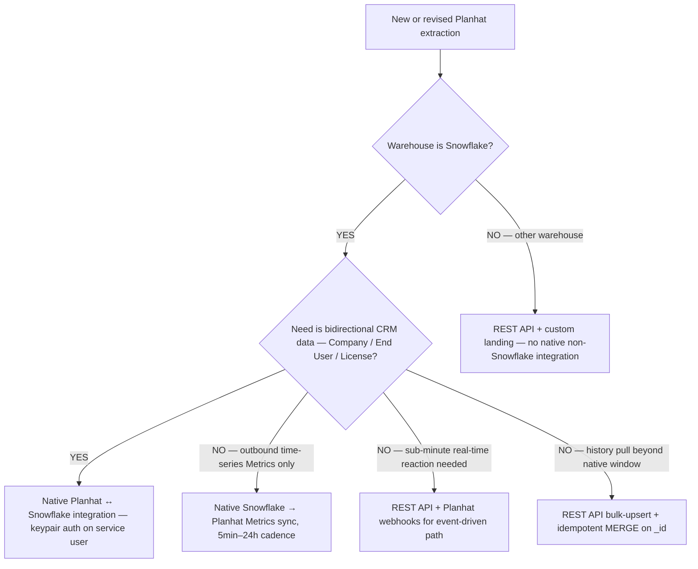

# Planhat integration

> **Last reviewed:** 2026-06-04. **Verdict change:** prior version (2026-06-03) recommended BUILD a custom Python loader. That guidance is **stale** as of 2026-06-04 — Planhat ships a native bidirectional Snowflake integration. Sources: Planhat's own help center and developer docs (URLs in `## References`). Refresh when: (a) Planhat retires the key-pair auth path, (b) Fivetran/Airbyte ship a managed Planhat connector and beat the native Snowflake integration on TCO, (c) Planhat changes the externalId / sourceId / _id keyable hierarchy, or (d) rate limits change.

## Connector strategy — BUY (Planhat-native Snowflake integration)

**Planhat ships a first-party, bidirectional Snowflake integration.** This is the right primary path for any SFDC-anchored or warehouse-first Customer Success stack. Build a custom loader **only** for the narrow gaps the native integration does not cover (out-of-band history pulls, real-time event reactions, time-series push from sources Planhat does not see).

**This reverses the 2026-Q1 BUILD verdict.** A team that has already started a custom Python loader should plan a migration (§ "Migration path from a custom BUILD pipeline" below) — the native path is cheaper to operate, ships with vendor-supported auth rotation, and is bidirectional out of the box.

### Why the verdict flipped

| Dimension | 2026-Q1 (old) | 2026-Q2 (current) |
|---|---|---|
| Native Snowflake integration | Did not exist | GA, bidirectional, ≥hourly CRM sync, 5min–24h Metrics sync `[verify-at-use — 2026-06-04]` |
| Auth | API key only | **Key-pair auth via "service"-type user** (recommended since 2025-07; OAuth + password "person" user being deprecated due to Snowflake MFA enforcement) `[verify-at-use — 2026-06-04]` |
| Sync direction | One-way pull only | Per-model: "Send to Provider," "Receive from Provider," or "Both" |
| Managed Fivetran/Airbyte | Did not exist | Still does not exist as of 2026-06 `[verify-at-use — 2026-06-04]` — native Snowflake integration beats the wrappers (Apideck, Portable, Estuary) on the CRM path |

## Connector capabilities (native Snowflake integration)

**Bidirectional CRM data layer:**

- Models supported: Company, End User, License, plus configurable additional Planhat models.
- Direction is set per model: `Send to Provider`, `Receive from Provider`, or `Both`.
- **Continuous sync at least once per hour** for static CRM data `[verify-at-use — 2026-06-04]`.

**Snowflake → Planhat time-series Metrics:**

- One-way (warehouse to Planhat).
- Configurable cadence: **5 minutes to 24 hours** `[verify-at-use — 2026-06-04]`.
- Use for product-usage telemetry, license-utilization rollups, and any metric that should feed Planhat's native Health Score factors.

**Auth (the load-bearing detail):**

- **Key-pair auth via a Snowflake "service"-type user** is the recommended path. Snowflake's MFA enforcement breaks the older OAuth + password "person" user pattern; key-pair on a service user is the MFA-compatible substitute `[verify-at-use — 2026-06-04]`.
- Rotate the keypair on the same cadence as any other Snowflake service-user key (see § "Failure-mode catalog").

## Configuration steps (warehouse side)

The Planhat docs are the authoritative source — this is the orientation, not a substitute for the runbook. Walk these in order:

1. **Create a dedicated Snowflake user** of type `SERVICE` (not `PERSON`). This is the MFA-compatible posture.
2. **Generate an RSA keypair** (`ssh-keygen` or `openssl`), set the public key on the Snowflake user (`ALTER USER … SET RSA_PUBLIC_KEY = '…'`), and store the private key in Planhat's integration UI.
3. **Grant minimum-necessary privileges** to the Planhat service user — `USAGE` on warehouse + database + schema, `SELECT` on the source tables for outbound, `INSERT/UPDATE/DELETE` on the target tables for inbound. Do not grant `ACCOUNTADMIN` or `SYSADMIN`.
4. **Pick a dedicated, sized-for-Planhat warehouse** (e.g., `WH_PLANHAT_SYNC`, X-Small auto-suspend 60s). The continuous hourly sync workload is small and bursty — do not share with the analyst warehouse, do not co-locate with the dashboard warehouse.
5. **Configure each model's direction** (Send / Receive / Both) deliberately. The default should be `Receive` for any Planhat-owned dimension (Company, End User) and `Send` for any warehouse-owned metric.
6. **Set the externalId / sourceId convention** per § "Keyable hierarchy" before turning the sync on — once records exist with one convention, changing it requires an explicit re-key migration.

## Cost model — native Snowflake integration vs Fivetran/Airbyte vs custom BUILD

The cost shape is fundamentally different from a row-billed connector. Compare on TCO, not on headline.

| Path | Cost shape | When it wins |
|---|---|---|
| **Native Planhat ↔ Snowflake** | No row-billed metering. Cost = Snowflake compute (the dedicated warehouse running the sync) + Planhat license tier `[verify-at-use — 2026-06-04]`. For a typical CS deployment (hundreds–low thousands of companies) the warehouse compute is a few credits/day. | Default. Bidirectional. SFDC-anchored. |
| **Fivetran managed connector** | Does not exist for Planhat as of 2026-06 `[verify-at-use — 2026-06-04]`. If it ships, expect per-connector MAR pricing (Fivetran's March 2025 shift removed bulk discounts; small connectors typically saw 50–60% bill increases) — the native Snowflake path will still beat it on a sub-100k-row/month CRM. | Hypothetical future case where it ships AND undercuts the native path on TCO. |
| **Airbyte (cloud or OSS)** | $2.50/credit standard plan; APIs ~$15/M rows `[verify-at-use — 2026-06-04]`. Engineer time to maintain. | Teams with strong objections to Planhat's native auth model and existing Airbyte infra. Rare. |
| **Custom Python + Snowpipe BUILD** | Engineer time (build + on-call). No vendor metering. | Out-of-band history pulls beyond the native integration's window; sources Planhat does not see; teams with hard objections to vendor-managed sync. |

**The math:** for any SFDC-anchored CS-health build with sub-100k Planhat-touching rows/day, the native Snowflake integration is materially cheaper and lower-ops than any wrapper. Re-run the math per engagement — it is not interchangeable with the Fivetran-vs-Airbyte trade-off for other sources.

## Keyable hierarchy — externalId / sourceId / _id

Planhat's matching/keyable hierarchy on **all bulk upserts**:

```
_id  >  sourceId  >  externalId   (Enduser also accepts email below externalId)
```

| Field | What it is | Use for |
|---|---|---|
| `_id` | Planhat-internal MongoDB-style ID. Stable forever. | The strongest key. Use in MERGE landing. |
| `sourceId` | The foreign CRM record ID. **In an SFDC-anchored shop, `sourceId` = Salesforce Account 18-char ID.** | The Salesforce bridge. Planhat ↔ SFDC native sync uses this. |
| `externalId` | Your own internal ID (e.g., `partner_key`, LEAID). | The district-level / partner-level identity hook. |

**Critical rule — do not invert these.** Planhat docs say explicitly: "if SourceId exists on a model, it must be used as the key; otherwise externalId is used." `sourceId` pins the SFDC bridge; `externalId` pins your warehouse identity. Inverting them silently breaks Planhat ↔ SFDC sync.

**Mutation rule:** a property that **is** the keyable cannot be updated via that key. To change a Planhat record's `externalId`, address the record by a higher-priority key (`_id` or `sourceId`). Plan migration writes accordingly.

## REST API (supplements the native integration)

Use the REST API for the gaps the native Snowflake integration does not cover:

- **Time-series / event push** for sources Planhat does not see (e.g., product-usage events landed in Kafka, not yet in Snowflake).
- **Out-of-band history pulls** beyond the native integration's effective window.
- **Real-time reactions** — pair with webhooks for "thing happened in Planhat → react" use cases.

### Rate limits `[verify-at-use — 2026-06-04]`

- Main REST API: **soft 200 req/min, hard 150 req/sec, bursts ≤50 parallel.**
- Bulk upsert: **5,000 items per request, all models.**
- Webhooks: not rate-limited from Planhat's side; the consumer absorbs spikes. Use the model's `_id` as the idempotency key.

### Idempotent MERGE landing pattern

When pulling Planhat via REST and landing in Snowflake (for the gap-cases above), the MERGE key is `_id`:

```sql
MERGE INTO analytics.dim_partner AS tgt
USING staging.planhat_company AS src
   ON tgt.planhat_id = src._id          -- _id is the strongest key
WHEN MATCHED AND tgt.updated_at < src.updated_at THEN UPDATE SET …
WHEN NOT MATCHED THEN INSERT (…) VALUES (…);
```

Match on `_id` only — `sourceId` and `externalId` can change over a record's lifetime and will produce double-rows if used as the MERGE key. `[unverified — derived from Planhat's documented keyable hierarchy, not a Planhat-published MERGE template]`

## Failure-mode catalog

The native integration is mature but not failure-free. Instrument these explicitly.

### Auth rotation

- **Failure shape:** keypair expired or rotated on the Snowflake side; sync silently stops; Planhat surface shows "last sync N hours ago" growing.
- **Detection:** dbt source freshness check on a Planhat-fed table; alert when `loaded_at` > sync SLA threshold.
- **Mitigation:** rotate on a calendar (90-day default), pre-stage the next keypair before retirement, monitor the Snowflake `LOGIN_HISTORY` view for failed authentications by the Planhat service user.
- **Recovery:** re-upload the new private key in the Planhat integration UI. No data loss — the sync resumes from its last cursor.

### Schema drift

- **Failure shape:** a new custom field is added to a Planhat model; the native sync may not auto-promote it; downstream dbt models that reference the column fail or silently null.
- **Detection:** dbt `dbt_utils.equal_rowcount` or `dbt_utils.expression_is_true` checks against an expected schema; surface diffs in `INFORMATION_SCHEMA.COLUMNS`.
- **Mitigation:** land the raw row as JSON in a `VARIANT` staging column where feasible; dbt staging models parse the typed columns. An additive change (new field) breaks only the staging parse, not the loader. `[unverified — pattern derived from Fivetran best practice, not a Planhat-published recommendation]`

### Deletion handling

- **Failure shape:** Planhat soft-deletes a Company; the native Snowflake sync's behavior around deletes is **vendor-defined and may differ from the Fivetran `_fivetran_deleted` convention**. Ghost rows in downstream marts is the failure mode.
- **Detection:** schedule a weekly full-reconciliation count (`COUNT(*) FROM planhat_companies` vs Planhat's API `GET /companies?count=true`); alert on drift > 0.5%.
- **Mitigation:** stage models should `WHERE deleted_at IS NULL` (or the vendor-specific delete column) before publishing to marts. Document the explicit delete column in the staging model's docstring.

### Direction misconfiguration

- **Failure shape:** a model set to `Both` (bidirectional) when one direction was intended; a warehouse-only edit propagates to Planhat and overwrites a CSM's manual update; or vice versa.
- **Detection:** review the per-model direction setting in the Planhat integration UI quarterly; cross-check against the model owner (warehouse-owned vs Planhat-owned).
- **Mitigation:** establish ownership per model up front; default direction is the conservative direction (Receive-only unless the warehouse genuinely is the source of truth).

### Health-score factor drift

- Planhat's native Health Score is a black box composed of CSM-configured rules + factor inputs. When you push Metrics into Planhat to feed those factors, a sync gap silently degrades score quality.
- **Detection:** alert when `MAX(metric_event_time)` per partner is older than the factor's expected freshness.

## Migration path from a custom BUILD pipeline

If a team has already deployed the 2026-Q1 BUILD pattern (custom Python loader + watermark + MERGE), migrate in four phases. Do **not** flip the switch in one cutover.

1. **Phase 0 — Audit current state.** Inventory: which Planhat models the BUILD covers, which fields, which downstream dbt models depend on each, the current watermark mechanism, the current delete-handling behavior. Document the existing `bridge_account_xref` mapping that uses `externalId`/`sourceId` — the native sync will use the same convention but the field-population history may differ.
2. **Phase 1 — Stand up native integration in parallel (read-only).** Configure the native integration to `Receive` (Planhat → Snowflake) into a **new schema** (e.g., `raw_planhat_native`). Do not point dbt staging models at it yet. Run for ≥2 weeks to observe the freshness, schema, and delete behavior side-by-side with the existing BUILD output.
3. **Phase 2 — Reconcile and cut over.** Run a row-count + content-diff reconciliation between the two raw layers (the BUILD's `raw.planhat_company` vs the native's `raw_planhat_native.company`). Investigate diffs > 0.5%. Once clean, repoint dbt staging models at the native schema; keep the BUILD loader running on standby for two weeks for rollback.
4. **Phase 3 — Decommission the BUILD.** Stop the BUILD loader; archive its code; preserve the historical `raw.planhat_*` tables for audit. Flip any inbound (warehouse → Planhat) needs onto the native integration's `Send` direction.

**Rollback gate:** if Phase 2 reconciliation can't reach <0.5% drift within three iterations of root-cause investigation, keep the BUILD as the source of truth and open a support ticket with Planhat against the diff cases. Do not cut over on faith.

## API surface — entities relevant to CS health

| Entity | Native Snowflake sync | REST endpoint | CS-health use |
|---|---|---|---|
| **Companies** | Yes (bidirectional) | `GET /companies` | The account spine. |
| **End Users / Contacts** | Yes (bidirectional) | `GET /endusers` | Contact dimension; secondary to companies for scoring. |
| **Licenses** | Yes | `GET /licenses` | License-utilization signal. |
| **Metrics / Usage (time-series)** | Yes (Snowflake → Planhat only) | `POST /metrics` | The strongest churn-leading signal. |
| **NPS answers** | Confirm per workspace | `GET /npsAnswers` | NPS score + verbatim (verbatim is PII — mask). |
| **Conversations** | Confirm per workspace | `GET /conversations` | CSM-to-customer touch cadence. |
| **Tasks** | Confirm per workspace | `GET /tasks` | Open/overdue CSM tasks. |
| **Health scores** | Embedded on Company | `GET /companies` (`health` sub-object) | Surface as `planhat_health_score` anchor — do not recompute in Phase 1. |

`[verify-at-use — 2026-06-04]` — confirm per-workspace which models are wired into the native integration; the supported model list expands over time.

## PII / data sensitivity

- **NPS verbatim** — customer-written text; PII. Apply Snowflake dynamic masking on the verbatim column. Surface only NPS score + response date to analyst/dashboard roles.
- **End-user records** — name + email; column-level masking in non-privileged roles.
- **Retention** — GDPR/CCPA right-to-erasure: document the deletion path that propagates from Planhat into Snowflake (the native sync's delete behavior is the load-bearing dependency here).

## Common gotchas

1. **`sourceId` vs `externalId` inversion** — the most common shape-of-data error. `sourceId` = SFDC Account ID; `externalId` = your warehouse identity. Inverting silently breaks Planhat ↔ SFDC sync.
2. **Keypair rotation drift** — a 90-day rotation cadence with no calendar reminder produces a silent stop. Always pair rotation with dbt source freshness alerts.
3. **Direction misconfiguration** — `Both` when one direction was intended. Default conservative (`Receive` only) unless the warehouse genuinely owns the model.
4. **Health Score recompute** — never recompute Planhat's native score in Phase 1. Surface it as the anchor; build additive signals alongside.
5. **Delete-column convention** — Planhat's native sync delete behavior is vendor-defined. Do not assume Fivetran's `_fivetran_deleted` convention applies.
6. **Sub-hourly CRM cadence is not available** — the CRM-data sync floor is "at least once per hour." For sub-minute reactions, use the REST API + webhooks, not the native integration `[verify-at-use — 2026-06-04]`.

## Decision Tree: Planhat Extraction — Pick the Right Path

**When this applies:** You are designing or revising the Planhat → warehouse extraction for a CS-health or PSM build. The native Snowflake integration is GA, the REST API is mature, and there is no managed Fivetran/Airbyte connector yet. Pick the path before committing engineering time.

**Last verified:** 2026-06-04 against Planhat help docs (articles 9587348, 9586985, 9587186) and developer docs (authentication-limits, bulk-upsert).



**Rationale per leaf:**
- *Leaf A — Native Snowflake integration (bidirectional CRM)* — the default for SFDC-anchored CS stacks. Cheapest TCO, vendor-supported auth, ≥hourly sync floor. **Requires:** Snowflake account with a SERVICE-type user and the ability to grant integration privileges.
- *Leaf B — Snowflake → Planhat Metrics sync* — when only outbound time-series telemetry needs to land in Planhat. Same integration; just the Metrics direction.
- *Leaf C — REST + webhooks (real-time)* — when sub-minute event-driven reactions are required (e.g., "Closed-Won in Planhat triggers a Slack play"). Native sync floor is hourly; this is the only path for faster.
- *Leaf D — REST bulk-upsert (history)* — when the history needed predates the native integration's effective window. Use bulk-upsert with the `_id`-keyed MERGE pattern.
- *Leaf E — REST only (non-Snowflake)* — the native integration is Snowflake-only. Other warehouses get a custom REST loader (the 2026-Q1 BUILD pattern still applies here).

**Tradeoffs summary table:**

| Method | Time to v1 | Latency floor | Cost shape | Use when |
|---|---|---|---|---|
| Native Snowflake (bidirectional) | Hours (setup) | ≥1 hour | Snowflake compute + license | Default for Snowflake + SFDC-anchored shops. |
| Native Snowflake → Planhat Metrics | Hours | 5 min | Snowflake compute + license | Outbound time-series only. |
| REST + webhooks | Days (BUILD) | Seconds | Engineer time | Real-time event-driven reactions. |
| REST bulk-upsert | Days (BUILD) | Variable (batch) | Engineer time | Beyond native-integration history window. |
| REST custom landing | Weeks (BUILD) | Hours–days | Engineer time | Non-Snowflake warehouse. |

## dbt modeling — common staging + mart models

| Model | Purpose |
|---|---|
| `stg_planhat__companies` | Company dimension — typed, 1:1 with raw; `sourceId` surfaced as `sfdc_account_id`; `externalId` surfaced as `partner_key_candidate`. |
| `stg_planhat__nps_answers` | NPS responses — NPS score surfaced; verbatim **masked** (PII). |
| `stg_planhat__metrics` | Usage/DAU metrics per company per period. |
| `stg_planhat__tasks` | Open + overdue CSM tasks per company. |
| `stg_planhat__conversations` | CSM touch history. |
| `dim_planhat_company` | Intermediate — adds `account_key` via `bridge_account_xref`. |
| `fct_account_health_snapshot` | Mart — `planhat_health_score` anchor + warehouse-derived signals. |

## Refresh triggers

- Fivetran or Airbyte ship a managed Planhat connector AND beat the native Snowflake integration on TCO.
- Planhat retires the key-pair auth path or changes the supported user type.
- Planhat changes the externalId / sourceId / _id keyable hierarchy.
- Planhat changes the native integration's per-model sync direction options.
- Snowflake changes the MFA enforcement that drove the 2025-07 auth migration.

## References

All URLs accessed 2026-06-04.

- https://www.planhat.com/integrations/snowflake — Planhat Snowflake integration product page.
- https://help.planhat.com/en/articles/9587348-preparing-snowflake-and-connecting-the-integration — Planhat Snowflake prep guide.
- https://help.planhat.com/en/articles/9586985-setting-up-the-snowflake-integration — Planhat Snowflake setup guide (keypair auth, sync cadence).
- https://www.planhat.com/developers/api/authentication-limits — Planhat API auth + rate limits.
- https://www.planhat.com/developers/api/bulk-upsert — Planhat bulk-upsert API + keyable hierarchy.
- https://help.planhat.com/en/articles/9587186-external-ids-source-ids-related-domains — Planhat external ID / source ID docs.
- https://help.planhat.com/en/articles/9587130-setting-up-the-salesforce-integration — Planhat ↔ Salesforce integration setup.
- https://help.planhat.com/en/articles/9587310-set-up-your-health-score-profiles — Planhat Health Score Profile factors.
- https://portable.io/connectors/planhat/snowflake — Portable.io wrapper (alternative path; rarely beats native).
- https://www.apideck.com/integrations/planhat — Apideck wrapper (alternative path; rarely beats native).
- https://portable.io/learn/fivetran-vs-airbyte-comparison — Fivetran March 2025 per-connector MAR pricing context.
