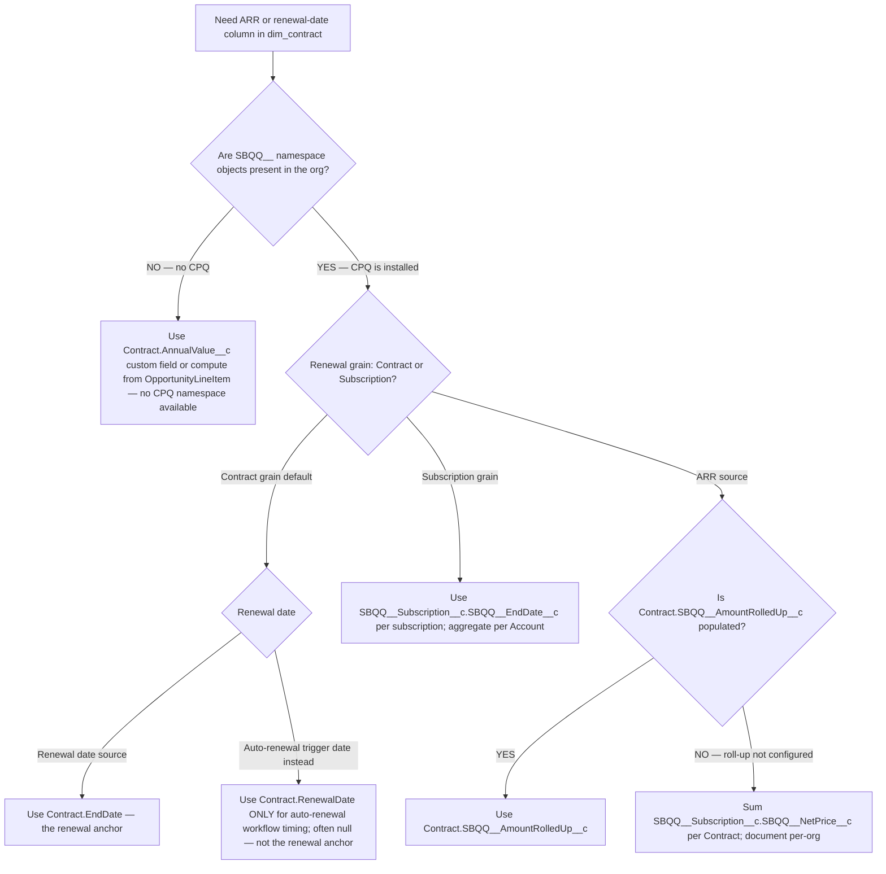

# Salesforce CPQ integration

> **Last reviewed:** 2026-06-04. Sources: Atrium CPQ-objects guide, Revsolutions Revenue Cloud data model, Salesforce Bulk API 2.0 docs, Fivetran SFDC schema docs (URLs in `## References`). Refresh when: (a) Salesforce restructures the `SBQQ__*` namespace as part of the Revenue Cloud Advanced transition, (b) Fivetran/Airbyte change CPQ-object handling, or (c) the underlying CPQ → Contract roll-up fields change. This file complements — does not replace — `salesforce-integration.md`; read both.

## TL;DR

- **CPQ rides the standard SFDC Fivetran connector** — `Quote`, `QuoteLineItem`, `Contract`, `ContractLineItem`, `Order`, `OrderProduct`, and all `SBQQ__*` namespace objects flow with the standard connector. No separate ELT needed.
- **ARR/TCV live on CPQ-managed roll-up fields** — primarily `Contract.SBQQ__AmountRolledUp__c` (ARR) and `Contract.SBQQ__SubscriptionTerm__c` × ARR (TCV).
- **Renewal date is `Contract.EndDate` — not `Contract.RenewalDate`.** `RenewalDate` is the auto-renewal target (often null); `EndDate` is the lifecycle end. Confusing them produces silent off-by-one-year errors on renewal pipelines.
- **Termination-notice date is derived** — `Contract.EndDate - Contract.TerminationNoticeDays`. Compute warehouse-side; do not rely on a single Contract field.
- **Contract amendments are exactly the SCD Type 2 workload** — model with dbt snapshots on `LastModifiedDate`.

## Object hierarchy

CPQ extends standard SFDC with a managed package in the `SBQQ__` namespace. The data lifecycle:

```
Opportunity  ──┐
               ├── (CPQ Quote process)
Account ───────┤
               │
        Quote (SBQQ__Quote__c)
            │
            └── QuoteLineItem (SBQQ__QuoteLine__c)
                    │
                    │  (on Closed-Won → contract generation)
                    ▼
                Contract  ──── ContractLineItem
                    │
                    │  (on contract activation → order generation)
                    ▼
                Order ──── OrderProduct ──── Asset / Subscription
```

| Object | Standard or CPQ | Role |
|---|---|---|
| `Opportunity` | Standard | Sales pipeline; pre-quote. |
| `SBQQ__Quote__c` ("Quote") | CPQ | The configured-priced offer. |
| `SBQQ__QuoteLine__c` ("QuoteLineItem") | CPQ | Per-product line on the Quote. |
| `Contract` | Standard, extended by CPQ | The signed commercial agreement. **The ARR/TCV/renewal-date anchor.** |
| `ContractLineItem` | Standard | Per-line on the Contract. |
| `Order` | Standard | Activation of the Contract; provisioning trigger. |
| `OrderProduct` | Standard | Per-line on the Order. |
| `SBQQ__Subscription__c` | CPQ | Recurring revenue subscription record (multi-year, evergreen). |
| `Asset` | Standard | Provisioned thing (often what `OrderProduct` becomes). |
| `Product2` / `Pricebook2` / `PricebookEntry` | Standard | Product + pricing dimension. |

**The grain to anchor on for PSM metrics is `Contract`** — it survives amendments, holds the renewal date, and is where CPQ rolls up the ARR. Quote and QuoteLineItem are pre-contract; Subscription and Asset are post-contract provisioning detail.

## API approach — Bulk API 2.0 vs SObject Tree

CPQ extraction follows the same rules as the base SFDC connector — see `salesforce-integration.md` for the full Bulk API 2.0 limits. CPQ-specific overlays:

- **Bulk API 2.0 is the right backbone.** All CPQ objects are queryable via standard SOQL.
- **Field selection matters more in CPQ.** The CPQ managed package adds 100+ fields to each managed object; pulling `SELECT *` will hit the 10MB payload ceiling on accounts with large amendment histories. Enumerate fields explicitly per the field-mapping table below.
- **SObject Tree API** is occasionally needed for **complex amendment graph writes** (e.g., creating a Quote + nested QuoteLineItems in one call) but is **not relevant to ELT** — ELT is read-only. Mention here only because it surfaces in CPQ build-vs-buy threads.
- **OpportunityFieldHistory + ContractHistory** are the SCD signals — track them if amendment-level analytics is in scope.

## Field-set management — the load-bearing CPQ-specific detail

The `SBQQ__*` namespace introduces 100+ custom fields per managed object. **Default ELT configs that auto-select all fields will fail at scale.** The discipline:

1. **Inventory the CPQ-managed objects** in the org: `SELECT QualifiedApiName FROM EntityDefinition WHERE NamespacePrefix = 'SBQQ'`.
2. **Inventory per-object fields**: `SELECT QualifiedApiName, DataType FROM FieldDefinition WHERE EntityDefinition.QualifiedApiName = 'SBQQ__Quote__c'`.
3. **Define a project-specific field allow-list** scoped to the metrics in the field-mapping table below. Do **not** pull all fields by default — CPQ orgs typically have ~30% of fields that drive actual analytics.
4. **Document the allow-list in the dbt staging layer's `_sources.yml`** so the contract is explicit and reviewable. The staging model selects only the allow-listed columns.
5. **Cross-check with the SFDC admin** before flipping the connector on. Custom CPQ workflows often add org-specific fields (`Contract.PD_Hours_Purchased__c` is almost universal in EdTech orgs; `Account.Customer_Health__c` is common; the org owns the list, not the vendor).

## Field mapping — PSM dashboard metrics → CPQ fields

This is the load-bearing table. Cite it in any dbt staging or mart model that derives ARR / TCV / renewal-date / termination-notice. `[verify-at-use — 2026-06-04]`

| PSM metric | Field source | Notes |
|---|---|---|
| **ARR** (annual recurring revenue) | `Contract.SBQQ__AmountRolledUp__c` (CPQ-managed roll-up). Fallback: sum `SBQQ__Subscription__c.SBQQ__NetPrice__c` for subscription-grain orgs. | Annualized MRR × 12 in some orgs — verify the roll-up's annualization convention before publishing. |
| **MRR** | `Contract.SBQQ__AmountRolledUp__c / 12` (if ARR-shaped) or sum `SBQQ__Subscription__c.SBQQ__MonthlyPrice__c`. | Convention varies. Document per org. |
| **TCV** (total contract value) | `Contract.ContractTermLength` × ARR + one-time line items. CPQ field: `SBQQ__SubscriptionTerm__c`. | Multi-year contracts: TCV = `SBQQ__SubscriptionTerm__c` (months) / 12 × ARR. |
| **Contract start date** | `Contract.StartDate`. | Standard SFDC field. |
| **Renewal date** | `Contract.EndDate`. | **NOT `Contract.RenewalDate`** — see § "Renewal date sources" below. |
| **Termination-notice date** | `Contract.EndDate - Contract.TerminationNoticeDays`. | Derived warehouse-side. Often the "notice window opens" PSM trigger. |
| **Auto-renew flag** | `Contract.SBQQ__AutoRenewal__c` (CPQ) or `Contract.AutoRenew__c` (custom). | Custom field name varies — confirm per org. |
| **Multi-year clause** | `Contract.SBQQ__SubscriptionTerm__c > 12` OR presence of `SBQQ__AmendmentStartDate__c`. | A truthy `SBQQ__AmendmentStartDate__c` indicates this contract is itself an amendment of a prior contract. |
| **PD purchased / used / remaining** | Almost always custom fields: `Account.PD_Hours_Purchased__c`, `Account.PD_Hours_Used__c`, `Account.PD_Hours_Remaining__c`. | EdTech-PSM standard. Confirm per org — names vary. |
| **Quote-to-cash cycle time** | `SBQQ__Quote__c.CreatedDate` → `Contract.StartDate`. | For sales-velocity panels. |
| **Discount applied** | `SBQQ__QuoteLine__c.SBQQ__Discount__c` or `SBQQ__AdditionalDiscount__c`. | Per-line; sum at Contract for total. |

## Multi-year contract clauses

Multi-year deals are where CPQ shines and where naive extraction breaks. Patterns:

- **Subscription term encoded in months**, not years: `SBQQ__SubscriptionTerm__c = 36` for a 3-year contract.
- **Amendment-of-amendment chains** — `SBQQ__AmendmentStartDate__c` and `SBQQ__AmendedContract__c` form a linked list. Walk the chain to reconstruct the original deal vs. the current-as-of state.
- **Co-termed amendments** — when an amendment co-terms with the parent contract's end date, `SBQQ__CoTerminationEvent__c` is set. Otherwise the amendment has its own end date and the partner has a staggered contract structure.
- **Subscription-level (not Contract-level) renewal anchors** — some orgs renew at the `SBQQ__Subscription__c` grain, not the Contract grain. The renewal-date source then becomes `SBQQ__Subscription__c.SBQQ__EndDate__c`. Confirm the renewal grain per org.

**Modeling rule for the warehouse:** `dim_contract` is SCD Type 2 on `LastModifiedDate`. Each amendment produces a new SCD2 row. The fact table joins via `partner_key + as_of_date` to the active row.

```sql
-- dbt snapshot pattern for Contract amendments

{{
  config(
    target_schema='snapshots',
    unique_key='Id',
    strategy='timestamp',
    updated_at='LastModifiedDate',
    invalidate_hard_deletes=True,
  )
}}
select Id, AccountId, StartDate, EndDate, ContractTerm,
       SBQQ__SubscriptionTerm__c, SBQQ__AmountRolledUp__c,
       SBQQ__AutoRenewal__c, SBQQ__AmendedContract__c,
       TerminationNoticeDays, Status
from {{ source('salesforce', 'Contract') }}

```

## PD entitlement tracking (EdTech / professional services PSM)

Professional Development hours sold + consumed is a common PSM-dashboard need, especially in EdTech. CPQ does **not** ship a standard PD-tracking object — it is always custom. The standard shape:

| Field (custom — names vary) | What it is |
|---|---|
| `Account.PD_Hours_Purchased__c` | Roll-up of PD hours sold across all active contracts. |
| `Account.PD_Hours_Used__c` | Consumption sum (often manually entered or rolled up from a custom `PD_Session__c` object). |
| `Account.PD_Hours_Remaining__c` | Purchased − Used. May be a formula field. |
| `Contract.PD_Hours_Included__c` | Per-contract entitlement. |
| `SBQQ__QuoteLine__c.PD_Hours_Per_Unit__c` | Per-line entitlement (when PD is bundled into a SKU). |

**Modeling caveats:**

- **Formula fields are not incrementally synced by Fivetran** — they re-derive on every full sync, not on row updates. Either rederive PD-remaining in dbt (preferred) or accept stale roll-ups between full syncs.
- **Manually-entered consumption is noisy** — frequent corrections. Track `LastModifiedDate` on the consumption field and surface "last updated" on PSM panels.
- **Cross-contract PD pooling** is org-specific. Confirm with the SFDC admin whether PD pools across all active contracts for an Account, or is contract-scoped.

## Renewal date sources — `terminationNoticeDate` vs `EndDate`

The single most common silent-error in CPQ extraction. **Memorize this:**

| Field | What it is | When to use |
|---|---|---|
| `Contract.EndDate` | The contract's lifecycle end date. | **The renewal anchor.** Use for "days to renewal," "renewal pipeline," "expiring contracts." |
| `Contract.RenewalDate` | The auto-renewal target date (sometimes null). | The date CPQ would auto-fire renewal workflows. **Often null** when auto-renewal is not configured. Do not use as the renewal anchor. |
| `Contract.StartDate` + `ContractTerm` | Computed end of the initial term (months from start). | Sanity-check against `EndDate`; in amended contracts they can disagree. |
| `SBQQ__SubscriptionTerm__c` | Subscription term in months. | Same role as `ContractTerm`; CPQ-specific. |
| Derived: `EndDate - TerminationNoticeDays` | The "notice window opens" date. | The PSM-action anchor — when the partner must be notified that renewal-or-terminate is approaching. |
| `SBQQ__Subscription__c.SBQQ__EndDate__c` | Per-subscription end date. | When the renewal grain is subscription, not contract. |

**dbt derivation:**

```sql
-- models/staging/stg_salesforce__contract.sql
select
    Id as contract_id,
    AccountId as sfdc_account_id,
    StartDate as contract_start_date,
    EndDate as contract_end_date,                        -- THE renewal anchor
    RenewalDate as auto_renewal_target_date,             -- NOT the renewal anchor
    TerminationNoticeDays as notice_period_days,
    dateadd('day', -coalesce(TerminationNoticeDays, 90), EndDate)
        as notice_window_opens_at,                       -- PSM-action anchor
    SBQQ__SubscriptionTerm__c as subscription_term_months,
    SBQQ__AmountRolledUp__c as arr_usd,
    SBQQ__AutoRenewal__c as is_auto_renewal,
    Status as contract_status,
    LastModifiedDate as updated_at
from {{ source('salesforce', 'Contract') }}
where IsDeleted = false
```

## Decision Tree: Salesforce CPQ — ARR / Renewal-Date Source Selection

**When this applies:** You are deriving the ARR or renewal-date column in `dim_contract` for a PSM dashboard, and the CPQ data shape is unfamiliar. The choice of source field controls whether downstream "days to renewal" / "expiring ARR" panels are correct.

**Last verified:** 2026-06-04 against Atrium CPQ guide + Revsolutions Revenue Cloud data model + Salesforce Bulk API 2.0 docs.



**Rationale per leaf:**
- *Leaf A — `Contract.EndDate`* — the canonical renewal anchor. Survives auto-renewal-not-configured cases where `RenewalDate` is null.
- *Leaf B — `SBQQ__AmountRolledUp__c`* — the CPQ-managed roll-up; the cheapest ARR source when populated.
- *Leaf C — Sum of subscription net prices* — fallback when the roll-up is not configured; computed in dbt staging.
- *Leaf D — Subscription-grain renewal* — for orgs that renew per-subscription, not per-contract. Aggregate up to the partner.
- *Leaf E — Non-CPQ org* — falls back to standard SFDC fields or a custom annualization field. Different file applies (`salesforce-integration.md`).
- *Leaf F — `Contract.RenewalDate`* — the auto-renewal target date; only use for auto-renewal workflow alerting, **never as the primary renewal anchor**.

**Tradeoffs summary table:**

| Method | Time to v1 | Org-specificity | Use when |
|---|---|---|---|
| `Contract.EndDate` (Leaf A) | Hours | Universal | Default renewal-date source. |
| `SBQQ__AmountRolledUp__c` (Leaf B) | Hours | CPQ-installed orgs | Default ARR source. |
| Subscription sum (Leaf C) | Days (dbt logic) | Per-org | Roll-up not configured. |
| Subscription-grain (Leaf D) | Days | Per-org | Renewal happens at subscription, not contract. |
| Non-CPQ fallback (Leaf E) | Hours–Days | Per-org custom | CPQ not installed. |

## Common gotchas

1. **`Contract.RenewalDate` ≠ `Contract.EndDate`.** RenewalDate is the auto-renewal target (often null). Use EndDate.
2. **Subscription term in months, not years.** `SBQQ__SubscriptionTerm__c = 36` is a 3-year contract.
3. **Formula fields are not incrementally synced** by Fivetran — rederive in dbt rather than relying on the CPQ formula output.
4. **CPQ-managed package field renames** — the `SBQQ__` namespace evolves as CPQ versions ship. Pin the namespace version per engagement and review on CPQ upgrade.
5. **Amendment chains break naive "current contract" queries** — use the SCD2 snapshot to reconstruct as-of state. A "current" filter that ignores amendments will undercount renewals.
6. **Multi-currency CPQ orgs** — `SBQQ__AmountRolledUp__c` is in the contract's currency, not USD. Join `CurrencyIsoCode` + `DatedConversionRate` for normalized ARR.
7. **PD-entitlement objects are always custom** — there is no standard CPQ PD object. Confirm field names per org.
8. **`SBQQ__Subscription__c` is not `Subscription`** — the latter is a standard SFDC object distinct from CPQ. Disambiguate in staging.
9. **`Contract` shows up twice in your dbt source list** — once as standard SFDC, once as CPQ-extended (same object, more fields). One source declaration; the field allow-list controls which columns land.
10. **Revenue Cloud Advanced** (Salesforce's CPQ-successor announced 2024) is a different object model — `SBQQ__*` becomes `RA_*` or similar in migrating orgs. Treat as a refresh trigger.

## Connector configuration — Fivetran specifics

- **Already in the SFDC Fivetran feed** — no additional connector cost. `SBQQ__*` objects are in the same MAR pool as standard SFDC.
- **Field selection: opt out of fields you do not need.** Per-column opt-out is supported `[verify-at-use — 2026-06-04]`. Defaults pull all fields → 10MB payload risk.
- **Formula fields are skipped on incremental sync.** Listed as a deliberate Fivetran behavior — rederive in dbt.
- **Soft deletes surface as `_fivetran_deleted = TRUE`.** Every staging model needs `WHERE _fivetran_deleted = FALSE`.

## dbt modeling — common marts

| Model | Purpose |
|---|---|
| `stg_salesforce__contract` | Typed staging; the renewal-date and ARR derivations. |
| `stg_salesforce__quote` / `stg_salesforce__quote_line` | Quote-to-cash velocity inputs. |
| `stg_salesforce__sbqq_subscription` | Subscription-grain fact for subscription-renewal orgs. |
| `snap_contract` | SCD Type 2 snapshot on `LastModifiedDate`. |
| `dim_contract` | Vendor-agnostic contract dimension (joins from `snap_contract` + cross-source overlay; see `clm-integration-ironclad-docusign.md` for the cross-vendor schema). |
| `fct_arr_movement` | New ARR / expansion ARR / churn / contraction by month. |
| `fct_renewal_pipeline` | Contracts by `notice_window_opens_at` for the PSM dashboard. |
| `mart_contract_amendments` | Amendment chains for "contract health over time" analysis. |

## PII / data sensitivity

- Quote / Contract content can include negotiated pricing — treat as commercially sensitive even if not PII.
- Surface ARR / TCV only to authorized roles in the warehouse; apply Snowflake row-access policies if PSMs are partner-scoped.
- Multi-currency `CurrencyIsoCode` is not PII but is a join key that, if wrong, silently misstates ARR.

## Refresh triggers

- Salesforce restructures `SBQQ__*` namespace (Revenue Cloud Advanced transition).
- Fivetran or Airbyte change CPQ-object handling (e.g., formula-field promotion).
- The org migrates from per-Contract to per-Subscription renewal grain.
- The org adds a new CPQ-managed package version that introduces field renames.
- CPQ retires (Salesforce has signaled Revenue Cloud as the successor).

## References

All URLs accessed 2026-06-04.

- https://atrium.ai/resources/a-complete-guide-to-salesforce-cpq-objects/ — Salesforce CPQ objects guide.
- https://revsolutions.co/blog/salesforce-revenue-cloud-data-model/ — Salesforce Revenue Cloud / CPQ data model.
- https://developer.salesforce.com/docs/atlas.en-us.api_asynch.meta/api_asynch/bulk_api_2_0.htm — Salesforce Bulk API 2.0 docs.
- https://fivetran.com/docs/connectors/applications/salesforce — Fivetran Salesforce schema (covers managed packages including CPQ).
- https://www.phdata.io/blog/how-to-use-fivetran-to-ingest-salesforce-data-into-snowflake/ — phData Fivetran SFDC patterns (formula-field exclusion, soft-delete convention).
- https://xebia.com/blog/a-practical-guide-to-creating-slowly-changing-dimensions-type-2-in-dbt-part-1/ — SCD2 in dbt practical guide (contract amendment pattern).
- https://sfdcdevelopers.com/2025/10/29/salesforce-integration-patterns-types-use-cases-and-best-practices/ — Salesforce integration patterns 2025.
