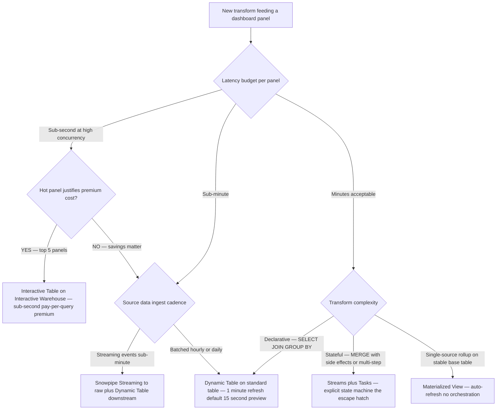

# Snowflake operational-dashboard patterns

> **Last reviewed:** 2026-06-04. Sources: Snowflake Dynamic Tables blog, Interactive Tables/Warehouses GA release notes (2025-12-11), Snowflake clustering keys docs, Search Optimization cost estimation docs, Keebo + e6data + seemoredata performance writeups, Snowpipe Streaming simplified pricing release notes (URLs in `## References`). Refresh when: (a) Interactive Warehouses pricing changes, (b) Dynamic Tables drop below 15s refresh floor, (c) Snowflake retires Streams + Tasks (no indication as of 2026-06), or (d) Search Optimization cost model changes materially. This file complements `cloud-database-landscape-2026.md` with the dashboard-specific decisions.

## TL;DR

- **Default to Dynamic Tables** for continuous transforms feeding the dashboard. The 1-minute refresh floor (15s in preview) is the right floor for nearly every PSM/CS dashboard pattern.
- **Use Streams + Tasks only for cases Dynamic Tables don't cover** — complex stateful logic, MERGE-with-side-effects.
- **Use Snowpipe Streaming** when sub-minute ingest is the use case (event-grade). Pair with Dynamic Tables downstream.
- **Use Interactive Tables / Interactive Warehouses (GA Dec 2025)** selectively for the hottest 5–10 panels where sub-second latency at high concurrency is load-bearing. Pay-per-query premium — do not put everything here.
- **Cluster only the top 5% largest tables that drive ≥80% of scan cost.** Combine `(partner_key, event_date)` for the canonical PSM access pattern.
- **Result cache covers identical queries for 24h** — parameterize on user only for personalization, not on time-bucket, so the morning view hits the cache for all PSMs after the first run.

## Layer pick — Dynamic Tables now dominate

Dynamic Tables replaced the manual Streams + Tasks pattern for declarative incremental pipelines in 2024–2025 and are now the default substrate for an operational dashboard layer.

| Layer | Refresh floor | Snowsight observability | Use for |
|---|---|---|---|
| **Dynamic Tables** | 1-minute (15s in preview) `[verify-at-use — 2026-06-04]` | Lag, refresh history, dependency DAG built-in | Continuous transforms (e.g., `tickets_aging`, `health_score_components`) feeding the dashboard. **Default choice.** |
| **Streams + Tasks** | Sub-minute possible | Manual instrumentation | Edge cases Dynamic Tables don't cover (complex stateful logic, MERGE-with-side-effects). The escape hatch. |
| **Snowpipe Streaming** | ~5 seconds `[verify-at-use — 2026-06-04]` | Snowpipe insights tables | Sub-minute ingest path. Pair with Dynamic Tables downstream. |
| **Interactive Tables / Warehouses (GA Dec 2025)** | Sub-second query latency `[verify-at-use — 2026-06-04]` | Dedicated for high-concurrency dashboards | The hottest 5–10 panels and "data-powered APIs." Pay-per-query premium. |
| **Materialized Views** | Auto-refresh on base-table change | Standard Snowsight | Single-source aggregates on a stable base table. Falls behind Dynamic Tables for multi-source joins. |
| **Standard tables + dbt incremental** | Per dbt run cadence | dbt artifacts | When you want dbt to own the materialization layer end-to-end. |

### When to use which — the decision

- **`fct_*` and `dim_*` rollups feeding ≥3 dashboard panels** → Dynamic Tables. Declarative, observable, vendor-supported. The default.
- **Single panel needing fresh-as-of-now event data** → Snowpipe Streaming + Dynamic Table.
- **A panel with `WHERE partner_key = $1` filter, hit on every page load, sub-second budget** → Interactive Table on `(partner_key, event_date)` clustering. Pair with Search Optimization if the lookup is high-cardinality.
- **A complex MERGE that touches three tables with side-effect tasks** → Streams + Tasks (Dynamic Tables don't support arbitrary stateful logic).
- **A simple per-day aggregate** → Materialized View on the fact table.

## Clustering keys — the partner-keyed access pattern

For a PSM dashboard that filters by `partner_key` on every panel, the clustering key should be **`(partner_key, event_date)`** or similar.

### Best-practice rules of thumb `[verify-at-use — 2026-06-04]`

- **Cluster only the top 5% largest tables that drive ≥80% of scan cost.** Use `SNOWFLAKE.ACCOUNT_USAGE.TABLE_STORAGE_METRICS` and `QUERY_HISTORY` to identify.
- Use `SYSTEM$ESTIMATE_AUTOMATIC_CLUSTERING_COSTS` before committing — actual costs can drift ±50% from estimate, in rare cases multiple-X.
- Combine `DATE_TRUNC('day', …)` filters + entity_id filters in the cluster key — the most common dashboard query shape.
- **Most teams waste 30–50% on Snowflake compute due to poor clustering** — the #1 cost lever on a dashboard that hits the warehouse every page load.
- Monitor `SYSTEM$CLUSTERING_INFORMATION` per clustered table; rebuild the cluster key if `average_overlaps` rises above ~10.

### Example clustering keys

| Table | Cluster key | Why |
|---|---|---|
| `fct_support_ticket` | `(partner_key, created_at::date)` | PSM filters by partner + date range every panel. |
| `fct_calendar_event` | `(partner_key, start_utc::date)` | Same pattern as tickets. |
| `fct_arr_movement` | `(snapshot_date, partner_key)` | Date-first because aggregation is typically by month, then by partner. |
| `dim_partner` | (none — small) | Small dimensions don't benefit; sub-second already. |
| `bridge_account_xref` | `(source, source_id)` | Already the primary key; clustering is redundant. |

### Verification

After clustering, run for one week and check:

- **`AUTOMATIC_CLUSTERING_HISTORY`** — credits spent on the auto-clustering service.
- **`QUERY_HISTORY`** — partition-pruning percentages on the affected queries (look for `PARTITIONS_SCANNED / PARTITIONS_TOTAL` rising to >95% pruning).
- **Dashboard panel latencies** — the actual user-visible metric.

If clustering doesn't move the needle on panel latencies, drop the clustering key — the auto-clustering credits are a continuous cost.

## Cost control on a "PSM opens the dashboard every morning" pattern

The dashboard is a cost magnifier — every page-load is N queries × W warehouse compute. Optimize the hottest panels first.

### Result cache — the cheapest optimization

- **Result caching covers identical queries for 24h.** Design the dashboard's morning view so all PSMs hit the cache.
- Parameterize on **user** for personalization, **not on time-bucket** that changes between calls.
- Anti-pattern: `WHERE event_date >= DATEADD(day, -7, CURRENT_DATE())` — every call gets a different `CURRENT_DATE()`, defeats the cache.
- Better: bucket on `WHERE event_date >= DATE_TRUNC('day', DATEADD(day, -7, CURRENT_DATE()))` — the bucket is stable for the day, cache hits.

### Per-warehouse sizing

| Warehouse | Workload | Size | Auto-suspend |
|---|---|---|---|
| `WH_PSM_DASHBOARD` | Dashboard read queries | X-Small or Small | 60s |
| `WH_DBT_TRANSFORM` | dbt batch transforms | Small or Medium | 60s |
| `WH_INGEST` | Snowpipe + connector landings | X-Small | 60s |
| `WH_AD_HOC` | Analyst notebooks | Small (or auto-scale) | 60s |
| `WH_PLANHAT_SYNC` | Planhat native sync | X-Small | 60s |

**The rule:** separate warehouses for separate workloads. A noisy dbt build should not slow the PSM dashboard. Snowflake's auto-suspend at 60s means the cost of N small warehouses ~= the cost of one larger warehouse for the same workload, with much better isolation.

### `INFORMATION_SCHEMA` vs `ACCOUNT_USAGE` for live telemetry `[verify-at-use — 2026-06-04]`

- **`INFORMATION_SCHEMA` latency: ~minutes.** Use for live dashboard panels ("queries running right now").
- **`ACCOUNT_USAGE` latency: ~90 minutes.** Use for historical reporting, never for live freshness indicators.

A "data as of <timestamp>" badge backed by `ACCOUNT_USAGE` will be 90 minutes stale and silently mislead PSMs.

### Search Optimization Service `[verify-at-use — 2026-06-04]`

For high-cardinality point lookups (e.g., "search for partner by district name"):

- Estimate via `SYSTEM$ESTIMATE_SEARCH_OPTIMIZATION_COSTS`. Actuals can drift ±50%.
- **Start with one column on one table and monitor before broadening.** Search Optimization is a continuous cost (maintains a search index per write).
- Worth it for: high-cardinality `=` and `IN` lookups, substring matches on partner names.
- Not worth it for: low-cardinality columns (status, region), already-clustered tables on the same column.

## Result-cache hit-rate optimization checklist

The dashboard's per-page cost is dominated by uncached queries. Audit the SQL behind every panel for these defeat-the-cache patterns:

| Pattern | Defeats cache? | Fix |
|---|---|---|
| `CURRENT_TIMESTAMP()` in WHERE | Yes | Bucket to `DATE_TRUNC('day', CURRENT_DATE())` if day-grain is acceptable. |
| `CURRENT_DATE()` in WHERE | Yes | Bucket as above, or use a stable cutover at warehouse-day boundaries. |
| `UUID_STRING()` in SELECT | Yes | Move row-IDs to a join, not a generated column. |
| Reading from a non-deterministic UDF | Yes | Make the UDF deterministic or move the call out of the query. |
| `WHERE partner_key = $current_user.partner_key` | No (different per user, but stable for that user across calls) | Acceptable — each PSM gets their own cache slot. |
| Reading from a Dynamic Table that just refreshed | No (first call after refresh re-executes) | Acceptable — refresh-then-cache is the intended pattern. |

## Decision Tree: Snowflake Layer — Which Refresh Substrate

**When this applies:** You are designing a Snowflake transform that feeds a dashboard panel. The choice between Dynamic Tables, Streams+Tasks, Materialized Views, and Interactive Tables controls latency, cost, and operational surface.

**Last verified:** 2026-06-04 against Snowflake Dynamic Tables blog, Interactive Tables GA release notes (2025-12-11), Snowflake clustering docs.



**Rationale per leaf:**
- *Leaf A — Interactive Table* — sub-second latency at high concurrency. **Requires:** Interactive Warehouse provisioned + budget for pay-per-query premium. Use for ≤10 hottest panels only.
- *Leaf B — Snowpipe Streaming + Dynamic Table* — event-grade ingest paired with declarative downstream rollups. ~5s end-to-end achievable.
- *Leaf C — Dynamic Table* — the default for any declarative transform with sub-minute or minute latency. Built-in observability.
- *Leaf D — Streams + Tasks* — the escape hatch for complex stateful logic Dynamic Tables can't express. Higher operational cost.
- *Leaf E — Materialized View* — single-source aggregate on a stable base table. Cheaper than a Dynamic Table when the use case fits.

**Tradeoffs summary table:**

| Method | Latency | Refresh cost shape | Ops surface | Use when |
|---|---|---|---|---|
| Interactive Table (A) | Sub-second | Pay-per-query premium | Low (managed) | Top 5–10 hottest panels. |
| Snowpipe Streaming + DT (B) | ~5s | Streaming ingest + DT refresh | Medium | Sub-minute event-grade pipelines. |
| Dynamic Table (C) | 1 min (15s preview) | DT refresh on cadence | Low | Default for declarative transforms. |
| Streams + Tasks (D) | Sub-minute possible | Task warehouse + cron | High | Complex stateful logic only. |
| Materialized View (E) | Auto on base change | Auto-refresh credits | Low | Single-source aggregate; stable base. |

## Row-access policies for multi-PSM scoping

When the dashboard serves N PSMs and each sees only their partners, the load-bearing control is at the Snowflake layer, not the dashboard:

```sql
create row access policy psm_partner_scope as
  (partner_key string) returns boolean ->
    current_role() = 'ROLE_ADMIN'
    or exists (
        select 1 from analytics.dim_psm_partner_assignment a
        where a.psm_user = current_user()
          and a.partner_key = partner_key
    );

alter table analytics.fct_support_ticket
  add row access policy psm_partner_scope on (partner_key);
```

- Cross-reference `multi-tenant-rls-patterns.md` for the full row-access policy + entitlements-table pattern.
- The dashboard renders `current_user()`-scoped views without app-code filtering. The control is in the policy, not the dashboard.

## dbt + Dynamic Tables — the integration pattern

dbt has first-class support for Dynamic Tables via the `dynamic_table` materialization `[verify-at-use — 2026-06-04]`. The model file:

```sql
{{ config(
    materialized='dynamic_table',
    target_lag='1 minute',
    snowflake_warehouse='WH_DBT_TRANSFORM',
    on_configuration_change='apply'
) }}

select
    partner_key,
    date_trunc('day', created_at) as ticket_day,
    count(*) as ticket_count,
    sum(case when status = 'open' then 1 else 0 end) as open_count
from {{ ref('stg_zendesk__tickets') }}
group by 1, 2
```

- `target_lag` is the max freshness Snowflake will tolerate; lower = more frequent refresh = higher cost.
- Source freshness checks on the upstream `stg_*` model gate whether the dynamic refresh is even meaningful (stale source → stale DT, no matter how often it refreshes).

## Common gotchas

1. **Dynamic Tables can't express arbitrary side effects** — no calling stored procedures, no writing to other tables. Use Streams + Tasks for that.
2. **Interactive Warehouses are pay-per-query premium** — easy to over-deploy and blow the budget. Limit to ≤10 panels.
3. **Clustering on the wrong column is worse than no clustering** — auto-clustering credits accumulate without latency improvement. Verify with `SYSTEM$CLUSTERING_INFORMATION` before committing.
4. **Result cache invalidation on any base-table write** — for tables that get hourly Planhat-native updates, the morning cache may be valid until first new update, then re-warmed. Acceptable shape; just be aware.
5. **`ACCOUNT_USAGE` is 90 minutes stale** — never use for live freshness badges.
6. **Snowpipe Streaming pricing simplified Dec 2025** to 0.0037 credits/GB `[verify-at-use — 2026-06-04]` — re-run any pre-Dec-2025 cost projection.
7. **Search Optimization cost drift can be multiple-X** — start narrow (one column, one table), monitor, broaden.
8. **Dynamic Table refresh failures are silent without observability** — wire `INFORMATION_SCHEMA.DYNAMIC_TABLE_REFRESH_HISTORY` to an alerting layer.
9. **Per-warehouse cost attribution is per-warehouse-tagged** — separate warehouses for separate workloads also gives you cost attribution.
10. **Interactive Tables don't replace Dynamic Tables** — they sit on top. The Dynamic Table is the materialization; the Interactive Table is the access path. `[verify-at-use — 2026-06-04]`

## Refresh triggers

- Interactive Warehouses pricing changes.
- Dynamic Tables drop below the 15s refresh preview floor (GA of streaming Dynamic Tables).
- Snowflake retires Streams + Tasks (no signal as of 2026-06).
- Search Optimization cost model changes materially.
- A new Snowflake-native dashboard primitive ships that replaces one of the layers above.

## References

All URLs accessed 2026-06-04.

- https://www.snowflake.com/en/blog/dynamic-tables-delivering-declarative-streaming-data-pipelines/ — Snowflake Dynamic Tables blog.
- https://docs.snowflake.com/en/release-notes/2025/other/2025-12-11-interactive-tables-ga — Interactive Tables / Interactive Warehouses GA release notes.
- https://www.snowflake.com/en/engineering-blog/snowflake-interactive-analytics-spring-2026-updates/ — Interactive Analytics Spring 2026 updates (sub-second).
- https://www.snowflake.com/en/developers/guides/cdc-snowpipestreaming-dynamictables/ — Snowpipe Streaming + Dynamic Tables CDC quickstart.
- https://docs.snowflake.com/en/user-guide/tables-clustering-keys — Snowflake clustering keys docs.
- https://docs.snowflake.com/en/sql-reference/functions/system_estimate_automatic_clustering_costs — Automatic clustering cost estimation.
- https://docs.snowflake.com/en/sql-reference/functions/system_estimate_search_optimization_costs — Search optimization cost estimation.
- https://docs.snowflake.com/en/user-guide/search-optimization/cost-estimation — Search optimization cost drift caveat.
- https://docs.snowflake.com/en/release-notes/2025/other/2025-12-08-snowpipe-simplified-pricing — Snowpipe simplified pricing Dec 2025 (0.0037 credits/GB).
- https://keebo.ai/2025/11/03/snowflake-clustering-keys-optimization — "30–50% wasted on poor clustering."
- https://seemoredata.io/blog/implementing-cluster-keys-for-snowflake-optimization/ — Cluster-key implementation guidance.
- https://www.e6data.com/query-and-cost-optimization-hub/snowflake-query-optimization — Snowflake query optimization 2025.
- https://seemoredata.io/blog/snowflake-cost-optimization-top-17-techniques-in-2025/ — Snowflake cost optimization techniques.
- https://estuary.dev/blog/reduce-snowflake-ingestion-costs/ — Snowpipe Streaming ~70% cheaper than batch micro-loads.
- https://docs.snowflake.com/en/developer-guide/streamlit/about-streamlit — Streamlit in Snowflake docs (INFORMATION_SCHEMA latency note).
- https://www.snowflake.com/en/blog/data-vault-row-access-policies-multi-tenancy/ — Row-access policies + multi-tenancy.
