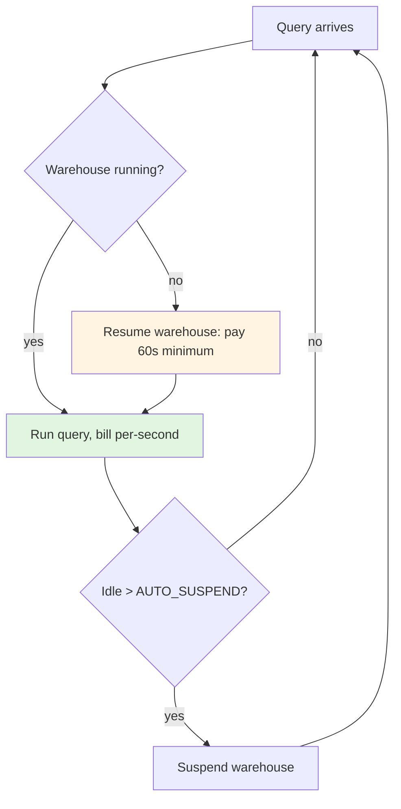
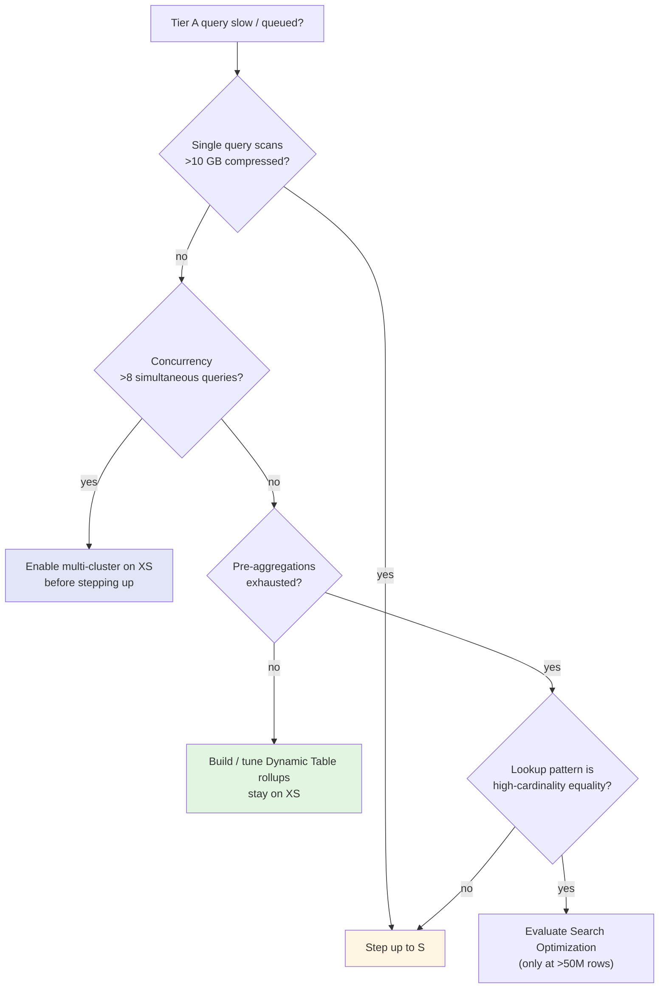

# Snowflake warehouse sizing recipes — per workload, with auto-suspend tuning

> **Last reviewed:** 2026-06-04. Distilled from `/tmp/research-snowflake-cost-perf.md`. Pair with [`snowflake-psm-dashboard-cost-model.md`](snowflake-psm-dashboard-cost-model.md) for the cost model and `QUERY_ATTRIBUTION_HISTORY` discipline.

## The recipe table — start here

| Tier | Workload | Recommended size | AUTO_SUSPEND | Edition | Rationale |
|---|---|---|---|---|---|
| **A — Dashboard read** | Streamlit / Power BI page load against a pre-aggregated rollup, `WHERE partner_id IN (…)` | **XS Standard** | **60s** | Standard or Enterprise | 1 credit/hr; pre-aggregated tables don't benefit from more cores. Doubling size doubles burn for marginal latency gain on small scans. |
| **B — dbt incremental build** | Nightly/hourly model refresh (90-day window, 25 partners) | **XS or S Standard** | **60s** | Standard | Hightouch publicly downsized M→S for dbt Cloud and reduced credits with only slight runtime increase. |
| **C — Ad-hoc exploration** | PSM drills past pre-aggs into raw fact tables | **S Standard, separate warehouse** | **60s** | Standard or Enterprise | Workload isolation prevents an exploratory full scan from blocking the dashboard XS. |
| **D — Streamlit-in-Snowflake (code WH)** | The WebSocket-anchored Python runtime warehouse | **XS Standard** (same as query WH) | **60s** | Standard or Enterprise | Two warehouses both meter; match them so resumes align and the cold-start tax is paid once. |
| **E — ML / Snowpark / Cortex** | Out of scope for PSM BI; would be Snowpark-Optimized | **avoid for BI** | n/a | n/a | 1.5× credit rate, M-minimum size, no XS available. Wrong tool for dashboards. |

[verified — `docs.snowflake.com/en/user-guide/warehouses-overview`, `docs.snowflake.com/en/user-guide/warehouses-snowpark-optimized`, Hightouch blog, Flexera 8-best-practices + Gen2 breakdown, Stellans, Chaosgenius, Keebo]

---

## Tier A — Dashboard read warehouse

**Default: XS Standard, AUTO_SUSPEND=60s, AUTO_RESUME=TRUE, no clustering, no Search Optimization.**

Only step up to S if:

- A single dashboard query consistently scans >10 GB of compressed data, OR
- Concurrency exceeds 8 simultaneous queries (multi-cluster XS is usually cheaper than a single S, by the way).

Never use Snowpark-Optimized for BI — 1.5× credit rate, M-minimum size, no XS available.

**Adaptive (Gen2) warehouses** (2026): can deliver 20–40% lower cost than Standard on variable workloads by scaling up only the slowest portion of a query plan. **Pilot only after the Tier-A workload is steady** — cold-start behavior differs from Standard. [vendor — Flexera Gen2]

DDL pattern:

```sql
CREATE WAREHOUSE psm_dashboard_xs
  WAREHOUSE_SIZE        = 'X-SMALL'
  WAREHOUSE_TYPE        = 'STANDARD'
  AUTO_SUSPEND          = 60
  AUTO_RESUME           = TRUE
  INITIALLY_SUSPENDED   = TRUE
  STATEMENT_TIMEOUT_IN_SECONDS = 120   -- runaway-query protection
  COMMENT               = 'PSM dashboard read warehouse (Tier A). See snowflake-warehouse-sizing-recipes.md.';
```

---

## Tier B — dbt build warehouse

**Default: XS or S Standard, AUTO_SUSPEND=60s, dedicated to dbt.**

The Hightouch lesson: cut spend by **downsizing first**, then optimizing slow models, then tuning auto-suspend. Auto-suspend tuning is a marginal lever vs. right-sizing. [verified — Hightouch case study]

- Start at **XS** for the PSM workload (25 partners × 90 days is small).
- Move to **S** only if a specific model's runtime crosses the SLA (e.g., the incremental run blocks Tier A's daily dashboard freshness).
- Keep dbt build *separate* from dashboard read. Don't share a warehouse between batch and interactive — batch will cold-cache the interactive path.

For Dynamic Table refresh, you specify a `TARGET_LAG` and a warehouse — the DT runs on a dedicated XS to keep refresh cost legible per pipeline.

---

## Tier C — Ad-hoc exploration

**Default: S Standard, separate warehouse, AUTO_SUSPEND=60s.**

Workload isolation is the #1 sizing principle. [verified — Flexera 8-best-practices]

- A PSM occasionally drilling past pre-aggs into raw facts will scan more data than the dashboard XS can handle gracefully. Isolating ad-hoc on its own warehouse means the dashboard stays sub-second even during exploration.
- S, not M — exploration queries are usually I/O bound and benefit linearly up to S; beyond S, you're paying for cores idle waiting on micro-partition scans.

---

## Tier D — Streamlit code warehouse (the silent tax)

**Two warehouses meter for Streamlit-in-Snowflake.** Both are billed independently. [verified — `docs.snowflake.com/en/developer-guide/streamlit/object-management/billing`]

1. **Code warehouse** — runs the Python. Kept alive by a WebSocket connection that expires **~15 minutes after the viewer's last activity** (mouse movement resets the timer). Custom `streamlitSleepTimeoutMinutes` can be set 5–240 min in `config.toml`.
2. **Query warehouse** — runs the SQL the app issues. Honors its own `AUTO_SUSPEND`/`AUTO_RESUME`.

**The silent tax:** every time the PSM opens the dashboard cold, you pay **60 seconds on the code warehouse + 60 seconds on the query warehouse** even if both queries finish in 2s.

**Cost levers:**

- Point Streamlit's code warehouse and query warehouse at the **same XS** (cuts the cold-start tax in half).
- Set `AUTO_SUSPEND = 60` on both.
- Lower `streamlitSleepTimeoutMinutes` from 15 → 5 if the PSM tends to leave the tab open while away. [verified — `docs.snowflake.com/en/developer-guide/streamlit/features/sleep-timer`]
- **Suspend the Streamlit app object outside business hours** (manual or scheduled task).

**Container runtime alternative:** bills via Snowpark Container Services compute-pool credits. Usually more expensive for sporadic BI, cheaper for sustained always-on dashboards. Not worth it for the 8am–6pm PSM pattern.

---

## The 60-second sweet spot for AUTO_SUSPEND

[verified across Stellans, Keebo, Unravel, Seemore]

**Minimum is 60 seconds. The "60-second sweet spot" is the documented sweet spot for sporadic BI.**

**The 60-second-minimum-charge trap:** Snowflake bills per-second **after a 60s minimum charge each time a warehouse resumes**. A warehouse that runs for 8s and suspends is billed 60s. So setting `AUTO_SUSPEND = 30` on a workload that fires every ~45s is **strictly worse** than `AUTO_SUSPEND = 60`, because you pay two 60s minimums instead of one continuous billing window. [verified — Keebo auto-suspend post]

**Tier recommendations:**

| Workload | AUTO_SUSPEND | Why |
|---|---|---|
| Dashboard / BI sporadic (PSM page loads) | **60s** | Sweet spot. Aggressive enough to stop idle burn at 6pm, lenient enough to amortize cold starts during a working session. |
| Streamlit code warehouse | **60s** | Match query warehouse so resumes align. |
| dbt incremental builds (scheduled) | **60s** | Job-scoped warehouses use 60s; never long suspends for batch. |
| Always-on production (NOT this workload) | 5–10 minutes | Reuse caches across continuous query streams. |



Setting `AUTO_SUSPEND` below 60 means every quick succession of queries pays multiple 60s minimums — strictly worse.

---

## When to step up from XS

A simple decision flow before you cut a `WAREHOUSE_SIZE = 'SMALL'`:



**The 80% rule from the field:** "around 80% of customers deploy cluster keys very poorly, leading to significant costs with little benefit." Always measure with `SYSTEM$CLUSTERING_INFORMATION` before and after, and skip clustering entirely below ~50M rows. [verified — Stellans clustering keys]

---

## Per-workload DDL snippets

```sql
-- Tier A: Dashboard read
CREATE WAREHOUSE psm_dash_xs
  WAREHOUSE_SIZE='X-SMALL' WAREHOUSE_TYPE='STANDARD'
  AUTO_SUSPEND=60 AUTO_RESUME=TRUE INITIALLY_SUSPENDED=TRUE
  STATEMENT_TIMEOUT_IN_SECONDS=120;

-- Tier B: dbt build
CREATE WAREHOUSE dbt_build_xs
  WAREHOUSE_SIZE='X-SMALL' WAREHOUSE_TYPE='STANDARD'
  AUTO_SUSPEND=60 AUTO_RESUME=TRUE INITIALLY_SUSPENDED=TRUE;

-- Tier C: Ad-hoc exploration (separate, slightly bigger)
CREATE WAREHOUSE psm_explore_s
  WAREHOUSE_SIZE='SMALL' WAREHOUSE_TYPE='STANDARD'
  AUTO_SUSPEND=60 AUTO_RESUME=TRUE INITIALLY_SUSPENDED=TRUE
  STATEMENT_TIMEOUT_IN_SECONDS=300;

-- Tier D: Streamlit code WH (point Streamlit at psm_dash_xs for query, this one for runtime)
CREATE WAREHOUSE psm_streamlit_code_xs
  WAREHOUSE_SIZE='X-SMALL' WAREHOUSE_TYPE='STANDARD'
  AUTO_SUSPEND=60 AUTO_RESUME=TRUE INITIALLY_SUSPENDED=TRUE;
```

---

## Anti-patterns this recipe flags

- A single shared warehouse for dashboard read + dbt build + ad-hoc → batch cold-caches interactive path; troubleshooting which workload is expensive becomes impossible.
- `AUTO_SUSPEND` set below 60 → strictly worse than 60 because of the minimum-charge rule.
- Step up to M / L / XL without first exhausting pre-aggregations and clustering analysis → 80%-deploy-poorly cluster-key trap.
- Snowpark-Optimized warehouse for BI workloads → 1.5× credit rate for no BI-relevant benefit.
- Streamlit code WH pointing at one warehouse and query WH pointing at another → doubles the cold-start tax.
- Pilot Adaptive (Gen2) warehouses on day one → cold-start behavior differs from Standard; pilot after baseline is steady.
- Long-lived `STATEMENT_TIMEOUT_IN_SECONDS` (>5 min) on the dashboard role → runaway query can rack up a full credit before Resource Monitor's 5-10 min accounting lag catches it.

---

## See also

- [`snowflake-psm-dashboard-cost-model.md`](snowflake-psm-dashboard-cost-model.md) — the cost model, Dynamic Tables vs MVs, attribution via JSON tags
- [`../skills/dashboard-performance-tuning/SKILL.md`](../skills/dashboard-performance-tuning/SKILL.md) — per-widget budgets + pre-aggregation tier hierarchy
- [`cloud-database-landscape-2026.md`](cloud-database-landscape-2026.md) — Snowflake's place in the broader DB landscape
- Research source: `/tmp/research-snowflake-cost-perf.md`
