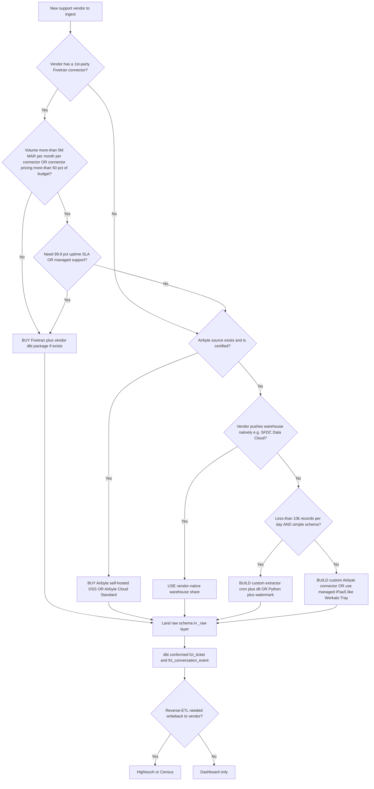

# Support-connector build-vs-buy economics (2026)

> **Last reviewed:** 2026-06-04. Sources: Fivetran 2026 pricing breakdowns (Mammoth Analytics, CheckThat.ai, Fivetran's own blog), Airbyte 2026 pricing (CheckThat.ai, CostBench), Fivetran/Airbyte connector directories, the per-vendor knowledge files in this directory. Refresh when: (a) Fivetran retires or restructures the connector-MAR model, (b) the Jan 1 2026 $5/connection minimum changes, (c) the deletes-count-as-MAR rule changes, (d) Airbyte Cloud pricing tiers shift, or (e) a third-party iPaaS materially undercuts on support-tool coverage.

## The 2026 shift in one sentence

> **Fivetran moved from pooled-MAR billing to per-connector MAR pricing in March 2025; effective Jan 1, 2026 there is a $5/month minimum per connection AND delete operations count toward paid MAR — for a multi-vendor support estate this typically raises bills 40–70% vs. the prior pooled model.** `[verify-at-use — 2026-06-04]`

This is **the** change in the support-connector economics for 2026. Older RavenClaude knowledge that treats Fivetran as "the safe default for any vendor with a connector" is now wrong for support estates with high MAR + lots of deletes (Zendesk ticket merges, SFDC Case `IsDeleted`, Front `archived/deleted` flips).

## The 2026 Fivetran pricing posture (verified)

| Dimension | Old (pre-Mar 2025) | Current (2026) |
|---|---|---|
| MAR billing | **pooled** across all connectors | **per-connector** — MAR computed independently per connector `[verify-at-use — 2026-06-04]` |
| Tiered MAR pricing | tiered band | **$2.50/M → $2.00/M → $1.50/M → $1.00/M** across **0-5M / 5-20M / 20-100M / 100M+** rows. `[verify-at-use — 2026-06-04]` |
| Minimum per connection | none | **$5/month per connection effective Jan 1, 2026** `[verify-at-use — 2026-06-04]` |
| Delete operations | did not count | **Delete operations now count toward paid MAR** `[verify-at-use — 2026-06-04]` |

**For multi-connector estates, typical bill impact is 40–70% higher vs. the pooled model.** `[verify-at-use — 2026-06-04]`

### Why the change matters for support estates

1. **Multi-vendor support estate** = many connectors (Zendesk + Salesforce + Intercom + Help Scout, say). Pre-2025, all 4 connectors' rows pooled into one MAR tier — often dropping the whole estate into the $1.00/M band. Now each one is billed independently, each one starts at $2.50/M.
2. **Deletes count.** Support workflows generate deletes: ticket merges (Zendesk), Case soft-deletes (SFDC `IsDeleted`), Front status flips to `archived/deleted`. Pre-change, none of these incremented MAR. Now they do.
3. **$5/connection minimum** — for tiny tenants on the long tail, the per-tenant connector spend has a floor.

## The 2026 Airbyte posture (the cheaper-at-scale alternative)

| Dimension | Value | Notes |
|---|---|---|
| Standard cloud credit price | **$2.50 per credit** | `[verify-at-use — 2026-06-04]` |
| APIs | **$15 per million rows (6 credits)** | `[verify-at-use — 2026-06-04]` |
| Databases | **$10 per GB (4 credits)** | `[verify-at-use — 2026-06-04]` |
| Plus tier (with SLAs / SSO) | starts **~$25k** | `[verify-at-use — 2026-06-04]` |

**For multi-vendor support estates** Airbyte's row-based billing tends to beat Fivetran's connector-MAR at meaningful scale — the cross-over depends on row volume + delete frequency. For very small estates ($5/connection × N connectors is small money), Fivetran's ergonomics still win. **For mid-to-large estates, re-quote.**

## Build-vs-buy decision tree

### Heuristics behind the tree

- **Fivetran wins** when: 1st-party connector + volume keeps tier in the low-MAR band + a connector dbt package exists (Zendesk specifically, via `fivetran/dbt_zendesk`).
- **Airbyte wins** on multi-vendor estates where per-connector pricing erodes Fivetran's value at scale; OSS self-host wins if you have the platform team.
- **Vendor-native warehouse shares** (SFDC Data Cloud / Snowflake Native Apps) **trump connectors** when available, but coverage is uneven across support vendors.
- **Custom Python (dlt / requests)** is correct for low-volume long-tail vendors where connector pricing dominates the cost case.

## Break-even heuristic — when BUILD overtakes BUY

For each support connector:

1. **Estimate annual MAR** (typical: tickets + comments + audits ≈ 2–4× ticket count per year).
2. **Compute Fivetran annual cost** at the per-connector MAR tier.
3. **Compare to BUILD amortized cost** — engineering time to write the loader (typically 1–2 weeks for a well-shaped API like Zendesk, 2–4 weeks for a multi-surface one like JSM) + ops cost to maintain it (1–2 hours/month).

**Rule of thumb:**

| Annual MAR per connector | Verdict |
|---|---|
| <1M | BUY Fivetran — the $5/connection minimum + connector ergonomics dominate. |
| 1–10M | **The contested zone.** Re-quote against Airbyte; consider BUILD if internal engineering capacity exists. |
| 10M+ | Strongly favor Airbyte (self-hosted) or BUILD — the connector-MAR math compounds. |

`[verify-at-use — 2026-06-04]` — re-validate against current vendor quotes; pricing shifts quarterly.

## Per-vendor connector rate card (2026 quick reference)

Detailed economics live in the per-vendor knowledge files; this table is the at-a-glance "should we BUY Fivetran for X."

| Vendor | Typical MAR shape | BUY Fivetran verdict | See |
|---|---|---|---|
| Zendesk | tickets + comments + audits — high MAR | **BUY** if <5M MAR; re-quote above. Best dbt package on the market (`fivetran/dbt_zendesk`). | [`./zendesk-integration.md`](./zendesk-integration.md) |
| Freshdesk | tickets + activities — medium MAR | **BUY** (managed connector handles the 300-page wall); no canonical dbt package. | [`./freshdesk-integration.md`](./freshdesk-integration.md) |
| Intercom | conversations + tickets + parts — high MAR | **BUY** but plan for refresh to cover Tickets API. | [`./intercom-integration.md`](./intercom-integration.md) |
| Salesforce Service Cloud | Case + CaseHistory — variable | **BUY** (Bulk 2.0 is the right shape for ELT). Mind the field-selection trap. | [`./salesforce-service-cloud-integration.md`](./salesforce-service-cloud-integration.md) |
| Jira Service Management | issue + changelog + SLA — high MAR with changelog | **BUY base, BUILD `/sla` puller** as supplement. | [`./jira-service-management-integration.md`](./jira-service-management-integration.md) |
| HubSpot Service Hub | tickets + engagements + history — variable | **BUY** but design against the 4 req/sec Search ceiling. | [`./hubspot-service-integration.md`](./hubspot-service-integration.md) |
| Help Scout | conversations + threads — low-to-medium MAR | **VERIFY** Fivetran connector depth; BUILD is straightforward. | [`./helpscout-integration.md`](./helpscout-integration.md) |
| Front | conversations + messages — medium MAR | **VERIFY** connector availability; BUILD is well-shaped. | [`./front-integration.md`](./front-integration.md) |

## House opinion (data-platform plugin §3 #2 + #9)

**Pricing changes quarterly.** Every pricing claim in this file carries a `[verify-at-use]` rider. **Re-quote before quoting a client.** Fivetran in particular has moved its model materially twice in 18 months (Mar 2025 → Jan 1 2026) — the pace is real, not anomalous.

## Refresh triggers

- Fivetran retires or restructures the connector-MAR model.
- Jan 1 2026 $5/connection minimum changes.
- Deletes-count-as-MAR rule changes.
- Airbyte Cloud pricing tiers shift.
- A third-party iPaaS materially undercuts on support-tool coverage.
- Vendor-native warehouse shares expand to cover more support vendors.

## References

All URLs accessed 2026-06-04.

- https://mammoth.io/blog/fivetran-pricing/ — Fivetran Pricing 2026 (Mammoth Analytics)
- https://checkthat.ai/brands/fivetran/pricing — Fivetran Pricing 2026 (CheckThat.ai)
- https://www.fivetran.com/blog/fivetran-vs-airbyte-features-pricing-services-and-more — Fivetran's own comparison
- https://checkthat.ai/compare/airbyte-vs-fivetran — Airbyte vs Fivetran 2026
- https://checkthat.ai/brands/airbyte/pricing — Airbyte Pricing 2026
- https://costbench.com/software/etl-tools/fivetran/ — CostBench (Airbyte comparison numbers)
- https://fivetran.com/docs/connectors — Fivetran connector directory
