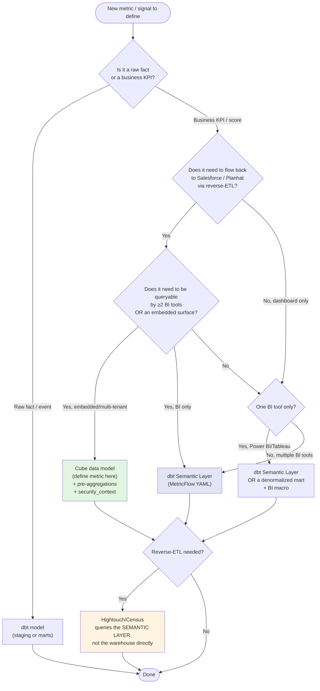

# Where do CS metrics live? — the "one number, one place" rule

> **Last reviewed:** 2026-06-04. Research-distilled from `/tmp/research-dbt-semantic-layer.md` (54 sources, dbt + Cube + Hightouch + Tobiko + community commentary). Refresh triggers above. Pair with [`cube-vs-dbt-semantic-layer-decision-tree.md`](../templates/cube-vs-dbt-semantic-layer-decision-tree.md) for the embedded-vs-internal-only call.

## The rule

**Define metric semantics — numerator, denominator, joins, dimensions, grain — exactly once, in the warehouse-adjacent semantic layer. Never in the BI tool. Never duplicated in the reverse-ETL query.** This is the 2023–2026 industry consensus across dbt, Cube, Hightouch, Census, and the practitioner commentary (Benn Stancil's entity-layer thesis, the cube.dev "universal semantic layer" arguments, the dbt Labs `dbt_metrics` deprecation rationale). [verified — `docs.getdbt.com/best-practices/how-we-build-our-metrics`, `cube.dev/blog/why-data-analytics-departments-need-a-universal-semantic-layer`, `benn.substack.com/p/entity-layer`]

The unresolved 2026 question is *which* semantic layer — dbt Semantic Layer (MetricFlow) vs Cube vs hybrid — and that choice is driven by **embedded / multi-tenant / API-shape** needs, not by the metric math.

---

## Default recommendation (opinionated)

For an internal-only CS / PSM dashboard with low-medium cardinality (hundreds of partners, not millions), daily refresh, and reverse-ETL into Salesforce/Planhat:

- **Facts and dims:** dbt models — `models/marts/`, the standard staging → intermediate → marts → metrics layering.
- **Business KPIs and composite scores:** **dbt Semantic Layer (MetricFlow YAML)** — *the* defensible default when the BI tool is on the supported list (Power BI, Tableau, Sheets, Excel, Hex, Mode, Lightdash, Push.ai, Omni as of 2026). [verified — `docs.getdbt.com/docs/cloud-integrations/avail-sl-integrations`]
- **Reverse-ETL:** Hightouch or Census, **querying the semantic layer, not the warehouse directly.** Both vendors support semantic-layer-backed syncs in 2026. [verified — `hightouch.com/blog/reverse-etl`]
- **Cube:** **not justified** at this stage. Re-evaluate only when an embedded / multi-tenant surface, sub-second p95 below dbt SL caching, or an external programmatic API consumer becomes a hard requirement.

The dbt Semantic Layer is **dbt Cloud only** (Starter / Enterprise / Enterprise+); dbt-core ships the MetricFlow CLI but not the Semantic Layer service. Caching is Enterprise+ only. [verified — `getdbt.com/pricing`, `docs.getdbt.com/docs/use-dbt-semantic-layer/sl-faqs`]

---

## Decision tree — where should THIS metric live?

Source: synthesized from research §6; reproduced verbatim from `/tmp/research-dbt-semantic-layer.md`.

**The two non-obvious rules embedded in the tree:**

1. **Reverse-ETL queries the semantic layer, not the warehouse.** If Hightouch hits `SELECT arr FROM analytics.fct_partner_arr` and the dashboard hits `metric(name='partner_arr')`, you have two definitions even when both happen to reference the same column.
2. **Composite scores live next to the metrics that feed them.** A `priority_score = w1 × arr_normalized + w2 × health_signal + w3 × recency_decay` belongs in the same semantic-layer surface where `arr`, `health_signal`, `recency_decay` are defined — never in a Power BI DAX measure or a Tableau calculated field that no other consumer can reach.

---

## dbt Semantic Layer in 2026 — what it does, what it doesn't

What it does (2026): [verified — `docs.getdbt.com/docs/use-dbt-semantic-layer`]

- Single YAML definition of `semantic_models` (entities, measures, dimensions) and `metrics` (simple / ratio / derived / cumulative / conversion).
- JDBC + GraphQL API; metric requests compile to warehouse SQL on demand.
- BI integrations (2026): **Power BI, Tableau, Google Sheets, Excel (desktop + online), Hex, Mode, Lightdash, Push.ai, Omni.** All others use materialized **exports**.
- "Write once, query anywhere" — metric change in YAML propagates to every consumer via the API.

What it does *not* do:

- **No native Looker / LookML integration.** No translator either direction. Treat as `[evolving]`. [verified — Medium analyses + dbt docs silence]
- **Not multi-tenant by construction.** No row-level security primitive comparable to Cube's `security_context`; you implement RLS as warehouse views.
- **Not an embedded-analytics layer.** The JDBC/GraphQL surface is for BI tools and notebooks, not for serving an external customer-facing app at scale.
- **No first-class pre-aggregation engine.** Performance depends on the underlying warehouse + caching tier; there is no Cube-Store-equivalent rollup store.

For when to promote to Cube, see [`cube-vs-dbt-semantic-layer-decision-tree.md`](../templates/cube-vs-dbt-semantic-layer-decision-tree.md).

---

## Specific recommendation for the PSM 9-signal dashboard

**Setup assumed:** internal-only partner-success dashboard, low-medium cardinality (hundreds of partners), daily refresh, signals also need to flow into Salesforce/Planhat so PSMs see the same priority ranking in their CRM.

**Recommendation:** dbt-core for facts + dbt Semantic Layer for the 9 signals + Hightouch/Census-equivalent reverse-ETL queries that hit the Semantic Layer, NOT raw warehouse tables. Cube is *not* justified yet. Re-evaluate Cube *only* if:

- A partner-facing portal is added (multi-tenant + embedded → Cube).
- Dashboard p95 > 3s and dbt SL caching (Enterprise+) isn't enough.
- An AI agent / programmatic consumer needs the metric API and dbt Cloud isn't the right surface.

**Where each of the 9 signals lives** (extracted from research §7):

| Signal | Layer | Reasoning |
|---|---|---|
| `partner_arr` | dbt mart → MetricFlow `metric` | Already a SoT debate (SFDC vs warehouse) — put it in MetricFlow so dashboard, SFDC sync, and AI agent agree. |
| `days_since_last_touch` | MetricFlow `metric` (cumulative) | Time-based, naturally MetricFlow-shaped. |
| `open_blockers_count` | dbt mart + MetricFlow `metric` (simple) | Aggregation of `fct_partner_blocker`. |
| `health_score_30d` | MetricFlow `metric` (derived) | Derived from constituents — keeps weights in one YAML file, versioned in git. |
| `renewal_window_flag` | MetricFlow `metric` (simple, boolean cast) | Drives sort order in dashboard *and* in SFDC list view. |
| `expansion_signal` | MetricFlow `metric` (derived) | Combines product-usage + sales-stage facts; do not compute in Power BI. |
| `escalation_flag` | dbt mart (with dbt test) | Boolean, mostly an `fct_` column; expose as a MetricFlow dimension on the partner entity. |
| `nps_latest` | dbt staging + MetricFlow dimension | Survey snapshot; not really a metric, but exposed via the semantic model. |
| `priority_score` | MetricFlow `metric` (derived, the combiner) | **This is the one that must NOT live in the dashboard.** Define it here so Salesforce ranking and dashboard ranking are byte-identical. |

**Anti-patterns to specifically avoid here:**

- Defining `priority_score` as a Power BI DAX measure → invisible to Hightouch, invisible to any AI agent, invisible to data tests.
- Defining `partner_arr` in the dbt mart *and* in a Salesforce formula field → metric drift the day finance changes the ARR definition.
- Skipping MetricFlow because "it's just 9 signals" → adding the 10th signal later is when drift starts; the YAML overhead is small.

---

## Anti-patterns (metric defined in 3 places)

The documented failure modes, attributed:

1. **Metric in dbt mart + metric in BI tool + metric in reverse-ETL query.** Benn Stancil's entity-layer framing: "Business concepts like users, customers, transactions, and events are defined in a mix of dbt models, queries in reverse ETL tools, configurations in third-party apps, and the application code of internal tools." [verified — `benn.substack.com/p/entity-layer`]
2. **"Active partner" defined as `last_login_30d` in the BI tool but `had_transaction_30d` in the Salesforce sync.** The cube.dev universal-SL critique: "'active users' might include trial accounts in one team's dashboard but not another's." [verified — `cube.dev/blog/why-data-analytics-departments-need-a-universal-semantic-layer`]
3. **Duplicating dbt marts because reuse is hard.** "Often, creating another dbt model is much easier than using an existing one. This duplication of definitions obscures the maintainability of key KPI declarations." [verified — `cube.dev/blog/optimizing-data-management-and-analytics-efficiency-with-semantic-layers`]
4. **LookML lock-in by codifying ALL business logic in Looker.** Combined with no LookML-to-MetricFlow translator: business logic is platform-locked to Google Cloud. [verified — `getdbt.com/blog/how-do-you-decide-what-to-model-in-dbt-vs-lookml`]
5. **Defining the same metric in MetricFlow YAML *and* a Cube cube.** The hybrid pattern only works if Cube **reads** MetricFlow; defining metrics twice is worst-of-both-worlds. [verified — `cube.dev/blog/dbt-metrics-meet-cube`]
6. **Health/priority score computed at the BI layer.** Means (i) the score can't be reverse-ETL'd back to Salesforce without re-implementation, (ii) AI agents querying the semantic layer get raw facts and have to re-derive priority, (iii) the score is invisible to data tests.
7. **`dbt_metrics` package still in the project.** Deprecated 2023-12-15, fully replaced by MetricFlow YAML in dbt v1.6+. Any project still on `dbt_metrics` is on a dead path. [verified — `docs.getdbt.com/blog/deprecating-dbt-metrics`]

---

## Reusable packages — what's worth borrowing

No `dbt_customer_success` package exists; verified absence against `github.com/Hiflylabs/awesome-dbt`. The closest things:

- **`dbt-labs/dbt-utils`** — surrogate keys, date spines, pivot macros. Always. [verified]
- **`fivetran/fivetran_log`** — connector health (useful as a "is the upstream data fresh" signal, not a CS metric per se). [verified — `hub.getdbt.com/fivetran/fivetran_log`]
- **`fivetran/dbt_salesforce`** — opportunity / account staging models; useful as a starting point for the `dim_partner` model rather than for metrics. [verified — `fivetran.com/blog/fivetran-dbt-salesforce`]
- **Hightouch / Census** — reverse-ETL into Salesforce / Planhat; both support semantic-layer-backed syncs in 2026.

**Build the 9-signal layer as a thin, project-local package, not as a fork of someone else's.**

---

## Vendor-flagged claims NOT to cite as fact

From the research source-honesty notes:

- "SQLMesh is 22× faster than dbt on Snowflake" — vendor benchmark, `tobikodata.com`. The *structural* claim that dbt-core is stateless and SQLMesh adds column-level lineage is verifiable; the speedup number is not.
- "Brex chose Cube over dbt SL and LookML" — `cube.dev` marketing, not independently verified.
- "Delphi + Cube scored 100% vs dbt 83% across 8 questions" — `cube.dev` benchmark, no independent replication.
- "18% dbt SL adoption / 28% LookML adoption" — Medium write-up, unverified, treat as anecdote.

---

## See also

- [`cube-vs-dbt-semantic-layer-decision-tree.md`](../templates/cube-vs-dbt-semantic-layer-decision-tree.md) — when to promote to Cube
- [`../skills/dbt-project-scaffolding/SKILL.md`](../skills/dbt-project-scaffolding/SKILL.md) — staging/intermediate/marts/metrics layer discipline
- [`../skills/cube-schema-scaffolding/SKILL.md`](../skills/cube-schema-scaffolding/SKILL.md) — when Cube is justified
- [`../../edtech-partner-success/knowledge/partner-health-score-drift.md`](../../edtech-partner-success/knowledge/partner-health-score-drift.md) — what happens when the score lives in the wrong place and drifts silently
- Research source: `/tmp/research-dbt-semantic-layer.md`
