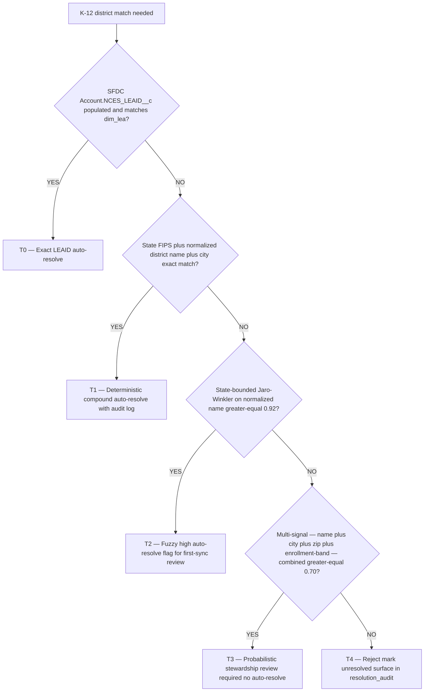

# Skill: cross-system-identity-resolution

> **Invoked by:** `etl-pipeline-engineer` (owns the pipeline correctness) + `ravenclaude-core/architect` (owns the cross-system data model). Also consulted by `dashboard-builder` when a mart metric seems wrong and the root cause may be a resolution error.
>
> **When to invoke:** Phase 0 of any multi-source build; whenever a new source system is added to an existing conformed spine; after a "the numbers don't match" incident where the suspected cause is a bad cross-system join.
>
> **Output:** a populated `bridge_account_xref` table seeded with high-confidence rows, a `resolution_audit` dbt model running on schedule, a stewardship surface for low-confidence candidates, and dbt tests guarding the join spine.

## The discipline (the floor, not the ceiling)

**Every metric built on a wrong join is wrong, silently.** Identity resolution is the #1 technical risk in a multi-source analytics build — both expert panels in the CS-health build plan agreed on this independently. The correct shape: exhaust deterministic options first (30 minutes of investigation), fall back to domain matching (imperfect but checkable), and treat name matching as a human-review queue, never an auto-trusted join.

Two-line rule:
1. **No match without a record** — every resolved and every unresolved record gets a row in `bridge_account_xref`
2. **No metric off a name-only match without a review record** — `reviewed_by IS NOT NULL` is a precondition for publishing

## Step 1 — Inventory candidate keys per source system

Before writing any matching code, audit each source system for cross-reference fields. This takes 30 minutes and often eliminates 90% of the resolution problem.

| Source system | Candidate key to check | How to check |
|---|---|---|
| **Planhat** | `externalId` on Company — designed to hold the Salesforce Account ID when the SFDC↔Planhat sync is configured | `GET /companies` for a sample; inspect `externalId` field |
| **Intercom** | `company_id` on Company — populated with Salesforce Account ID when Intercom's Salesforce integration is on | `GET /companies` for a sample; inspect `company_id` |
| **Slack** | No native account concept — see Step 4 | N/A for the ladder; use seed table |
| **HubSpot** | `hs_object_id`, or `salesforce_account_id` custom property if SFDC sync is on | Check HubSpot company properties |
| **Stripe** | `metadata.salesforce_account_id` if set by the billing flow | Check Stripe customer metadata |

**Document what you find.** Record in the Phase 0 notes: which systems have deterministic keys populated, which do not, and what action was taken (configured the sync, escalated for ops setup, proceeded to domain matching).

## Step 2 — Build the resolution precedence ladder

Apply in order. Stop at the first level that resolves the record. Never skip to a lower-confidence level because it is faster to code.

| Priority | Method | Confidence | Auto-resolve? | `match_method` value |
|---|---|---|---|---|
| **1 — Deterministic** | External ID / cross-reference field set by a configured integration | Exact | Yes | `'external_id'` |
| **2 — Email domain** | Derive primary domain per account; join on normalized domain (lowercase, strip `www.`, strip known TLD suffixes) | Strong, not perfect | Yes — unless domain is shared/generic | `'email_domain'` |
| **3 — Normalized name** | Strip legal suffixes, lowercase, collapse whitespace, Levenshtein distance ≤ threshold | Weak | **No — human review required** | `'name_fuzzy'` |
| **Unresolved** | No match found at any level | None | N/A | `'unresolved'` |

**Email domain caveats:** exclude known shared/generic domains (`gmail.com`, `outlook.com`, `yahoo.com`). Maintain a `dim_account_domains(account_key, domain)` table for accounts with multiple legitimate domains (post-acquisition, holding companies). Domain matching on a large consulting firm's domain will produce false positives.

**Name fuzzy caveats:** use normalized Levenshtein (or trigram similarity), not `ILIKE '%acme%'`. Set a threshold (e.g., similarity ≥ 0.85) and never auto-accept — every name-fuzzy candidate goes to the stewardship queue regardless of similarity score.

## Step 3 — Construct `bridge_account_xref`

Every resolution — at any confidence level — is recorded in the bridge table. Unresolved records get a null `account_key` and are retained, never dropped.

```sql
-- transform/models/staging/bridge_account_xref.sql (or infra DDL)
create or replace table transform.bridge_account_xref (
    source          varchar not null,        -- 'planhat' | 'intercom' | 'slack' | 'hubspot' | 'stripe'
    source_id       varchar not null,        -- the source system's native primary ID
    account_key     varchar,                 -- FK to dim_account.account_key; NULL = unresolved
    match_method    varchar not null,        -- 'external_id' | 'email_domain' | 'name_fuzzy' | 'manual' | 'unresolved'
    confidence      varchar not null,        -- 'high' | 'medium' | 'low' | 'unresolved'
    similarity_score float,                  -- for name_fuzzy matches; null otherwise
    reviewed_by     varchar,                 -- email of reviewer; required before name_fuzzy used in metrics
    reviewed_at     timestamp,
    created_at      timestamp default current_timestamp,
    updated_at      timestamp default current_timestamp,
    primary key (source, source_id)
);
```

**Seeding order:**
1. Run the deterministic pass first — insert all `external_id` rows with `confidence = 'high'`
2. Run the domain pass for the remaining unresolved records — insert with `confidence = 'medium'`; flag shared/generic domains to stewardship queue
3. Run the name-fuzzy pass for any still-unresolved records — insert with `confidence = 'low'`, `account_key = NULL` until reviewed
4. Insert remaining unresolved records explicitly with `match_method = 'unresolved'`

```sql
-- Example: deterministic pass for Planhat
insert into transform.bridge_account_xref (source, source_id, account_key, match_method, confidence)
select
    'planhat',
    p.planhat_id,
    a.account_key,
    'external_id',
    'high'
from stg_planhat__companies p
join dim_account a
    on p.external_id = a.sfdc_account_id   -- deterministic: Planhat externalId = Salesforce Account ID
where p.external_id is not null
  and a.sfdc_account_id is not null
on conflict (source, source_id) do nothing;   -- idempotent; don't overwrite existing rows

-- Unresolved records (those not matched above)
insert into transform.bridge_account_xref (source, source_id, account_key, match_method, confidence)
select 'planhat', p.planhat_id, null, 'unresolved', 'unresolved'
from stg_planhat__companies p
where p.planhat_id not in (
    select source_id from transform.bridge_account_xref where source = 'planhat'
)
on conflict (source, source_id) do nothing;
```

## Step 4 — Slack channel → account mapping (separate mechanism)

Slack has no native account concept; the three-step ladder does not apply. Use the seed table mechanism instead.

See [`../../knowledge/slack-as-data-source.md`](../../knowledge/slack-as-data-source.md) for the full `slack_channel_account_map` DDL, seeding process, and weekly diff script.

The key discipline: the Slack → account mapping is **always human-confirmed**. The diff script proposes; a human approves. Never auto-insert a channel-to-account mapping from naming-convention heuristics alone.

## Step 5 — Quarantine and null-FK propagation

Unresolved records (`account_key = NULL` in the bridge) are **retained, never dropped**. Downstream models use an explicit `WHERE account_key IS NOT NULL` to exclude them from aggregated metrics. This makes the exclusion visible and auditable.

```sql
-- In mart_cs_health or equivalent: exclude unresolved AND unreviewed low-confidence joins
left join transform.bridge_account_xref xref
    on xref.source = 'planhat'
    and xref.source_id = p.planhat_id
where xref.account_key is not null               -- exclude unresolved
  and (
    xref.match_method != 'name_fuzzy'            -- auto-trusted methods
    or xref.reviewed_by is not null              -- OR name-fuzzy with human review
  )
```

A `null` FK in the mart signals "source record exists but account is unknown" — which is a data quality alert, not a missing record. A silent drop would make an unmatched account look like a healthy account with zero signals.

## Step 6 — `resolution_audit` dbt model + alert

A dbt model that runs daily and alerts when resolution quality degrades. The >5% unresolved threshold comes directly from the build plan's guardrails.

```sql
-- models/marts/resolution_audit.sql
with summary as (
    select
        source,
        count(*) as total_records,
        sum(case when account_key is null then 1 else 0 end) as unresolved_count,
        round(100.0 * sum(case when account_key is null then 1 else 0 end) / count(*), 2)
            as unresolved_pct,
        sum(case when match_method = 'name_fuzzy' and reviewed_by is null then 1 else 0 end)
            as unreviewed_fuzzy_count
    from {{ ref('bridge_account_xref') }}
    group by source
),
slack_unmapped as (
    select channel_id, added_at
    from {{ ref('seed_slack_channel_account_map') }}
    where account_key is null
      and added_at < current_date - 7
)
select 'unresolved_pct_breach' as alert_type, source, unresolved_pct as value, null as channel_id
from summary
where unresolved_pct > 5

union all

select 'unreviewed_fuzzy_match' as alert_type, source, unreviewed_fuzzy_count, null
from summary
where unreviewed_fuzzy_count > 0

union all

select 'slack_channel_unmapped_gt_7d', 'slack', datediff('day', added_at, current_date), channel_id
from slack_unmapped
```

```yaml
# _models.yml — warn severity so the pipeline continues but alert fires
models:
  - name: resolution_audit
    tests:
      - dbt_utils.expression_is_true:
          expression: "count(*) = 0"
          severity: warn
          config:
            error_if: ">= 1"
```

Wire the `warn` severity to a Slack/email alert channel. A rising unresolved percentage or an accumulating unreviewed-fuzzy queue are correctness risks, not outages — they need visibility, not a wake-up page.

## Step 7 — Stewardship review surface

Low-confidence (name-fuzzy) match candidates queue to a stewardship view in the BI tool before they are published to any metric. The minimum viable stewardship surface:

| Column to surface | Purpose |
|---|---|
| `source`, `source_id` | Identify the source record needing review |
| Source-system display name (e.g., `planhat_company_name`) | Human-readable context |
| Candidate `account_key` and `dim_account.account_name` | The proposed match |
| `match_method`, `confidence`, `similarity_score` | Basis for the proposal |
| `reviewed_by`, `reviewed_at` | Approval status |
| Approve / Reject action | Write back to `bridge_account_xref` |

**The approval action writes `reviewed_by` and `reviewed_at` to the bridge.** Until that write, the name-fuzzy record's `account_key` is excluded from all mart metrics by the WHERE clause in Step 5.

## Step 8 — Manual top-N review before launch

Before Phase 1 launch: manually audit the top ~20 accounts by ARR. For each account:

1. Confirm the correct Planhat company is mapped
2. Confirm the correct Intercom company is mapped
3. Confirm the correct Slack channel(s) are in `slack_channel_account_map`
4. Review the `match_method` and `confidence` for each mapping
5. Document the match evidence in a "pre-launch resolution sign-off" doc

This catches systematic resolution errors before they compound through a quarter of health-score data. The CS team typically knows their top accounts well; this review takes 30–60 minutes and is non-negotiable.

## dbt tests that guard the join spine

Add these to the `bridge_account_xref` model's `_models.yml`:

```yaml
models:
  - name: bridge_account_xref
    columns:
      - name: source
        tests:
          - not_null
          - accepted_values:
              values: ['planhat', 'intercom', 'slack', 'hubspot', 'stripe']
      - name: source_id
        tests:
          - not_null
      - name: match_method
        tests:
          - not_null
          - accepted_values:
              values: ['external_id', 'email_domain', 'name_fuzzy', 'manual', 'unresolved']
      - name: confidence
        tests:
          - not_null
          - accepted_values:
              values: ['high', 'medium', 'low', 'unresolved']
    tests:
      - dbt_utils.unique_combination_of_columns:
          combination_of_columns: [source, source_id]
```

Also add a singular test asserting no name-fuzzy row with `account_key IS NOT NULL` and `reviewed_by IS NULL` reaches the mart layer (the WHERE clause in Step 5 is the runtime gate; this test catches a missing WHERE clause):

```sql
-- tests/assert_no_unreviewed_fuzzy_in_mart.sql
-- Any name-fuzzy join without a reviewer is an accuracy risk; this catches a missing WHERE clause.
select b.source, b.source_id, b.account_key
from {{ ref('bridge_account_xref') }} b
join {{ ref('fct_account_health_snapshot') }} f on f.account_key = b.account_key
where b.match_method = 'name_fuzzy'
  and b.reviewed_by is null
{{ config(severity='error') }}
```

## Anti-patterns this skill flags

- Writing a `JOIN ON LOWER(TRIM(company_name)) = LOWER(TRIM(account_name))` directly in a dbt model — bypasses the bridge entirely; produces invisible duplicates with no audit trail
- Auto-publishing a metric for a record matched on normalized name without a human review record
- Dropping records that don't resolve — null FK, retain, alert, review
- Treating a rising unresolved percentage as "normal" and not investigating — it means source records exist that are invisible to every CS health metric
- Skipping the Phase 0 candidate-key inventory and jumping straight to fuzzy matching — the highest-value 30-minute investment in the whole build

---

## K-12 LEAID matching (added 2026-06-04)

The base ladder (Steps 1–3) is domain-neutral. For K-12 EdTech engagements there is a higher-confidence deterministic anchor than email-domain: **LEAID** (Local Education Agency ID), the NCES-issued 7-digit identifier for every public school district in the United States. This section is **additive** — apply it inside Steps 1–3 when the engagement is K-12.

### LEAID structure `[verify-at-use — 2026-06-04]`

- **7 digits total. First 2 = State FIPS code.** A Texas district always starts with `48`, Wisconsin with `55`, California with `06`, New York with `36`, etc.
- Issued by the National Center for Education Statistics (NCES) via the Common Core of Data (CCD) survey.
- Updated annually. Changes on district consolidation/split (see § "District consolidation/split" below).
- **NCES School ID** = LEAID + SCHNO (12 digits total) — school-grain identifier.
- Public lookup: [`nces.ed.gov/ccd/districtsearch/`](https://nces.ed.gov/ccd/districtsearch/). Programmatic flat-file: [`nces.ed.gov/ccd/ccddata.asp`](https://nces.ed.gov/ccd/ccddata.asp).

### LEAID confidence-tier ladder

Layered on top of the base ladder in Step 2. T0–T2 are auto-resolve; T3 is human-review; T4 is reject.

| Tier | Match logic | Confidence | Auto-resolve? | `match_method` value |
|---|---|---|---|---|
| **T0 — Exact LEAID** | SFDC `Account.NCES_LEAID__c` populated AND matches `dim_lea.leaid` | 100% | Yes | `'leaid_exact'` |
| **T1 — Deterministic compound** | `(state_fips, normalized_district_name, city)` exact match against `dim_lea` | ~95% `[verify-at-use — 2026-06-04]` | Yes (with audit log) | `'leaid_compound'` |
| **T2 — Fuzzy district name** | Levenshtein/Jaro on normalized name within state; threshold ≥ 0.92 | 85–95% `[verify-at-use — 2026-06-04]` | Yes (flag for review at first sync) | `'leaid_fuzzy_high'` |
| **T3 — Probabilistic** | Multi-signal: name + city + zip + enrollment-band agreement | 70–85% | **No — human review** | `'leaid_probabilistic'` |
| **T4 — Below threshold** | <70% confidence on any signal combination | — | No — reject | `'unresolved'` |

**Threshold rationale:** industry-standard threshold for the deterministic-vs-probabilistic boundary is **85–95%** `[verify-at-use — 2026-06-04]`. For B2B district matching the cost of a wrong match is higher than consumer identity resolution (a wrong district = wrong cohort = wrong health score), so tighten thresholds at the high end of the industry range: 0.92 for the T2 fuzzy threshold instead of the consumer-standard 0.85.

**Why tighter than consumer identity:** the entity universe is smaller (~13,500 US public school districts), so the prior probability of two real districts having very similar names is higher than in consumer matching where names are drawn from a much larger distribution. False positives are more likely without tighter thresholds.

### District-name normalization rules

Before any fuzzy match, normalize the district name. Apply in order:

1. **Lowercase + collapse whitespace.** `"  Chicago   Public Schools  "` → `"chicago public schools"`.
2. **Drop common district-type suffixes** (idempotent — strip any that appear):
   - `"school district"` → ``
   - `"public schools"` → ``
   - `"public school district"` → ``
   - `"independent school district"` → ``
   - `"unified school district"` → ``
   - `"consolidated school district"` → ``
   - `"city school district"` → ``
   - `"central school district"` → ``
   - `"community school district"` → ``
   - `"regional school district"` → ``
   - `"isd"` (with word boundary) → `` (Texas-heavy convention — "Plano ISD" → "plano")
   - `"csd"` (with word boundary) → ``
   - `"usd"` (with word boundary) → ``
3. **Normalize "Saint" variants:** `"st."` → `"saint"`, `"st "` → `"saint "` (word boundary). `"st. louis"` and `"saint louis"` collapse to one form.
4. **Normalize ampersands and "and":** `"&"` → `"and"`.
5. **Strip punctuation** (after the above replacements): apostrophes, periods, commas. Hyphens stay (they're often semantically meaningful — `"winston-salem"`).
6. **Collapse multiple spaces to one.**
7. **Strip leading/trailing whitespace.**

```sql
-- A reference implementation as a Snowflake UDF
create or replace function normalize_district_name(name string)
returns string
language sql
as $$
    trim(
        regexp_replace(
            regexp_replace(
                regexp_replace(
                    regexp_replace(
                        regexp_replace(
                            regexp_replace(
                                regexp_replace(
                                    regexp_replace(
                                        regexp_replace(
                                            regexp_replace(
                                                regexp_replace(
                                                    regexp_replace(
                                                        regexp_replace(
                                                            lower(name),
                                                            '\\bindependent school district\\b', ''
                                                        ),
                                                        '\\bunified school district\\b', ''
                                                    ),
                                                    '\\bconsolidated school district\\b', ''
                                                ),
                                                '\\bcity school district\\b', ''
                                            ),
                                            '\\bcentral school district\\b', ''
                                        ),
                                        '\\bcommunity school district\\b', ''
                                    ),
                                    '\\bregional school district\\b', ''
                                ),
                                '\\bpublic school district\\b', ''
                            ),
                            '\\bschool district\\b|\\bpublic schools\\b|\\bisd\\b|\\bcsd\\b|\\busd\\b', ''
                        ),
                        '\\bst\\.\\s|\\bst\\s', 'saint '
                    ),
                    '&', 'and'
                ),
                '[\\.,'']', ''
            ),
            '\\s+', ' '
        )
    )
$$;
```

### State-ID systems by state

LEAID is the federal identifier; states often issue their own. The state ID is sometimes the more useful key in single-state engagements because it's the one districts know.

| State | State agency | State district ID name | LEAID prefix (FIPS) | Notes |
|---|---|---|---|---|
| California | CDE (Cal. Dept. of Education) | CDS code (14-digit county-district-school) | 06 | First 7 digits = district; full 14 = school. |
| Texas | TEA (Texas Education Agency) | CDN (County-District Number, 6-digit) | 48 | Maps deterministically to LEAID. |
| New York | NYSED (NY State Education Dept.) | BEDS code (12-digit) | 36 | First 6 = district; 12 = school. |
| Florida | FLDOE | District number (2-digit) | 12 | Often used standalone in FL contracts. |
| Illinois | ISBE (Ill. State Bd. of Education) | RCDTS (Region-County-District-Type-School, 15-digit) | 17 | |
| Pennsylvania | PDE | AUN (Administrative Unit Number, 9-digit) | 42 | |
| Ohio | ODE | IRN (Information Retrieval Number) | 39 | |
| Michigan | MDE | District code (5-digit) | 26 | |
| Georgia | GaDOE | District ID (3-digit) | 13 | |
| North Carolina | NCDPI | LEA Code (3-digit) | 37 | |
| Massachusetts | DESE | District Code (4-digit) | 25 | Often called "ORG code." |
| Washington | OSPI | District Code (5-digit) | 53 | |
| Virginia | VDOE | Division Number (3-digit) | 51 | "Division" not "district" in VA. |
| Wisconsin | DPI | District Number (4-digit) | 55 | |
| Indiana | IDOE | Corporation Number (4-digit) | 18 | "Corporation" not "district." |
| Tennessee | TDOE | System Number (3-digit) | 47 | |
| Missouri | DESE-MO | District Code (6-digit) | 29 | |
| Maryland | MSDE | LEA Code (2-digit) | 24 | Only 24 districts (county-based). |
| Arizona | ADE | District Entity ID (4-digit) | 04 | |
| Colorado | CDE-CO | District Code (4-digit) | 08 | |

`[verify-at-use — 2026-06-04]` — confirm per state. Each state agency publishes its own crosswalk to LEAID; ingest the crosswalk into a `dim_state_district_id` table when the engagement scope includes that state.

### Implementation pattern — `dim_lea` materialization

- **Seed source:** `seed_nces_districts.csv` from NCES CCD flat-file ([`nces.ed.gov/ccd/ccddata.asp`](https://nces.ed.gov/ccd/ccddata.asp)) — refreshed annually.
- **Alternative source:** an NCES Snowflake share if available, or an S3 pull from `nces.ed.gov`.
- **Materialize monthly** — district data changes annually but the refresh cadence is conservative.
- **dbt model:** `dim_lea.sql` materializes the typed dimension; `int_district_match__sfdc_to_lea.sql` is a stage-of-stages with one CTE per tier.

```sql
-- models/marts/dim_lea.sql
{{ config(materialized='table') }}
select
    leaid,                                                  -- 7-digit LEAID
    substring(leaid, 1, 2) as state_fips,
    state_abbreviation,
    district_name as district_name_official,
    normalize_district_name(district_name) as district_name_normalized,
    city,
    state,
    zip_code,
    enrollment_total,
    enrollment_band,
    effective_from,                                         -- SCD2
    effective_to,
    is_current
from {{ ref('seed_nces_districts') }}
```

```sql
-- models/intermediate/int_district_match__sfdc_to_lea.sql
with t0_exact as (
    select a.account_key, l.leaid,
           'leaid_exact' as match_method, 'high' as confidence, 1.00 as similarity_score
    from {{ ref('stg_salesforce__account') }} a
    join {{ ref('dim_lea') }} l on a.nces_leaid_c = l.leaid
    where a.nces_leaid_c is not null and l.is_current
),
unresolved_after_t0 as (
    select a.* from {{ ref('stg_salesforce__account') }} a
    where a.account_key not in (select account_key from t0_exact)
),
t1_compound as (
    select a.account_key, l.leaid,
           'leaid_compound' as match_method, 'high' as confidence, 0.95 as similarity_score
    from unresolved_after_t0 a
    join {{ ref('dim_lea') }} l
        on l.state_fips = substring(a.state_fips_code, 1, 2)
       and normalize_district_name(a.account_name) = l.district_name_normalized
       and lower(a.billing_city) = lower(l.city)
    where l.is_current
),
unresolved_after_t1 as (
    select a.* from unresolved_after_t0 a
    where a.account_key not in (select account_key from t1_compound)
),
t2_fuzzy as (
    select a.account_key, l.leaid,
           'leaid_fuzzy_high' as match_method, 'medium' as confidence,
           jarowinkler_similarity(normalize_district_name(a.account_name), l.district_name_normalized) as similarity_score
    from unresolved_after_t1 a
    join {{ ref('dim_lea') }} l on l.state_fips = substring(a.state_fips_code, 1, 2)
    where l.is_current
      and jarowinkler_similarity(normalize_district_name(a.account_name), l.district_name_normalized) >= 0.92
)
select * from t0_exact
union all select * from t1_compound
union all select * from t2_fuzzy
```

Surface `match_method` + `similarity_score` on the final mart row so dashboards can render the confidence to PSMs ("matched by name — 0.94 confidence").

### District consolidation/split — the SCD2 gotcha

**LEAIDs change on consolidation.** When two districts merge, both old LEAIDs are retired and a new one issued; the historical fact data must still resolve to the new partner key.

**Pattern:**
- Keep `dim_lea` as **SCD Type 2** (`effective_from` / `effective_to` / `is_current`).
- Don't embed LEAID directly in fact tables — fact tables hold `partner_key`.
- Join chain: `fact → dim_partner → dim_partner_lea_link → dim_lea`.
- `dim_partner_lea_link` is many-to-many (one partner may span multiple LEAIDs through history) and SCD2.
- The fact survives consolidation because `partner_key` is stable; the LEAID join walks through the link table to find the LEAID effective at the fact's date.

```sql
create table dim_partner_lea_link (
    partner_key      varchar not null,
    leaid            varchar not null,
    effective_from   date not null,
    effective_to     date,
    is_current       boolean,
    link_source      varchar,         -- 'sfdc_field' | 'manual_review' | 'nces_consolidation_event'
    primary key (partner_key, leaid, effective_from)
);
```

### LEAID-specific anti-patterns

- **Joining `Account.account_name` directly against `dim_lea.district_name`** without normalization → false negatives on every "ISD" suffix.
- **Embedding LEAID in fact tables** → consolidation breaks historical joins. Use `partner_key` + the link table.
- **Using LEAID without state FIPS** → cross-state collisions are unlikely but possible. Always carry state FIPS in the join.
- **Trusting a single LEAID per partner forever** → multi-LEAID partners exist (charter networks, regional consortia, post-merger districts). Use the link table.
- **Skipping the SCD2 on `dim_lea`** → a consolidation event silently rewrites historical answers ("which district owned this contract in 2023?" gives the 2026 LEAID).

### LEAID-specific dbt tests

```yaml
models:
  - name: dim_lea
    columns:
      - name: leaid
        tests:
          - not_null
          - dbt_utils.expression_is_true:
              expression: "length(leaid) = 7"
      - name: state_fips
        tests:
          - not_null
          - dbt_utils.expression_is_true:
              expression: "length(state_fips) = 2"
  - name: dim_partner_lea_link
    tests:
      - dbt_utils.unique_combination_of_columns:
          combination_of_columns: [partner_key, leaid, effective_from]
      - dbt_utils.expression_is_true:
          expression: "(is_current = true and effective_to is null) or (is_current = false and effective_to is not null)"
```

## Decision Tree: K-12 District Identity Resolution

**When this applies:** You are matching an SFDC Account (or Planhat Company) to a public-school-district identity for a K-12 EdTech engagement. The choice of tier controls whether the resolution is auto-published or human-reviewed.

**Last verified:** 2026-06-04 against NCES CCD docs, Cometly identity-resolution 2026 thresholds guidance, CustomerLabs deterministic-vs-probabilistic guide.



**Rationale per leaf:**
- *Leaf A — T0 Exact LEAID* — the strongest deterministic key. **Requires:** SFDC custom field `NCES_LEAID__c` populated and synced to the warehouse.
- *Leaf B — T1 Deterministic compound* — strong enough to auto-resolve when LEAID isn't populated. The compound key is hard to collide accidentally.
- *Leaf C — T2 Fuzzy high* — the 0.92 threshold is tighter than the consumer-identity standard because the K-12 entity universe is small enough that 0.85 produces too many false positives.
- *Leaf D — T3 Probabilistic* — multi-signal but never auto-resolve. Always stewardship review.
- *Leaf E — T4 Reject* — below threshold. Quarantine, alert, hand to ops team.

**Tradeoffs summary table:**

| Tier | Auto-resolve? | Confidence | Use when |
|---|---|---|---|
| T0 Exact LEAID (A) | Yes | 100% | LEAID field populated. |
| T1 Compound (B) | Yes (with audit) | ~95% | LEAID missing; name + city + state available. |
| T2 Fuzzy high (C) | Yes (first-sync review) | 85–95% | Name match only; tight similarity. |
| T3 Probabilistic (D) | No | 70–85% | Multi-signal but ambiguous; needs human. |
| T4 Reject (E) | No | <70% | Unresolved; route to ops. |

## See also

- Best practice: [`../../best-practices/resolve-identity-deterministic-keys-before-fuzzy.md`](../../best-practices/resolve-identity-deterministic-keys-before-fuzzy.md) — the named rule this skill operationalizes
- Skill: [`../data-quality-tests/SKILL.md`](../data-quality-tests/SKILL.md) — the `resolution_audit` model is a cross-source reconciliation test in disguise; wire it to the same alert infrastructure
- Skill: [`../dbt-project-scaffolding/SKILL.md`](../dbt-project-scaffolding/SKILL.md) — the dbt project layer that hosts the bridge model and resolution audit
- Knowledge: [`../../knowledge/planhat-integration.md`](../../knowledge/planhat-integration.md) — Planhat `externalId` / `sourceId` keys; the SFDC bridge anchor
- Knowledge: [`../../knowledge/intercom-integration.md`](../../knowledge/intercom-integration.md) — Intercom `company_id` as the Salesforce ID hook
- Knowledge: [`../../knowledge/slack-as-data-source.md`](../../knowledge/slack-as-data-source.md) — the `slack_channel_account_map` seed-table pattern
- Knowledge: [`../../knowledge/salesforce-integration.md`](../../knowledge/salesforce-integration.md) — the Salesforce Account ID is the master key
- Knowledge: [`../../knowledge/salesforce-cpq-integration.md`](../../knowledge/salesforce-cpq-integration.md) — CPQ field mapping for ARR/TCV/renewal-date (the contract grain joined via account_key)

## References

All URLs accessed 2026-06-04.

- https://nces.ed.gov/ccd/aadd.asp — NCES Common Core of Data district address file.
- https://nces.ed.gov/ccd/ccddata.asp — NCES CCD flat-file download.
- https://nces.ed.gov/ccd/districtsearch/ — NCES district search.
- https://nces.ed.gov/programs/edge/docs/EDGE_GEOCODE_PUBLIC_FILEDOC.pdf — NCES EDGE geocode file doc (LEAID + SCHNO structure).
- https://www.cometly.com/post/identity-resolution-marketing — Identity resolution 2026 (85–95% threshold guidance).
- https://www.customerlabs.com/blog/deterministic-vs-probabilistic-identity-resolution-guide/ — Deterministic vs probabilistic match guide.
- https://towardsdatascience.com/fuzzywuzzy-basica-and-merging-datasets-on-names-with-different-transcriptions-e2bb6e179fbf/ — FuzzyWuzzy / Levenshtein for name matching.
- https://xebia.com/blog/a-practical-guide-to-creating-slowly-changing-dimensions-type-2-in-dbt-part-1/ — SCD2 in dbt (the consolidation/split pattern).
