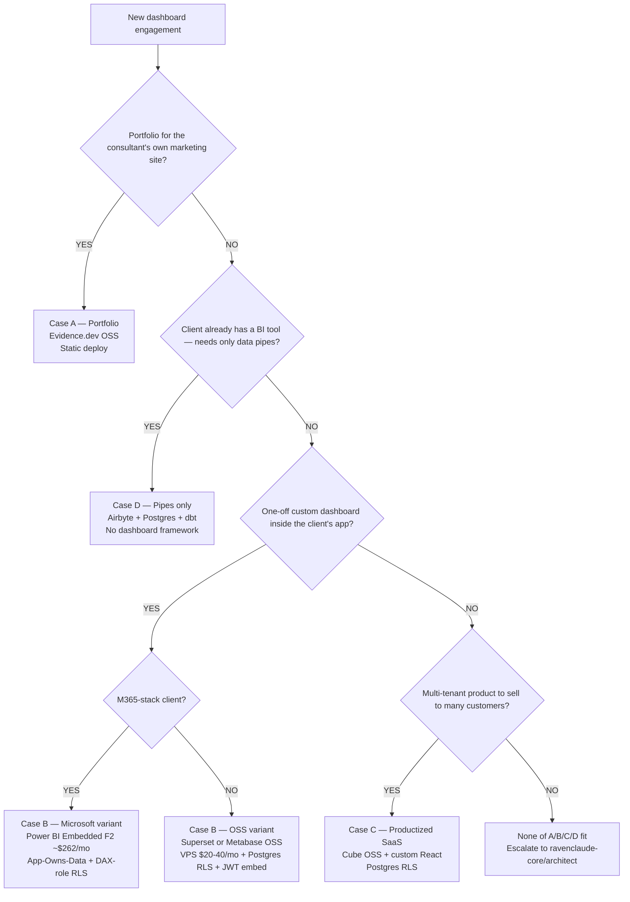

# Skill: stack-selection

> **Invoked by:** `ravenclaude-core/architect` (via inline prior on the core architect's file) — and by any data-platform agent who realizes the engagement Case hasn't been named yet.
>
> **When to invoke:** any time the user asks "what stack should I use?", a new dashboard engagement is starting, or scope materially shifts mid-engagement. Run this before the database / ELT / dashboard / embed-pattern decisions are made — those decisions hang on the Case outcome.
>
> **Output artifact:** populated [`../../templates/stack-decision-record.md`](../../templates/stack-decision-record.md).

## The four Cases

Every dashboard engagement fits one of four cases. The skill's job is to name the Case, then ship the default stack for that Case (with documented alt-stack triggers).

### Case A — Portfolio dashboard on the consultant's own marketing site

- **Shape:** Build-as-code, version-controlled, periodic refresh (monthly/quarterly), public-facing, single-tenant (no viewer scope).
- **Driving question:** How do I show what I can do?
- **Default stack:** Evidence.dev OSS (MIT-licensed) → static deploy to Vercel / Netlify. Markdown + SQL fenced blocks. $0 hosting.
- **Alt-stack triggers:** Observable Framework (open-source) if the dashboard needs richer notebook-style data exploration; a custom Next.js + Tremor + Recharts page if brand differentiation matters and Evidence's styling is too generic.
- **Don't:** Use Evidence Cloud (no free tier; Pro $25/user/mo; Embedded is Enterprise-only). OSS Evidence handles Case A cleanly.

### Case B — Per-client deliverable dashboard inside the client's app

- **Shape:** Multi-tenant or single-tenant (client-scoped), JWT-embedded, 5-50 viewers per client, lives inside the client's existing web app or admin panel.
- **Driving question:** How do I ship a custom dashboard for this engagement?
- **Default stack:** Apache Superset OR Metabase OSS, self-hosted on $20-40/mo VPS per client, JWT-secured embed SDK, Postgres RLS for tenant isolation.
- **Alt-stack triggers:**
  - **Microsoft-stack client → Power BI Embedded F2 (~$262/mo PAYG, ~$156/mo reserved).** App-Owns-Data flow; no per-viewer license; DAX-role RLS in the semantic model. Coordinate with `power-platform/power-bi-engineer`.
  - **Client already on Snowflake / Databricks → data sharing, not a pipeline.** Skip the iPaaS entirely.
  - **Tight budget + read-only → Evidence.dev OSS static deploy** if the dashboard doesn't need interactive filtering.
- **Don't:** Metabase Pro ($575/mo + $12/viewer) — the math breaks at 5-50 viewers. Tableau Embedded (~$420/viewer/yr). Looker (~$400/viewer/yr). Sigma ($61k median deployment). All per-viewer-priced; all wrong for SMB consulting.

### Case C — Long-bet productized SaaS

- **Shape:** Multi-tenant, configurable, customer-facing inside the client's own admin panel, 50-500+ viewers, eventually scales.
- **Driving question:** How do I build a dashboard *product* I can sell to many?
- **Default stack:** Cube OSS (Apache 2.0 semantic layer) + custom React UI (Next.js + Tremor + Recharts + shadcn/ui) + Postgres with RLS.
- **Alt-stack triggers:**
  - Cube Cloud Premium ($80/dev/mo, includes embedded dashboards) if running Cube as a service vs. self-hosting.
  - Embeddable.com (managed semantic-layer alternative; sales-quoted) if 5+ paying tenants and operating the platform layer is the bottleneck.
  - Migrate hot-path queries to Apache Druid / Pinot / ClickHouse Cloud at very high scale (Stripe runs Pinot at p99 70ms / 10k+ QPS — the "big version").
- **Don't:** Skip the semantic layer. Customer-facing dashboards shipping raw SQL queries will not scale.

### Case D — Client already has a BI tool; scope is data pipes only

- **Shape:** Client has Power BI / Tableau Online / Looker Studio / Metabase already deployed. Engagement is ELT + database + maybe modeling — *no dashboard build*.
- **Driving question:** How do I get the right data into the client's existing tool?
- **Default stack:** Airbyte (Cloud Standard or self-hosted) + Supabase Pro or Postgres on the client's cloud + dbt Core for modeling. No dashboard framework selection.
- **Alt-stack triggers:** Fivetran free tier if MAR <500K AND client takes over post-engagement.
- **Don't:** Try to sell a dashboard build the client doesn't need. Stay in the data-pipes lane.

## Decision Tree: Dashboard engagement — which Case?

**When this applies:** any new dashboard engagement OR mid-engagement scope shift that might change the Case. **Traverse this tree top-to-bottom before recommending a stack** — do NOT pattern-match on keywords in the user's situation description.

**Last verified:** 2026-05-22 against current pricing pages + practitioner sources.

**Rationale per leaf:**

- *CASE_A* — single-tenant + version-controlled + public-facing means no embed-auth complexity. Evidence.dev OSS handles the SQL-fenced-block authoring pattern cleanly. $0 hosting via Vercel / Netlify static deploy.
- *CASE_D* — when the client owns the BI tool, the dashboard build is out of scope. Stay in the pipes lane. Don't try to sell a dashboard the client doesn't need.
- *CASE_B_PBI* — Microsoft-stack means Entra-ID-based RLS via DAX roles is the path of least resistance. F2 capacity is flat ~$262/mo PAYG (no per-viewer license). Coordinate with `power-platform/power-bi-engineer` on semantic-model + DAX-role design.
- *CASE_B_OSS* — non-Microsoft client + 5-50 viewers means per-viewer pricing kills the math. Superset / Metabase OSS with Postgres RLS + JWT embed is the consulting-friendly default at $20-40/mo per-client VPS.
- *CASE_C* — multi-tenant productized SaaS needs a semantic layer (Cube) to prevent customer-facing dashboards from shipping raw SQL. Custom React (Next.js + Tremor + Recharts + shadcn/ui) gives brand differentiation and viewer-scale economics.
- *ESCAPE* — if the engagement genuinely doesn't fit A/B/C/D, the architect handles a custom plan. Examples: regulator-facing dashboard with audit-trail requirements; embedded-mobile-app dashboard; offline-first dashboard for field operations.

**Tradeoffs summary:**

| Case | Stack | Per-month cost | Multi-tenant? | Viewer ceiling |
|---|---|---|---|---|
| A | Evidence.dev OSS + static deploy | $0 | No (single-tenant) | n/a — public |
| B (OSS) | Superset/Metabase OSS + VPS + Postgres RLS | $20-40/client | Yes | 5-50/client |
| B (PBI) | Power BI Embedded F2 + Fabric | $262 PAYG / $156 reserved | Yes (Entra-ID RLS) | Unlimited |
| C | Cube OSS + custom React + Postgres RLS | $0 OSS + infra (~$50-200/mo at scale) | Yes | 50-500+ |
| D | Airbyte + Postgres + dbt | $20-40 (Airbyte Cloud) or self-host | Client-owned | n/a — client's BI tool |

**Failure modes to avoid:**
- Recommending Metabase Pro / Tableau Embedded / Sigma / Looker for Case B without flagging the per-viewer math (5-50 viewers × $400+/yr each kills SMB consulting margin)
- Putting Case C on a raw-Postgres stack without a semantic layer (Cube). Customer-facing dashboards shipping raw SQL won't scale.
- Recommending Case A's Evidence.dev for a multi-tenant Case B engagement (no embed-auth model in OSS Evidence)
- Trying to retrofit Case C onto a Case B engagement just because the consultant might sell it to a second client someday — Case C earns its complexity only when there ARE multiple paying tenants

## The per-viewer-pricing-trap heuristic

When the user names a BI tool, run this check before recommending it for Case B or C:

| Tool | Viewer-cost model | When math breaks |
|---|---|---|
| **Looker (enterprise)** | ~$400/viewer/yr | 5+ viewers per client × 4-6 clients |
| **Tableau Embedded** | ~$420/viewer/yr | Same |
| **Sigma** | Median $61k deployment, embedded 2-3× | Any SMB consulting profile |
| **Metabase Pro Interactive Embedding** | $575/mo + $12/viewer | 15+ viewers |
| **Power BI Embedded F2** | $262/mo PAYG flat capacity (no per-viewer in App-Owns-Data) | Doesn't apply — flat |
| **Apache Superset OSS** | Free | Doesn't apply |
| **Metabase OSS (static embed only)** | Free | Doesn't apply |
| **Cube OSS** | Free; Cloud per-developer | Doesn't apply |
| **Evidence.dev OSS** | Free | Doesn't apply |

The hook ([`../../hooks/flag-data-platform-smells.sh`](../../hooks/flag-data-platform-smells.sh)) enforces this on `stack-decision-record.md` templates — references to Looker / Tableau Embedded / Sigma / Metabase Pro trigger a stderr warning.

## EdTech LMS connector-gap recognition

When the engagement is EdTech *and* a connector is needed for Canvas / Moodle / Schoology / Blackboard / D2L: **this is the canonical custom-Airbyte-connector use case**. Native ELT vendor coverage is thin. Surface this finding in the decision record + route the partner-success motion (renewals, QBR, health scoring above the data layer) to `edtech-partner-success` agents. See [`../../knowledge/edtech-lms-connector-gap.md`](../../knowledge/edtech-lms-connector-gap.md).

## Inputs the skill needs from the requester

Before recommending, confirm:

1. **Engagement target user:** consultant's own site / single-client deliverable / multi-tenant product / data-pipes-only?
2. **Client tech stack:** Microsoft (Dynamics, Fabric, Power BI), Salesforce, generic SaaS, AWS-native, GCP-native, Snowflake/Databricks already?
3. **Compliance:** HIPAA, SOC 2, GDPR, state-privacy (NY Ed Law 2-d, IL SOPPA, CA SOPIPA)?
4. **Source systems:** what data is in play? (QBO, Stripe, Salesforce, HubSpot, GA4, Shopify, LMS, HRIS, other?)
5. **Viewer count:** 1-5 / 5-50 / 50-500 / 500+?
6. **Engagement length:** one-off / multi-month / ongoing retainer?
7. **Post-engagement ownership:** client takes over the infra, or Matt hosts indefinitely?

These seven inputs drive the Case match + the alt-stack triggers.

## Anti-patterns this skill flags

- Picking a framework before naming the Case
- Recommending a per-viewer-priced BI tool for Case B/C without surfacing the cost math
- Defaulting to Snowflake / Databricks for engagements <$25K ACV
- Pulling a new ELT pipeline when the client is already on a lakehouse (data sharing is the answer)
- Skipping the semantic layer for Case C (customer-facing dashboards shipping raw SQL won't scale)
- Recommending Evidence Cloud for Case A (no free tier; Embedded is Enterprise-only — OSS handles Case A)
- Recommending Metabase Pro Interactive Embedding without explaining the $144/viewer/yr + $575/mo base math
- Failing to flag the Fivetran 2026 deletes-count-as-MAR change when proposing Fivetran on change-heavy sources

## Output: `stack-decision-record.md`

The skill ships a populated [`../../templates/stack-decision-record.md`](../../templates/stack-decision-record.md) with:
- Case match (A/B/C/D) + rationale
- DB / ELT / dashboard / embed picks per the Case defaults (with alt-stack overrides documented)
- Pricing claims with retrieval dates
- Compliance constraints flagged
- Cross-plugin handoff routes (`power-platform`, `edtech-partner-success`, `web-design`)

## References

- Knowledge: [`../../knowledge/cloud-database-landscape-2026.md`](../../knowledge/cloud-database-landscape-2026.md)
- Knowledge: [`../../knowledge/ipaas-connector-landscape-2026.md`](../../knowledge/ipaas-connector-landscape-2026.md)
- Knowledge: [`../../knowledge/embedded-analytics-landscape-2026.md`](../../knowledge/embedded-analytics-landscape-2026.md)
- Knowledge: [`../../knowledge/edtech-lms-connector-gap.md`](../../knowledge/edtech-lms-connector-gap.md)
- Template: [`../../templates/stack-decision-record.md`](../../templates/stack-decision-record.md)
