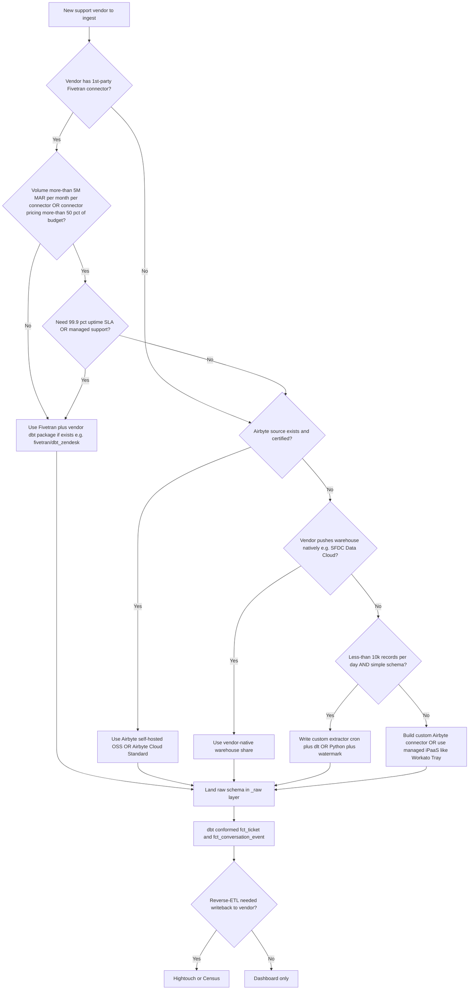

# Skill: support-ticket-normalization

> **Invoked by:** `etl-pipeline-engineer` (owns the pipeline correctness) + `dashboard-builder` (consumes the conformed mart). Also consulted by `customer-success-analytics/cs-analytics-architect` when a CS health view spans multiple support vendors.
>
> **When to invoke:**
> - Building a CS dashboard backed by multiple support tools.
> - Migrating from one support tool to another and needing a stable warehouse contract that survives the cutover.
> - The user mentions "conformed ticket model" / "ticket aging" / "SLA breach rate" / "cross-vendor support analytics".
>
> **When NOT to invoke:**
> - Single-vendor estates with a vendor-native analytics product already in use (e.g., Zendesk Explore for a Zendesk-only shop) — the conformed model is overkill unless cross-vendor or warehouse joins are needed.
>
> **Output:** a dbt project skeleton with raw → staging → conformed layers, the `fct_ticket` + `fct_conversation_event` marts, `bridge_account_xref` populated by external_id + domain, per-vendor SLA-breach derivation, and the dbt tests that guard the join spine.

## Inputs

- List of vendors in scope (any of: Zendesk, Freshdesk, Intercom, SFDC Service Cloud, JSM, HubSpot Service, Help Scout, Front).
- Warehouse type (Snowflake / BigQuery / Redshift / Databricks).
- Existing connector (or none) per vendor.
- Business-hours schedule per tenant (default: 24×7 calendar; lift from Zendesk or SFDC when available).
- SFDC Account ID source-of-truth location (Planhat Company ID, raw SFDC, or both).

## Decision tree — which connector method per vendor

The decision space is structured: managed vs. self-hosted vs. custom. Walk this before writing any code.



**Heuristics behind the tree:**

- **Fivetran wins** when 1st-party + volume keeps tier in the low-MAR band + a connector dbt package exists (Zendesk specifically).
- **Airbyte wins** on multi-vendor estates where per-connector pricing erodes Fivetran's value at scale; OSS self-host wins if you have the platform team.
- **Vendor-native warehouse shares** (SFDC Data Cloud / Snowflake Native Apps) trump connectors when available, but coverage is uneven across support vendors.
- **Custom Python (dlt / requests)** is correct for low-volume long-tail vendors where connector pricing dominates the cost case.

Full economics: [`../../knowledge/support-connector-build-vs-buy-2026.md`](../../knowledge/support-connector-build-vs-buy-2026.md).

## Step 1 — Confirm scope + pull per-vendor knowledge

For each vendor in scope, read the per-vendor knowledge file:

| Vendor | Knowledge file |
|---|---|
| Zendesk | [`../../knowledge/zendesk-integration.md`](../../knowledge/zendesk-integration.md) |
| Freshdesk | [`../../knowledge/freshdesk-integration.md`](../../knowledge/freshdesk-integration.md) |
| Intercom (Conversations + Tickets) | [`../../knowledge/intercom-integration.md`](../../knowledge/intercom-integration.md) |
| Salesforce Service Cloud | [`../../knowledge/salesforce-service-cloud-integration.md`](../../knowledge/salesforce-service-cloud-integration.md) |
| Jira Service Management | [`../../knowledge/jira-service-management-integration.md`](../../knowledge/jira-service-management-integration.md) |
| HubSpot Service Hub | [`../../knowledge/hubspot-service-integration.md`](../../knowledge/hubspot-service-integration.md) |
| Help Scout | [`../../knowledge/helpscout-integration.md`](../../knowledge/helpscout-integration.md) |
| Front | [`../../knowledge/front-integration.md`](../../knowledge/front-integration.md) |

## Step 2 — Stand up raw schemas via the chosen connector

Land each vendor's raw tables in a vendor-prefixed schema (`raw_zendesk`, `raw_freshdesk`, etc.). **Don't conform during extract** — that's the staging layer's job. Per-vendor watermark + pagination caveats live in the knowledge files; respect them or the connector will silently drop records.

## Step 3 — Author staging models

For each vendor, a `stg_<vendor>__tickets` and `stg_<vendor>__conversations` model that:

a. **Casts types** and applies vendor-specific corrections (Freshdesk numeric priority, Intercom snoozed-period exclusion, JSM `id` vs `key` distinction).
b. **Applies the per-vendor status / priority / channel maps** below.
c. **Computes `first_response_at`, `resolved_at`, `business_minute_aging`** per-vendor (see derivation rules below).

## Conformed schema — `fct_ticket` (one row per ticket, current snapshot)

| Column | Type | Vendor mapping |
|---|---|---|
| `ticket_pk` | string | `{source}_{external_id}` |
| `source_system` | enum | `zendesk` / `freshdesk` / `intercom` / `sfdc` / `jsm` / `hubspot` / `helpscout` / `front` |
| `external_id` | string | vendor primary ID |
| `external_number` | string | Zendesk: `id`, Freshdesk: `id`, SFDC: `CaseNumber`, JSM: `key`, Help Scout: `number`, Front: `id`, HubSpot: `hs_object_id`, Intercom: `id` |
| `account_pk` | string | resolved SFDC Account ID via bridge |
| `planhat_company_id` | string | resolved Planhat Company ID via bridge |
| `requester_email` | string | normalized lowercased email |
| `assignee_user_pk` | string | conformed agent ID |
| `subject` | string | |
| `status_raw` | string | vendor's raw status |
| `status_conformed` | enum | `new / open / pending / on_hold / resolved / closed / spam` |
| `priority_raw` | string | |
| `priority_conformed` | enum | `low / normal / high / urgent` |
| `channel` | enum | `email / chat / portal / phone / sms / api / social / other` |
| `type` | enum | `question / incident / problem / task / request` |
| `is_escalated` | bool | Freshdesk + SFDC native; others derived |
| `theme` | string | from tags taxonomy rollup |
| `tags_raw` | array | preserved for audit |
| `created_at_utc` | timestamp | |
| `first_response_at_utc` | timestamp | |
| `first_assignment_at_utc` | timestamp | |
| `resolved_at_utc` | timestamp | |
| `closed_at_utc` | timestamp | |
| `total_resolution_minutes_calendar` | int | |
| `total_resolution_minutes_business` | int | requires per-account business-hours schedule |
| `first_response_minutes_calendar` | int | |
| `first_response_minutes_business` | int | |
| `sla_first_response_target_minutes` | int | from `sla_policies` join |
| `sla_first_response_breached` | bool | |
| `sla_resolution_target_minutes` | int | |
| `sla_resolution_breached` | bool | |
| `reopen_count` | int | from audit / changelog count of `solved→open` transitions |
| `_loaded_at` | timestamp | warehouse load watermark |
| `_source_updated_at` | timestamp | vendor's `updated_at` — for incremental dbt builds |

## Conformed schema — `fct_conversation_event` (one row per message / status change / SLA event)

| Column | Type | Notes |
|---|---|---|
| `event_pk` | string | `{source}_{ticket_external_id}_{event_external_id}` |
| `ticket_pk` | string | FK to `fct_ticket` |
| `event_type` | enum | `comment_public / comment_private / status_change / assignment_change / priority_change / sla_breach / sla_clock_paused / merge / tag_added / tag_removed` |
| `actor_user_pk` | string | agent or end-user |
| `actor_is_agent` | bool | |
| `actor_is_bot` | bool | Intercom Fin, Zendesk AI agent, etc. |
| `body_text` | text | nullable for non-message events; **mask PII** at the warehouse layer |
| `from_value` | string | for status / priority / assignment changes |
| `to_value` | string | |
| `occurred_at_utc` | timestamp | |
| `_loaded_at` | timestamp | |

## Per-vendor field-mapping table — entity → conformed column

| Conformed column | Zendesk | Freshdesk | Intercom (Conv + Tkt) | SFDC | JSM | HubSpot | Help Scout | Front |
|---|---|---|---|---|---|---|---|---|
| `external_id` | `tickets.id` | `tickets.id` | `conversations.id` / `tickets.id` | `Case.Id` | `issue.id` | `tickets.hs_object_id` | `conversations.id` | `conversations.id` |
| `external_number` | `tickets.id` | `tickets.id` | `tickets.id` | `Case.CaseNumber` | `issue.key` | `hs_object_id` | `conversations.number` | `conversations.id` |
| `subject` | `subject` | `subject` | conv: derived from first part; tkt: `ticket_attributes._default_title_` | `Case.Subject` | `fields.summary` | `subject` | `subject` | `subject` |
| `status_raw` | `tickets.status` | `tickets.status` | conv: `state`; tkt: `ticket_state` | `Case.Status` | `fields.status.name` | `hs_pipeline_stage` | `conversations.status` | `conversations.status` |
| `priority_raw` | `tickets.priority` | `tickets.priority` (1–4) | `conversations.priority` | `Case.Priority` | `fields.priority.name` | `hs_ticket_priority` | n/a — none | n/a — none |
| `channel` | `tickets.via.channel` | `tickets.source` | n/a — derive | `Case.Origin` | n/a — derive from issuetype | `source_type` | `conversations.threads[0].type` | `inboxes[].type` |
| `assignee_user_pk` | `tickets.assignee_id` | `tickets.responder_id` | conv: `assignee.id`; tkt: `admin_assignee_id` | `Case.OwnerId` | `fields.assignee.accountId` | `hubspot_owner_id` | `conversations.assignee.id` | `conversations.assignee.id` |
| `is_escalated` | **derived** | `tickets.is_escalated` (native) | derived (priority bump / team_assignee change) | `Case.IsEscalated` (native) | derived (status to "Escalated") | derived (stage flip / priority bump) | derived (assignee change) | derived (tag application) |
| `tags_raw` | `tickets.tags[]` | `tickets.tags[]` | `tags{}` (via tag api) | n/a — `Type` + `Reason` + custom | `fields.labels[]` + `components[]` | `hs_ticket_category` + custom multi-select | `tags[]` (account-scoped) | `tags[]` (hierarchical) |
| `created_at_utc` | `tickets.created_at` | `tickets.created_at` | `created_at` | `Case.CreatedDate` | `fields.created` | `createdate` | `createdAt` | `created_at` |
| `_source_updated_at` | `tickets.updated_at` | `tickets.updated_at` | `updated_at` | `Case.LastModifiedDate` (NOT `SystemModstamp`) | `fields.updated` | `hs_lastmodifieddate` | `userUpdatedAt` / `modifiedAt` | `last_message.created_at` |

## Status normalization map (`status_conformed`)

Drive these via tenant-config tables where statuses are custom (SFDC RecordTypes, HubSpot pipelines, Freshdesk custom statuses, JSM workflow). Defaults:

| Vendor | Raw → Conformed |
|---|---|
| Zendesk | `new`→`new`, `open`→`open`, `pending`→`pending`, `hold`→`on_hold`, `solved`→`resolved`, `closed`→`closed` |
| Freshdesk | `Open`→`open`, `Pending`→`pending`, `Resolved`→`resolved`, `Closed`→`closed`, custom→`other` |
| SFDC | `New`→`new`, `Working`→`open`, `Closed`→`closed`. **Heavily customized — drive via per-tenant config.** |
| Intercom (Conv) | `open`→`open`, `closed`→`resolved`, `snoozed`→`on_hold` |
| Intercom (Tkt) | `submitted`→`new`, `in_progress`→`open`, `waiting_on_customer`→`pending`, `resolved`→`resolved` |
| HubSpot | `hs_pipeline_stage` is pipeline-dependent — **drive via `dim_hubspot_pipeline_stage`** |
| JSM | `To Do`→`new`, `In Progress`→`open`, `Done`→`resolved`, custom workflow → other |
| Help Scout | `active`→`open`, `pending`→`pending`, `closed`→`resolved`, `spam`→`spam` |
| Front | `unassigned`→`new`, `assigned`→`open`, `archived`→`resolved`, `deleted`→`closed` |

## Priority normalization map (`priority_conformed`)

| Vendor | Raw scheme | Map |
|---|---|---|
| Zendesk | `low`/`normal`/`high`/`urgent` | identity |
| Freshdesk | 1/2/3/4 numeric | 1→`low`, 2→`normal`, 3→`high`, 4→`urgent` |
| SFDC | named picklist (tenant-defined) | drive via config; common: `Low/Medium/High` → `low/normal/high` |
| Intercom | named | `not_priority`→`low`, `priority`→`high` |
| HubSpot | `LOW`/`MEDIUM`/`HIGH` | `low`/`normal`/`high` (no `urgent` natively) |
| JSM | named (`Lowest`/`Low`/`Medium`/`High`/`Highest`) | `Lowest`+`Low`→`low`, `Medium`→`normal`, `High`→`high`, `Highest`→`urgent` |
| Help Scout | n/a — derive from tags | tenant-defined |
| Front | n/a — derive from tags | tenant-defined |

## Escalation derivation per vendor

- **Freshdesk + SFDC** — read native `is_escalated` / `IsEscalated`.
- **Zendesk** — `priority` raised to `urgent` OR group reassign to allow-list OR `ticket_audit` shows hold-then-reassign OR SLA-policy breach event.
- **Intercom** — `team_assignee_id` change to an escalation team OR priority raised OR `sla_status='missed'`.
- **JSM** — status flip to "Escalated"/"Tier 2" OR priority `Highest` OR SLA `breached=true`.
- **HubSpot** — pipeline stage flip to escalation stage OR priority `HIGH` OR owner reassign.
- **Help Scout** — assignee change to escalation user/team OR `escalated` tag.
- **Front** — `sla-breached` tag application OR escalation tag (tenant-defined).

## SLA-breach derivation per vendor

| Vendor | Source of truth | Pattern |
|---|---|---|
| Zendesk | `sla_policy_metrics` + audit | `zendesk__sla_policies` from `fivetran/dbt_zendesk` |
| Freshdesk | `fr_due_by` / `due_by` | `now > fr_due_by AND first_response_at IS NULL` |
| Intercom | `sla_applied.sla_status` | `sla_status = 'missed'` |
| SFDC | `Milestone.IsViolated` / `MilestoneStatus` | `Milestone.IsViolated = TRUE` |
| JSM | `/request/{id}/sla` payload | `ongoingCycle.breached = true` (live) or `completedCycles[].breached = true` (historical) |
| HubSpot | `hs_sla_at_breach` ticket property | `hs_sla_at_breach IS NOT NULL` |
| Help Scout | **no native — build your own** | per-`mailboxId`/`tag` config; `now > created + target` |
| Front | rule-driven — tag application | tenant-configured `sla-breached` tag |

## Bridge resolution — `bridge_account_xref` precedence

(Delegates to [`../cross-system-identity-resolution/SKILL.md`](../cross-system-identity-resolution/SKILL.md) for the full skill; this is the support-tool-flavored summary.)

| Tier | Source field | `match_method` | `confidence` |
|---|---|---|---|
| 1 — Deterministic | external_id-class field (e.g., Zendesk `organizations.external_id`, Freshdesk `companies.cf_sfdc_account_id`, Intercom `companies.company_id`, JSM `customfield_<sfdc_account_id>`, HubSpot `companies.sfdc_account_id`, Front `contacts.custom_fields.sfdc_account_id`) | `external_id` | 1.0 |
| 2 — Domain | normalized domain from email or company `domains[]` | `email_domain` | 0.8 |
| 3 — Name fuzzy | normalized + Levenshtein/Jaro | `name_fuzzy` | 0.6 (stewardship required) |
| 4 — Manual | manual override | `manual` | 0.5 |
| Unresolved | none | `unresolved` | 0.0 |

## Step 4 — Union staging into the conformed marts

```sql
-- models/marts/fct_ticket.sql (sketch)
with z as (select * from {{ ref('stg_zendesk__tickets') }}),
     f as (select * from {{ ref('stg_freshdesk__tickets') }}),
     i_conv as (select * from {{ ref('stg_intercom__conversations') }}),
     i_tkt as (select * from {{ ref('stg_intercom__tickets') }} where ticket_id not in (select ticket_id from i_conv where ticket_id is not null)),
     sfdc as (select * from {{ ref('stg_sfdc__cases') }}),
     jsm as (select * from {{ ref('stg_jsm__requests') }}),
     hs as (select * from {{ ref('stg_hubspot__tickets') }}),
     hsc as (select * from {{ ref('stg_helpscout__conversations') }}),
     fr as (select * from {{ ref('stg_front__conversations') }})
select * from z
union all select * from f
union all select * from i_conv
union all select * from i_tkt
union all select * from sfdc
union all select * from jsm
union all select * from hs
union all select * from hsc
union all select * from fr
```

**De-duplication of merged tickets:** keep both vendor IDs but expose only the survivor's `ticket_pk`; record merges in `fct_conversation_event` with `event_type='merge'`.

## Step 5 — dbt tests guarding the join spine

```yaml
models:
  - name: fct_ticket
    columns:
      - name: ticket_pk
        tests:
          - not_null
          - unique
      - name: source_system
        tests:
          - not_null
          - accepted_values:
              values: [zendesk, freshdesk, intercom, sfdc, jsm, hubspot, helpscout, front]
      - name: status_conformed
        tests:
          - not_null
          - accepted_values:
              values: [new, open, pending, on_hold, resolved, closed, spam, other]
      - name: priority_conformed
        tests:
          - not_null
          - accepted_values:
              values: [low, normal, high, urgent]
      - name: channel
        tests:
          - accepted_values:
              values: [email, chat, portal, phone, sms, api, social, other]
      - name: account_pk
        tests:
          - relationships:
              to: ref('dim_account')
              field: account_key
  - name: fct_conversation_event
    columns:
      - name: event_pk
        tests:
          - not_null
          - unique
      - name: ticket_pk
        tests:
          - not_null
          - relationships:
              to: ref('fct_ticket')
              field: ticket_pk
      - name: event_type
        tests:
          - accepted_values:
              values: [comment_public, comment_private, status_change, assignment_change, priority_change, sla_breach, sla_clock_paused, merge, tag_added, tag_removed]
```

## Pre-flight checks before shipping

- **Watermark column present and respected** per source (Freshdesk's "never-updated tickets" gotcha; Zendesk's 60-second floor; SFDC `LastModifiedDate` not `SystemModstamp`).
- **Account bridge resolves > 90% of tickets** (else surface unmatched for ops review; don't silently default to NULL).
- **SLA targets present** per vendor that supports them (Zendesk Pro+, HubSpot Service Pro+, SFDC Entitlements present).
- **Validate against a known-good week of data** per vendor — counts, first-response distribution, breach rate. Reconcile to the vendor's native dashboard before publishing.

## Anti-patterns this skill flags

- Computing `fct_ticket` without consulting per-vendor knowledge files — every vendor has at least one silent-data-loss gotcha.
- Treating Intercom Conversations as the complete ticket universe — must union the Tickets API.
- Using `SystemModstamp` as the SFDC watermark — phantom rows.
- Dropping the channel dimension on Front — multi-channel aging is the dashboard's point.
- Flattening Front's hierarchical tags into a flat `tags[]` — discards the free taxonomy.
- Hard-coding the 4 req/sec HubSpot Search cap as "190 req/10s" — burns the budget on incremental.
- Auto-trusting a `name_fuzzy` bridge match without stewardship review.

## See also

- Skill: [`../cross-system-identity-resolution/SKILL.md`](../cross-system-identity-resolution/SKILL.md) — full account-bridge resolution skill.
- Skill: [`../dbt-project-scaffolding/SKILL.md`](../dbt-project-scaffolding/SKILL.md) — the dbt project layer that hosts the conformed marts.
- Skill: [`../data-quality-tests/SKILL.md`](../data-quality-tests/SKILL.md) — the test taxonomy referenced above.
- Knowledge: [`../../knowledge/support-connector-build-vs-buy-2026.md`](../../knowledge/support-connector-build-vs-buy-2026.md) — 2026 connector economics.
- Per-vendor knowledge files (linked in Step 1 above).

## References

All URLs accessed 2026-06-04. Primary research: [`/home/user/RavenClaude/docs/research/2026-06-04-psm-dashboard-research/support-tool-ingestion.md`](../../../../docs/research/2026-06-04-psm-dashboard-research/support-tool-ingestion.md).

- https://developer.zendesk.com/api-reference/ticketing/ticket-management/incremental_exports/ — Zendesk incremental exports
- https://developer.freshdesk.com/api/v1/ — Freshdesk Help Desk API
- https://developers.intercom.com/docs/references/2.11/rest-api/api.intercom.io/tickets — Intercom Tickets API
- https://developer.salesforce.com/docs/atlas.en-us.object_reference.meta/object_reference/sforce_api_objects_case.htm — Salesforce Case Object Reference
- https://developer.atlassian.com/cloud/jira/service-desk/rest/ — JSM Cloud REST
- https://developers.hubspot.com/docs/api-reference/legacy/crm/objects/tickets/guide — HubSpot Tickets API
- https://developer.helpscout.com/mailbox-api/ — Help Scout Mailbox API
- https://dev.frontapp.com/docs/rate-limiting — Front rate limits
- https://github.com/fivetran/dbt_zendesk — `fivetran/dbt_zendesk` (the canonical conformed dbt package for Zendesk)
