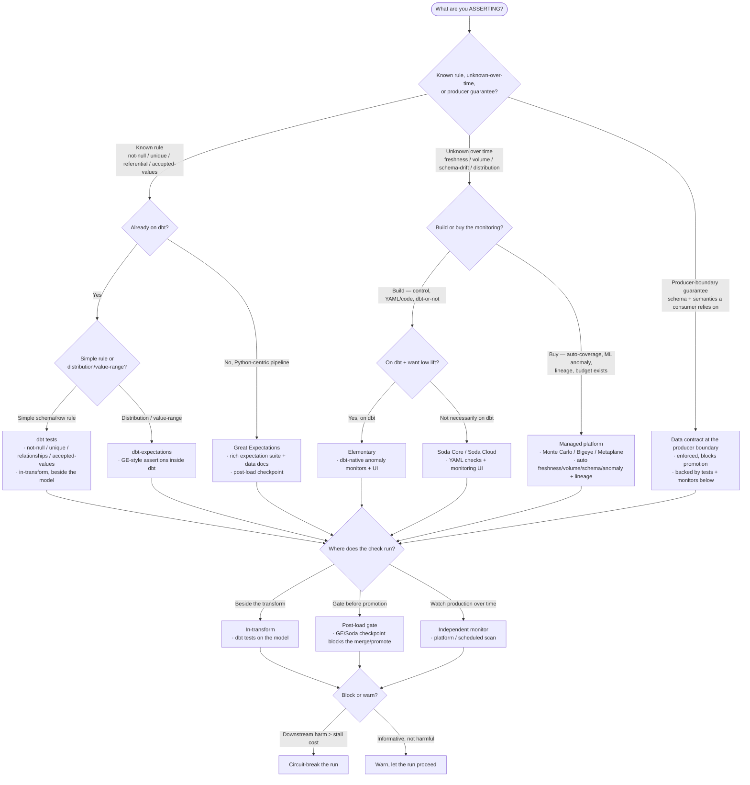

# Knowledge — Data-quality tooling decision tree

> **Last reviewed:** 2026-07-08 · **Confidence:** Medium-High (consensus on the test-vs-monitor and build-vs-buy framing, and on where dbt tests / Great Expectations / Soda / a managed platform each fit; **specific platform feature/pricing/connector claims are volatile — re-verify before a client commitment**).
> The most-asked data-quality question is "what should we use — dbt tests, dbt-expectations, Great Expectations, Soda, or a managed observability platform?". This is the decision tree the `data-quality-architect` traverses **before** naming a tool, plus the trade-off table, the "where do checks run" sub-choice, and the seams to adjacent plugins.

The agent's discipline: **name the assurance approach first (contract / test / monitor), name the tool second.** Policy questions — who may access, PII handling, retention — are **not** data quality; they leave this layer for `data-governance-privacy`.

---

## Decision Tree: choosing a data-quality tool

Traverse top-to-bottom. Gate on **what you're asserting** first (known rule vs unknown-over-time vs producer guarantee), then **already-on-dbt?**, then **build vs buy**, then **where the check runs**.

---

## Trade-off table

| Tool | Sweet spot | Watch out for |
|---|---|---|
| **dbt tests** | Known schema/row rules on a dbt project; in-transform, zero new tooling | Point-in-time only (no over-time monitoring); native tests are a small set (lean on packages) |
| **dbt-expectations** | GE-style value/distribution assertions expressed inside dbt | Still test-time, not a monitor; adds a package dependency |
| **Great Expectations** | Python pipelines wanting a rich expectation library + data docs + post-load checkpoints | Heavier setup/maintenance; config sprawl on large estates |
| **Soda Core / Soda Cloud** | YAML-first checks + a monitoring UI, dbt-or-not; warehouse-native scans | Cloud tier is paid; anomaly detection less deep than a dedicated platform |
| **Elementary** | dbt-native anomaly monitors + a UI with low lift on an existing dbt project | Scoped to the dbt world; younger ecosystem |
| **Monte Carlo / Bigeye / Metaplane** | Large estates wanting automated coverage, ML anomaly detection, and lineage out of the box | Cost + lock-in; can mask missing discipline if bought before the ROI basics exist |
| **Warehouse-native checks** | A quick `SELECT`/constraint gate with no new tool | Hand-rolled, no UI/history; doesn't scale as a program |

> **Volatile:** managed-platform feature sets, pricing, connector/warehouse coverage, and each OSS tool's exact assertion catalog change frequently. Treat the rows above as a 2026-07 snapshot and re-verify with `ravenclaude-core/deep-researcher` before a client commitment.

---

## "Where do checks run" sub-choice (after the tool)

Three placements — most programs use all three:

- **In-transform** — the check lives *beside* the model (dbt tests). Catches a broken rule the moment the model builds; cheapest to author; the natural home for known-rule tests.
- **Post-load gate** — a Great Expectations / Soda checkpoint that **blocks promotion** of a landed/raw dataset before anything downstream sees it. The right home for a producer-contract that must not let bad data through.
- **Independent monitor** — a managed platform or scheduled scan that **watches production over time**. The only home for freshness/volume/schema-drift/distribution — the unknowns a point-in-time test can't see.

Cross-cut every placement with **block vs warn**: circuit-break only where downstream harm > pipeline-stall cost; otherwise warn and let the run proceed.

---

## Seams (data quality is a layer over the stack, not a rival to it)

- **Policy / PII / access / retention / lineage governance** → `data-governance-privacy` (the "are we *allowed* to, and by whom" question — distinct from "is the number *right*").
- **The transform/model that produced the data** → `analytics-engineering` (dbt); fixing the logic once a root-cause names it.
- **Ingestion connectors + warehouse** → `data-platform` ("is the source itself broken / landing?").
- **Scheduling the scans, wiring a circuit-breaker into the DAG, backfill execution** → `data-orchestration`.

---

## Provenance

- OSS docs and consensus framing for dbt tests (not-null/unique/relationships/accepted-values, `severity`), dbt-expectations, Great Expectations (expectation suites, checkpoints, data docs), Soda (Core/Cloud, SodaCL checks), and Elementary (dbt-native anomaly monitors), reviewed 2026-07-08.
- Managed observability: Monte Carlo, Bigeye, Metaplane positioning (automated freshness/volume/schema/anomaly + lineage) as of 2026-07; **feature parity, pricing, and connector coverage are volatile, re-verify before quoting.**
