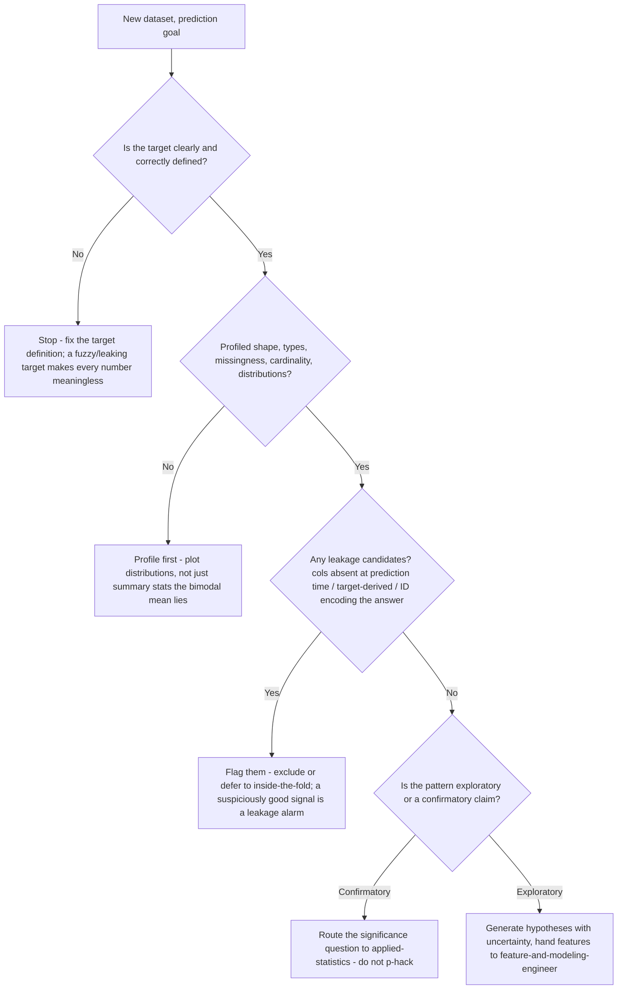
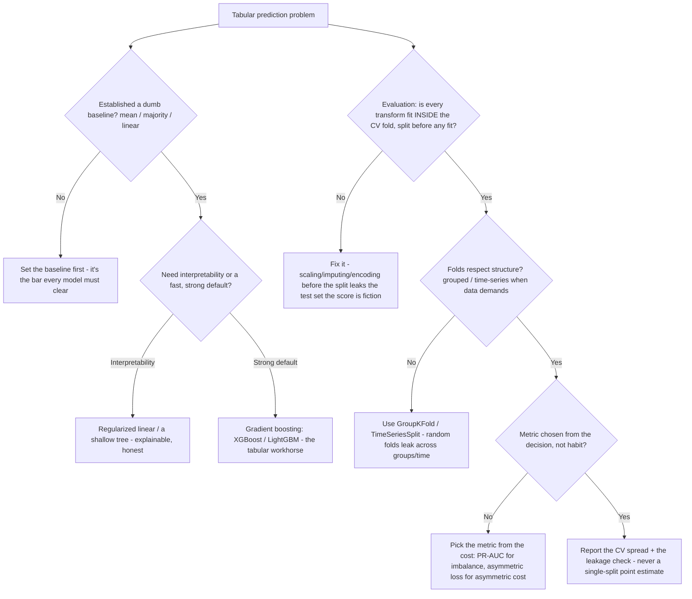

# Data Science Research — Decision Trees

_Decision trees + a dated tooling map. Tooling rows are `[verify-at-build]` — re-check against the library/project before quoting. Last reviewed: 2026-06-08._

Traverse before modeling, before choosing an evaluation scheme, and before declaring a result reproducible.

## Decision Tree: EDA before modeling — what to check first

A model on un-profiled data is a guess with a confidence interval. Profile first.

_If you can't define the target or name the missingness pattern, you're not ready to model._

## Decision Tree: Which classical model — and how to evaluate it honestly

Baseline first, classical before deep, and never let a transform see the test fold.

_Tuning hyperparameters? Use nested CV and report the nested estimate; the test set is touched once._

---

## Tooling map (2026, `[verify-at-build]`)

| Layer | Options | Notes |
|---|---|---|
| Data profiling / wrangling | pandas, polars, `ydata-profiling`, Great Expectations | Plot distributions; profile missingness/cardinality before modeling `[verify-at-build]` |
| Visualization | matplotlib, seaborn, plotly, Altair | Read plots adversarially — outliers, bimodality, Simpson's-paradox confounders `[verify-at-build]` |
| Classical modeling | scikit-learn (linear, trees, RF), XGBoost, LightGBM, CatBoost | Baseline first; gradient boosting is the tabular workhorse `[verify-at-build]` |
| Cross-validation | scikit-learn `KFold` / `StratifiedKFold` / `GroupKFold` / `TimeSeriesSplit`, nested CV | Transforms inside the fold; grouped/time-aware when structure demands `[verify-at-build]` |
| Metrics | scikit-learn `metrics` (RMSE/MAE, ROC-AUC/PR-AUC, F-beta), calibration curves | Choose from the decision/cost; accuracy lies on imbalanced classes `[verify-at-build]` |
| Pipelines (leakage-safe) | scikit-learn `Pipeline` / `ColumnTransformer` | Bundles fit-transforms so they stay inside the fold by construction `[verify-at-build]` |
| Experiment tracking | MLflow, Weights & Biases, DVC experiments | Log params + metrics + artifacts + code/data version per run `[verify-at-build]` |
| Data/version control | DVC, content hashes, immutable snapshots | Version the exact input — never "the latest table" `[verify-at-build]` |
| Environment pinning | `pip` lockfile, Poetry (`poetry.lock`), conda env, containers | Pin Python + every dependency; floating `>=` is a future irreproducibility `[verify-at-build]` |

_Seams: the significance call (p-values, confidence intervals, power) → `applied-statistics`; serving/monitoring/retraining → `ml-engineering`; the pipeline/warehouse that produces the table → `data-platform`. Re-verify any library version/behavior before quoting it to a consumer._
