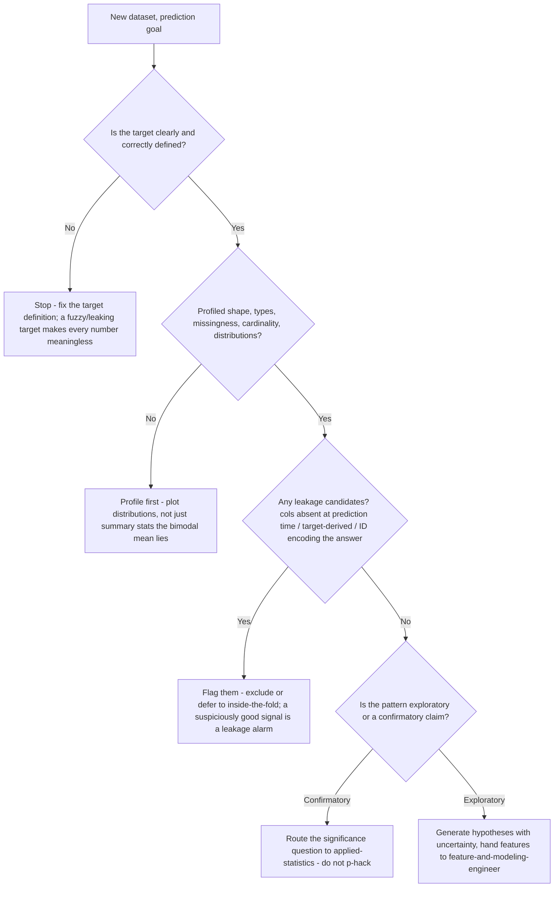
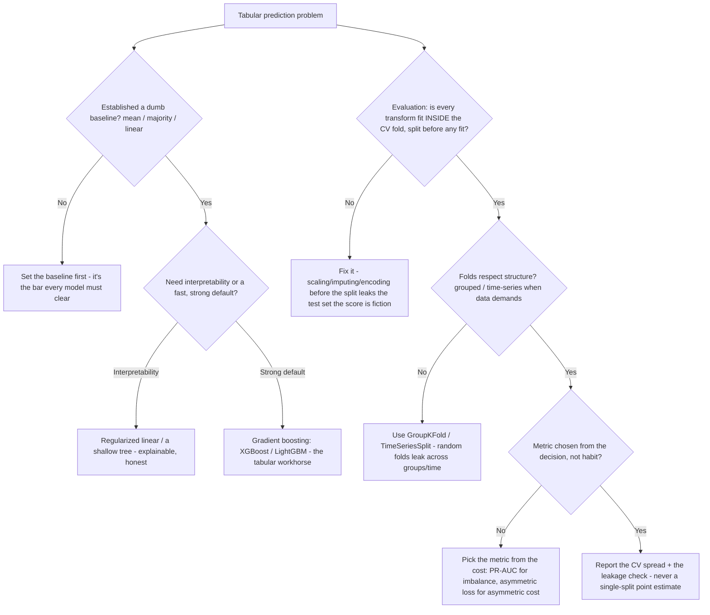
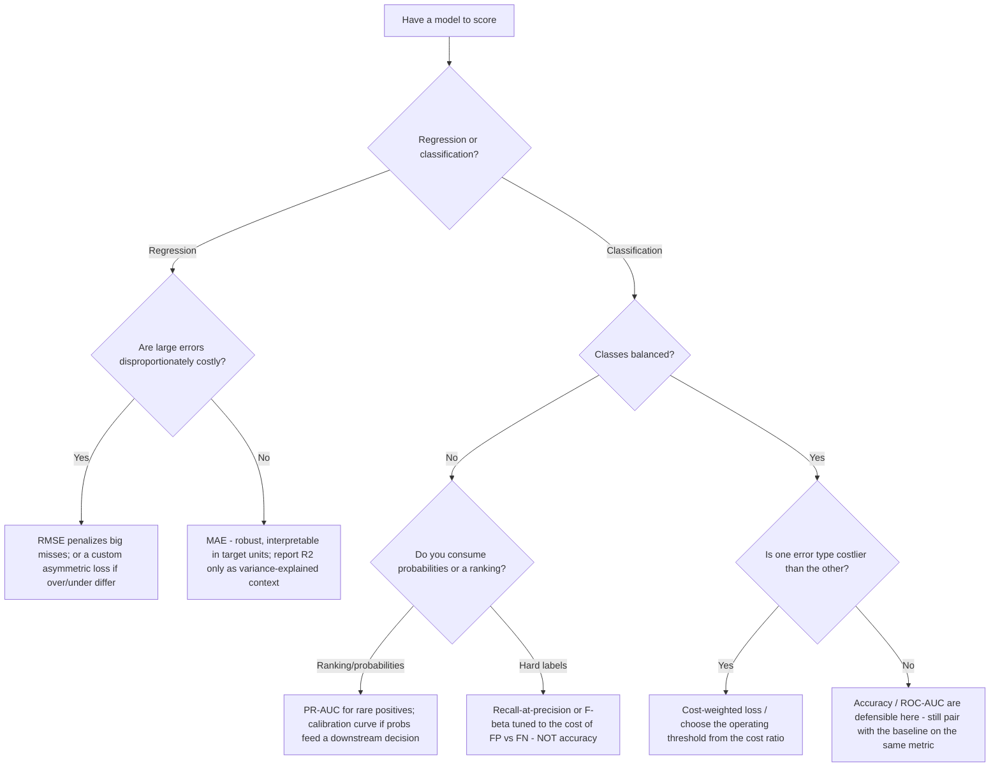
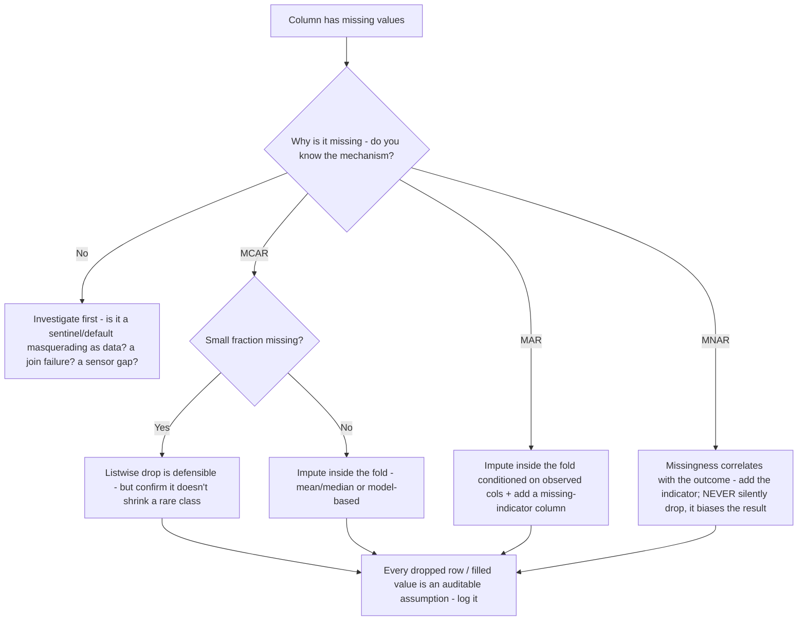

# Data Science Research — Decision Trees

_Decision trees + a dated tooling map. Tooling rows are `[verify-at-build]` — re-check against the library/project before quoting. Last reviewed: 2026-06-08._

Traverse before modeling, before choosing an evaluation scheme, before picking the metric, before imputing a missing value, and before declaring a result reproducible. Five trees: EDA-before-modeling, classical-model-selection-and-honest-evaluation, metric-per-decision, missing-data-diagnosis, and the reproducibility spine.

## Decision Tree: EDA before modeling — what to check first

A model on un-profiled data is a guess with a confidence interval. Profile first.



_If you can't define the target or name the missingness pattern, you're not ready to model._

## Decision Tree: Which classical model — and how to evaluate it honestly

Baseline first, classical before deep, and never let a transform see the test fold.



_Tuning hyperparameters? Use nested CV and report the nested estimate; the test set is touched once._

## Decision Tree: Which metric — derive it from the decision, not from habit

The wrong metric makes a bad model look good. Choose from the cost structure, then justify it.



_Always score the baseline on the *same* metric so "better" is measured against the right bar; report lift, not just the absolute number._

## Decision Tree: Missing data — diagnose before you impute

Imputation is a modeling decision. The *fact* of missingness is often itself a signal.



_Fit every imputer inside the cross-validation fold like any other transform; fitting on the full dataset leaks the test set's distribution._

## Decision Tree: Is this result reproducible — the spine

A result that can't be re-run from a pinned env, versioned data, and a fixed seed is an anecdote.

```mermaid
graph TD
  A[Have a result to defend] --> B{Notebook runs clean restart-and-run-all?}
  B -- No --> C[Fix hidden out-of-order state, or extract to a scripted pipeline - top-to-bottom is the only honest test]
  B -- Yes --> D{Environment pinned - Python + every dep at exact versions?}
  D -- No --> E[Lock it - a floating >= is a future irreproducibility]
  D -- Yes --> F{Exact input data versioned - hash / snapshot, not "the latest table"?}
  F -- No --> G[Version it with a content hash / DVC snapshot]
  F -- Yes --> H{Seed threaded through EVERY stochastic step - split, model, framework?}
  H -- No --> I[Thread the seed everywhere - a single global seed is not enough]
  H -- Yes --> J{Run's params + metrics + code/data version tracked?}
  J -- No --> K[Log the run - MLflow / W&B / DVC - so it's recoverable and comparable]
  J -- Yes --> L[Reproducible - it reproduces byte-for-byte on another machine]
```

_The notebook is a draft, not the deliverable; the reproducible artifact (pinned env + scripted pipeline + tracked run) is what ships._

---

## Tooling map (2026, `[verify-at-build]`)

| Layer | Options | Notes |
|---|---|---|
| Data profiling / wrangling | pandas, polars, `ydata-profiling`, Great Expectations | Plot distributions; profile missingness/cardinality before modeling. **pandas 3.0.0 (2026-01-21) is a breaking pin — see the dated note below** `[verify-at-build]` |
| Visualization | matplotlib, seaborn, plotly, Altair | Read plots adversarially — outliers, bimodality, Simpson's-paradox confounders `[verify-at-build]` |
| Classical modeling | scikit-learn (linear, trees, RF), XGBoost, LightGBM, CatBoost | Baseline first; gradient boosting is the tabular workhorse `[verify-at-build]` |
| Cross-validation | scikit-learn `KFold` / `StratifiedKFold` / `GroupKFold` / `TimeSeriesSplit`, nested CV | Transforms inside the fold; grouped/time-aware when structure demands `[verify-at-build]` |
| Metrics | scikit-learn `metrics` (RMSE/MAE, ROC-AUC/PR-AUC, F-beta), calibration curves | Choose from the decision/cost; accuracy lies on imbalanced classes `[verify-at-build]` |
| Pipelines (leakage-safe) | scikit-learn `Pipeline` / `ColumnTransformer` | Bundles fit-transforms so they stay inside the fold by construction `[verify-at-build]` |
| Experiment tracking | MLflow, Weights & Biases, DVC experiments | Log params + metrics + artifacts + code/data version per run `[verify-at-build]` |
| Data/version control | DVC, content hashes, immutable snapshots | Version the exact input — never "the latest table" `[verify-at-build]` |
| Environment pinning | `pip` lockfile, Poetry (`poetry.lock`), conda env, containers | Pin Python + every dependency; floating `>=` is a future irreproducibility. **Pin pandas explicitly (`==2.x` vs `>=3.0`) — the 3.0 boundary changes dtypes and copy semantics, see below** `[verify-at-build]` |

_Seams: the significance call (p-values, confidence intervals, power) → `applied-statistics`; serving/monitoring/retraining → `ml-engineering`; the pipeline/warehouse that produces the table → `data-platform`. Re-verify any library version/behavior before quoting it to a consumer._

### Dated note — pandas 3.0.0 as a reproducibility-pinning boundary (2026-01-21, retrieved 2026-06-25)

pandas **3.0.0** (released 2026-01-21) ships breaking changes that cross the line between "two pinned envs run the same notebook" and "they silently diverge." Treat the 2.x → 3.0 boundary as a **hard pin decision**, not a transparent upgrade — a floating `pandas` requirement that resolves to 3.0 on a re-run can change dtypes, copy semantics, and even importability versus the env the result was first produced in. The four changes that matter for repro-pinning:

- **Copy-on-Write (CoW) is now enforced** — no longer opt-in. Any indexing result or method return behaves as a copy, so chained-assignment / in-place mutation patterns that "worked" under 2.x (often by accident, sometimes via `SettingWithCopyWarning`) now no longer write back to the original. A pipeline that relied on that mutation produces **different numbers** under 3.0 with no error — the most dangerous kind of irreproducibility.
- **Strings default to a dedicated `str` dtype** — columns of string data are now inferred as the new `str` dtype instead of `object`. Code that branches on `dtype == object`, serializes dtypes, or round-trips through formats that encode dtype will see different results across the 2.x/3.0 boundary.
- **PyArrow is now used by default and strongly recommended** for the new `str` dtype, giving the PyArrow-backed string type when PyArrow is installed. _Accuracy note: the official "What's new in 3.0.0" docs state PyArrow as a **hard required dependency was delayed past 3.0** — when PyArrow is absent the `str` dtype falls back to NumPy object-dtype backing rather than failing to import. So pin PyArrow explicitly if you want the Arrow-backed string behavior to be reproducible; don't assume its presence._
- **Minimum Python is now 3.11** (with NumPy ≥ 1.26.0) — a 3.0 env simply won't build on Python ≤ 3.10, so the interpreter pin and the pandas pin are now coupled.

**Repro-pinning takeaway:** record the exact `pandas` (and `pyarrow`, and Python) versions in the lockfile/env that produced a result, and pin across the 3.0 boundary deliberately. When migrating an older notebook forward, re-run restart-and-run-all under the new pin and **diff the numbers** — CoW and the `str`-dtype default are silent-divergence changes, not loud failures. Sources: <https://pandas.pydata.org/> (What's new in 3.0.0, 2026-01-21) and <https://realpython.com/python-news-february-2026/> (retrieved 2026-06-25). `[verify-at-build]`
