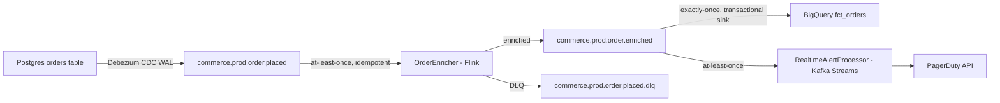

# Document the streaming topology diagram before any pipeline code is written

**Status:** Pattern
**Domain:** Streaming architecture
**Applies to:** `data-streaming-engineering`

---

## Why this exists

A streaming pipeline has more moving parts than a batch job: sources, topics, consumer groups, processors, state stores, sinks, DLQs, schema registry subjects, and the delivery semantic of each hop. Building these without a topology diagram means the architecture lives only in the implementer's head — invisible to the team, impossible to review, and impossible to reason about during an outage at 2 AM. A topology diagram also forces the designer to make explicit decisions about delivery semantics and partition keys before they become accidental defaults.

## How to apply

Author a topology diagram in the ADR (Architecture Decision Record) or the pipeline's `README.md` before starting implementation:

**Topology document checklist:**
- [ ] All sources and their schemas named
- [ ] All topics with retention and compaction policy
- [ ] Delivery semantic at each hop (at-least-once / exactly-once)
- [ ] Partition key per topic and the ordering guarantee it provides
- [ ] State stores named with TTL and backend (RocksDB vs in-memory)
- [ ] DLQ topics for each consumer that can fail
- [ ] Sink type and idempotency mechanism

**Do:**
- Review the topology diagram in the PR before any pipeline code is approved.
- Update the diagram when the topology changes — a stale diagram is worse than none.
- Use the diagram during incident response to trace which hop is lagging.

**Don't:**
- Build first and diagram later — the diagram is a design tool, not just documentation.
- Omit the delivery-semantic annotation ("at-least-once" / "exactly-once") from each hop.

## Edge cases / when the rule does NOT apply

- A trivial single-topic, single-consumer pipeline (e.g., a connector that reads one topic and writes to one database) may use a brief prose description instead of a full diagram, as long as it captures the delivery semantic and partition key.

## See also

- [`../agents/streaming-architect.md`](../agents/streaming-architect.md) — owns the topology design and the ADR
- [`./choose-delivery-semantics-deliberately.md`](./choose-delivery-semantics-deliberately.md) — the delivery semantics rule the topology must document

## Provenance

Standard streaming-architecture practice. A topology-first design discipline is recommended in "Designing Event-Driven Systems" (Ben Stopford, 2018) and Confluent's production deployment guides. Codifies data-streaming-engineering CLAUDE.md §2 house opinion #3 ("Pick the delivery semantic deliberately").

---

_Last reviewed: 2026-06-05 by `claude`_
