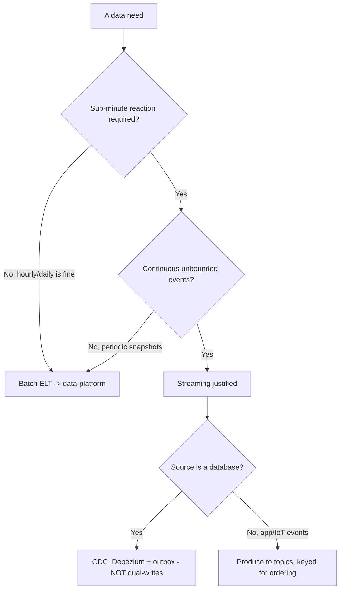
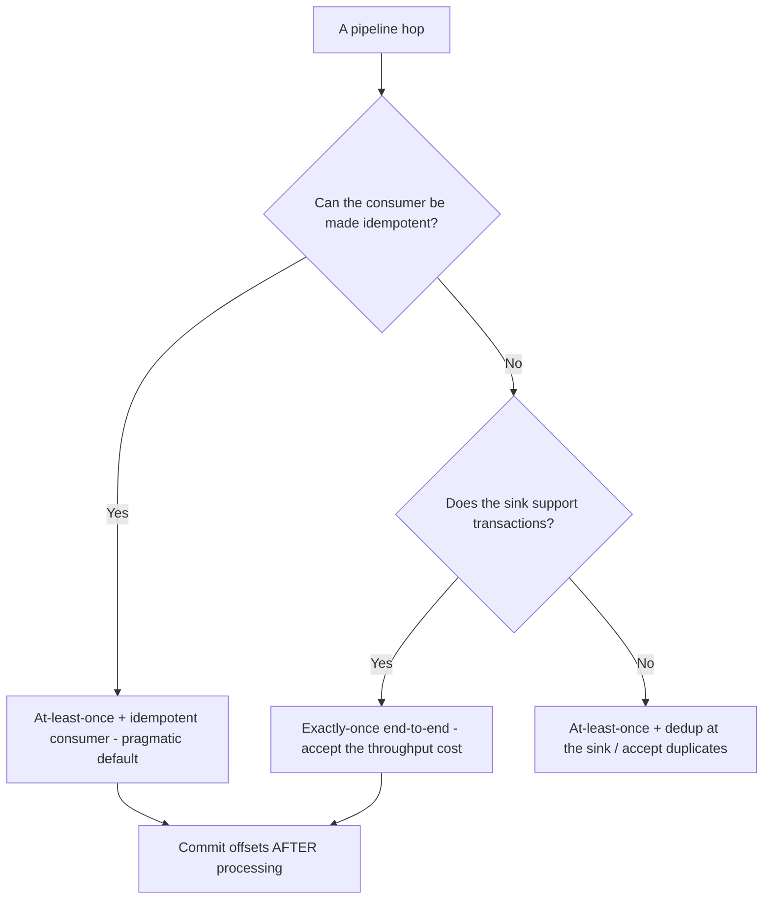
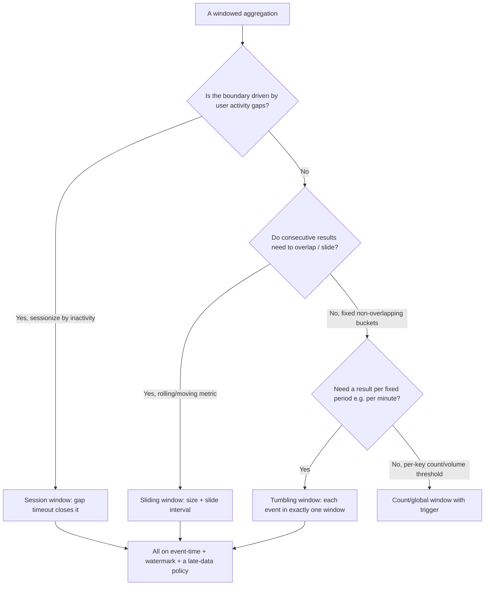
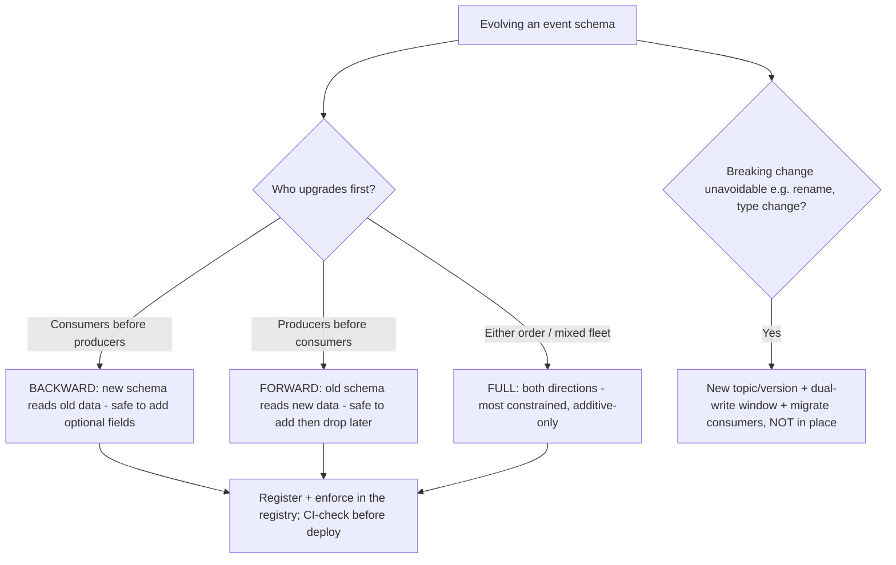
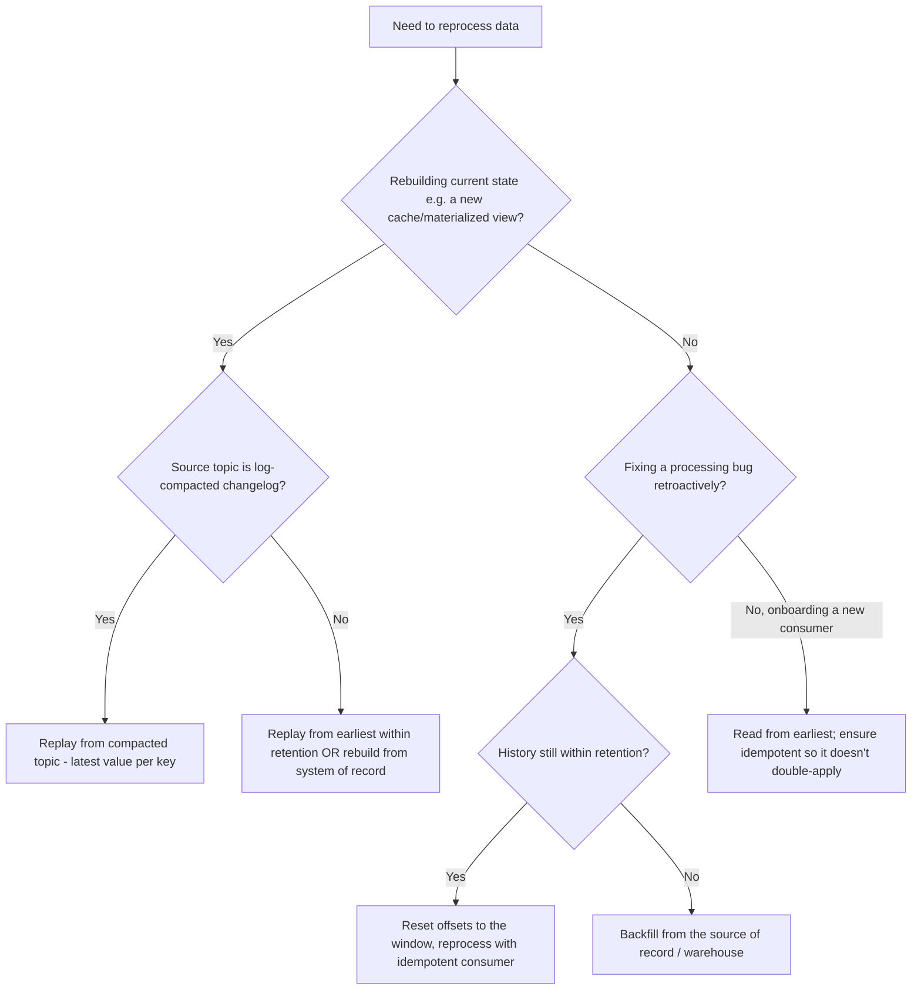
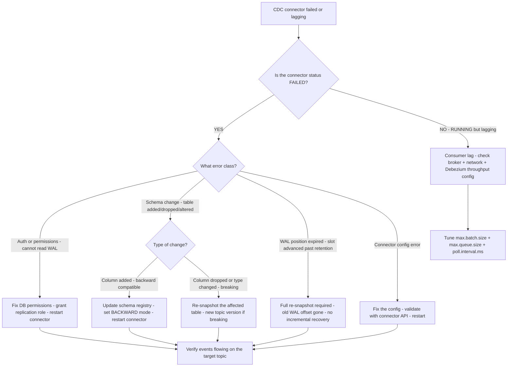
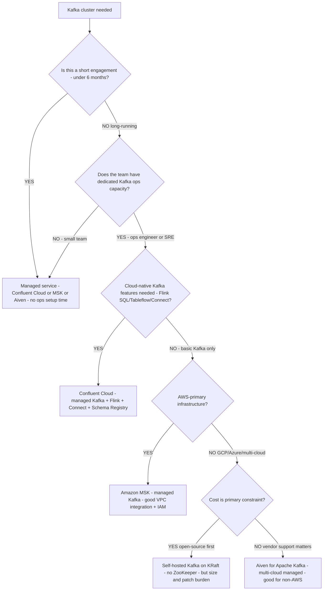
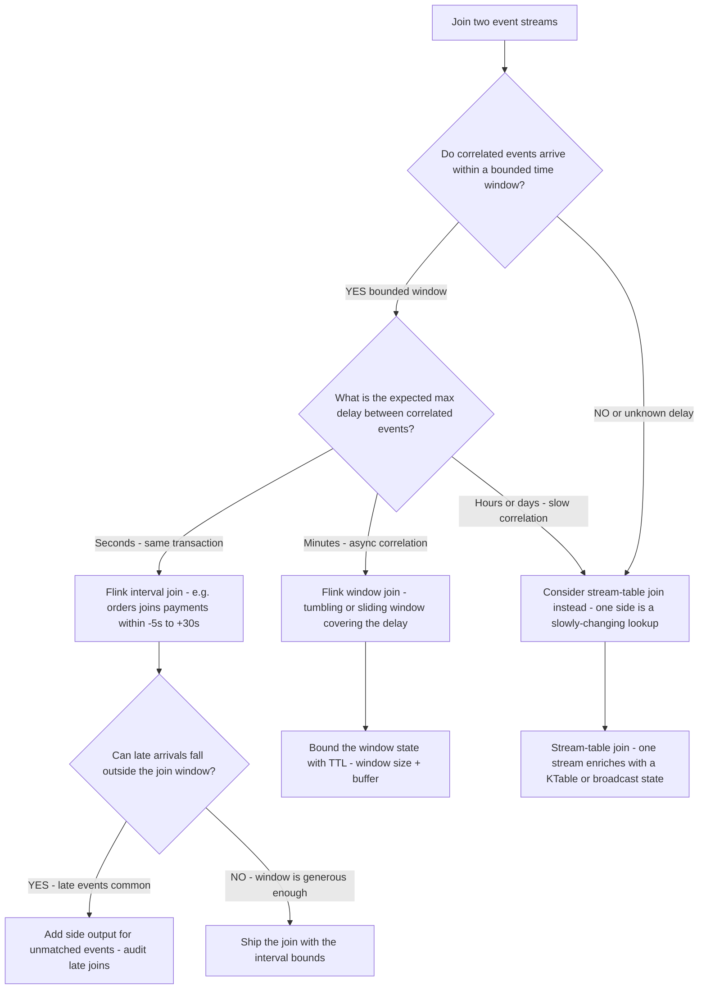

# Data Streaming — Decision Trees

_Decision trees + a dated capability map. Capability rows are `[verify-at-build]` — re-check against the vendor before quoting. Last reviewed: 2026-06-04._

Traverse before building a stream or choosing delivery semantics.

## Decision Tree: Streaming or batch?

Justify streaming with a real latency need; otherwise batch is simpler and cheaper.

_Streaming is operationally heavy — don't pay for it without a latency need._

## Decision Tree: Delivery semantics

Pick the weakest semantic that meets the requirement; stronger costs throughput + complexity.

## Decision Tree: Which window type?

The window type is the analytical question; pick it from the question, not by habit.

_Sliding windows multiply state (each event in many windows) — bound it. Every window runs on event-time with a watermark and an explicit late-data policy._

## Decision Tree: Which schema-compatibility mode?

Compatibility mode is a contract about who can deploy first; choose by upgrade order.

_An unversioned payload is a future cross-team outage. A genuinely breaking change is a new topic + migration, never a silent in-place edit._

## Decision Tree: How do I reprocess / recover?

Match the recovery mechanism to what you're fixing; idempotent consumers make all of these safe.

_Replay is a design constraint: it needs retention to cover the window, idempotent consumers, and an offset-reset plan that won't corrupt live state._

## Decision Tree: CDC connector failure — what broke and how to recover?

**When this applies:** a Debezium CDC connector fails, lags, or produces wrong/missing events. Observable inputs: the connector's status (RUNNING / PAUSED / FAILED), whether the WAL position is still available, and the type of failure (auth, schema change, WAL rotation).

**Last verified:** 2026-06-05 against Debezium 2.x documentation and Kafka Connect error handling docs.

**Rationale per leaf:**
- *AUTH* — the Debezium connector needs the `REPLICATION` privilege on Postgres; a permissions revocation (common after a DB rotation) is the most common auth failure.
- *EVOLVE* — an additive schema change is backward-compatible; update the registry and restart. Do not re-snapshot for an additive change.
- *NEWSNAP* — a breaking column change (type change, drop) requires a re-snapshot of the affected table; if the topic has existing consumers, this is the new-topic migration path.
- *RESNAP* — the WAL replication slot retains data only while it is consumed; if the connector was paused too long, the WAL offset has advanced past what the slot retained and a full re-snapshot is the only recovery. This is expensive — set `max.slot.wal.keep.size` to prevent silent slot growth.
- *LAG* — a RUNNING but lagging connector is usually a throughput tuning issue (batch size, polling interval, or broker I/O).

**Tradeoffs summary:**

| Failure class | Recovery | Data gap risk | Cost |
|---|---|---|---|
| Auth / permissions | Restart after fix | None if done promptly | Low |
| Additive schema change | Update registry + restart | None | Low |
| Breaking schema change | Re-snapshot | Window gap during snapshot | Medium |
| WAL slot expired | Full re-snapshot | Gap from last good event | High |
| Config error | Fix + restart | Minimal | Low |

---

## Decision Tree: Kafka platform — self-hosted vs managed?

**When this applies:** a new Kafka cluster is being provisioned, or an existing self-hosted cluster is being evaluated for migration to a managed service. Observable inputs: team ops capacity, cloud provider, required Kafka features, and engagement duration.

**Last verified:** 2026-06-05 against Confluent Cloud, MSK (Amazon), and Aiven documentation.

**Rationale per leaf:**
- *MANAGED* — for short engagements or small teams, the ops burden of self-hosted Kafka (cluster sizing, ZooKeeper/KRaft, JVM tuning, broker patching) costs more time than the managed service costs money.
- *CONFLUENT* — when Flink SQL, managed connectors, and the full streaming platform are needed, Confluent Cloud is the only fully-integrated option.
- *MSK* — AWS-native integration (VPC, IAM, CloudWatch) makes MSK the lowest-friction managed Kafka on AWS; no Flink or Schema Registry included (add Confluent Schema Registry separately if needed).
- *SELFHOST* — a team with dedicated ops capacity and a long-running workload can run KRaft-mode Kafka without ZooKeeper; the cost savings are real but the ops burden (broker failures, rebalances, upgrades) is the team's responsibility.
- *AIVEN* — good multi-cloud managed option for non-AWS shops; includes Schema Registry.

**Tradeoffs summary:**

| Option | Monthly cost | Ops burden | Schema Registry | Flink / Connect | Use when |
|---|---|---|---|---|---|
| Confluent Cloud | Higher | None | Included | Managed | Full streaming platform + ops convenience |
| Amazon MSK | Medium | Low | Not included | Partial | AWS-native + cost-conscious |
| Aiven | Medium | None | Included | No | Multi-cloud managed |
| Self-hosted KRaft | Infra only | High | Deploy separately | Deploy separately | Long-running + ops capacity available |

---

## Decision Tree: Stream-stream join — can these two streams be joined?

**When this applies:** a stream processing pipeline needs to join two event streams (e.g., orders + payments, clicks + impressions) and you must choose whether a stream-stream join is feasible and what join window to use. Observable inputs: the expected time skew between correlated events on the two streams, the cardinality (how many events per join key), and whether late arrivals are common.

**Last verified:** 2026-06-05 against Apache Flink 1.19 and Kafka Streams 3.7 join documentation.

**Rationale per leaf:**
- *ENRICH* — when the two streams don't have a bounded time correlation, a stream-stream join is the wrong model; one side is likely a slowly-changing lookup (a customer dim, a product catalog) that should be a KTable or broadcast state.
- *INTERVAL* — Flink's interval join is the correct model when events correlate within a predictable time window (an order payment typically arrives within seconds to minutes of the order event).
- *WINDOW* — when the delay is known but wider (minutes), a windowed join covers the window; be careful about state size (every event is buffered for the full window duration per key).
- *SIDE* — unmatched events in a join window are a real-world occurrence (a payment for a cancelled order, a late-arriving click); route them to a side output for auditing rather than silently dropping them.
- *KTABLE* — for one-sided lookup enrichment (enrich an order event with the customer's tier), a stream-table join is cheaper and correct; the table side doesn't need a time window.
- *STATE* — window joins buffer both sides; bound the state with TTL equal to the join window plus a buffer, or the state grows unboundedly for high-cardinality keys.

**Tradeoffs summary:**

| Join type | State size | Late arrival handling | Use when |
|---|---|---|---|
| Interval join (Flink) | Bounded by interval | Side output for outliers | Correlated events within seconds-minutes |
| Window join (Flink) | Bounded by window | Events outside window dropped | Correlated events within minutes, fixed period |
| Stream-table join (KTable) | Table side only | Table is updated-in-place | One side is a slowly-changing lookup |
| Broadcast state join | Broadcast side only | n/a | Small lookup replicated to all partitions |

---

## Capability map (dated — verify at build)

| Capability | 2026 state `[verify-at-build]` | Notes |
|---|---|---|
| Apache Kafka | GA, ecosystem default | KRaft (no ZooKeeper) standard |
| Schema Registry (Avro/Protobuf/JSON) | GA | Compatibility rules essential |
| Debezium CDC | GA | Log-based change capture |
| Apache Flink | GA | Event-time, watermarks, exactly-once |
| Kafka Streams | GA | JVM library; stateful processing |
| Kafka transactions / EOS | GA | Exactly-once within Kafka; sink matters |
| Pulsar / Kinesis | GA | Multi-tenant / AWS-managed alternatives |
